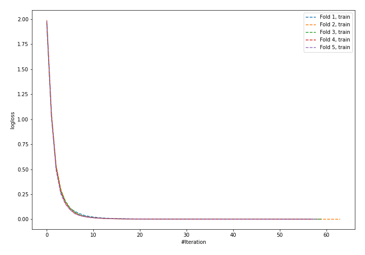
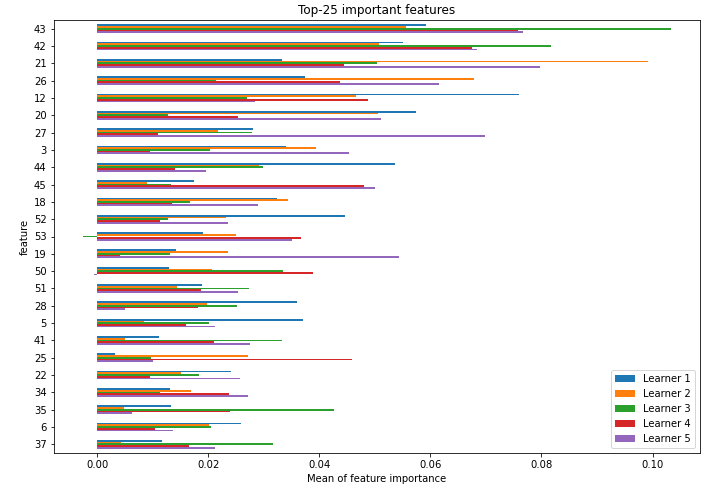
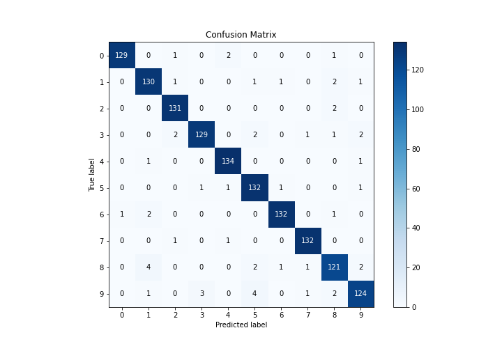
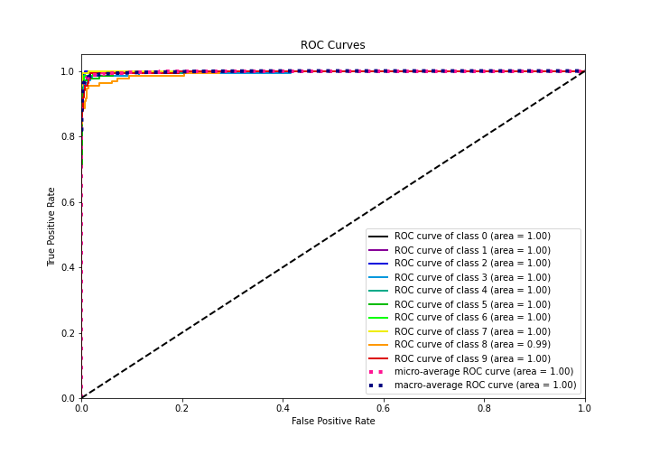
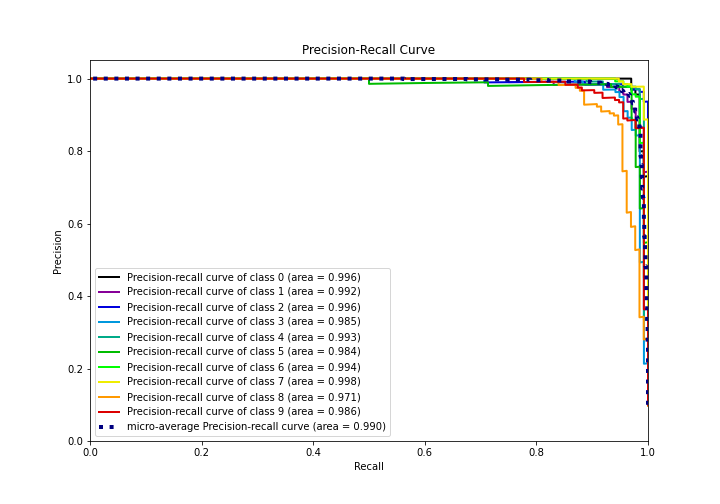

# Summary of 19_NeuralNetwork_SelectedFeatures

[<< Go back](../README.md)

## Neural Network
- **n_jobs**: -1
- **dense_1_size**: 64
- **dense_2_size**: 16
- **learning_rate**: 0.01
- **num_class**: 10
- **explain_level**: 1

## Validation
 - **validation_type**: kfold
 - **k_folds**: 5
 - **shuffle**: True
 - **stratify**: True

## Optimized metric
logloss

## Training time

5.6 seconds

### Metric details
|           |          0 |          1 |          2 |          3 |          4 |          5 |          6 |          7 |          8 |          9 |   accuracy |   macro avg |   weighted avg |   logloss |
|:----------|-----------:|-----------:|-----------:|-----------:|-----------:|-----------:|-----------:|-----------:|-----------:|-----------:|-----------:|------------:|---------------:|----------:|
| precision |   0.992308 |   0.942029 |   0.963235 |   0.969925 |   0.971014 |   0.93617  |   0.977778 |   0.977778 |   0.930769 |   0.946565 |   0.960653 |    0.960757 |       0.960785 |  0.153551 |
| recall    |   0.969925 |   0.955882 |   0.984962 |   0.941606 |   0.985294 |   0.970588 |   0.970588 |   0.985075 |   0.923664 |   0.918519 |   0.960653 |    0.96061  |       0.960653 |  0.153551 |
| f1-score  |   0.980989 |   0.948905 |   0.973978 |   0.955556 |   0.978102 |   0.953069 |   0.97417  |   0.981413 |   0.927203 |   0.932331 |   0.960653 |    0.960571 |       0.960606 |  0.153551 |
| support   | 133        | 136        | 133        | 137        | 136        | 136        | 136        | 134        | 131        | 135        |   0.960653 | 1347        |    1347        |  0.153551 |

## Confusion matrix
|              |   Predicted as 0 |   Predicted as 1 |   Predicted as 2 |   Predicted as 3 |   Predicted as 4 |   Predicted as 5 |   Predicted as 6 |   Predicted as 7 |   Predicted as 8 |   Predicted as 9 |
|:-------------|-----------------:|-----------------:|-----------------:|-----------------:|-----------------:|-----------------:|-----------------:|-----------------:|-----------------:|-----------------:|
| Labeled as 0 |              129 |                0 |                1 |                0 |                2 |                0 |                0 |                0 |                1 |                0 |
| Labeled as 1 |                0 |              130 |                1 |                0 |                0 |                1 |                1 |                0 |                2 |                1 |
| Labeled as 2 |                0 |                0 |              131 |                0 |                0 |                0 |                0 |                0 |                2 |                0 |
| Labeled as 3 |                0 |                0 |                2 |              129 |                0 |                2 |                0 |                1 |                1 |                2 |
| Labeled as 4 |                0 |                1 |                0 |                0 |              134 |                0 |                0 |                0 |                0 |                1 |
| Labeled as 5 |                0 |                0 |                0 |                1 |                1 |              132 |                1 |                0 |                0 |                1 |
| Labeled as 6 |                1 |                2 |                0 |                0 |                0 |                0 |              132 |                0 |                1 |                0 |
| Labeled as 7 |                0 |                0 |                1 |                0 |                1 |                0 |                0 |              132 |                0 |                0 |
| Labeled as 8 |                0 |                4 |                0 |                0 |                0 |                2 |                1 |                1 |              121 |                2 |
| Labeled as 9 |                0 |                1 |                0 |                3 |                0 |                4 |                0 |                1 |                2 |              124 |

## Learning curves

## Permutation-based Importance

## Confusion Matrix

## Normalized Confusion Matrix

## ROC Curve

## Precision Recall Curve

[<< Go back](../README.md)
