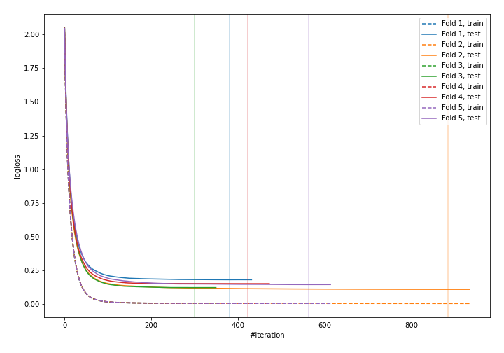
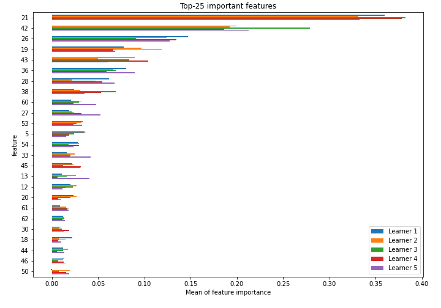
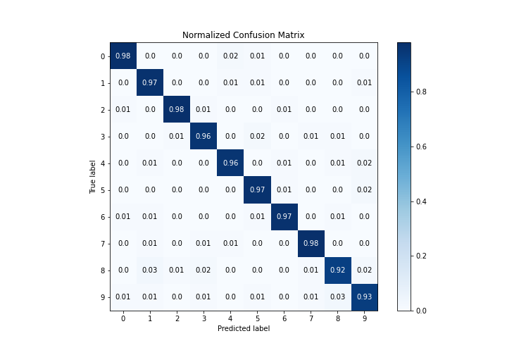
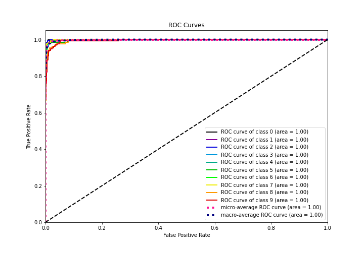
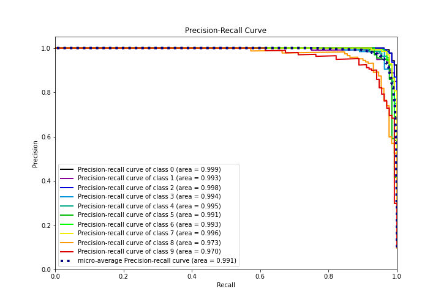

# Summary of 3_Default_Xgboost

[<< Go back](../README.md)

## Extreme Gradient Boosting (Xgboost)
- **n_jobs**: -1
- **objective**: multi:softprob
- **eta**: 0.075
- **max_depth**: 6
- **min_child_weight**: 1
- **subsample**: 1.0
- **colsample_bytree**: 1.0
- **eval_metric**: mlogloss
- **num_class**: 10
- **explain_level**: 1

## Validation
 - **validation_type**: kfold
 - **k_folds**: 5
 - **shuffle**: True
 - **stratify**: True

## Optimized metric
logloss

## Training time

55.1 seconds

### Metric details
|           |          0 |          1 |          2 |          3 |          4 |          5 |          6 |          7 |          8 |          9 |   accuracy |   macro avg |   weighted avg |   logloss |
|:----------|-----------:|-----------:|-----------:|-----------:|-----------:|-----------:|-----------:|-----------:|-----------:|-----------:|-----------:|------------:|---------------:|----------:|
| precision |   0.977444 |   0.942857 |   0.984848 |   0.963235 |   0.970149 |   0.94964  |   0.977778 |   0.97037  |   0.944882 |   0.919118 |   0.959911 |    0.960032 |       0.960012 |  0.141544 |
| recall    |   0.977444 |   0.970588 |   0.977444 |   0.956204 |   0.955882 |   0.970588 |   0.970588 |   0.977612 |   0.916031 |   0.925926 |   0.959911 |    0.959831 |       0.959911 |  0.141544 |
| f1-score  |   0.977444 |   0.956522 |   0.981132 |   0.959707 |   0.962963 |   0.96     |   0.97417  |   0.973978 |   0.930233 |   0.922509 |   0.959911 |    0.959866 |       0.959896 |  0.141544 |
| support   | 133        | 136        | 133        | 137        | 136        | 136        | 136        | 134        | 131        | 135        |   0.959911 | 1347        |    1347        |  0.141544 |

## Confusion matrix
|              |   Predicted as 0 |   Predicted as 1 |   Predicted as 2 |   Predicted as 3 |   Predicted as 4 |   Predicted as 5 |   Predicted as 6 |   Predicted as 7 |   Predicted as 8 |   Predicted as 9 |
|:-------------|-----------------:|-----------------:|-----------------:|-----------------:|-----------------:|-----------------:|-----------------:|-----------------:|-----------------:|-----------------:|
| Labeled as 0 |              130 |                0 |                0 |                0 |                2 |                1 |                0 |                0 |                0 |                0 |
| Labeled as 1 |                0 |              132 |                0 |                0 |                1 |                1 |                0 |                0 |                0 |                2 |
| Labeled as 2 |                1 |                0 |              130 |                1 |                0 |                0 |                1 |                0 |                0 |                0 |
| Labeled as 3 |                0 |                0 |                1 |              131 |                0 |                3 |                0 |                1 |                1 |                0 |
| Labeled as 4 |                0 |                1 |                0 |                0 |              130 |                0 |                1 |                0 |                1 |                3 |
| Labeled as 5 |                0 |                0 |                0 |                0 |                0 |              132 |                1 |                0 |                0 |                3 |
| Labeled as 6 |                1 |                1 |                0 |                0 |                0 |                1 |              132 |                0 |                1 |                0 |
| Labeled as 7 |                0 |                1 |                0 |                1 |                1 |                0 |                0 |              131 |                0 |                0 |
| Labeled as 8 |                0 |                4 |                1 |                2 |                0 |                0 |                0 |                1 |              120 |                3 |
| Labeled as 9 |                1 |                1 |                0 |                1 |                0 |                1 |                0 |                2 |                4 |              125 |

## Learning curves

## Permutation-based Importance

## Confusion Matrix

## Normalized Confusion Matrix

## ROC Curve

## Precision Recall Curve

[<< Go back](../README.md)
