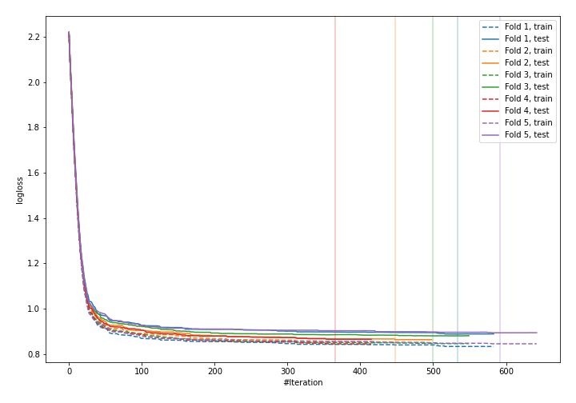
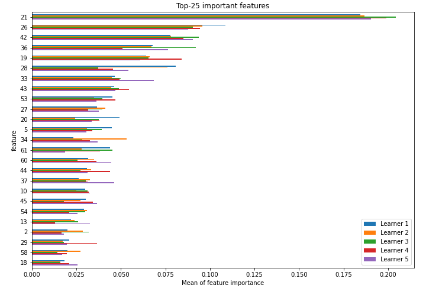
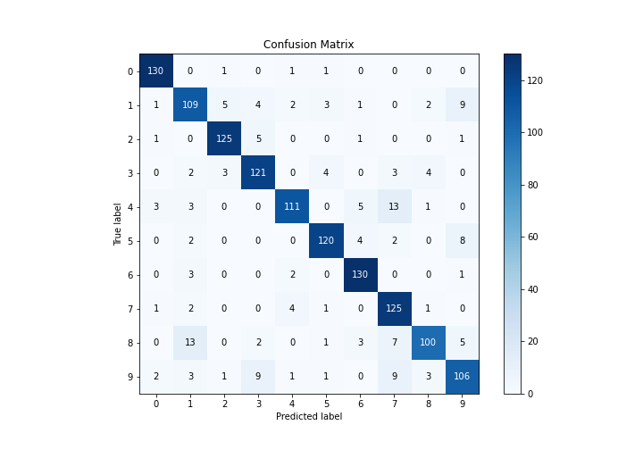
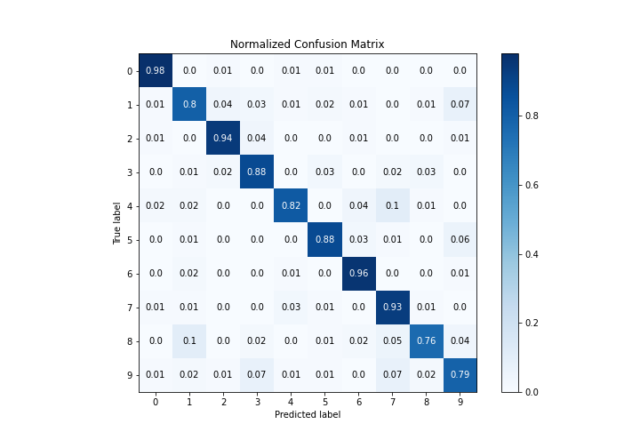
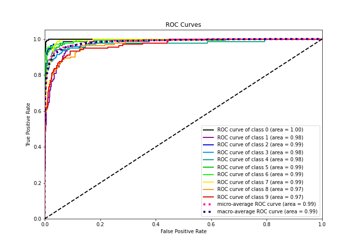
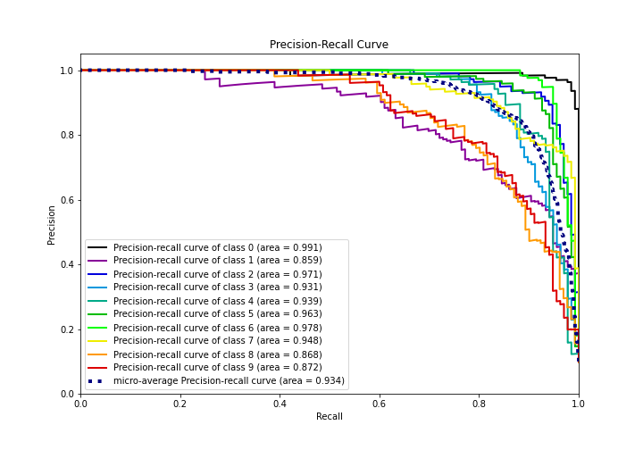

# Summary of 9_Xgboost

[<< Go back](../README.md)

## Extreme Gradient Boosting (Xgboost)
- **n_jobs**: -1
- **objective**: multi:softprob
- **eta**: 0.15
- **max_depth**: 8
- **min_child_weight**: 50
- **subsample**: 0.6
- **colsample_bytree**: 0.6
- **eval_metric**: mlogloss
- **num_class**: 10
- **explain_level**: 1

## Validation
 - **validation_type**: kfold
 - **k_folds**: 5
 - **shuffle**: True
 - **stratify**: True

## Optimized metric
logloss

## Training time

51.1 seconds

### Metric details
|           |          0 |          1 |          2 |          3 |          4 |          5 |          6 |          7 |          8 |          9 |   accuracy |   macro avg |   weighted avg |   logloss |
|:----------|-----------:|-----------:|-----------:|-----------:|-----------:|-----------:|-----------:|-----------:|-----------:|-----------:|-----------:|------------:|---------------:|----------:|
| precision |   0.942029 |   0.79562  |   0.925926 |   0.858156 |   0.917355 |   0.916031 |   0.902778 |   0.786164 |   0.900901 |   0.815385 |   0.873794 |    0.876034 |       0.875849 |  0.877835 |
| recall    |   0.977444 |   0.801471 |   0.93985  |   0.883212 |   0.816176 |   0.882353 |   0.955882 |   0.932836 |   0.763359 |   0.785185 |   0.873794 |    0.873777 |       0.873794 |  0.877835 |
| f1-score  |   0.95941  |   0.798535 |   0.932836 |   0.870504 |   0.863813 |   0.898876 |   0.928571 |   0.853242 |   0.826446 |   0.8      |   0.873794 |    0.873223 |       0.873154 |  0.877835 |
| support   | 133        | 136        | 133        | 137        | 136        | 136        | 136        | 134        | 131        | 135        |   0.873794 | 1347        |    1347        |  0.877835 |

## Confusion matrix
|              |   Predicted as 0 |   Predicted as 1 |   Predicted as 2 |   Predicted as 3 |   Predicted as 4 |   Predicted as 5 |   Predicted as 6 |   Predicted as 7 |   Predicted as 8 |   Predicted as 9 |
|:-------------|-----------------:|-----------------:|-----------------:|-----------------:|-----------------:|-----------------:|-----------------:|-----------------:|-----------------:|-----------------:|
| Labeled as 0 |              130 |                0 |                1 |                0 |                1 |                1 |                0 |                0 |                0 |                0 |
| Labeled as 1 |                1 |              109 |                5 |                4 |                2 |                3 |                1 |                0 |                2 |                9 |
| Labeled as 2 |                1 |                0 |              125 |                5 |                0 |                0 |                1 |                0 |                0 |                1 |
| Labeled as 3 |                0 |                2 |                3 |              121 |                0 |                4 |                0 |                3 |                4 |                0 |
| Labeled as 4 |                3 |                3 |                0 |                0 |              111 |                0 |                5 |               13 |                1 |                0 |
| Labeled as 5 |                0 |                2 |                0 |                0 |                0 |              120 |                4 |                2 |                0 |                8 |
| Labeled as 6 |                0 |                3 |                0 |                0 |                2 |                0 |              130 |                0 |                0 |                1 |
| Labeled as 7 |                1 |                2 |                0 |                0 |                4 |                1 |                0 |              125 |                1 |                0 |
| Labeled as 8 |                0 |               13 |                0 |                2 |                0 |                1 |                3 |                7 |              100 |                5 |
| Labeled as 9 |                2 |                3 |                1 |                9 |                1 |                1 |                0 |                9 |                3 |              106 |

## Learning curves

## Permutation-based Importance

## Confusion Matrix

## Normalized Confusion Matrix

## ROC Curve

## Precision Recall Curve

[<< Go back](../README.md)
