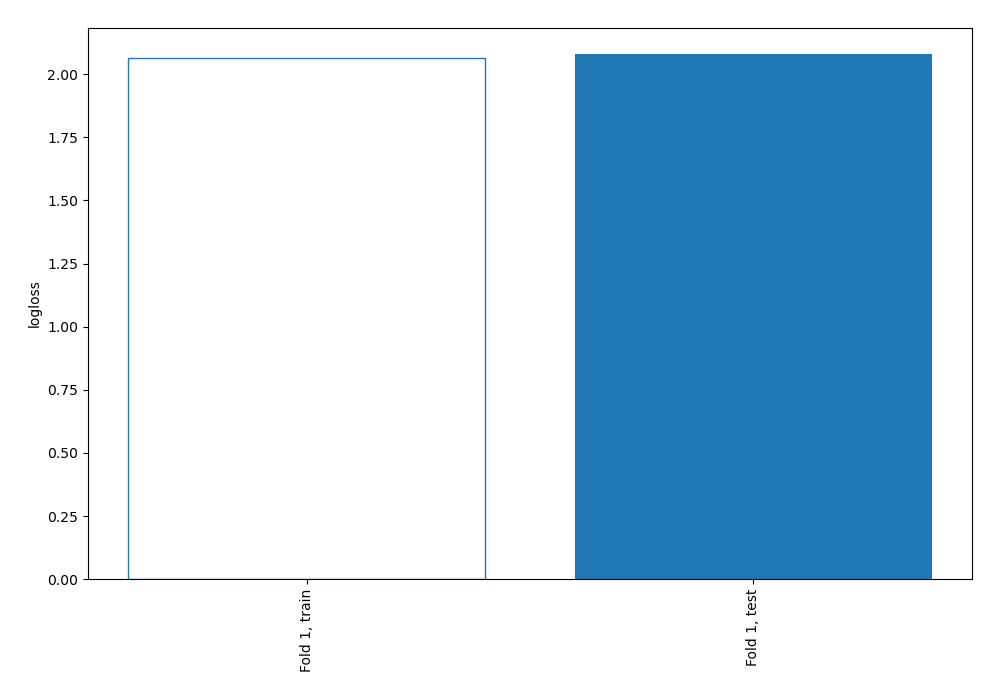
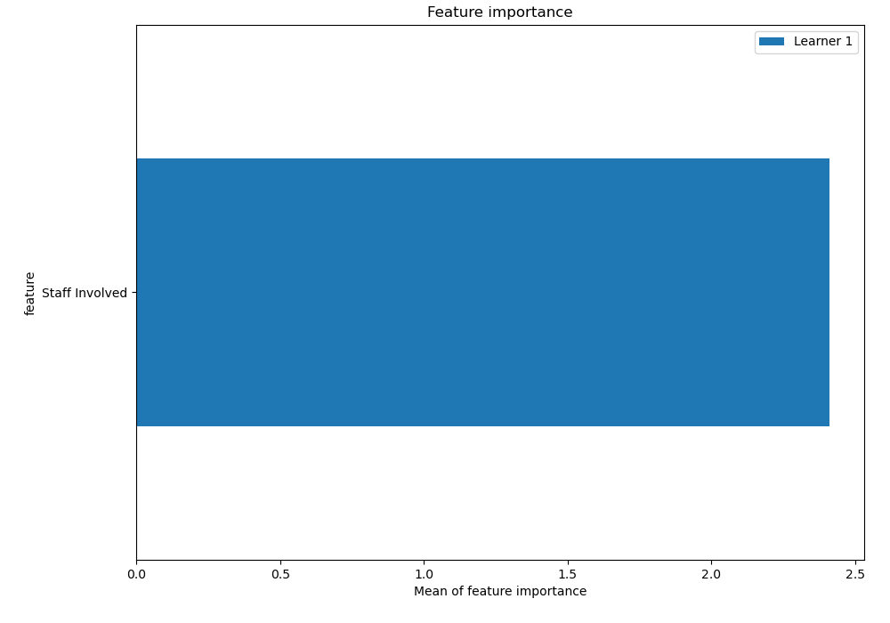
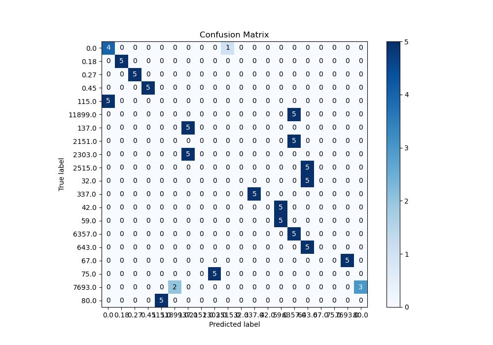
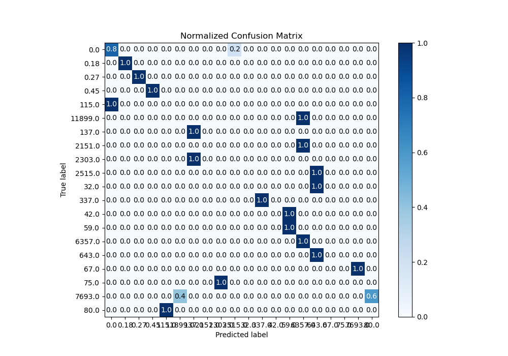
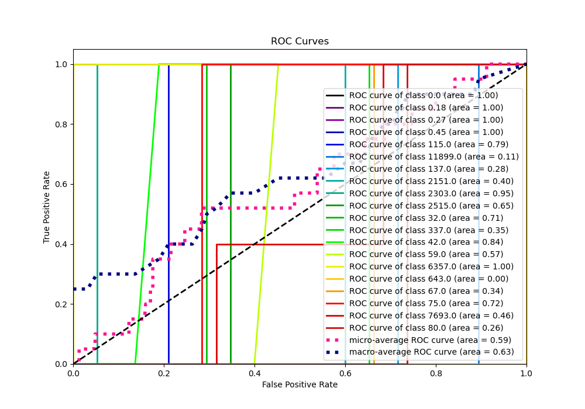
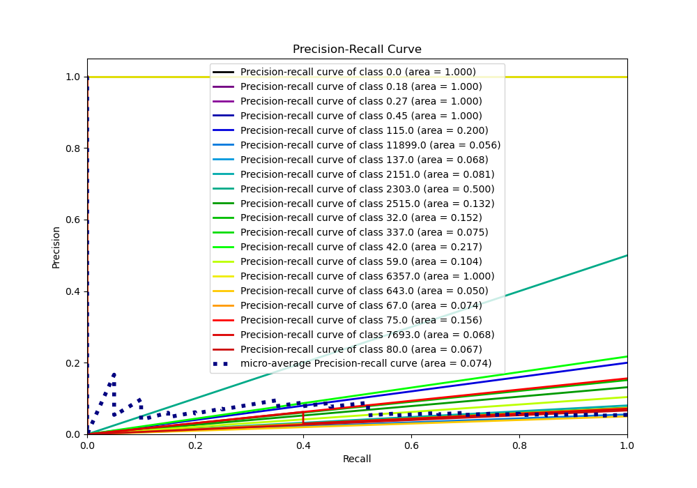
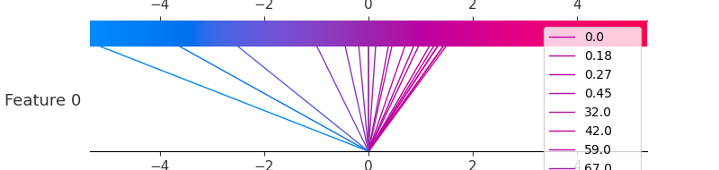
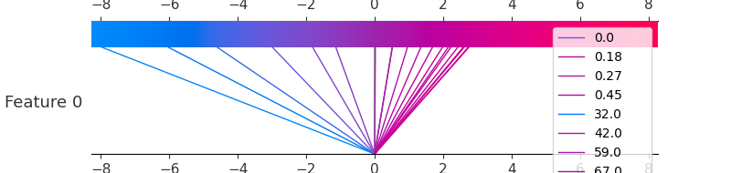
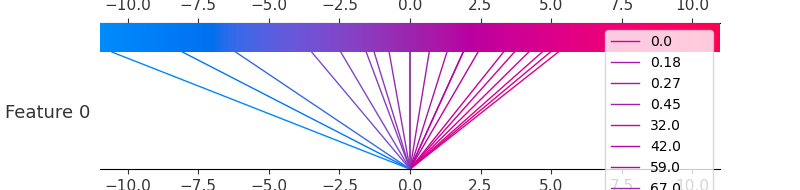

# Summary of 3_Linear

[<< Go back](../README.md)

## Logistic Regression (Linear)
- **n_jobs**: -1
- **num_class**: 20
- **explain_level**: 2

## Validation
 - **validation_type**: split
 - **train_ratio**: 0.75
 - **shuffle**: True
 - **stratify**: True

## Optimized metric
logloss

## Training time

8.1 seconds

### Metric details
|           |      0.0 |   0.18 |   0.27 |   0.45 |   32.0 |   42.0 |     59.0 |   67.0 |   75.0 |   80.0 |   115.0 |    137.0 |   337.0 |    643.0 |   2151.0 |   2303.0 |   2515.0 |   6357.0 |   7693.0 |   11899.0 |   accuracy |   macro avg |   weighted avg |   logloss |
|:----------|---------:|-------:|-------:|-------:|-------:|-------:|---------:|-------:|-------:|-------:|--------:|---------:|--------:|---------:|---------:|---------:|---------:|---------:|---------:|----------:|-----------:|------------:|---------------:|----------:|
| precision | 0.444444 |      1 |      1 |      1 |      0 |      0 | 0.5      |      0 |      0 |      0 |       0 | 0.5      |       1 | 0.333333 |        0 |        0 |        0 | 0.333333 |        0 |         0 |       0.44 |    0.305556 |       0.305556 |   2.07926 |
| recall    | 0.8      |      1 |      1 |      1 |      0 |      0 | 1        |      0 |      0 |      0 |       0 | 1        |       1 | 1        |        0 |        0 |        0 | 1        |        0 |         0 |       0.44 |    0.44     |       0.44     |   2.07926 |
| f1-score  | 0.571429 |      1 |      1 |      1 |      0 |      0 | 0.666667 |      0 |      0 |      0 |       0 | 0.666667 |       1 | 0.5      |        0 |        0 |        0 | 0.5      |        0 |         0 |       0.44 |    0.345238 |       0.345238 |   2.07926 |
| support   | 5        |      5 |      5 |      5 |      5 |      5 | 5        |      5 |      5 |      5 |       5 | 5        |       5 | 5        |        5 |        5 |        5 | 5        |        5 |         5 |       0.44 |  100        |     100        |   2.07926 |

## Confusion matrix
|                    |   Predicted as 0.0 |   Predicted as 0.18 |   Predicted as 0.27 |   Predicted as 0.45 |   Predicted as 32.0 |   Predicted as 42.0 |   Predicted as 59.0 |   Predicted as 67.0 |   Predicted as 75.0 |   Predicted as 80.0 |   Predicted as 115.0 |   Predicted as 137.0 |   Predicted as 337.0 |   Predicted as 643.0 |   Predicted as 2151.0 |   Predicted as 2303.0 |   Predicted as 2515.0 |   Predicted as 6357.0 |   Predicted as 7693.0 |   Predicted as 11899.0 |
|:-------------------|-------------------:|--------------------:|--------------------:|--------------------:|--------------------:|--------------------:|--------------------:|--------------------:|--------------------:|--------------------:|---------------------:|---------------------:|---------------------:|---------------------:|----------------------:|----------------------:|----------------------:|----------------------:|----------------------:|-----------------------:|
| Labeled as 0.0     |                  4 |                   0 |                   0 |                   0 |                   0 |                   0 |                   0 |                   0 |                   0 |                   0 |                    0 |                    0 |                    0 |                    0 |                     0 |                     0 |                     1 |                     0 |                     0 |                      0 |
| Labeled as 0.18    |                  0 |                   5 |                   0 |                   0 |                   0 |                   0 |                   0 |                   0 |                   0 |                   0 |                    0 |                    0 |                    0 |                    0 |                     0 |                     0 |                     0 |                     0 |                     0 |                      0 |
| Labeled as 0.27    |                  0 |                   0 |                   5 |                   0 |                   0 |                   0 |                   0 |                   0 |                   0 |                   0 |                    0 |                    0 |                    0 |                    0 |                     0 |                     0 |                     0 |                     0 |                     0 |                      0 |
| Labeled as 0.45    |                  0 |                   0 |                   0 |                   5 |                   0 |                   0 |                   0 |                   0 |                   0 |                   0 |                    0 |                    0 |                    0 |                    0 |                     0 |                     0 |                     0 |                     0 |                     0 |                      0 |
| Labeled as 32.0    |                  0 |                   0 |                   0 |                   0 |                   0 |                   0 |                   0 |                   0 |                   0 |                   0 |                    0 |                    0 |                    0 |                    5 |                     0 |                     0 |                     0 |                     0 |                     0 |                      0 |
| Labeled as 42.0    |                  0 |                   0 |                   0 |                   0 |                   0 |                   0 |                   5 |                   0 |                   0 |                   0 |                    0 |                    0 |                    0 |                    0 |                     0 |                     0 |                     0 |                     0 |                     0 |                      0 |
| Labeled as 59.0    |                  0 |                   0 |                   0 |                   0 |                   0 |                   0 |                   5 |                   0 |                   0 |                   0 |                    0 |                    0 |                    0 |                    0 |                     0 |                     0 |                     0 |                     0 |                     0 |                      0 |
| Labeled as 67.0    |                  0 |                   0 |                   0 |                   0 |                   0 |                   0 |                   0 |                   0 |                   0 |                   0 |                    0 |                    0 |                    0 |                    0 |                     0 |                     0 |                     0 |                     0 |                     5 |                      0 |
| Labeled as 75.0    |                  0 |                   0 |                   0 |                   0 |                   0 |                   0 |                   0 |                   0 |                   0 |                   0 |                    0 |                    0 |                    0 |                    0 |                     0 |                     5 |                     0 |                     0 |                     0 |                      0 |
| Labeled as 80.0    |                  0 |                   0 |                   0 |                   0 |                   0 |                   0 |                   0 |                   0 |                   0 |                   0 |                    5 |                    0 |                    0 |                    0 |                     0 |                     0 |                     0 |                     0 |                     0 |                      0 |
| Labeled as 115.0   |                  5 |                   0 |                   0 |                   0 |                   0 |                   0 |                   0 |                   0 |                   0 |                   0 |                    0 |                    0 |                    0 |                    0 |                     0 |                     0 |                     0 |                     0 |                     0 |                      0 |
| Labeled as 137.0   |                  0 |                   0 |                   0 |                   0 |                   0 |                   0 |                   0 |                   0 |                   0 |                   0 |                    0 |                    5 |                    0 |                    0 |                     0 |                     0 |                     0 |                     0 |                     0 |                      0 |
| Labeled as 337.0   |                  0 |                   0 |                   0 |                   0 |                   0 |                   0 |                   0 |                   0 |                   0 |                   0 |                    0 |                    0 |                    5 |                    0 |                     0 |                     0 |                     0 |                     0 |                     0 |                      0 |
| Labeled as 643.0   |                  0 |                   0 |                   0 |                   0 |                   0 |                   0 |                   0 |                   0 |                   0 |                   0 |                    0 |                    0 |                    0 |                    5 |                     0 |                     0 |                     0 |                     0 |                     0 |                      0 |
| Labeled as 2151.0  |                  0 |                   0 |                   0 |                   0 |                   0 |                   0 |                   0 |                   0 |                   0 |                   0 |                    0 |                    0 |                    0 |                    0 |                     0 |                     0 |                     0 |                     5 |                     0 |                      0 |
| Labeled as 2303.0  |                  0 |                   0 |                   0 |                   0 |                   0 |                   0 |                   0 |                   0 |                   0 |                   0 |                    0 |                    5 |                    0 |                    0 |                     0 |                     0 |                     0 |                     0 |                     0 |                      0 |
| Labeled as 2515.0  |                  0 |                   0 |                   0 |                   0 |                   0 |                   0 |                   0 |                   0 |                   0 |                   0 |                    0 |                    0 |                    0 |                    5 |                     0 |                     0 |                     0 |                     0 |                     0 |                      0 |
| Labeled as 6357.0  |                  0 |                   0 |                   0 |                   0 |                   0 |                   0 |                   0 |                   0 |                   0 |                   0 |                    0 |                    0 |                    0 |                    0 |                     0 |                     0 |                     0 |                     5 |                     0 |                      0 |
| Labeled as 7693.0  |                  0 |                   0 |                   0 |                   0 |                   0 |                   0 |                   0 |                   0 |                   0 |                   3 |                    0 |                    0 |                    0 |                    0 |                     0 |                     0 |                     0 |                     0 |                     0 |                      2 |
| Labeled as 11899.0 |                  0 |                   0 |                   0 |                   0 |                   0 |                   0 |                   0 |                   0 |                   0 |                   0 |                    0 |                    0 |                    0 |                    0 |                     0 |                     0 |                     0 |                     5 |                     0 |                      0 |

## Learning curves

## Coefficients

### Coefficients learner #1
|                |       0.0 |     0.18 |      0.27 |     0.45 |     32.0 |      42.0 |      59.0 |     67.0 |     75.0 |      80.0 |     115.0 |    137.0 |     337.0 |    643.0 |   2151.0 |   2303.0 |    2515.0 |   6357.0 |   7693.0 |   11899.0 |
|:---------------|----------:|---------:|----------:|---------:|---------:|----------:|----------:|---------:|---------:|----------:|----------:|---------:|----------:|---------:|---------:|---------:|----------:|---------:|---------:|----------:|
| intercept      | -0.132251 | 1.08351  |  1.09663  | 1.01876  | -1.66024 |  1.05819  |  1.05819  | 0.901331 | 0.727681 |  0.630839 |  0.375871 | 0.177122 |  0.968306 | -2.71915 | -1.54796 | 0.490806 | -0.915845 | -2.61345 | 0.792156 | -0.790505 |
| Staff Involved | -2.51004  | 0.232772 | -0.122945 | 0.589179 | -3.83705 | -0.478522 | -0.478522 | 0.949015 | 1.31774  | -1.55116  | -1.92243  | 2.11772  | -0.833957 | -4.61169 |  3.76739 | 1.70319  | -3.23837  |  4.59864 | 1.19342  |  3.11561  |

## Permutation-based Importance

## Confusion Matrix

## Normalized Confusion Matrix

## ROC Curve

## Precision Recall Curve

## SHAP Importance

## SHAP Dependence plots

### Dependence 0.0 (Fold 1)

### Dependence 0.18 (Fold 1)

### Dependence 0.27 (Fold 1)

### Dependence 0.45 (Fold 1)

### Dependence 115.0 (Fold 1)

### Dependence 11899.0 (Fold 1)

### Dependence 137.0 (Fold 1)

### Dependence 2151.0 (Fold 1)

### Dependence 2303.0 (Fold 1)

### Dependence 2515.0 (Fold 1)

### Dependence 32.0 (Fold 1)

### Dependence 337.0 (Fold 1)

### Dependence 42.0 (Fold 1)

### Dependence 59.0 (Fold 1)

### Dependence 6357.0 (Fold 1)

### Dependence 643.0 (Fold 1)

### Dependence 67.0 (Fold 1)

### Dependence 75.0 (Fold 1)

### Dependence 7693.0 (Fold 1)

### Dependence 80.0 (Fold 1)

## SHAP Decision plots

### Worst decisions for selected sample 1 (Fold 1)

### Worst decisions for selected sample 2 (Fold 1)

### Worst decisions for selected sample 3 (Fold 1)

### Worst decisions for selected sample 4 (Fold 1)

### Best decisions for selected sample 1 (Fold 1)

### Best decisions for selected sample 2 (Fold 1)

### Best decisions for selected sample 3 (Fold 1)

### Best decisions for selected sample 4 (Fold 1)

[<< Go back](../README.md)
