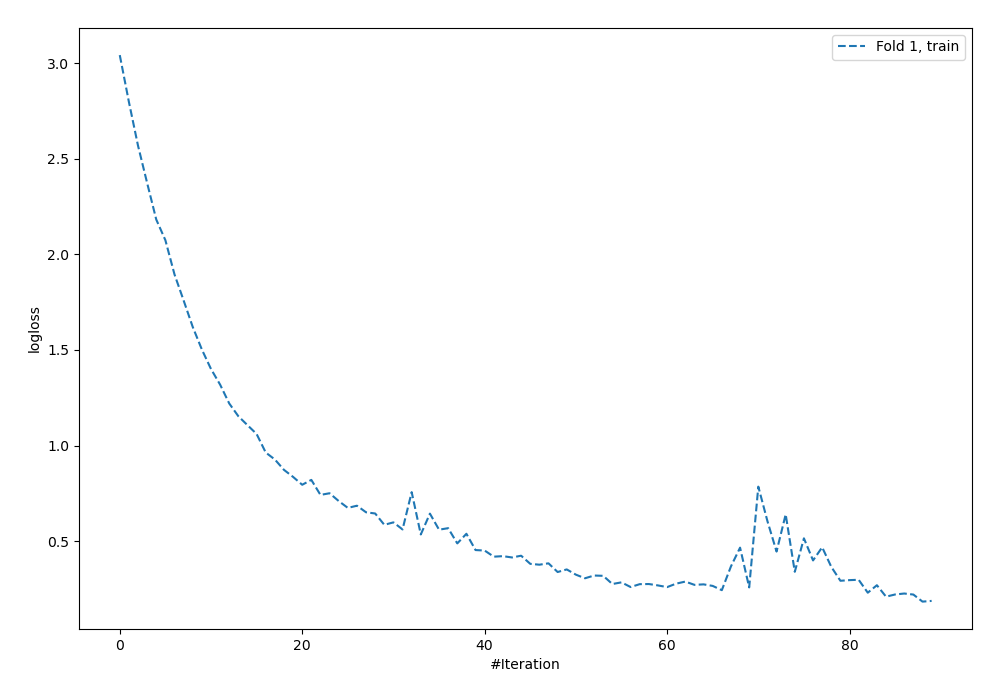
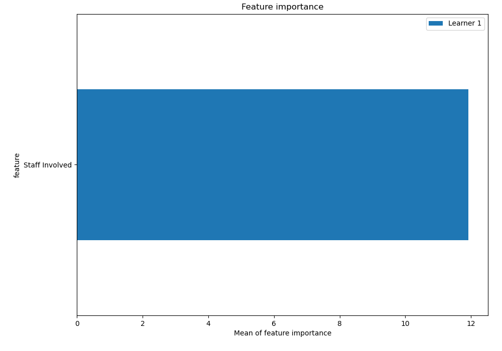
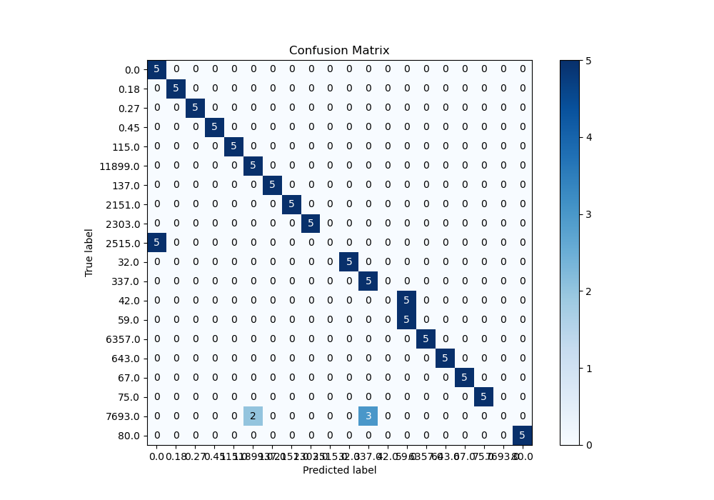
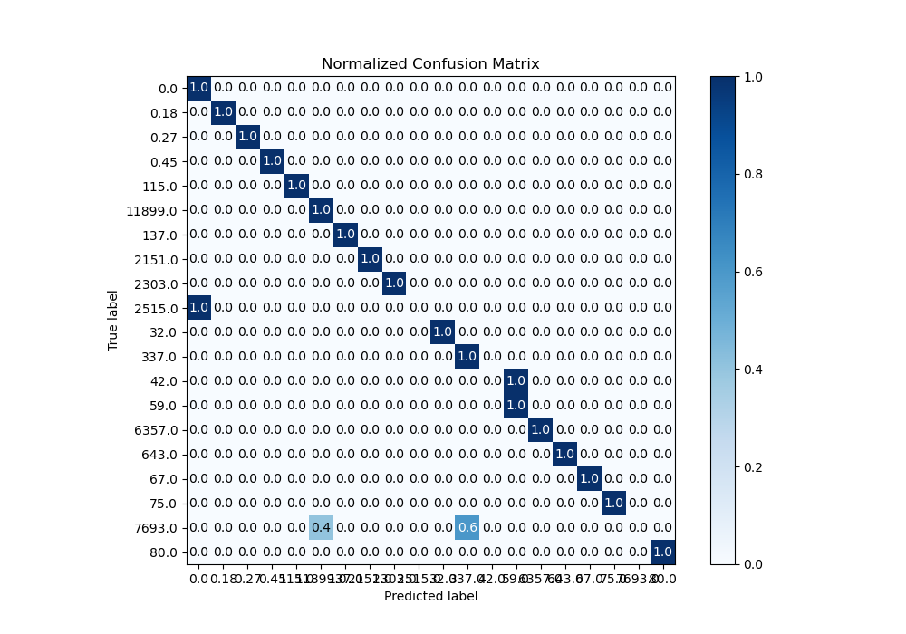
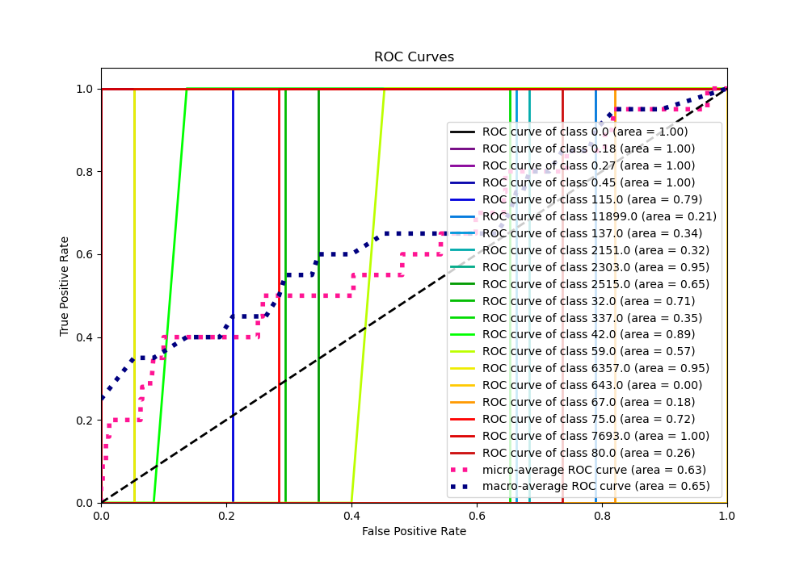
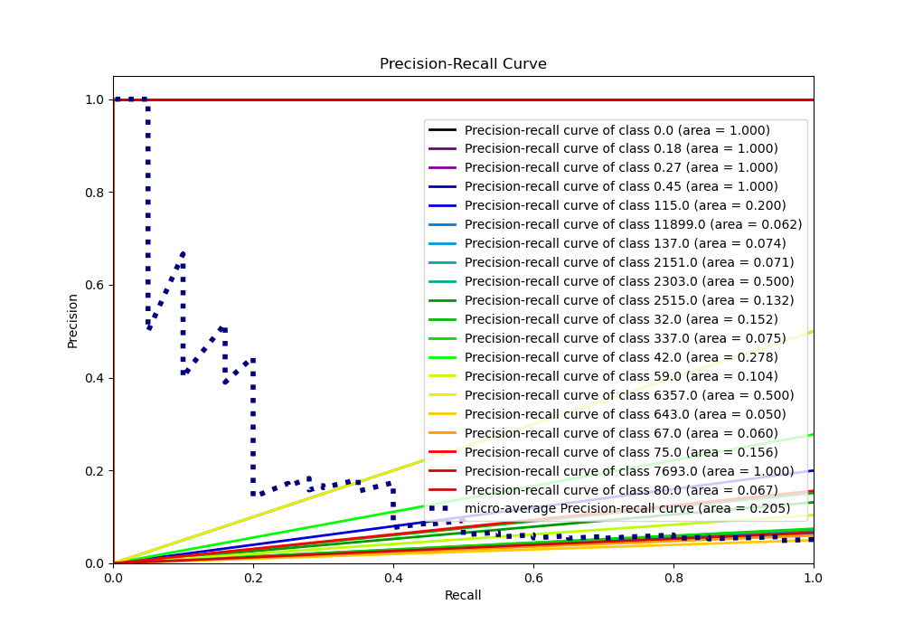

# Summary of 5_Default_NeuralNetwork

[<< Go back](../README.md)

## Neural Network
- **n_jobs**: -1
- **dense_1_size**: 32
- **dense_2_size**: 16
- **learning_rate**: 0.05
- **num_class**: 20
- **explain_level**: 2

## Validation
 - **validation_type**: split
 - **train_ratio**: 0.75
 - **shuffle**: True
 - **stratify**: True

## Optimized metric
logloss

## Training time

5.8 seconds

### Metric details
|           |      0.0 |   0.18 |   0.27 |   0.45 |   32.0 |   42.0 |     59.0 |   67.0 |   75.0 |   80.0 |   115.0 |   137.0 |    337.0 |   643.0 |   2151.0 |   2303.0 |   2515.0 |   6357.0 |   7693.0 |   11899.0 |   accuracy |   macro avg |   weighted avg |   logloss |
|:----------|---------:|-------:|-------:|-------:|-------:|-------:|---------:|-------:|-------:|-------:|--------:|--------:|---------:|--------:|---------:|---------:|---------:|---------:|---------:|----------:|-----------:|------------:|---------------:|----------:|
| precision | 0.5      |      1 |      1 |      1 |      1 |      0 | 0.5      |      1 |      1 |      1 |       1 |       1 | 0.625    |       1 |        1 |        1 |        0 |        1 |        0 |  0.714286 |       0.85 |    0.766964 |       0.766964 |   0.44374 |
| recall    | 1        |      1 |      1 |      1 |      1 |      0 | 1        |      1 |      1 |      1 |       1 |       1 | 1        |       1 |        1 |        1 |        0 |        1 |        0 |  1        |       0.85 |    0.85     |       0.85     |   0.44374 |
| f1-score  | 0.666667 |      1 |      1 |      1 |      1 |      0 | 0.666667 |      1 |      1 |      1 |       1 |       1 | 0.769231 |       1 |        1 |        1 |        0 |        1 |        0 |  0.833333 |       0.85 |    0.796795 |       0.796795 |   0.44374 |
| support   | 5        |      5 |      5 |      5 |      5 |      5 | 5        |      5 |      5 |      5 |       5 |       5 | 5        |       5 |        5 |        5 |        5 |        5 |        5 |  5        |       0.85 |  100        |     100        |   0.44374 |

## Confusion matrix
|                    |   Predicted as 0.0 |   Predicted as 0.18 |   Predicted as 0.27 |   Predicted as 0.45 |   Predicted as 32.0 |   Predicted as 42.0 |   Predicted as 59.0 |   Predicted as 67.0 |   Predicted as 75.0 |   Predicted as 80.0 |   Predicted as 115.0 |   Predicted as 137.0 |   Predicted as 337.0 |   Predicted as 643.0 |   Predicted as 2151.0 |   Predicted as 2303.0 |   Predicted as 2515.0 |   Predicted as 6357.0 |   Predicted as 7693.0 |   Predicted as 11899.0 |
|:-------------------|-------------------:|--------------------:|--------------------:|--------------------:|--------------------:|--------------------:|--------------------:|--------------------:|--------------------:|--------------------:|---------------------:|---------------------:|---------------------:|---------------------:|----------------------:|----------------------:|----------------------:|----------------------:|----------------------:|-----------------------:|
| Labeled as 0.0     |                  5 |                   0 |                   0 |                   0 |                   0 |                   0 |                   0 |                   0 |                   0 |                   0 |                    0 |                    0 |                    0 |                    0 |                     0 |                     0 |                     0 |                     0 |                     0 |                      0 |
| Labeled as 0.18    |                  0 |                   5 |                   0 |                   0 |                   0 |                   0 |                   0 |                   0 |                   0 |                   0 |                    0 |                    0 |                    0 |                    0 |                     0 |                     0 |                     0 |                     0 |                     0 |                      0 |
| Labeled as 0.27    |                  0 |                   0 |                   5 |                   0 |                   0 |                   0 |                   0 |                   0 |                   0 |                   0 |                    0 |                    0 |                    0 |                    0 |                     0 |                     0 |                     0 |                     0 |                     0 |                      0 |
| Labeled as 0.45    |                  0 |                   0 |                   0 |                   5 |                   0 |                   0 |                   0 |                   0 |                   0 |                   0 |                    0 |                    0 |                    0 |                    0 |                     0 |                     0 |                     0 |                     0 |                     0 |                      0 |
| Labeled as 32.0    |                  0 |                   0 |                   0 |                   0 |                   5 |                   0 |                   0 |                   0 |                   0 |                   0 |                    0 |                    0 |                    0 |                    0 |                     0 |                     0 |                     0 |                     0 |                     0 |                      0 |
| Labeled as 42.0    |                  0 |                   0 |                   0 |                   0 |                   0 |                   0 |                   5 |                   0 |                   0 |                   0 |                    0 |                    0 |                    0 |                    0 |                     0 |                     0 |                     0 |                     0 |                     0 |                      0 |
| Labeled as 59.0    |                  0 |                   0 |                   0 |                   0 |                   0 |                   0 |                   5 |                   0 |                   0 |                   0 |                    0 |                    0 |                    0 |                    0 |                     0 |                     0 |                     0 |                     0 |                     0 |                      0 |
| Labeled as 67.0    |                  0 |                   0 |                   0 |                   0 |                   0 |                   0 |                   0 |                   5 |                   0 |                   0 |                    0 |                    0 |                    0 |                    0 |                     0 |                     0 |                     0 |                     0 |                     0 |                      0 |
| Labeled as 75.0    |                  0 |                   0 |                   0 |                   0 |                   0 |                   0 |                   0 |                   0 |                   5 |                   0 |                    0 |                    0 |                    0 |                    0 |                     0 |                     0 |                     0 |                     0 |                     0 |                      0 |
| Labeled as 80.0    |                  0 |                   0 |                   0 |                   0 |                   0 |                   0 |                   0 |                   0 |                   0 |                   5 |                    0 |                    0 |                    0 |                    0 |                     0 |                     0 |                     0 |                     0 |                     0 |                      0 |
| Labeled as 115.0   |                  0 |                   0 |                   0 |                   0 |                   0 |                   0 |                   0 |                   0 |                   0 |                   0 |                    5 |                    0 |                    0 |                    0 |                     0 |                     0 |                     0 |                     0 |                     0 |                      0 |
| Labeled as 137.0   |                  0 |                   0 |                   0 |                   0 |                   0 |                   0 |                   0 |                   0 |                   0 |                   0 |                    0 |                    5 |                    0 |                    0 |                     0 |                     0 |                     0 |                     0 |                     0 |                      0 |
| Labeled as 337.0   |                  0 |                   0 |                   0 |                   0 |                   0 |                   0 |                   0 |                   0 |                   0 |                   0 |                    0 |                    0 |                    5 |                    0 |                     0 |                     0 |                     0 |                     0 |                     0 |                      0 |
| Labeled as 643.0   |                  0 |                   0 |                   0 |                   0 |                   0 |                   0 |                   0 |                   0 |                   0 |                   0 |                    0 |                    0 |                    0 |                    5 |                     0 |                     0 |                     0 |                     0 |                     0 |                      0 |
| Labeled as 2151.0  |                  0 |                   0 |                   0 |                   0 |                   0 |                   0 |                   0 |                   0 |                   0 |                   0 |                    0 |                    0 |                    0 |                    0 |                     5 |                     0 |                     0 |                     0 |                     0 |                      0 |
| Labeled as 2303.0  |                  0 |                   0 |                   0 |                   0 |                   0 |                   0 |                   0 |                   0 |                   0 |                   0 |                    0 |                    0 |                    0 |                    0 |                     0 |                     5 |                     0 |                     0 |                     0 |                      0 |
| Labeled as 2515.0  |                  5 |                   0 |                   0 |                   0 |                   0 |                   0 |                   0 |                   0 |                   0 |                   0 |                    0 |                    0 |                    0 |                    0 |                     0 |                     0 |                     0 |                     0 |                     0 |                      0 |
| Labeled as 6357.0  |                  0 |                   0 |                   0 |                   0 |                   0 |                   0 |                   0 |                   0 |                   0 |                   0 |                    0 |                    0 |                    0 |                    0 |                     0 |                     0 |                     0 |                     5 |                     0 |                      0 |
| Labeled as 7693.0  |                  0 |                   0 |                   0 |                   0 |                   0 |                   0 |                   0 |                   0 |                   0 |                   0 |                    0 |                    0 |                    3 |                    0 |                     0 |                     0 |                     0 |                     0 |                     0 |                      2 |
| Labeled as 11899.0 |                  0 |                   0 |                   0 |                   0 |                   0 |                   0 |                   0 |                   0 |                   0 |                   0 |                    0 |                    0 |                    0 |                    0 |                     0 |                     0 |                     0 |                     0 |                     0 |                      5 |

## Learning curves

## Permutation-based Importance

## Confusion Matrix

## Normalized Confusion Matrix

## ROC Curve

## Precision Recall Curve

[<< Go back](../README.md)
