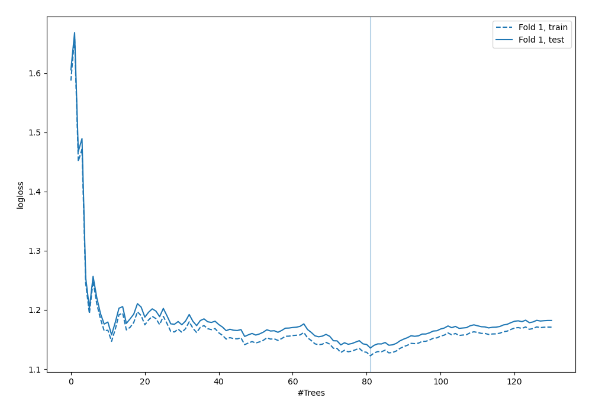
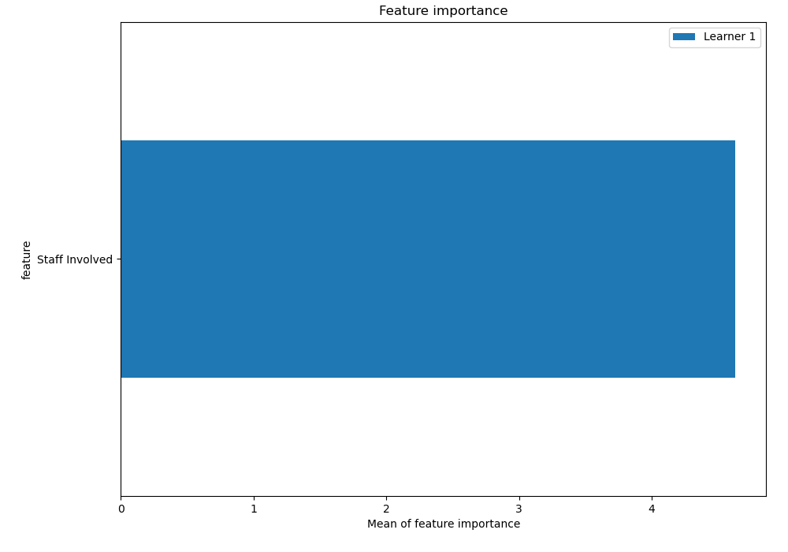
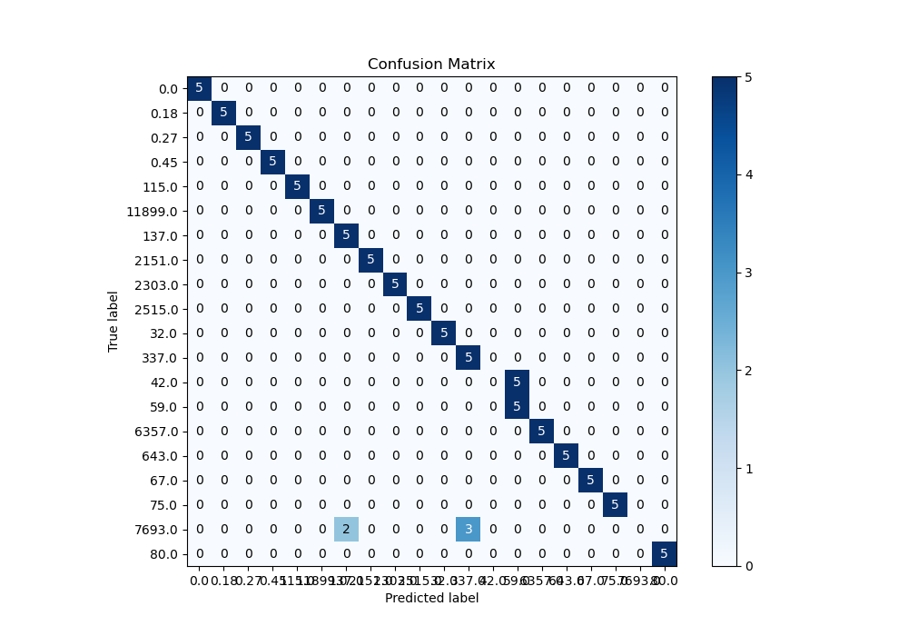
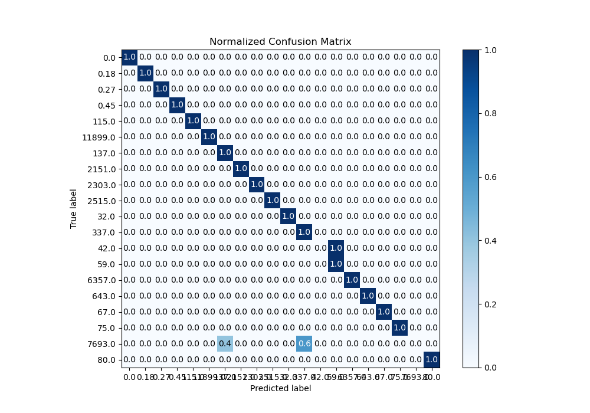
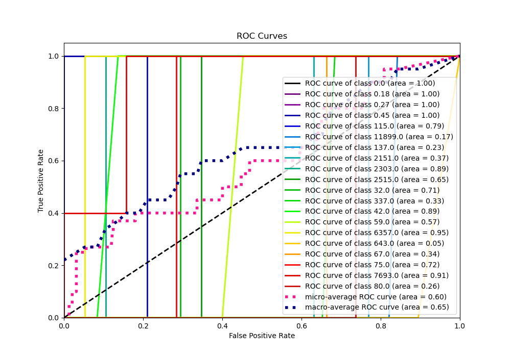
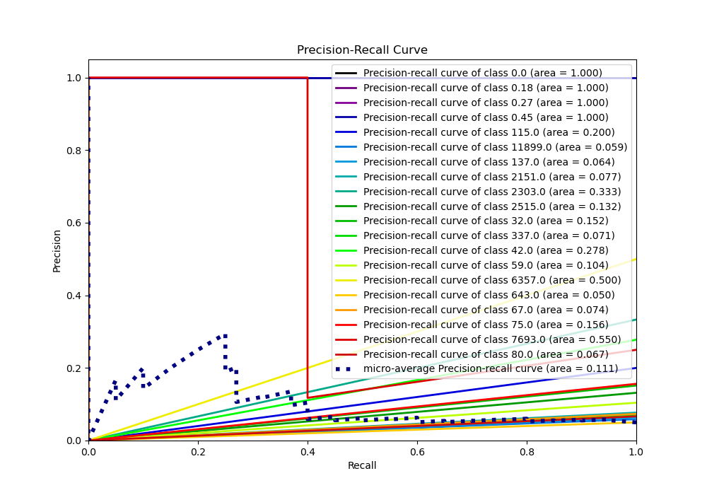
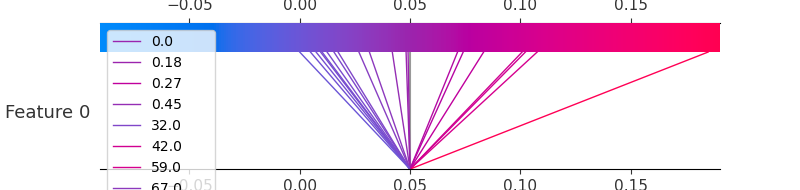
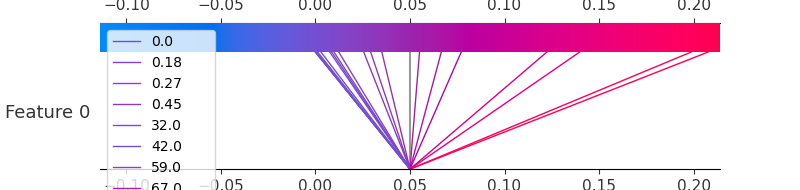
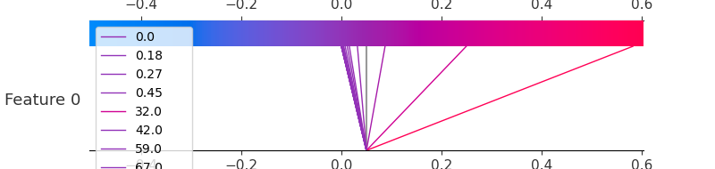

# Summary of 6_Default_RandomForest

[<< Go back](../README.md)

## Random Forest
- **n_jobs**: -1
- **criterion**: gini
- **max_features**: 0.9
- **min_samples_split**: 30
- **max_depth**: 4
- **eval_metric_name**: logloss
- **num_class**: 20
- **explain_level**: 2

## Validation
 - **validation_type**: split
 - **train_ratio**: 0.75
 - **shuffle**: True
 - **stratify**: True

## Optimized metric
logloss

## Training time

8.8 seconds

### Metric details
|           |   0.0 |   0.18 |   0.27 |   0.45 |   32.0 |   42.0 |     59.0 |   67.0 |   75.0 |   80.0 |   115.0 |    137.0 |    337.0 |   643.0 |   2151.0 |   2303.0 |   2515.0 |   6357.0 |   7693.0 |   11899.0 |   accuracy |   macro avg |   weighted avg |   logloss |
|:----------|------:|-------:|-------:|-------:|-------:|-------:|---------:|-------:|-------:|-------:|--------:|---------:|---------:|--------:|---------:|---------:|---------:|---------:|---------:|----------:|-----------:|------------:|---------------:|----------:|
| precision |     1 |      1 |      1 |      1 |      1 |      0 | 0.5      |      1 |      1 |      1 |       1 | 0.714286 | 0.625    |       1 |        1 |        1 |        1 |        1 |        0 |         1 |        0.9 |    0.841964 |       0.841964 |   1.13552 |
| recall    |     1 |      1 |      1 |      1 |      1 |      0 | 1        |      1 |      1 |      1 |       1 | 1        | 1        |       1 |        1 |        1 |        1 |        1 |        0 |         1 |        0.9 |    0.9      |       0.9      |   1.13552 |
| f1-score  |     1 |      1 |      1 |      1 |      1 |      0 | 0.666667 |      1 |      1 |      1 |       1 | 0.833333 | 0.769231 |       1 |        1 |        1 |        1 |        1 |        0 |         1 |        0.9 |    0.863462 |       0.863462 |   1.13552 |
| support   |     5 |      5 |      5 |      5 |      5 |      5 | 5        |      5 |      5 |      5 |       5 | 5        | 5        |       5 |        5 |        5 |        5 |        5 |        5 |         5 |        0.9 |  100        |     100        |   1.13552 |

## Confusion matrix
|                    |   Predicted as 0.0 |   Predicted as 0.18 |   Predicted as 0.27 |   Predicted as 0.45 |   Predicted as 32.0 |   Predicted as 42.0 |   Predicted as 59.0 |   Predicted as 67.0 |   Predicted as 75.0 |   Predicted as 80.0 |   Predicted as 115.0 |   Predicted as 137.0 |   Predicted as 337.0 |   Predicted as 643.0 |   Predicted as 2151.0 |   Predicted as 2303.0 |   Predicted as 2515.0 |   Predicted as 6357.0 |   Predicted as 7693.0 |   Predicted as 11899.0 |
|:-------------------|-------------------:|--------------------:|--------------------:|--------------------:|--------------------:|--------------------:|--------------------:|--------------------:|--------------------:|--------------------:|---------------------:|---------------------:|---------------------:|---------------------:|----------------------:|----------------------:|----------------------:|----------------------:|----------------------:|-----------------------:|
| Labeled as 0.0     |                  5 |                   0 |                   0 |                   0 |                   0 |                   0 |                   0 |                   0 |                   0 |                   0 |                    0 |                    0 |                    0 |                    0 |                     0 |                     0 |                     0 |                     0 |                     0 |                      0 |
| Labeled as 0.18    |                  0 |                   5 |                   0 |                   0 |                   0 |                   0 |                   0 |                   0 |                   0 |                   0 |                    0 |                    0 |                    0 |                    0 |                     0 |                     0 |                     0 |                     0 |                     0 |                      0 |
| Labeled as 0.27    |                  0 |                   0 |                   5 |                   0 |                   0 |                   0 |                   0 |                   0 |                   0 |                   0 |                    0 |                    0 |                    0 |                    0 |                     0 |                     0 |                     0 |                     0 |                     0 |                      0 |
| Labeled as 0.45    |                  0 |                   0 |                   0 |                   5 |                   0 |                   0 |                   0 |                   0 |                   0 |                   0 |                    0 |                    0 |                    0 |                    0 |                     0 |                     0 |                     0 |                     0 |                     0 |                      0 |
| Labeled as 32.0    |                  0 |                   0 |                   0 |                   0 |                   5 |                   0 |                   0 |                   0 |                   0 |                   0 |                    0 |                    0 |                    0 |                    0 |                     0 |                     0 |                     0 |                     0 |                     0 |                      0 |
| Labeled as 42.0    |                  0 |                   0 |                   0 |                   0 |                   0 |                   0 |                   5 |                   0 |                   0 |                   0 |                    0 |                    0 |                    0 |                    0 |                     0 |                     0 |                     0 |                     0 |                     0 |                      0 |
| Labeled as 59.0    |                  0 |                   0 |                   0 |                   0 |                   0 |                   0 |                   5 |                   0 |                   0 |                   0 |                    0 |                    0 |                    0 |                    0 |                     0 |                     0 |                     0 |                     0 |                     0 |                      0 |
| Labeled as 67.0    |                  0 |                   0 |                   0 |                   0 |                   0 |                   0 |                   0 |                   5 |                   0 |                   0 |                    0 |                    0 |                    0 |                    0 |                     0 |                     0 |                     0 |                     0 |                     0 |                      0 |
| Labeled as 75.0    |                  0 |                   0 |                   0 |                   0 |                   0 |                   0 |                   0 |                   0 |                   5 |                   0 |                    0 |                    0 |                    0 |                    0 |                     0 |                     0 |                     0 |                     0 |                     0 |                      0 |
| Labeled as 80.0    |                  0 |                   0 |                   0 |                   0 |                   0 |                   0 |                   0 |                   0 |                   0 |                   5 |                    0 |                    0 |                    0 |                    0 |                     0 |                     0 |                     0 |                     0 |                     0 |                      0 |
| Labeled as 115.0   |                  0 |                   0 |                   0 |                   0 |                   0 |                   0 |                   0 |                   0 |                   0 |                   0 |                    5 |                    0 |                    0 |                    0 |                     0 |                     0 |                     0 |                     0 |                     0 |                      0 |
| Labeled as 137.0   |                  0 |                   0 |                   0 |                   0 |                   0 |                   0 |                   0 |                   0 |                   0 |                   0 |                    0 |                    5 |                    0 |                    0 |                     0 |                     0 |                     0 |                     0 |                     0 |                      0 |
| Labeled as 337.0   |                  0 |                   0 |                   0 |                   0 |                   0 |                   0 |                   0 |                   0 |                   0 |                   0 |                    0 |                    0 |                    5 |                    0 |                     0 |                     0 |                     0 |                     0 |                     0 |                      0 |
| Labeled as 643.0   |                  0 |                   0 |                   0 |                   0 |                   0 |                   0 |                   0 |                   0 |                   0 |                   0 |                    0 |                    0 |                    0 |                    5 |                     0 |                     0 |                     0 |                     0 |                     0 |                      0 |
| Labeled as 2151.0  |                  0 |                   0 |                   0 |                   0 |                   0 |                   0 |                   0 |                   0 |                   0 |                   0 |                    0 |                    0 |                    0 |                    0 |                     5 |                     0 |                     0 |                     0 |                     0 |                      0 |
| Labeled as 2303.0  |                  0 |                   0 |                   0 |                   0 |                   0 |                   0 |                   0 |                   0 |                   0 |                   0 |                    0 |                    0 |                    0 |                    0 |                     0 |                     5 |                     0 |                     0 |                     0 |                      0 |
| Labeled as 2515.0  |                  0 |                   0 |                   0 |                   0 |                   0 |                   0 |                   0 |                   0 |                   0 |                   0 |                    0 |                    0 |                    0 |                    0 |                     0 |                     0 |                     5 |                     0 |                     0 |                      0 |
| Labeled as 6357.0  |                  0 |                   0 |                   0 |                   0 |                   0 |                   0 |                   0 |                   0 |                   0 |                   0 |                    0 |                    0 |                    0 |                    0 |                     0 |                     0 |                     0 |                     5 |                     0 |                      0 |
| Labeled as 7693.0  |                  0 |                   0 |                   0 |                   0 |                   0 |                   0 |                   0 |                   0 |                   0 |                   0 |                    0 |                    2 |                    3 |                    0 |                     0 |                     0 |                     0 |                     0 |                     0 |                      0 |
| Labeled as 11899.0 |                  0 |                   0 |                   0 |                   0 |                   0 |                   0 |                   0 |                   0 |                   0 |                   0 |                    0 |                    0 |                    0 |                    0 |                     0 |                     0 |                     0 |                     0 |                     0 |                      5 |

## Learning curves

## Permutation-based Importance

## Confusion Matrix

## Normalized Confusion Matrix

## ROC Curve

## Precision Recall Curve

## SHAP Importance

## SHAP Dependence plots

### Dependence 0.0 (Fold 1)

### Dependence 0.18 (Fold 1)

### Dependence 0.27 (Fold 1)

### Dependence 0.45 (Fold 1)

### Dependence 115.0 (Fold 1)

### Dependence 11899.0 (Fold 1)

### Dependence 137.0 (Fold 1)

### Dependence 2151.0 (Fold 1)

### Dependence 2303.0 (Fold 1)

### Dependence 2515.0 (Fold 1)

### Dependence 32.0 (Fold 1)

### Dependence 337.0 (Fold 1)

### Dependence 42.0 (Fold 1)

### Dependence 59.0 (Fold 1)

### Dependence 6357.0 (Fold 1)

### Dependence 643.0 (Fold 1)

### Dependence 67.0 (Fold 1)

### Dependence 75.0 (Fold 1)

### Dependence 7693.0 (Fold 1)

### Dependence 80.0 (Fold 1)

## SHAP Decision plots

### Worst decisions for selected sample 1 (Fold 1)

### Worst decisions for selected sample 2 (Fold 1)

### Worst decisions for selected sample 3 (Fold 1)

### Worst decisions for selected sample 4 (Fold 1)

### Best decisions for selected sample 1 (Fold 1)

### Best decisions for selected sample 2 (Fold 1)

### Best decisions for selected sample 3 (Fold 1)

### Best decisions for selected sample 4 (Fold 1)

[<< Go back](../README.md)
