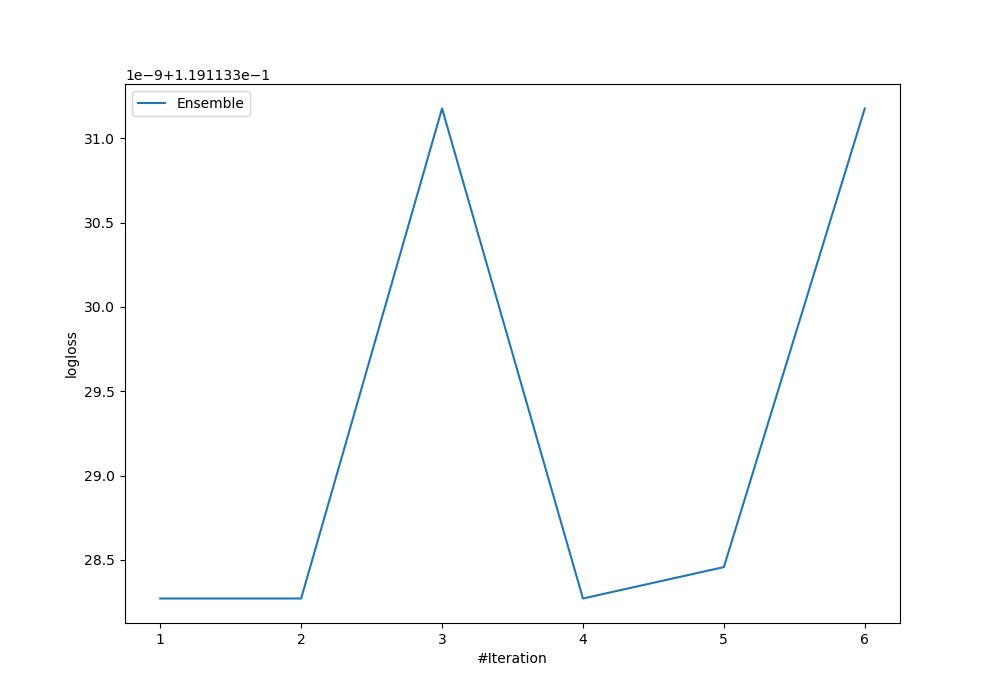
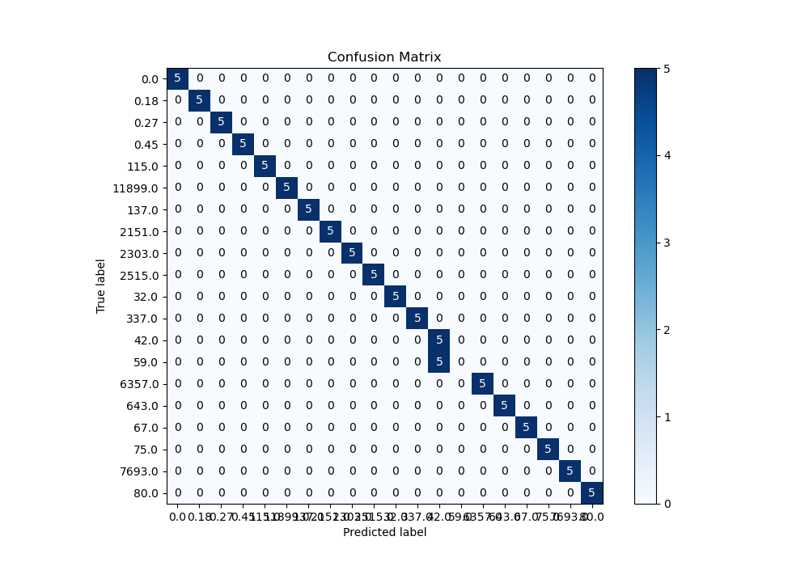
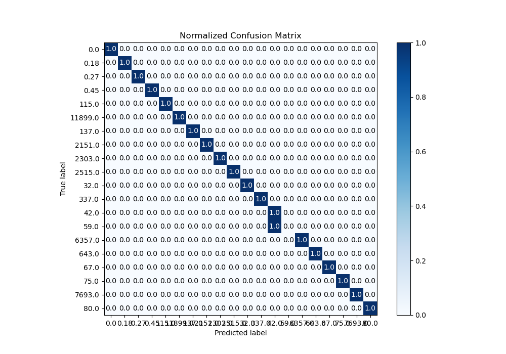
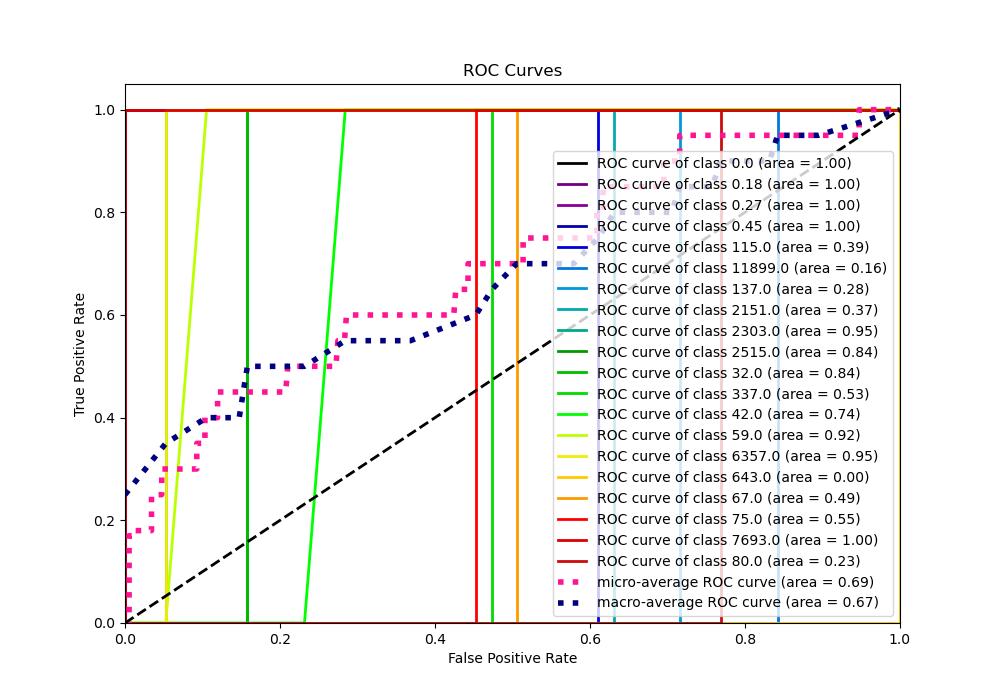
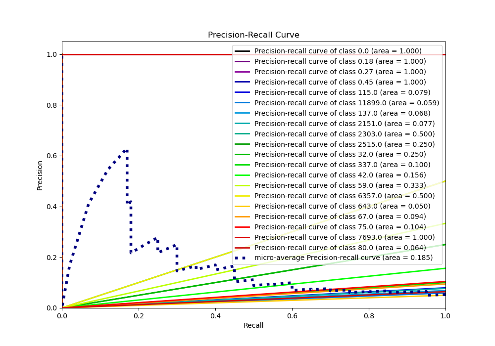

# Summary of Ensemble

[<< Go back](../README.md)

## Ensemble structure
| Model             |   Weight |
|:------------------|---------:|
| 4_Default_Xgboost |        1 |

### Metric details
|           |   0.0 |   0.18 |   0.27 |   0.45 |   32.0 |     42.0 |   59.0 |   67.0 |   75.0 |   80.0 |   115.0 |   137.0 |   337.0 |   643.0 |   2151.0 |   2303.0 |   2515.0 |   6357.0 |   7693.0 |   11899.0 |   accuracy |   macro avg |   weighted avg |   logloss |
|:----------|------:|-------:|-------:|-------:|-------:|---------:|-------:|-------:|-------:|-------:|--------:|--------:|--------:|--------:|---------:|---------:|---------:|---------:|---------:|----------:|-----------:|------------:|---------------:|----------:|
| precision |     1 |      1 |      1 |      1 |      1 | 0.5      |      0 |      1 |      1 |      1 |       1 |       1 |       1 |       1 |        1 |        1 |        1 |        1 |        1 |         1 |       0.95 |    0.925    |       0.925    |  0.119113 |
| recall    |     1 |      1 |      1 |      1 |      1 | 1        |      0 |      1 |      1 |      1 |       1 |       1 |       1 |       1 |        1 |        1 |        1 |        1 |        1 |         1 |       0.95 |    0.95     |       0.95     |  0.119113 |
| f1-score  |     1 |      1 |      1 |      1 |      1 | 0.666667 |      0 |      1 |      1 |      1 |       1 |       1 |       1 |       1 |        1 |        1 |        1 |        1 |        1 |         1 |       0.95 |    0.933333 |       0.933333 |  0.119113 |
| support   |     5 |      5 |      5 |      5 |      5 | 5        |      5 |      5 |      5 |      5 |       5 |       5 |       5 |       5 |        5 |        5 |        5 |        5 |        5 |         5 |       0.95 |  100        |     100        |  0.119113 |

## Confusion matrix
|                    |   Predicted as 0.0 |   Predicted as 0.18 |   Predicted as 0.27 |   Predicted as 0.45 |   Predicted as 32.0 |   Predicted as 42.0 |   Predicted as 59.0 |   Predicted as 67.0 |   Predicted as 75.0 |   Predicted as 80.0 |   Predicted as 115.0 |   Predicted as 137.0 |   Predicted as 337.0 |   Predicted as 643.0 |   Predicted as 2151.0 |   Predicted as 2303.0 |   Predicted as 2515.0 |   Predicted as 6357.0 |   Predicted as 7693.0 |   Predicted as 11899.0 |
|:-------------------|-------------------:|--------------------:|--------------------:|--------------------:|--------------------:|--------------------:|--------------------:|--------------------:|--------------------:|--------------------:|---------------------:|---------------------:|---------------------:|---------------------:|----------------------:|----------------------:|----------------------:|----------------------:|----------------------:|-----------------------:|
| Labeled as 0.0     |                  5 |                   0 |                   0 |                   0 |                   0 |                   0 |                   0 |                   0 |                   0 |                   0 |                    0 |                    0 |                    0 |                    0 |                     0 |                     0 |                     0 |                     0 |                     0 |                      0 |
| Labeled as 0.18    |                  0 |                   5 |                   0 |                   0 |                   0 |                   0 |                   0 |                   0 |                   0 |                   0 |                    0 |                    0 |                    0 |                    0 |                     0 |                     0 |                     0 |                     0 |                     0 |                      0 |
| Labeled as 0.27    |                  0 |                   0 |                   5 |                   0 |                   0 |                   0 |                   0 |                   0 |                   0 |                   0 |                    0 |                    0 |                    0 |                    0 |                     0 |                     0 |                     0 |                     0 |                     0 |                      0 |
| Labeled as 0.45    |                  0 |                   0 |                   0 |                   5 |                   0 |                   0 |                   0 |                   0 |                   0 |                   0 |                    0 |                    0 |                    0 |                    0 |                     0 |                     0 |                     0 |                     0 |                     0 |                      0 |
| Labeled as 32.0    |                  0 |                   0 |                   0 |                   0 |                   5 |                   0 |                   0 |                   0 |                   0 |                   0 |                    0 |                    0 |                    0 |                    0 |                     0 |                     0 |                     0 |                     0 |                     0 |                      0 |
| Labeled as 42.0    |                  0 |                   0 |                   0 |                   0 |                   0 |                   5 |                   0 |                   0 |                   0 |                   0 |                    0 |                    0 |                    0 |                    0 |                     0 |                     0 |                     0 |                     0 |                     0 |                      0 |
| Labeled as 59.0    |                  0 |                   0 |                   0 |                   0 |                   0 |                   5 |                   0 |                   0 |                   0 |                   0 |                    0 |                    0 |                    0 |                    0 |                     0 |                     0 |                     0 |                     0 |                     0 |                      0 |
| Labeled as 67.0    |                  0 |                   0 |                   0 |                   0 |                   0 |                   0 |                   0 |                   5 |                   0 |                   0 |                    0 |                    0 |                    0 |                    0 |                     0 |                     0 |                     0 |                     0 |                     0 |                      0 |
| Labeled as 75.0    |                  0 |                   0 |                   0 |                   0 |                   0 |                   0 |                   0 |                   0 |                   5 |                   0 |                    0 |                    0 |                    0 |                    0 |                     0 |                     0 |                     0 |                     0 |                     0 |                      0 |
| Labeled as 80.0    |                  0 |                   0 |                   0 |                   0 |                   0 |                   0 |                   0 |                   0 |                   0 |                   5 |                    0 |                    0 |                    0 |                    0 |                     0 |                     0 |                     0 |                     0 |                     0 |                      0 |
| Labeled as 115.0   |                  0 |                   0 |                   0 |                   0 |                   0 |                   0 |                   0 |                   0 |                   0 |                   0 |                    5 |                    0 |                    0 |                    0 |                     0 |                     0 |                     0 |                     0 |                     0 |                      0 |
| Labeled as 137.0   |                  0 |                   0 |                   0 |                   0 |                   0 |                   0 |                   0 |                   0 |                   0 |                   0 |                    0 |                    5 |                    0 |                    0 |                     0 |                     0 |                     0 |                     0 |                     0 |                      0 |
| Labeled as 337.0   |                  0 |                   0 |                   0 |                   0 |                   0 |                   0 |                   0 |                   0 |                   0 |                   0 |                    0 |                    0 |                    5 |                    0 |                     0 |                     0 |                     0 |                     0 |                     0 |                      0 |
| Labeled as 643.0   |                  0 |                   0 |                   0 |                   0 |                   0 |                   0 |                   0 |                   0 |                   0 |                   0 |                    0 |                    0 |                    0 |                    5 |                     0 |                     0 |                     0 |                     0 |                     0 |                      0 |
| Labeled as 2151.0  |                  0 |                   0 |                   0 |                   0 |                   0 |                   0 |                   0 |                   0 |                   0 |                   0 |                    0 |                    0 |                    0 |                    0 |                     5 |                     0 |                     0 |                     0 |                     0 |                      0 |
| Labeled as 2303.0  |                  0 |                   0 |                   0 |                   0 |                   0 |                   0 |                   0 |                   0 |                   0 |                   0 |                    0 |                    0 |                    0 |                    0 |                     0 |                     5 |                     0 |                     0 |                     0 |                      0 |
| Labeled as 2515.0  |                  0 |                   0 |                   0 |                   0 |                   0 |                   0 |                   0 |                   0 |                   0 |                   0 |                    0 |                    0 |                    0 |                    0 |                     0 |                     0 |                     5 |                     0 |                     0 |                      0 |
| Labeled as 6357.0  |                  0 |                   0 |                   0 |                   0 |                   0 |                   0 |                   0 |                   0 |                   0 |                   0 |                    0 |                    0 |                    0 |                    0 |                     0 |                     0 |                     0 |                     5 |                     0 |                      0 |
| Labeled as 7693.0  |                  0 |                   0 |                   0 |                   0 |                   0 |                   0 |                   0 |                   0 |                   0 |                   0 |                    0 |                    0 |                    0 |                    0 |                     0 |                     0 |                     0 |                     0 |                     5 |                      0 |
| Labeled as 11899.0 |                  0 |                   0 |                   0 |                   0 |                   0 |                   0 |                   0 |                   0 |                   0 |                   0 |                    0 |                    0 |                    0 |                    0 |                     0 |                     0 |                     0 |                     0 |                     0 |                      5 |

## Learning curves

## Confusion Matrix

## Normalized Confusion Matrix

## ROC Curve

## Precision Recall Curve

[<< Go back](../README.md)
