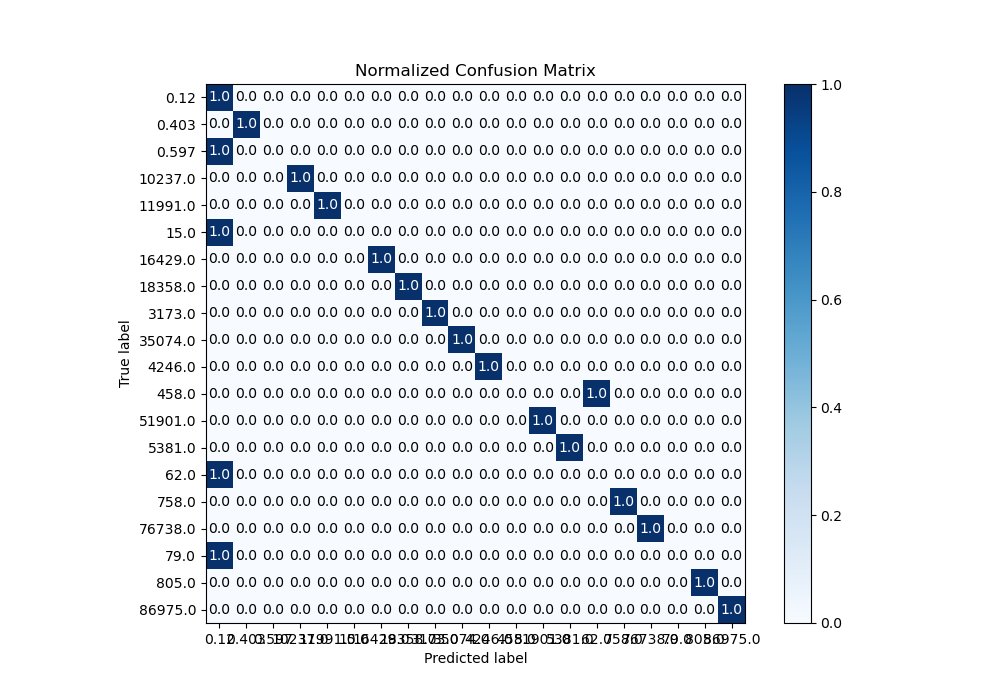

# Summary of 1_Linear

[<< Go back](../README.md)

## Logistic Regression (Linear)
- **n_jobs**: -1
- **num_class**: 20
- **explain_level**: 1

## Validation
 - **validation_type**: kfold
 - **k_folds**: 5
 - **shuffle**: True
 - **stratify**: True

## Optimized metric
logloss

## Training time

5.3 seconds

### Metric details
|           |      0.12 |   0.403 |   0.597 |   15.0 |   62.0 |   79.0 |   458.0 |   758.0 |   805.0 |   3173.0 |   4246.0 |   5381.0 |   10237.0 |   11991.0 |   16429.0 |   18358.0 |   35074.0 |   51901.0 |   76738.0 |   86975.0 |   accuracy |   macro avg |   weighted avg |   logloss |
|:----------|----------:|--------:|--------:|-------:|-------:|-------:|--------:|--------:|--------:|---------:|---------:|---------:|----------:|----------:|----------:|----------:|----------:|----------:|----------:|----------:|-----------:|------------:|---------------:|----------:|
| precision |  0.2      |       1 |       0 |      0 |      0 |      0 |       0 |       1 |       1 |        1 |        1 |        1 |         1 |         1 |         1 |         1 |         1 |         1 |         1 |         1 |       0.75 |    0.71     |       0.71     |   1.23882 |
| recall    |  1        |       1 |       0 |      0 |      0 |      0 |       0 |       1 |       1 |        1 |        1 |        1 |         1 |         1 |         1 |         1 |         1 |         1 |         1 |         1 |       0.75 |    0.75     |       0.75     |   1.23882 |
| f1-score  |  0.333333 |       1 |       0 |      0 |      0 |      0 |       0 |       1 |       1 |        1 |        1 |        1 |         1 |         1 |         1 |         1 |         1 |         1 |         1 |         1 |       0.75 |    0.716667 |       0.716667 |   1.23882 |
| support   | 20        |      20 |      20 |     20 |     20 |     20 |      20 |      20 |      20 |       20 |       20 |       20 |        20 |        20 |        20 |        20 |        20 |        20 |        20 |        20 |       0.75 |  400        |     400        |   1.23882 |

## Confusion matrix
|                    |   Predicted as 0.12 |   Predicted as 0.403 |   Predicted as 0.597 |   Predicted as 15.0 |   Predicted as 62.0 |   Predicted as 79.0 |   Predicted as 458.0 |   Predicted as 758.0 |   Predicted as 805.0 |   Predicted as 3173.0 |   Predicted as 4246.0 |   Predicted as 5381.0 |   Predicted as 10237.0 |   Predicted as 11991.0 |   Predicted as 16429.0 |   Predicted as 18358.0 |   Predicted as 35074.0 |   Predicted as 51901.0 |   Predicted as 76738.0 |   Predicted as 86975.0 |
|:-------------------|--------------------:|---------------------:|---------------------:|--------------------:|--------------------:|--------------------:|---------------------:|---------------------:|---------------------:|----------------------:|----------------------:|----------------------:|-----------------------:|-----------------------:|-----------------------:|-----------------------:|-----------------------:|-----------------------:|-----------------------:|-----------------------:|
| Labeled as 0.12    |                  20 |                    0 |                    0 |                   0 |                   0 |                   0 |                    0 |                    0 |                    0 |                     0 |                     0 |                     0 |                      0 |                      0 |                      0 |                      0 |                      0 |                      0 |                      0 |                      0 |
| Labeled as 0.403   |                   0 |                   20 |                    0 |                   0 |                   0 |                   0 |                    0 |                    0 |                    0 |                     0 |                     0 |                     0 |                      0 |                      0 |                      0 |                      0 |                      0 |                      0 |                      0 |                      0 |
| Labeled as 0.597   |                  20 |                    0 |                    0 |                   0 |                   0 |                   0 |                    0 |                    0 |                    0 |                     0 |                     0 |                     0 |                      0 |                      0 |                      0 |                      0 |                      0 |                      0 |                      0 |                      0 |
| Labeled as 15.0    |                  20 |                    0 |                    0 |                   0 |                   0 |                   0 |                    0 |                    0 |                    0 |                     0 |                     0 |                     0 |                      0 |                      0 |                      0 |                      0 |                      0 |                      0 |                      0 |                      0 |
| Labeled as 62.0    |                  20 |                    0 |                    0 |                   0 |                   0 |                   0 |                    0 |                    0 |                    0 |                     0 |                     0 |                     0 |                      0 |                      0 |                      0 |                      0 |                      0 |                      0 |                      0 |                      0 |
| Labeled as 79.0    |                  20 |                    0 |                    0 |                   0 |                   0 |                   0 |                    0 |                    0 |                    0 |                     0 |                     0 |                     0 |                      0 |                      0 |                      0 |                      0 |                      0 |                      0 |                      0 |                      0 |
| Labeled as 458.0   |                   0 |                    0 |                    0 |                   0 |                  20 |                   0 |                    0 |                    0 |                    0 |                     0 |                     0 |                     0 |                      0 |                      0 |                      0 |                      0 |                      0 |                      0 |                      0 |                      0 |
| Labeled as 758.0   |                   0 |                    0 |                    0 |                   0 |                   0 |                   0 |                    0 |                   20 |                    0 |                     0 |                     0 |                     0 |                      0 |                      0 |                      0 |                      0 |                      0 |                      0 |                      0 |                      0 |
| Labeled as 805.0   |                   0 |                    0 |                    0 |                   0 |                   0 |                   0 |                    0 |                    0 |                   20 |                     0 |                     0 |                     0 |                      0 |                      0 |                      0 |                      0 |                      0 |                      0 |                      0 |                      0 |
| Labeled as 3173.0  |                   0 |                    0 |                    0 |                   0 |                   0 |                   0 |                    0 |                    0 |                    0 |                    20 |                     0 |                     0 |                      0 |                      0 |                      0 |                      0 |                      0 |                      0 |                      0 |                      0 |
| Labeled as 4246.0  |                   0 |                    0 |                    0 |                   0 |                   0 |                   0 |                    0 |                    0 |                    0 |                     0 |                    20 |                     0 |                      0 |                      0 |                      0 |                      0 |                      0 |                      0 |                      0 |                      0 |
| Labeled as 5381.0  |                   0 |                    0 |                    0 |                   0 |                   0 |                   0 |                    0 |                    0 |                    0 |                     0 |                     0 |                    20 |                      0 |                      0 |                      0 |                      0 |                      0 |                      0 |                      0 |                      0 |
| Labeled as 10237.0 |                   0 |                    0 |                    0 |                   0 |                   0 |                   0 |                    0 |                    0 |                    0 |                     0 |                     0 |                     0 |                     20 |                      0 |                      0 |                      0 |                      0 |                      0 |                      0 |                      0 |
| Labeled as 11991.0 |                   0 |                    0 |                    0 |                   0 |                   0 |                   0 |                    0 |                    0 |                    0 |                     0 |                     0 |                     0 |                      0 |                     20 |                      0 |                      0 |                      0 |                      0 |                      0 |                      0 |
| Labeled as 16429.0 |                   0 |                    0 |                    0 |                   0 |                   0 |                   0 |                    0 |                    0 |                    0 |                     0 |                     0 |                     0 |                      0 |                      0 |                     20 |                      0 |                      0 |                      0 |                      0 |                      0 |
| Labeled as 18358.0 |                   0 |                    0 |                    0 |                   0 |                   0 |                   0 |                    0 |                    0 |                    0 |                     0 |                     0 |                     0 |                      0 |                      0 |                      0 |                     20 |                      0 |                      0 |                      0 |                      0 |
| Labeled as 35074.0 |                   0 |                    0 |                    0 |                   0 |                   0 |                   0 |                    0 |                    0 |                    0 |                     0 |                     0 |                     0 |                      0 |                      0 |                      0 |                      0 |                     20 |                      0 |                      0 |                      0 |
| Labeled as 51901.0 |                   0 |                    0 |                    0 |                   0 |                   0 |                   0 |                    0 |                    0 |                    0 |                     0 |                     0 |                     0 |                      0 |                      0 |                      0 |                      0 |                      0 |                     20 |                      0 |                      0 |
| Labeled as 76738.0 |                   0 |                    0 |                    0 |                   0 |                   0 |                   0 |                    0 |                    0 |                    0 |                     0 |                     0 |                     0 |                      0 |                      0 |                      0 |                      0 |                      0 |                      0 |                     20 |                      0 |
| Labeled as 86975.0 |                   0 |                    0 |                    0 |                   0 |                   0 |                   0 |                    0 |                    0 |                    0 |                     0 |                     0 |                     0 |                      0 |                      0 |                      0 |                      0 |                      0 |                      0 |                      0 |                     20 |

## Learning curves

## Coefficients

### Coefficients learner #1
|                                            |       0.12 |      0.403 |       0.597 |       15.0 |       62.0 |       79.0 |      458.0 |      758.0 |      805.0 |     3173.0 |    4246.0 |    5381.0 |   10237.0 |    11991.0 |   16429.0 |    18358.0 |    35074.0 |   51901.0 |   76738.0 |   86975.0 |
|:-------------------------------------------|-----------:|-----------:|------------:|-----------:|-----------:|-----------:|-----------:|-----------:|-----------:|-----------:|----------:|----------:|----------:|-----------:|----------:|-----------:|-----------:|----------:|----------:|----------:|
| intercept                                  | -0.535972  | -0.331542  | -0.493716   | -0.463615  | -0.435498  | -0.444872  |  0.0368926 |  0.341998  |  0.441397  |  2.38074   |  1.5039   | -0.522822 | -0.297515 |  0.379552  |  1.35646  |  0.948607  | -0.131523  | -0.142417 | -0.551189 | -3.03886  |
| acf                                        | -0.066172  | -0.0511329 | -0.0502924  | -0.0345818 | -0.0685859 | -0.0672424 | -0.0752735 | -0.0856107 | -0.0190302 | -0.269692  | -0.397076 | -1.0039   | -0.705529 | -0.0788983 | -0.489144 |  1.59231   |  0.302546  |  0.329819 |  0.88936  |  0.348119 |
| acl                                        | -0.0329792 |  0.198113  | -0.00153312 | -0.0332137 | -0.0332437 | -0.0331667 | -0.0369626 | -0.0482668 | -0.0523222 | -0.359227  | -0.285028 | -0.292085 | -0.658742 |  0.0293571 |  0.160625 | -0.0121113 |  0.898665  | -0.350432 |  0.536729 |  0.405824 |
| ahrq                                       | -0.0818704 |  0.0702885 | -0.0671672  | -0.0829995 | -0.0829057 | -0.0816626 | -0.0898023 | -0.0948714 | -0.100073  |  0.415924  | -0.295893 | -0.25807  | -0.412978 | -0.0352706 | -0.251513 |  0.0236921 |  0.942543  | -0.424126 |  0.494792 |  0.411964 |
| aspr                                       | -0.941522  | -0.960208  | -0.927945   | -0.933761  | -0.989565  | -0.966324  | -1.07152   | -1.11307   | -1.13128   |  0.634815  | -0.639115 |  2.18419  |  2.42237  | -0.408395  |  2.45623  |  0.386176  | -0.390035  |  1.30623  | -0.800153 |  1.88289  |
| Centers for Disease Control and Prevention | -0.542747  | -0.540451  | -0.545814   | -0.550216  | -0.324505  | -0.544721  | -0.144406  | -0.352796  | -0.313352  |  0.155294  | -0.443815 |  0.941056 | -0.258127 | -0.147128  |  1.5794   |  0.0823302 |  0.472106  |  0.30483  |  0.199964 |  0.9731   |
| Centers for Medicare and Medicaid Services | -0.264294  | -0.262312  | -0.262425   | -0.264256  | -0.270568  | -0.263399  | -0.295519  | -0.27576   | -0.300945  |  0.0196989 |  2.04682  | -0.415839 | -0.595076 | -0.104047  | -0.530412 | -0.0973457 |  0.337728  |  0.535279 |  0.936335 |  0.326334 |
| Food and Drug Administration               | -0.333129  | -0.331617  | -0.3358     | -0.337411  | -0.343917  | -0.305937  | -0.348344  | -0.187355  | -0.351717  | -0.969964  | -0.510422 |  0.823078 |  0.495869 | -0.161512  | -0.849406 |  2.01961   | -0.168798  |  0.905284 |  0.51359  |  0.777896 |
| hrsa                                       | -0.347078  | -0.342118  | -0.33996    | -0.356613  | -0.301338  | -0.346642  | -0.296841  | -0.239064  | -0.391349  |  0.2715    |  2.16397  | -0.823375 | -0.784884 | -0.132403  | -0.210069 |  0.322152  |  0.217574  |  0.631983 |  0.971606 |  0.332949 |
| ihs                                        | -0.515664  | -0.519186  | -0.515113   | -0.51959   | -0.520052  | -0.51476   | -0.210262  | -0.520844  | -0.4458    |  1.02603   | -0.351186 | -0.885312 | -0.9658   |  3.26965   |  0.382784 | -0.661564  | -0.410841  |  1.51047  |  1.13067  |  0.236365 |
| nih                                        | -0.476274  | -0.474363  | -0.477048   | -0.475484  | -0.479487  | -0.299621  | -0.102959  |  1.06205   |  1.09546   | -0.863451  | -0.383586 | -2.29647  |  2.02535  | -0.115707  |  0.98071  | -0.403267  |  0.868483  | -0.12987  | -0.199347 |  1.14488  |
| os                                         | -0.484942  | -0.484895  | -0.484438   | -0.428443  | -0.496628  | -0.486267  | -0.341726  | -0.531556  | -0.19634   | -0.0232415 |  1.8044   | -0.500674 | -0.4545   | -0.176191  |  0.577427 |  0.445427  |  0.0290284 |  0.881864 |  0.744523 |  0.607173 |
| samhsa                                     | -0.214327  | -0.150909  | -0.208227   | -0.144089  | -0.217397  | -0.213562  | -0.237212  | -0.228633  | -0.238607  |  1.71549   | -0.332323 | -0.379702 | -0.959691 | -0.0819648 |  0.665242 | -0.229818  |  0.919423  | -0.385126 |  0.501934 |  0.419496 |

### Coefficients learner #2
|                                            |       0.12 |      0.403 |       0.597 |       15.0 |       62.0 |       79.0 |      458.0 |      758.0 |      805.0 |     3173.0 |    4246.0 |    5381.0 |   10237.0 |    11991.0 |   16429.0 |    18358.0 |    35074.0 |   51901.0 |   76738.0 |   86975.0 |
|:-------------------------------------------|-----------:|-----------:|------------:|-----------:|-----------:|-----------:|-----------:|-----------:|-----------:|-----------:|----------:|----------:|----------:|-----------:|----------:|-----------:|-----------:|----------:|----------:|----------:|
| intercept                                  | -0.535972  | -0.331542  | -0.493716   | -0.463615  | -0.435498  | -0.444872  |  0.0368926 |  0.341998  |  0.441397  |  2.38074   |  1.5039   | -0.522822 | -0.297515 |  0.379552  |  1.35646  |  0.948606  | -0.131523  | -0.142417 | -0.55119  | -3.03886  |
| acf                                        | -0.066172  | -0.0511329 | -0.0502924  | -0.0345818 | -0.0685859 | -0.0672424 | -0.0752735 | -0.0856107 | -0.0190303 | -0.269692  | -0.397076 | -1.0039   | -0.70553  | -0.0788983 | -0.489144 |  1.59231   |  0.302546  |  0.329819 |  0.88936  |  0.348119 |
| acl                                        | -0.0329792 |  0.198114  | -0.00153312 | -0.0332137 | -0.0332437 | -0.0331667 | -0.0369626 | -0.0482669 | -0.0523223 | -0.359227  | -0.285028 | -0.292085 | -0.658742 |  0.0293571 |  0.160625 | -0.0121113 |  0.898665  | -0.350432 |  0.536729 |  0.405824 |
| ahrq                                       | -0.0818704 |  0.0702885 | -0.0671672  | -0.0829995 | -0.0829057 | -0.0816627 | -0.0898023 | -0.0948714 | -0.100073  |  0.415924  | -0.295893 | -0.25807  | -0.412978 | -0.0352707 | -0.251513 |  0.0236921 |  0.942543  | -0.424126 |  0.494792 |  0.411964 |
| aspr                                       | -0.941522  | -0.960208  | -0.927945   | -0.933761  | -0.989565  | -0.966324  | -1.07152   | -1.11307   | -1.13128   |  0.634815  | -0.639115 |  2.18419  |  2.42237  | -0.408395  |  2.45623  |  0.386176  | -0.390035  |  1.30623  | -0.800153 |  1.88289  |
| Centers for Disease Control and Prevention | -0.542747  | -0.540451  | -0.545814   | -0.550216  | -0.324505  | -0.544721  | -0.144406  | -0.352796  | -0.313352  |  0.155294  | -0.443815 |  0.941056 | -0.258127 | -0.147128  |  1.5794   |  0.0823302 |  0.472106  |  0.30483  |  0.199964 |  0.9731   |
| Centers for Medicare and Medicaid Services | -0.264294  | -0.262312  | -0.262425   | -0.264256  | -0.270568  | -0.263399  | -0.295519  | -0.27576   | -0.300945  |  0.0196989 |  2.04682  | -0.415839 | -0.595076 | -0.104047  | -0.530412 | -0.0973457 |  0.337728  |  0.535279 |  0.936335 |  0.326334 |
| Food and Drug Administration               | -0.333129  | -0.331617  | -0.3358     | -0.337411  | -0.343917  | -0.305937  | -0.348344  | -0.187355  | -0.351717  | -0.969963  | -0.510422 |  0.823078 |  0.495869 | -0.161512  | -0.849406 |  2.01961   | -0.168798  |  0.905284 |  0.51359  |  0.777896 |
| hrsa                                       | -0.347078  | -0.342118  | -0.33996    | -0.356613  | -0.301338  | -0.346642  | -0.296841  | -0.239064  | -0.391349  |  0.2715    |  2.16397  | -0.823375 | -0.784884 | -0.132403  | -0.210069 |  0.322152  |  0.217574  |  0.631983 |  0.971606 |  0.332949 |
| ihs                                        | -0.515664  | -0.519186  | -0.515113   | -0.51959   | -0.520052  | -0.51476   | -0.210262  | -0.520844  | -0.4458    |  1.02603   | -0.351186 | -0.885312 | -0.9658   |  3.26965   |  0.382784 | -0.661564  | -0.410841  |  1.51047  |  1.13067  |  0.236365 |
| nih                                        | -0.476274  | -0.474363  | -0.477048   | -0.475484  | -0.479487  | -0.299621  | -0.102959  |  1.06205   |  1.09546   | -0.863451  | -0.383586 | -2.29647  |  2.02535  | -0.115707  |  0.98071  | -0.403267  |  0.868483  | -0.12987  | -0.199347 |  1.14488  |
| os                                         | -0.484942  | -0.484895  | -0.484438   | -0.428443  | -0.496628  | -0.486267  | -0.341726  | -0.531556  | -0.19634   | -0.0232415 |  1.8044   | -0.500674 | -0.4545   | -0.176191  |  0.577427 |  0.445427  |  0.0290284 |  0.881864 |  0.744523 |  0.607173 |
| samhsa                                     | -0.214327  | -0.150908  | -0.208227   | -0.144089  | -0.217397  | -0.213562  | -0.237212  | -0.228633  | -0.238607  |  1.71549   | -0.332323 | -0.379702 | -0.959691 | -0.0819648 |  0.665242 | -0.229818  |  0.919423  | -0.385126 |  0.501934 |  0.419496 |

### Coefficients learner #3
|                                            |       0.12 |      0.403 |       0.597 |       15.0 |       62.0 |       79.0 |      458.0 |      758.0 |      805.0 |     3173.0 |    4246.0 |    5381.0 |   10237.0 |    11991.0 |   16429.0 |    18358.0 |    35074.0 |   51901.0 |   76738.0 |   86975.0 |
|:-------------------------------------------|-----------:|-----------:|------------:|-----------:|-----------:|-----------:|-----------:|-----------:|-----------:|-----------:|----------:|----------:|----------:|-----------:|----------:|-----------:|-----------:|----------:|----------:|----------:|
| intercept                                  | -0.535972  | -0.331542  | -0.493716   | -0.463615  | -0.435498  | -0.444872  |  0.0368926 |  0.341998  |  0.441397  |  2.38074   |  1.5039   | -0.522822 | -0.297515 |  0.379552  |  1.35646  |  0.948607  | -0.131523  | -0.142417 | -0.551189 | -3.03886  |
| acf                                        | -0.066172  | -0.0511329 | -0.0502924  | -0.0345818 | -0.0685859 | -0.0672424 | -0.0752735 | -0.0856107 | -0.0190302 | -0.269692  | -0.397076 | -1.0039   | -0.705529 | -0.0788983 | -0.489144 |  1.59231   |  0.302546  |  0.329819 |  0.88936  |  0.348119 |
| acl                                        | -0.0329792 |  0.198113  | -0.00153312 | -0.0332137 | -0.0332437 | -0.0331667 | -0.0369626 | -0.0482669 | -0.0523222 | -0.359227  | -0.285028 | -0.292085 | -0.658742 |  0.0293571 |  0.160625 | -0.0121113 |  0.898665  | -0.350432 |  0.536729 |  0.405824 |
| ahrq                                       | -0.0818704 |  0.0702885 | -0.0671672  | -0.0829995 | -0.0829057 | -0.0816626 | -0.0898023 | -0.0948714 | -0.100073  |  0.415924  | -0.295893 | -0.25807  | -0.412978 | -0.0352706 | -0.251513 |  0.0236921 |  0.942543  | -0.424126 |  0.494792 |  0.411964 |
| aspr                                       | -0.941522  | -0.960208  | -0.927945   | -0.933761  | -0.989565  | -0.966324  | -1.07152   | -1.11307   | -1.13128   |  0.634815  | -0.639115 |  2.18419  |  2.42237  | -0.408395  |  2.45623  |  0.386176  | -0.390035  |  1.30623  | -0.800153 |  1.88289  |
| Centers for Disease Control and Prevention | -0.542747  | -0.540451  | -0.545814   | -0.550216  | -0.324505  | -0.544721  | -0.144406  | -0.352796  | -0.313352  |  0.155294  | -0.443815 |  0.941056 | -0.258127 | -0.147128  |  1.5794   |  0.0823302 |  0.472106  |  0.30483  |  0.199964 |  0.9731   |
| Centers for Medicare and Medicaid Services | -0.264294  | -0.262312  | -0.262425   | -0.264256  | -0.270568  | -0.263399  | -0.295519  | -0.27576   | -0.300945  |  0.0196989 |  2.04682  | -0.415839 | -0.595076 | -0.104047  | -0.530412 | -0.0973457 |  0.337728  |  0.535279 |  0.936335 |  0.326334 |
| Food and Drug Administration               | -0.333129  | -0.331617  | -0.3358     | -0.337411  | -0.343917  | -0.305937  | -0.348344  | -0.187355  | -0.351717  | -0.969964  | -0.510422 |  0.823078 |  0.495869 | -0.161512  | -0.849406 |  2.01961   | -0.168798  |  0.905284 |  0.51359  |  0.777896 |
| hrsa                                       | -0.347078  | -0.342118  | -0.33996    | -0.356613  | -0.301338  | -0.346642  | -0.296841  | -0.239064  | -0.391349  |  0.2715    |  2.16397  | -0.823375 | -0.784884 | -0.132403  | -0.210069 |  0.322152  |  0.217574  |  0.631983 |  0.971606 |  0.332949 |
| ihs                                        | -0.515664  | -0.519186  | -0.515113   | -0.51959   | -0.520052  | -0.51476   | -0.210262  | -0.520844  | -0.4458    |  1.02603   | -0.351186 | -0.885312 | -0.9658   |  3.26965   |  0.382784 | -0.661564  | -0.410841  |  1.51047  |  1.13067  |  0.236365 |
| nih                                        | -0.476274  | -0.474363  | -0.477048   | -0.475484  | -0.479487  | -0.299621  | -0.102959  |  1.06205   |  1.09546   | -0.863451  | -0.383586 | -2.29647  |  2.02535  | -0.115707  |  0.98071  | -0.403267  |  0.868483  | -0.12987  | -0.199347 |  1.14488  |
| os                                         | -0.484942  | -0.484895  | -0.484438   | -0.428443  | -0.496628  | -0.486267  | -0.341726  | -0.531556  | -0.19634   | -0.0232415 |  1.8044   | -0.500674 | -0.4545   | -0.176191  |  0.577427 |  0.445427  |  0.0290284 |  0.881864 |  0.744523 |  0.607173 |
| samhsa                                     | -0.214327  | -0.150909  | -0.208227   | -0.144089  | -0.217397  | -0.213562  | -0.237212  | -0.228633  | -0.238607  |  1.71549   | -0.332323 | -0.379702 | -0.959691 | -0.0819648 |  0.665242 | -0.229818  |  0.919423  | -0.385126 |  0.501934 |  0.419496 |

### Coefficients learner #4
|                                            |       0.12 |      0.403 |       0.597 |       15.0 |       62.0 |       79.0 |      458.0 |      758.0 |      805.0 |     3173.0 |    4246.0 |    5381.0 |   10237.0 |    11991.0 |   16429.0 |    18358.0 |    35074.0 |   51901.0 |   76738.0 |   86975.0 |
|:-------------------------------------------|-----------:|-----------:|------------:|-----------:|-----------:|-----------:|-----------:|-----------:|-----------:|-----------:|----------:|----------:|----------:|-----------:|----------:|-----------:|-----------:|----------:|----------:|----------:|
| intercept                                  | -0.535972  | -0.331542  | -0.493716   | -0.463615  | -0.435498  | -0.444872  |  0.0368926 |  0.341998  |  0.441397  |  2.38074   |  1.5039   | -0.522822 | -0.297515 |  0.379552  |  1.35646  |  0.948606  | -0.131523  | -0.142417 | -0.55119  | -3.03886  |
| acf                                        | -0.066172  | -0.0511329 | -0.0502924  | -0.0345818 | -0.0685859 | -0.0672424 | -0.0752735 | -0.0856108 | -0.0190304 | -0.269692  | -0.397076 | -1.0039   | -0.70553  | -0.0788983 | -0.489144 |  1.59231   |  0.302546  |  0.329819 |  0.88936  |  0.348119 |
| acl                                        | -0.0329792 |  0.198114  | -0.00153312 | -0.0332137 | -0.0332437 | -0.0331667 | -0.0369626 | -0.0482669 | -0.0523224 | -0.359227  | -0.285028 | -0.292085 | -0.658742 |  0.029357  |  0.160625 | -0.0121114 |  0.898665  | -0.350432 |  0.536729 |  0.405824 |
| ahrq                                       | -0.0818704 |  0.0702885 | -0.0671672  | -0.0829995 | -0.0829057 | -0.0816627 | -0.0898023 | -0.0948715 | -0.100073  |  0.415924  | -0.295893 | -0.25807  | -0.412978 | -0.0352707 | -0.251513 |  0.0236921 |  0.942543  | -0.424126 |  0.494792 |  0.411964 |
| aspr                                       | -0.941522  | -0.960208  | -0.927945   | -0.933761  | -0.989565  | -0.966324  | -1.07152   | -1.11307   | -1.13128   |  0.634815  | -0.639115 |  2.18419  |  2.42237  | -0.408395  |  2.45623  |  0.386176  | -0.390035  |  1.30623  | -0.800153 |  1.88289  |
| Centers for Disease Control and Prevention | -0.542747  | -0.540451  | -0.545814   | -0.550216  | -0.324505  | -0.544721  | -0.144406  | -0.352796  | -0.313352  |  0.155294  | -0.443815 |  0.941056 | -0.258127 | -0.147128  |  1.5794   |  0.0823302 |  0.472106  |  0.30483  |  0.199964 |  0.9731   |
| Centers for Medicare and Medicaid Services | -0.264294  | -0.262312  | -0.262425   | -0.264256  | -0.270568  | -0.263399  | -0.295519  | -0.27576   | -0.300946  |  0.0196989 |  2.04682  | -0.415839 | -0.595076 | -0.104047  | -0.530412 | -0.0973457 |  0.337728  |  0.535279 |  0.936335 |  0.326334 |
| Food and Drug Administration               | -0.333129  | -0.331617  | -0.3358     | -0.337411  | -0.343917  | -0.305937  | -0.348344  | -0.187355  | -0.351717  | -0.969963  | -0.510422 |  0.823078 |  0.495869 | -0.161512  | -0.849406 |  2.01961   | -0.168798  |  0.905283 |  0.51359  |  0.777896 |
| hrsa                                       | -0.347078  | -0.342118  | -0.33996    | -0.356613  | -0.301338  | -0.346642  | -0.296841  | -0.239064  | -0.391349  |  0.2715    |  2.16397  | -0.823375 | -0.784884 | -0.132404  | -0.210069 |  0.322152  |  0.217574  |  0.631983 |  0.971606 |  0.332949 |
| ihs                                        | -0.515664  | -0.519186  | -0.515113   | -0.51959   | -0.520052  | -0.51476   | -0.210262  | -0.520844  | -0.4458    |  1.02603   | -0.351186 | -0.885312 | -0.9658   |  3.26965   |  0.382784 | -0.661564  | -0.410841  |  1.51047  |  1.13067  |  0.236365 |
| nih                                        | -0.476274  | -0.474363  | -0.477048   | -0.475484  | -0.479487  | -0.299621  | -0.102959  |  1.06205   |  1.09546   | -0.863451  | -0.383586 | -2.29647  |  2.02535  | -0.115707  |  0.98071  | -0.403267  |  0.868483  | -0.12987  | -0.199347 |  1.14488  |
| os                                         | -0.484942  | -0.484895  | -0.484438   | -0.428443  | -0.496628  | -0.486267  | -0.341726  | -0.531556  | -0.19634   | -0.0232415 |  1.8044   | -0.500674 | -0.4545   | -0.176191  |  0.577427 |  0.445427  |  0.0290284 |  0.881864 |  0.744523 |  0.607173 |
| samhsa                                     | -0.214327  | -0.150908  | -0.208227   | -0.144089  | -0.217397  | -0.213562  | -0.237212  | -0.228634  | -0.238607  |  1.71549   | -0.332323 | -0.379702 | -0.95969  | -0.0819648 |  0.665242 | -0.229818  |  0.919423  | -0.385126 |  0.501934 |  0.419496 |

### Coefficients learner #5
|                                            |       0.12 |      0.403 |       0.597 |       15.0 |       62.0 |       79.0 |      458.0 |      758.0 |      805.0 |     3173.0 |    4246.0 |    5381.0 |   10237.0 |    11991.0 |   16429.0 |    18358.0 |    35074.0 |   51901.0 |   76738.0 |   86975.0 |
|:-------------------------------------------|-----------:|-----------:|------------:|-----------:|-----------:|-----------:|-----------:|-----------:|-----------:|-----------:|----------:|----------:|----------:|-----------:|----------:|-----------:|-----------:|----------:|----------:|----------:|
| intercept                                  | -0.535972  | -0.331542  | -0.493716   | -0.463615  | -0.435498  | -0.444872  |  0.0368926 |  0.341998  |  0.441397  |  2.38074   |  1.5039   | -0.522822 | -0.297515 |  0.379552  |  1.35646  |  0.948607  | -0.131523  | -0.142417 | -0.551189 | -3.03886  |
| acf                                        | -0.0661721 | -0.0511329 | -0.0502924  | -0.0345818 | -0.0685859 | -0.0672424 | -0.0752735 | -0.0856107 | -0.0190302 | -0.269692  | -0.397076 | -1.0039   | -0.705529 | -0.0788983 | -0.489144 |  1.59231   |  0.302546  |  0.329819 |  0.88936  |  0.348119 |
| acl                                        | -0.0329792 |  0.198113  | -0.00153312 | -0.0332137 | -0.0332437 | -0.0331667 | -0.0369627 | -0.0482668 | -0.0523222 | -0.359227  | -0.285028 | -0.292085 | -0.658742 |  0.0293571 |  0.160625 | -0.0121113 |  0.898665  | -0.350432 |  0.536729 |  0.405824 |
| ahrq                                       | -0.0818704 |  0.0702885 | -0.0671672  | -0.0829995 | -0.0829057 | -0.0816626 | -0.0898023 | -0.0948714 | -0.100073  |  0.415924  | -0.295893 | -0.25807  | -0.412978 | -0.0352706 | -0.251513 |  0.0236921 |  0.942543  | -0.424126 |  0.494792 |  0.411964 |
| aspr                                       | -0.941522  | -0.960208  | -0.927945   | -0.933761  | -0.989565  | -0.966324  | -1.07152   | -1.11307   | -1.13128   |  0.634815  | -0.639115 |  2.18419  |  2.42237  | -0.408395  |  2.45623  |  0.386176  | -0.390035  |  1.30623  | -0.800153 |  1.88289  |
| Centers for Disease Control and Prevention | -0.542747  | -0.540451  | -0.545814   | -0.550216  | -0.324505  | -0.544721  | -0.144406  | -0.352796  | -0.313352  |  0.155294  | -0.443815 |  0.941056 | -0.258127 | -0.147128  |  1.5794   |  0.0823302 |  0.472106  |  0.30483  |  0.199964 |  0.9731   |
| Centers for Medicare and Medicaid Services | -0.264294  | -0.262312  | -0.262425   | -0.264256  | -0.270568  | -0.263399  | -0.295519  | -0.27576   | -0.300945  |  0.0196989 |  2.04682  | -0.415839 | -0.595076 | -0.104047  | -0.530412 | -0.0973457 |  0.337728  |  0.535279 |  0.936335 |  0.326334 |
| Food and Drug Administration               | -0.333129  | -0.331617  | -0.3358     | -0.337411  | -0.343917  | -0.305937  | -0.348344  | -0.187355  | -0.351716  | -0.969964  | -0.510422 |  0.823078 |  0.495869 | -0.161512  | -0.849406 |  2.01961   | -0.168798  |  0.905284 |  0.51359  |  0.777896 |
| hrsa                                       | -0.347078  | -0.342118  | -0.33996    | -0.356613  | -0.301338  | -0.346642  | -0.296841  | -0.239064  | -0.391349  |  0.2715    |  2.16397  | -0.823375 | -0.784884 | -0.132403  | -0.210069 |  0.322152  |  0.217574  |  0.631983 |  0.971606 |  0.332949 |
| ihs                                        | -0.515664  | -0.519186  | -0.515113   | -0.51959   | -0.520052  | -0.51476   | -0.210262  | -0.520844  | -0.4458    |  1.02603   | -0.351186 | -0.885312 | -0.9658   |  3.26965   |  0.382784 | -0.661564  | -0.410841  |  1.51047  |  1.13067  |  0.236365 |
| nih                                        | -0.476274  | -0.474363  | -0.477048   | -0.475484  | -0.479487  | -0.299621  | -0.102959  |  1.06205   |  1.09546   | -0.863451  | -0.383586 | -2.29647  |  2.02535  | -0.115707  |  0.98071  | -0.403267  |  0.868483  | -0.12987  | -0.199347 |  1.14488  |
| os                                         | -0.484942  | -0.484895  | -0.484438   | -0.428443  | -0.496628  | -0.486267  | -0.341726  | -0.531556  | -0.19634   | -0.0232415 |  1.8044   | -0.500674 | -0.4545   | -0.176191  |  0.577427 |  0.445427  |  0.0290284 |  0.881864 |  0.744523 |  0.607173 |
| samhsa                                     | -0.214327  | -0.150909  | -0.208227   | -0.144089  | -0.217397  | -0.213562  | -0.237212  | -0.228633  | -0.238607  |  1.71549   | -0.332323 | -0.379702 | -0.959691 | -0.0819648 |  0.665242 | -0.229818  |  0.919423  | -0.385126 |  0.501934 |  0.419496 |

## Permutation-based Importance

## Confusion Matrix

## Normalized Confusion Matrix

## ROC Curve

## Precision Recall Curve

[<< Go back](../README.md)
