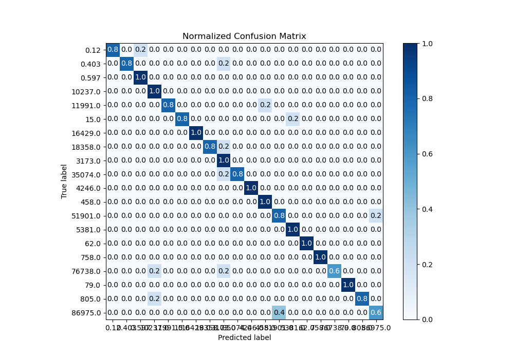
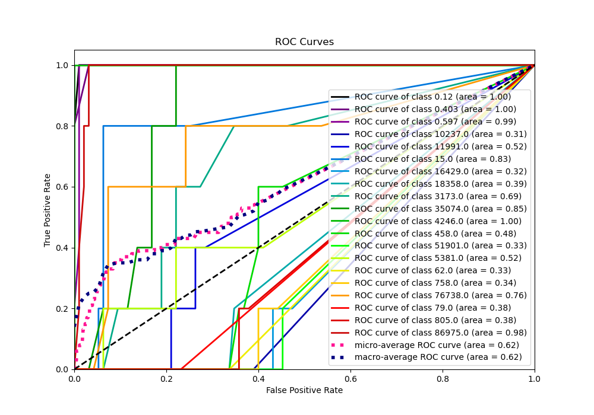

# Summary of 20_RandomForest

[<< Go back](../README.md)

## Random Forest
- **n_jobs**: -1
- **criterion**: gini
- **max_features**: 0.7
- **min_samples_split**: 30
- **max_depth**: 7
- **eval_metric_name**: logloss
- **num_class**: 20
- **explain_level**: 1

## Validation
 - **validation_type**: kfold
 - **k_folds**: 5
 - **shuffle**: True
 - **stratify**: True

## Optimized metric
logloss

## Training time

30.6 seconds

### Metric details
|           |      0.12 |     0.403 |     0.597 |      15.0 |   62.0 |   79.0 |     458.0 |   758.0 |     805.0 |    3173.0 |   4246.0 |    5381.0 |   10237.0 |   11991.0 |   16429.0 |   18358.0 |   35074.0 |   51901.0 |   76738.0 |   86975.0 |   accuracy |   macro avg |   weighted avg |   logloss |
|:----------|----------:|----------:|----------:|----------:|-------:|-------:|----------:|--------:|----------:|----------:|---------:|----------:|----------:|----------:|----------:|----------:|----------:|----------:|----------:|----------:|-----------:|------------:|---------------:|----------:|
| precision |  1        |  1        |  0.833333 |  1        |      1 |      1 |  0.833333 |       1 |  1        |  0.555556 |        1 |  0.833333 |  0.714286 |  1        |         1 |  1        |  1        |  0.666667 |      1    |  0.75     |       0.88 |    0.909325 |       0.909325 |  0.649932 |
| recall    |  0.8      |  0.8      |  1        |  0.8      |      1 |      1 |  1        |       1 |  0.8      |  1        |        1 |  1        |  1        |  0.8      |         1 |  0.8      |  0.8      |  0.8      |      0.6  |  0.6      |       0.88 |    0.88     |       0.88     |  0.649932 |
| f1-score  |  0.888889 |  0.888889 |  0.909091 |  0.888889 |      1 |      1 |  0.909091 |       1 |  0.888889 |  0.714286 |        1 |  0.909091 |  0.833333 |  0.888889 |         1 |  0.888889 |  0.888889 |  0.727273 |      0.75 |  0.666667 |       0.88 |    0.882053 |       0.882053 |  0.649932 |
| support   | 20        | 20        | 20        | 20        |     20 |     20 | 20        |      20 | 20        | 20        |       20 | 20        | 20        | 20        |        20 | 20        | 20        | 20        |     20    | 20        |       0.88 |  400        |     400        |  0.649932 |

## Confusion matrix
|                    |   Predicted as 0.12 |   Predicted as 0.403 |   Predicted as 0.597 |   Predicted as 15.0 |   Predicted as 62.0 |   Predicted as 79.0 |   Predicted as 458.0 |   Predicted as 758.0 |   Predicted as 805.0 |   Predicted as 3173.0 |   Predicted as 4246.0 |   Predicted as 5381.0 |   Predicted as 10237.0 |   Predicted as 11991.0 |   Predicted as 16429.0 |   Predicted as 18358.0 |   Predicted as 35074.0 |   Predicted as 51901.0 |   Predicted as 76738.0 |   Predicted as 86975.0 |
|:-------------------|--------------------:|---------------------:|---------------------:|--------------------:|--------------------:|--------------------:|---------------------:|---------------------:|---------------------:|----------------------:|----------------------:|----------------------:|-----------------------:|-----------------------:|-----------------------:|-----------------------:|-----------------------:|-----------------------:|-----------------------:|-----------------------:|
| Labeled as 0.12    |                  16 |                    0 |                    4 |                   0 |                   0 |                   0 |                    0 |                    0 |                    0 |                     0 |                     0 |                     0 |                      0 |                      0 |                      0 |                      0 |                      0 |                      0 |                      0 |                      0 |
| Labeled as 0.403   |                   0 |                   16 |                    0 |                   0 |                   0 |                   0 |                    0 |                    0 |                    0 |                     4 |                     0 |                     0 |                      0 |                      0 |                      0 |                      0 |                      0 |                      0 |                      0 |                      0 |
| Labeled as 0.597   |                   0 |                    0 |                   20 |                   0 |                   0 |                   0 |                    0 |                    0 |                    0 |                     0 |                     0 |                     0 |                      0 |                      0 |                      0 |                      0 |                      0 |                      0 |                      0 |                      0 |
| Labeled as 15.0    |                   0 |                    0 |                    0 |                  16 |                   0 |                   0 |                    0 |                    0 |                    0 |                     0 |                     0 |                     4 |                      0 |                      0 |                      0 |                      0 |                      0 |                      0 |                      0 |                      0 |
| Labeled as 62.0    |                   0 |                    0 |                    0 |                   0 |                  20 |                   0 |                    0 |                    0 |                    0 |                     0 |                     0 |                     0 |                      0 |                      0 |                      0 |                      0 |                      0 |                      0 |                      0 |                      0 |
| Labeled as 79.0    |                   0 |                    0 |                    0 |                   0 |                   0 |                  20 |                    0 |                    0 |                    0 |                     0 |                     0 |                     0 |                      0 |                      0 |                      0 |                      0 |                      0 |                      0 |                      0 |                      0 |
| Labeled as 458.0   |                   0 |                    0 |                    0 |                   0 |                   0 |                   0 |                   20 |                    0 |                    0 |                     0 |                     0 |                     0 |                      0 |                      0 |                      0 |                      0 |                      0 |                      0 |                      0 |                      0 |
| Labeled as 758.0   |                   0 |                    0 |                    0 |                   0 |                   0 |                   0 |                    0 |                   20 |                    0 |                     0 |                     0 |                     0 |                      0 |                      0 |                      0 |                      0 |                      0 |                      0 |                      0 |                      0 |
| Labeled as 805.0   |                   0 |                    0 |                    0 |                   0 |                   0 |                   0 |                    0 |                    0 |                   16 |                     0 |                     0 |                     0 |                      4 |                      0 |                      0 |                      0 |                      0 |                      0 |                      0 |                      0 |
| Labeled as 3173.0  |                   0 |                    0 |                    0 |                   0 |                   0 |                   0 |                    0 |                    0 |                    0 |                    20 |                     0 |                     0 |                      0 |                      0 |                      0 |                      0 |                      0 |                      0 |                      0 |                      0 |
| Labeled as 4246.0  |                   0 |                    0 |                    0 |                   0 |                   0 |                   0 |                    0 |                    0 |                    0 |                     0 |                    20 |                     0 |                      0 |                      0 |                      0 |                      0 |                      0 |                      0 |                      0 |                      0 |
| Labeled as 5381.0  |                   0 |                    0 |                    0 |                   0 |                   0 |                   0 |                    0 |                    0 |                    0 |                     0 |                     0 |                    20 |                      0 |                      0 |                      0 |                      0 |                      0 |                      0 |                      0 |                      0 |
| Labeled as 10237.0 |                   0 |                    0 |                    0 |                   0 |                   0 |                   0 |                    0 |                    0 |                    0 |                     0 |                     0 |                     0 |                     20 |                      0 |                      0 |                      0 |                      0 |                      0 |                      0 |                      0 |
| Labeled as 11991.0 |                   0 |                    0 |                    0 |                   0 |                   0 |                   0 |                    4 |                    0 |                    0 |                     0 |                     0 |                     0 |                      0 |                     16 |                      0 |                      0 |                      0 |                      0 |                      0 |                      0 |
| Labeled as 16429.0 |                   0 |                    0 |                    0 |                   0 |                   0 |                   0 |                    0 |                    0 |                    0 |                     0 |                     0 |                     0 |                      0 |                      0 |                     20 |                      0 |                      0 |                      0 |                      0 |                      0 |
| Labeled as 18358.0 |                   0 |                    0 |                    0 |                   0 |                   0 |                   0 |                    0 |                    0 |                    0 |                     4 |                     0 |                     0 |                      0 |                      0 |                      0 |                     16 |                      0 |                      0 |                      0 |                      0 |
| Labeled as 35074.0 |                   0 |                    0 |                    0 |                   0 |                   0 |                   0 |                    0 |                    0 |                    0 |                     4 |                     0 |                     0 |                      0 |                      0 |                      0 |                      0 |                     16 |                      0 |                      0 |                      0 |
| Labeled as 51901.0 |                   0 |                    0 |                    0 |                   0 |                   0 |                   0 |                    0 |                    0 |                    0 |                     0 |                     0 |                     0 |                      0 |                      0 |                      0 |                      0 |                      0 |                     16 |                      0 |                      4 |
| Labeled as 76738.0 |                   0 |                    0 |                    0 |                   0 |                   0 |                   0 |                    0 |                    0 |                    0 |                     4 |                     0 |                     0 |                      4 |                      0 |                      0 |                      0 |                      0 |                      0 |                     12 |                      0 |
| Labeled as 86975.0 |                   0 |                    0 |                    0 |                   0 |                   0 |                   0 |                    0 |                    0 |                    0 |                     0 |                     0 |                     0 |                      0 |                      0 |                      0 |                      0 |                      0 |                      8 |                      0 |                     12 |

## Learning curves

## Permutation-based Importance

## Confusion Matrix

## Normalized Confusion Matrix

## ROC Curve

## Precision Recall Curve

[<< Go back](../README.md)
