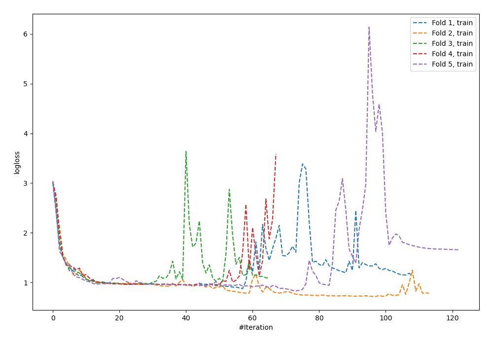
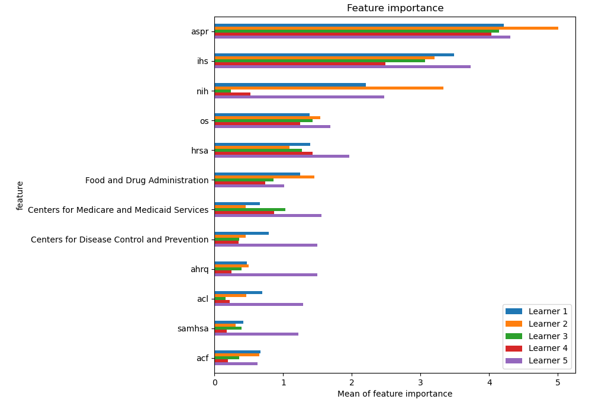
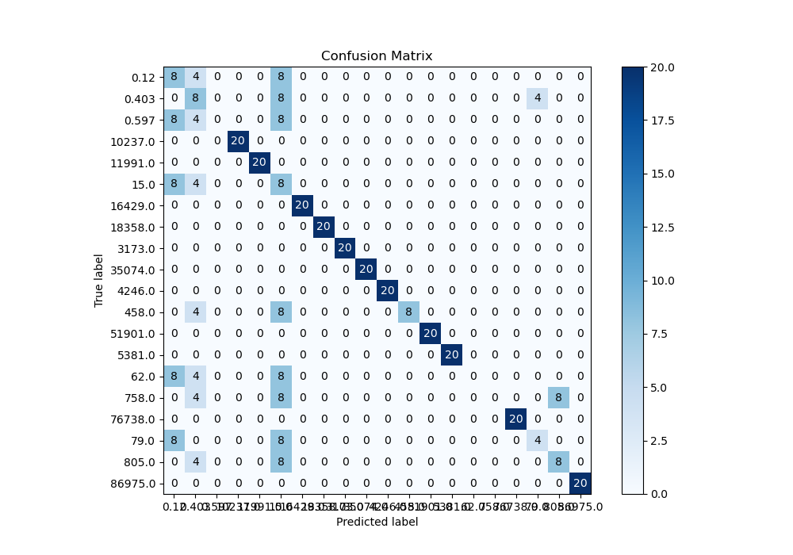
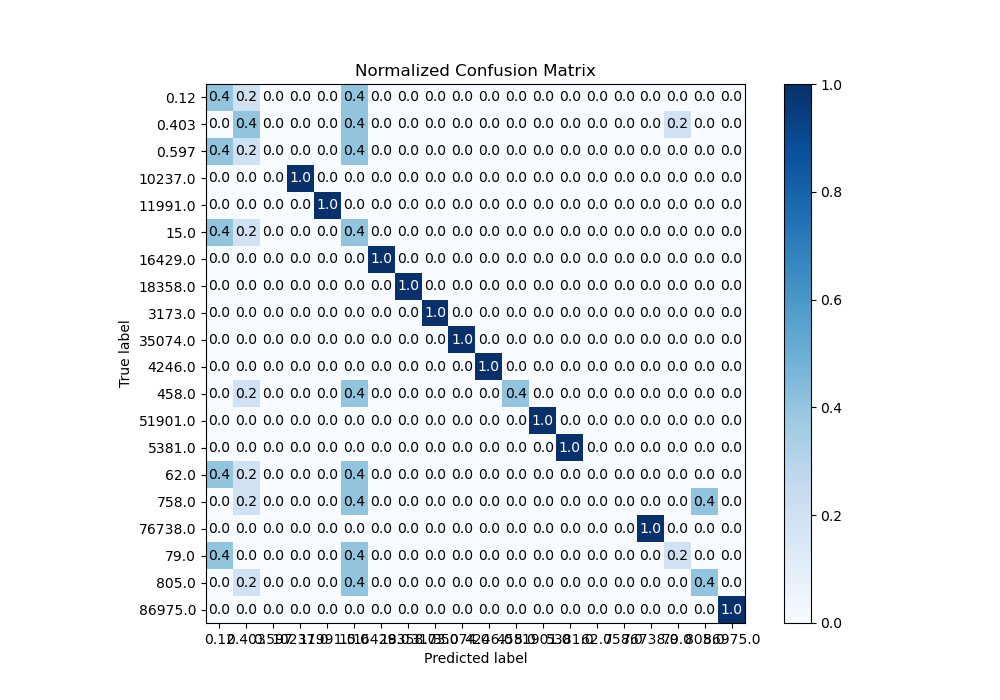
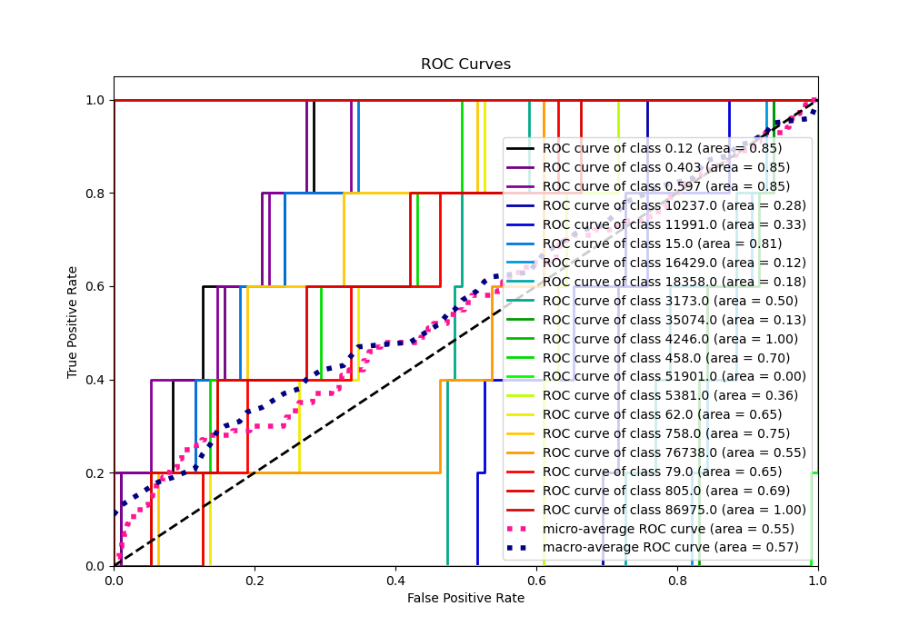
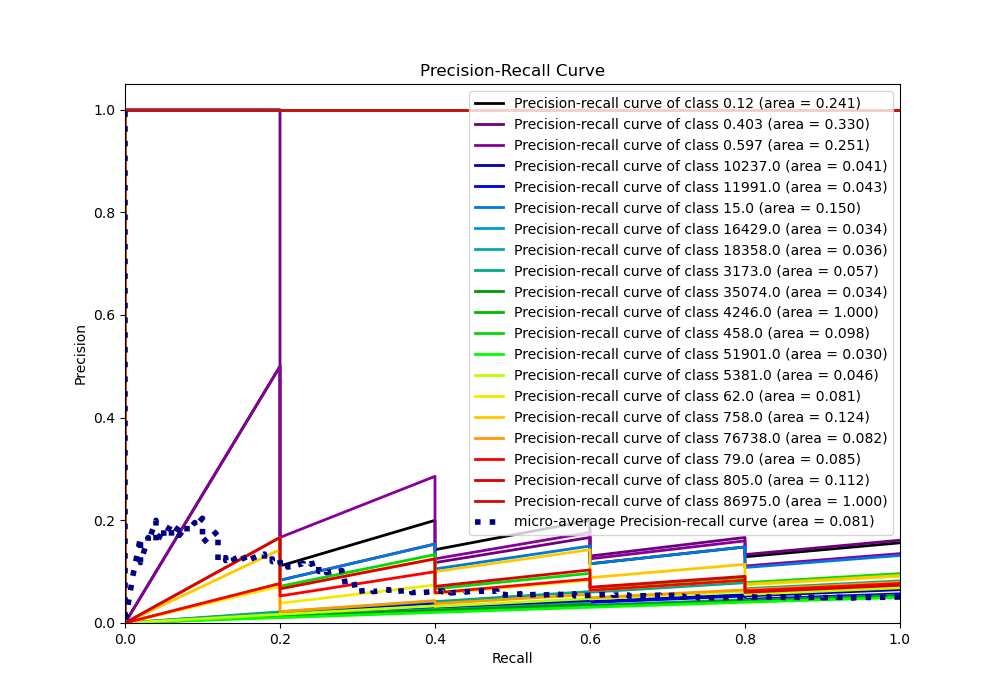

# Summary of 25_NeuralNetwork

[<< Go back](../README.md)

## Neural Network
- **n_jobs**: -1
- **dense_1_size**: 64
- **dense_2_size**: 32
- **learning_rate**: 0.08
- **num_class**: 20
- **explain_level**: 1

## Validation
 - **validation_type**: kfold
 - **k_folds**: 5
 - **shuffle**: True
 - **stratify**: True

## Optimized metric
logloss

## Training time

6.0 seconds

### Metric details
|           |      0.12 |     0.403 |   0.597 |      15.0 |   62.0 |      79.0 |     458.0 |   758.0 |     805.0 |   3173.0 |   4246.0 |   5381.0 |   10237.0 |   11991.0 |   16429.0 |   18358.0 |   35074.0 |   51901.0 |   76738.0 |   86975.0 |   accuracy |   macro avg |   weighted avg |   logloss |
|:----------|----------:|----------:|--------:|----------:|-------:|----------:|----------:|--------:|----------:|---------:|---------:|---------:|----------:|----------:|----------:|----------:|----------:|----------:|----------:|----------:|-----------:|------------:|---------------:|----------:|
| precision |  0.2      |  0.222222 |       0 |  0.111111 |      0 |  0.5      |  1        |       0 |  0.5      |        1 |        1 |        1 |         1 |         1 |         1 |         1 |         1 |         1 |         1 |         1 |       0.66 |    0.676667 |       0.676667 |  0.923888 |
| recall    |  0.4      |  0.4      |       0 |  0.4      |      0 |  0.2      |  0.4      |       0 |  0.4      |        1 |        1 |        1 |         1 |         1 |         1 |         1 |         1 |         1 |         1 |         1 |       0.66 |    0.66     |       0.66     |  0.923888 |
| f1-score  |  0.266667 |  0.285714 |       0 |  0.173913 |      0 |  0.285714 |  0.571429 |       0 |  0.444444 |        1 |        1 |        1 |         1 |         1 |         1 |         1 |         1 |         1 |         1 |         1 |       0.66 |    0.651394 |       0.651394 |  0.923888 |
| support   | 20        | 20        |      20 | 20        |     20 | 20        | 20        |      20 | 20        |       20 |       20 |       20 |        20 |        20 |        20 |        20 |        20 |        20 |        20 |        20 |       0.66 |  400        |     400        |  0.923888 |

## Confusion matrix
|                    |   Predicted as 0.12 |   Predicted as 0.403 |   Predicted as 0.597 |   Predicted as 15.0 |   Predicted as 62.0 |   Predicted as 79.0 |   Predicted as 458.0 |   Predicted as 758.0 |   Predicted as 805.0 |   Predicted as 3173.0 |   Predicted as 4246.0 |   Predicted as 5381.0 |   Predicted as 10237.0 |   Predicted as 11991.0 |   Predicted as 16429.0 |   Predicted as 18358.0 |   Predicted as 35074.0 |   Predicted as 51901.0 |   Predicted as 76738.0 |   Predicted as 86975.0 |
|:-------------------|--------------------:|---------------------:|---------------------:|--------------------:|--------------------:|--------------------:|---------------------:|---------------------:|---------------------:|----------------------:|----------------------:|----------------------:|-----------------------:|-----------------------:|-----------------------:|-----------------------:|-----------------------:|-----------------------:|-----------------------:|-----------------------:|
| Labeled as 0.12    |                   8 |                    4 |                    0 |                   8 |                   0 |                   0 |                    0 |                    0 |                    0 |                     0 |                     0 |                     0 |                      0 |                      0 |                      0 |                      0 |                      0 |                      0 |                      0 |                      0 |
| Labeled as 0.403   |                   0 |                    8 |                    0 |                   8 |                   0 |                   4 |                    0 |                    0 |                    0 |                     0 |                     0 |                     0 |                      0 |                      0 |                      0 |                      0 |                      0 |                      0 |                      0 |                      0 |
| Labeled as 0.597   |                   8 |                    4 |                    0 |                   8 |                   0 |                   0 |                    0 |                    0 |                    0 |                     0 |                     0 |                     0 |                      0 |                      0 |                      0 |                      0 |                      0 |                      0 |                      0 |                      0 |
| Labeled as 15.0    |                   8 |                    4 |                    0 |                   8 |                   0 |                   0 |                    0 |                    0 |                    0 |                     0 |                     0 |                     0 |                      0 |                      0 |                      0 |                      0 |                      0 |                      0 |                      0 |                      0 |
| Labeled as 62.0    |                   8 |                    4 |                    0 |                   8 |                   0 |                   0 |                    0 |                    0 |                    0 |                     0 |                     0 |                     0 |                      0 |                      0 |                      0 |                      0 |                      0 |                      0 |                      0 |                      0 |
| Labeled as 79.0    |                   8 |                    0 |                    0 |                   8 |                   0 |                   4 |                    0 |                    0 |                    0 |                     0 |                     0 |                     0 |                      0 |                      0 |                      0 |                      0 |                      0 |                      0 |                      0 |                      0 |
| Labeled as 458.0   |                   0 |                    4 |                    0 |                   8 |                   0 |                   0 |                    8 |                    0 |                    0 |                     0 |                     0 |                     0 |                      0 |                      0 |                      0 |                      0 |                      0 |                      0 |                      0 |                      0 |
| Labeled as 758.0   |                   0 |                    4 |                    0 |                   8 |                   0 |                   0 |                    0 |                    0 |                    8 |                     0 |                     0 |                     0 |                      0 |                      0 |                      0 |                      0 |                      0 |                      0 |                      0 |                      0 |
| Labeled as 805.0   |                   0 |                    4 |                    0 |                   8 |                   0 |                   0 |                    0 |                    0 |                    8 |                     0 |                     0 |                     0 |                      0 |                      0 |                      0 |                      0 |                      0 |                      0 |                      0 |                      0 |
| Labeled as 3173.0  |                   0 |                    0 |                    0 |                   0 |                   0 |                   0 |                    0 |                    0 |                    0 |                    20 |                     0 |                     0 |                      0 |                      0 |                      0 |                      0 |                      0 |                      0 |                      0 |                      0 |
| Labeled as 4246.0  |                   0 |                    0 |                    0 |                   0 |                   0 |                   0 |                    0 |                    0 |                    0 |                     0 |                    20 |                     0 |                      0 |                      0 |                      0 |                      0 |                      0 |                      0 |                      0 |                      0 |
| Labeled as 5381.0  |                   0 |                    0 |                    0 |                   0 |                   0 |                   0 |                    0 |                    0 |                    0 |                     0 |                     0 |                    20 |                      0 |                      0 |                      0 |                      0 |                      0 |                      0 |                      0 |                      0 |
| Labeled as 10237.0 |                   0 |                    0 |                    0 |                   0 |                   0 |                   0 |                    0 |                    0 |                    0 |                     0 |                     0 |                     0 |                     20 |                      0 |                      0 |                      0 |                      0 |                      0 |                      0 |                      0 |
| Labeled as 11991.0 |                   0 |                    0 |                    0 |                   0 |                   0 |                   0 |                    0 |                    0 |                    0 |                     0 |                     0 |                     0 |                      0 |                     20 |                      0 |                      0 |                      0 |                      0 |                      0 |                      0 |
| Labeled as 16429.0 |                   0 |                    0 |                    0 |                   0 |                   0 |                   0 |                    0 |                    0 |                    0 |                     0 |                     0 |                     0 |                      0 |                      0 |                     20 |                      0 |                      0 |                      0 |                      0 |                      0 |
| Labeled as 18358.0 |                   0 |                    0 |                    0 |                   0 |                   0 |                   0 |                    0 |                    0 |                    0 |                     0 |                     0 |                     0 |                      0 |                      0 |                      0 |                     20 |                      0 |                      0 |                      0 |                      0 |
| Labeled as 35074.0 |                   0 |                    0 |                    0 |                   0 |                   0 |                   0 |                    0 |                    0 |                    0 |                     0 |                     0 |                     0 |                      0 |                      0 |                      0 |                      0 |                     20 |                      0 |                      0 |                      0 |
| Labeled as 51901.0 |                   0 |                    0 |                    0 |                   0 |                   0 |                   0 |                    0 |                    0 |                    0 |                     0 |                     0 |                     0 |                      0 |                      0 |                      0 |                      0 |                      0 |                     20 |                      0 |                      0 |
| Labeled as 76738.0 |                   0 |                    0 |                    0 |                   0 |                   0 |                   0 |                    0 |                    0 |                    0 |                     0 |                     0 |                     0 |                      0 |                      0 |                      0 |                      0 |                      0 |                      0 |                     20 |                      0 |
| Labeled as 86975.0 |                   0 |                    0 |                    0 |                   0 |                   0 |                   0 |                    0 |                    0 |                    0 |                     0 |                     0 |                     0 |                      0 |                      0 |                      0 |                      0 |                      0 |                      0 |                      0 |                     20 |

## Learning curves

## Permutation-based Importance

## Confusion Matrix

## Normalized Confusion Matrix

## ROC Curve

## Precision Recall Curve

[<< Go back](../README.md)
