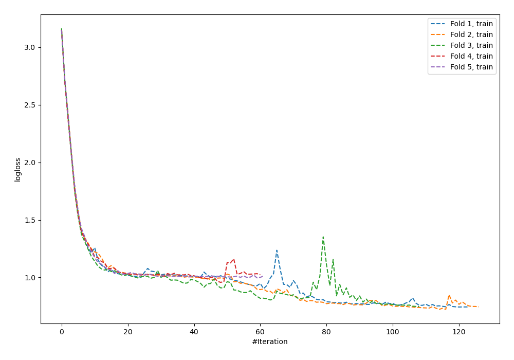
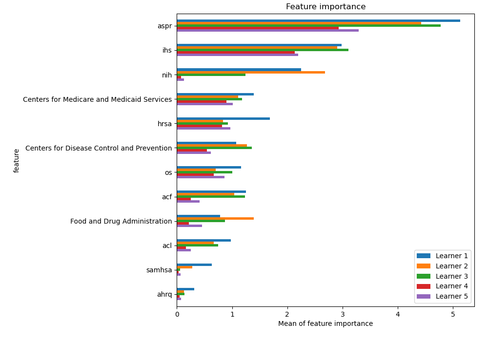
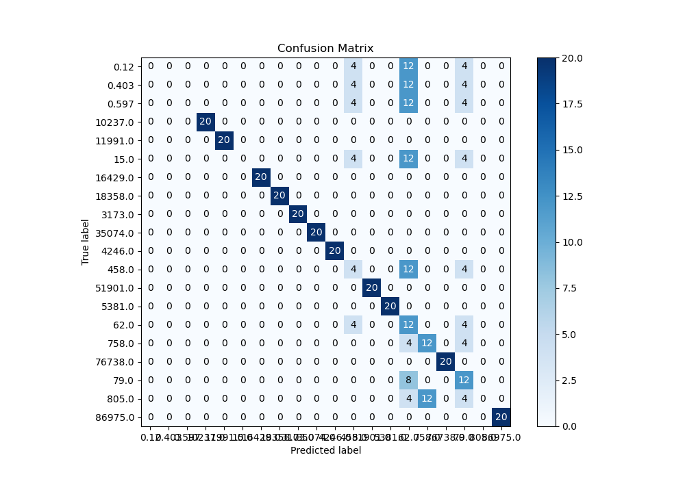
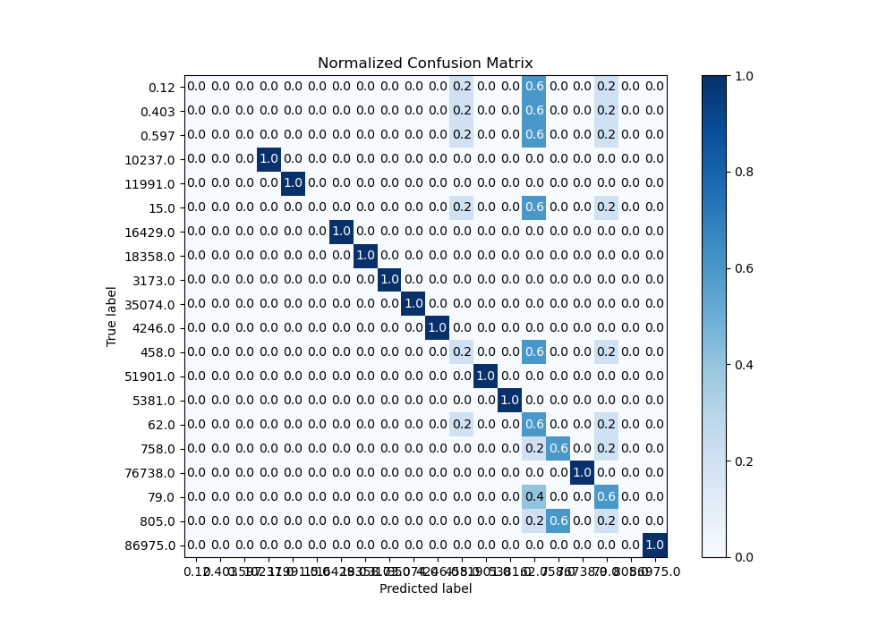
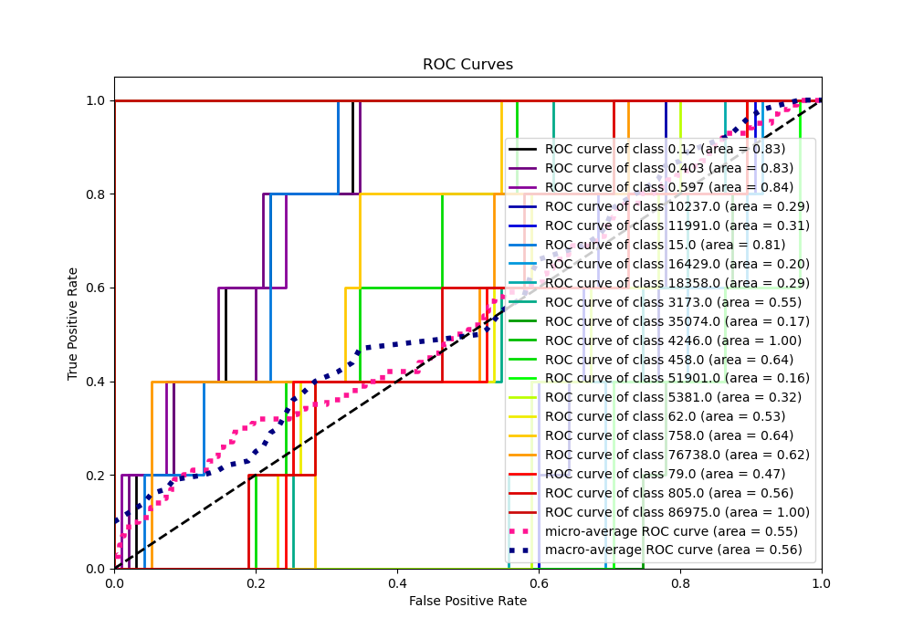
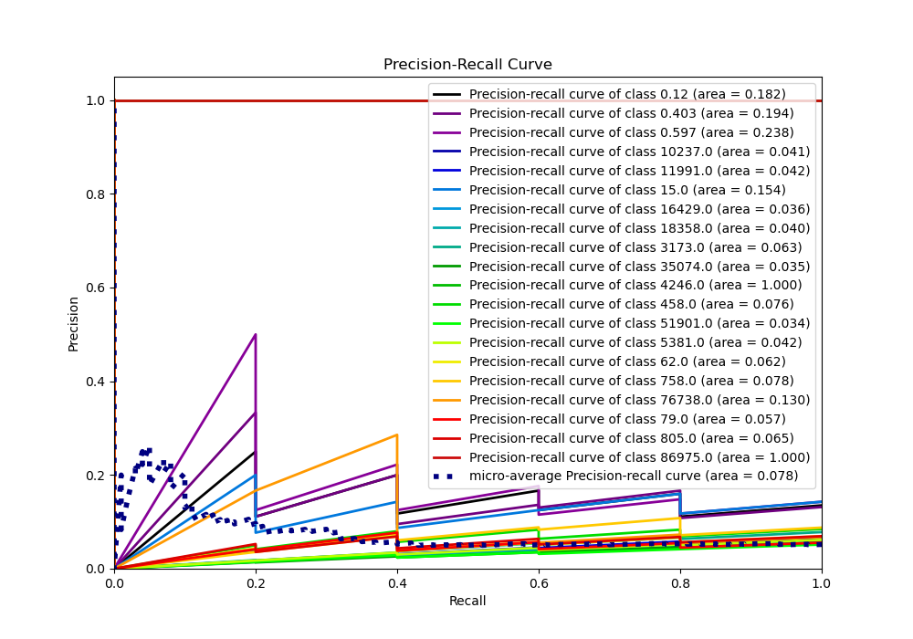

# Summary of 5_Default_NeuralNetwork

[<< Go back](../README.md)

## Neural Network
- **n_jobs**: -1
- **dense_1_size**: 32
- **dense_2_size**: 16
- **learning_rate**: 0.05
- **num_class**: 20
- **explain_level**: 1

## Validation
 - **validation_type**: kfold
 - **k_folds**: 5
 - **shuffle**: True
 - **stratify**: True

## Optimized metric
logloss

## Training time

3.0 seconds

### Metric details
|           |   0.12 |   0.403 |   0.597 |   15.0 |      62.0 |      79.0 |     458.0 |     758.0 |   805.0 |   3173.0 |   4246.0 |   5381.0 |   10237.0 |   11991.0 |   16429.0 |   18358.0 |   35074.0 |   51901.0 |   76738.0 |   86975.0 |   accuracy |   macro avg |   weighted avg |   logloss |
|:----------|-------:|--------:|--------:|-------:|----------:|----------:|----------:|----------:|--------:|---------:|---------:|---------:|----------:|----------:|----------:|----------:|----------:|----------:|----------:|----------:|-----------:|------------:|---------------:|----------:|
| precision |      0 |       0 |       0 |      0 |  0.136364 |  0.272727 |  0.166667 |  0.5      |       0 |        1 |        1 |        1 |         1 |         1 |         1 |         1 |         1 |         1 |         1 |         1 |       0.65 |    0.603788 |       0.603788 |  0.944295 |
| recall    |      0 |       0 |       0 |      0 |  0.6      |  0.6      |  0.2      |  0.6      |       0 |        1 |        1 |        1 |         1 |         1 |         1 |         1 |         1 |         1 |         1 |         1 |       0.65 |    0.65     |       0.65     |  0.944295 |
| f1-score  |      0 |       0 |       0 |      0 |  0.222222 |  0.375    |  0.181818 |  0.545455 |       0 |        1 |        1 |        1 |         1 |         1 |         1 |         1 |         1 |         1 |         1 |         1 |       0.65 |    0.616225 |       0.616225 |  0.944295 |
| support   |     20 |      20 |      20 |     20 | 20        | 20        | 20        | 20        |      20 |       20 |       20 |       20 |        20 |        20 |        20 |        20 |        20 |        20 |        20 |        20 |       0.65 |  400        |     400        |  0.944295 |

## Confusion matrix
|                    |   Predicted as 0.12 |   Predicted as 0.403 |   Predicted as 0.597 |   Predicted as 15.0 |   Predicted as 62.0 |   Predicted as 79.0 |   Predicted as 458.0 |   Predicted as 758.0 |   Predicted as 805.0 |   Predicted as 3173.0 |   Predicted as 4246.0 |   Predicted as 5381.0 |   Predicted as 10237.0 |   Predicted as 11991.0 |   Predicted as 16429.0 |   Predicted as 18358.0 |   Predicted as 35074.0 |   Predicted as 51901.0 |   Predicted as 76738.0 |   Predicted as 86975.0 |
|:-------------------|--------------------:|---------------------:|---------------------:|--------------------:|--------------------:|--------------------:|---------------------:|---------------------:|---------------------:|----------------------:|----------------------:|----------------------:|-----------------------:|-----------------------:|-----------------------:|-----------------------:|-----------------------:|-----------------------:|-----------------------:|-----------------------:|
| Labeled as 0.12    |                   0 |                    0 |                    0 |                   0 |                  12 |                   4 |                    4 |                    0 |                    0 |                     0 |                     0 |                     0 |                      0 |                      0 |                      0 |                      0 |                      0 |                      0 |                      0 |                      0 |
| Labeled as 0.403   |                   0 |                    0 |                    0 |                   0 |                  12 |                   4 |                    4 |                    0 |                    0 |                     0 |                     0 |                     0 |                      0 |                      0 |                      0 |                      0 |                      0 |                      0 |                      0 |                      0 |
| Labeled as 0.597   |                   0 |                    0 |                    0 |                   0 |                  12 |                   4 |                    4 |                    0 |                    0 |                     0 |                     0 |                     0 |                      0 |                      0 |                      0 |                      0 |                      0 |                      0 |                      0 |                      0 |
| Labeled as 15.0    |                   0 |                    0 |                    0 |                   0 |                  12 |                   4 |                    4 |                    0 |                    0 |                     0 |                     0 |                     0 |                      0 |                      0 |                      0 |                      0 |                      0 |                      0 |                      0 |                      0 |
| Labeled as 62.0    |                   0 |                    0 |                    0 |                   0 |                  12 |                   4 |                    4 |                    0 |                    0 |                     0 |                     0 |                     0 |                      0 |                      0 |                      0 |                      0 |                      0 |                      0 |                      0 |                      0 |
| Labeled as 79.0    |                   0 |                    0 |                    0 |                   0 |                   8 |                  12 |                    0 |                    0 |                    0 |                     0 |                     0 |                     0 |                      0 |                      0 |                      0 |                      0 |                      0 |                      0 |                      0 |                      0 |
| Labeled as 458.0   |                   0 |                    0 |                    0 |                   0 |                  12 |                   4 |                    4 |                    0 |                    0 |                     0 |                     0 |                     0 |                      0 |                      0 |                      0 |                      0 |                      0 |                      0 |                      0 |                      0 |
| Labeled as 758.0   |                   0 |                    0 |                    0 |                   0 |                   4 |                   4 |                    0 |                   12 |                    0 |                     0 |                     0 |                     0 |                      0 |                      0 |                      0 |                      0 |                      0 |                      0 |                      0 |                      0 |
| Labeled as 805.0   |                   0 |                    0 |                    0 |                   0 |                   4 |                   4 |                    0 |                   12 |                    0 |                     0 |                     0 |                     0 |                      0 |                      0 |                      0 |                      0 |                      0 |                      0 |                      0 |                      0 |
| Labeled as 3173.0  |                   0 |                    0 |                    0 |                   0 |                   0 |                   0 |                    0 |                    0 |                    0 |                    20 |                     0 |                     0 |                      0 |                      0 |                      0 |                      0 |                      0 |                      0 |                      0 |                      0 |
| Labeled as 4246.0  |                   0 |                    0 |                    0 |                   0 |                   0 |                   0 |                    0 |                    0 |                    0 |                     0 |                    20 |                     0 |                      0 |                      0 |                      0 |                      0 |                      0 |                      0 |                      0 |                      0 |
| Labeled as 5381.0  |                   0 |                    0 |                    0 |                   0 |                   0 |                   0 |                    0 |                    0 |                    0 |                     0 |                     0 |                    20 |                      0 |                      0 |                      0 |                      0 |                      0 |                      0 |                      0 |                      0 |
| Labeled as 10237.0 |                   0 |                    0 |                    0 |                   0 |                   0 |                   0 |                    0 |                    0 |                    0 |                     0 |                     0 |                     0 |                     20 |                      0 |                      0 |                      0 |                      0 |                      0 |                      0 |                      0 |
| Labeled as 11991.0 |                   0 |                    0 |                    0 |                   0 |                   0 |                   0 |                    0 |                    0 |                    0 |                     0 |                     0 |                     0 |                      0 |                     20 |                      0 |                      0 |                      0 |                      0 |                      0 |                      0 |
| Labeled as 16429.0 |                   0 |                    0 |                    0 |                   0 |                   0 |                   0 |                    0 |                    0 |                    0 |                     0 |                     0 |                     0 |                      0 |                      0 |                     20 |                      0 |                      0 |                      0 |                      0 |                      0 |
| Labeled as 18358.0 |                   0 |                    0 |                    0 |                   0 |                   0 |                   0 |                    0 |                    0 |                    0 |                     0 |                     0 |                     0 |                      0 |                      0 |                      0 |                     20 |                      0 |                      0 |                      0 |                      0 |
| Labeled as 35074.0 |                   0 |                    0 |                    0 |                   0 |                   0 |                   0 |                    0 |                    0 |                    0 |                     0 |                     0 |                     0 |                      0 |                      0 |                      0 |                      0 |                     20 |                      0 |                      0 |                      0 |
| Labeled as 51901.0 |                   0 |                    0 |                    0 |                   0 |                   0 |                   0 |                    0 |                    0 |                    0 |                     0 |                     0 |                     0 |                      0 |                      0 |                      0 |                      0 |                      0 |                     20 |                      0 |                      0 |
| Labeled as 76738.0 |                   0 |                    0 |                    0 |                   0 |                   0 |                   0 |                    0 |                    0 |                    0 |                     0 |                     0 |                     0 |                      0 |                      0 |                      0 |                      0 |                      0 |                      0 |                     20 |                      0 |
| Labeled as 86975.0 |                   0 |                    0 |                    0 |                   0 |                   0 |                   0 |                    0 |                    0 |                    0 |                     0 |                     0 |                     0 |                      0 |                      0 |                      0 |                      0 |                      0 |                      0 |                      0 |                     20 |

## Learning curves

## Permutation-based Importance

## Confusion Matrix

## Normalized Confusion Matrix

## ROC Curve

## Precision Recall Curve

[<< Go back](../README.md)
