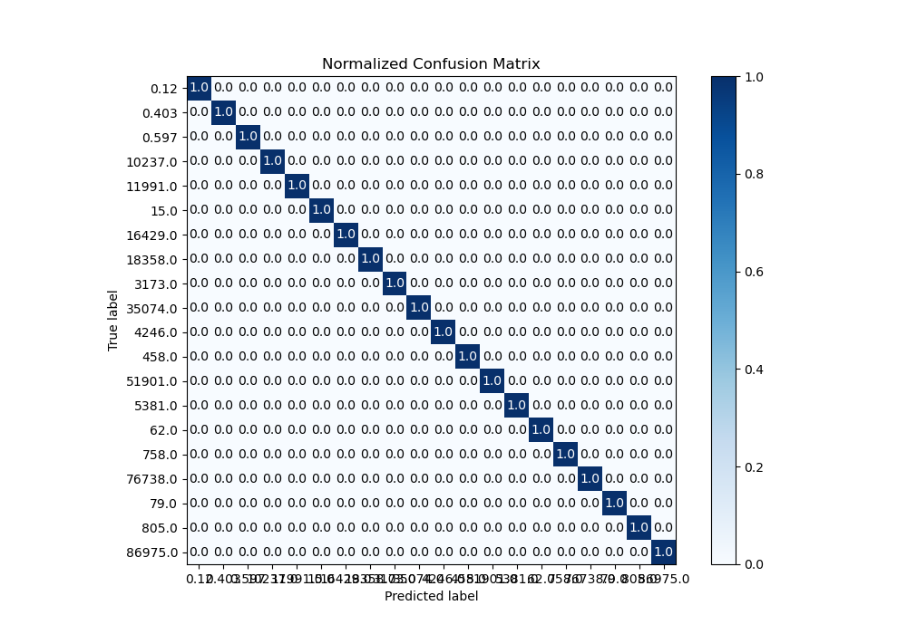

# Summary of Ensemble

[<< Go back](../README.md)

## Ensemble structure
| Model                      |   Weight |
|:---------------------------|---------:|
| 27_LightGBM_GoldenFeatures |       44 |
| 29_LightGBM_GoldenFeatures |       15 |

### Metric details
|           |   0.12 |   0.403 |   0.597 |   15.0 |   62.0 |   79.0 |   458.0 |   758.0 |   805.0 |   3173.0 |   4246.0 |   5381.0 |   10237.0 |   11991.0 |   16429.0 |   18358.0 |   35074.0 |   51901.0 |   76738.0 |   86975.0 |   accuracy |   macro avg |   weighted avg |     logloss |
|:----------|-------:|--------:|--------:|-------:|-------:|-------:|--------:|--------:|--------:|---------:|---------:|---------:|----------:|----------:|----------:|----------:|----------:|----------:|----------:|----------:|-----------:|------------:|---------------:|------------:|
| precision |      1 |       1 |       1 |      1 |      1 |      1 |       1 |       1 |       1 |        1 |        1 |        1 |         1 |         1 |         1 |         1 |         1 |         1 |         1 |         1 |          1 |           1 |              1 | 5.87714e-05 |
| recall    |      1 |       1 |       1 |      1 |      1 |      1 |       1 |       1 |       1 |        1 |        1 |        1 |         1 |         1 |         1 |         1 |         1 |         1 |         1 |         1 |          1 |           1 |              1 | 5.87714e-05 |
| f1-score  |      1 |       1 |       1 |      1 |      1 |      1 |       1 |       1 |       1 |        1 |        1 |        1 |         1 |         1 |         1 |         1 |         1 |         1 |         1 |         1 |          1 |           1 |              1 | 5.87714e-05 |
| support   |     20 |      20 |      20 |     20 |     20 |     20 |      20 |      20 |      20 |       20 |       20 |       20 |        20 |        20 |        20 |        20 |        20 |        20 |        20 |        20 |          1 |         400 |            400 | 5.87714e-05 |

## Confusion matrix
|                    |   Predicted as 0.12 |   Predicted as 0.403 |   Predicted as 0.597 |   Predicted as 15.0 |   Predicted as 62.0 |   Predicted as 79.0 |   Predicted as 458.0 |   Predicted as 758.0 |   Predicted as 805.0 |   Predicted as 3173.0 |   Predicted as 4246.0 |   Predicted as 5381.0 |   Predicted as 10237.0 |   Predicted as 11991.0 |   Predicted as 16429.0 |   Predicted as 18358.0 |   Predicted as 35074.0 |   Predicted as 51901.0 |   Predicted as 76738.0 |   Predicted as 86975.0 |
|:-------------------|--------------------:|---------------------:|---------------------:|--------------------:|--------------------:|--------------------:|---------------------:|---------------------:|---------------------:|----------------------:|----------------------:|----------------------:|-----------------------:|-----------------------:|-----------------------:|-----------------------:|-----------------------:|-----------------------:|-----------------------:|-----------------------:|
| Labeled as 0.12    |                  20 |                    0 |                    0 |                   0 |                   0 |                   0 |                    0 |                    0 |                    0 |                     0 |                     0 |                     0 |                      0 |                      0 |                      0 |                      0 |                      0 |                      0 |                      0 |                      0 |
| Labeled as 0.403   |                   0 |                   20 |                    0 |                   0 |                   0 |                   0 |                    0 |                    0 |                    0 |                     0 |                     0 |                     0 |                      0 |                      0 |                      0 |                      0 |                      0 |                      0 |                      0 |                      0 |
| Labeled as 0.597   |                   0 |                    0 |                   20 |                   0 |                   0 |                   0 |                    0 |                    0 |                    0 |                     0 |                     0 |                     0 |                      0 |                      0 |                      0 |                      0 |                      0 |                      0 |                      0 |                      0 |
| Labeled as 15.0    |                   0 |                    0 |                    0 |                  20 |                   0 |                   0 |                    0 |                    0 |                    0 |                     0 |                     0 |                     0 |                      0 |                      0 |                      0 |                      0 |                      0 |                      0 |                      0 |                      0 |
| Labeled as 62.0    |                   0 |                    0 |                    0 |                   0 |                  20 |                   0 |                    0 |                    0 |                    0 |                     0 |                     0 |                     0 |                      0 |                      0 |                      0 |                      0 |                      0 |                      0 |                      0 |                      0 |
| Labeled as 79.0    |                   0 |                    0 |                    0 |                   0 |                   0 |                  20 |                    0 |                    0 |                    0 |                     0 |                     0 |                     0 |                      0 |                      0 |                      0 |                      0 |                      0 |                      0 |                      0 |                      0 |
| Labeled as 458.0   |                   0 |                    0 |                    0 |                   0 |                   0 |                   0 |                   20 |                    0 |                    0 |                     0 |                     0 |                     0 |                      0 |                      0 |                      0 |                      0 |                      0 |                      0 |                      0 |                      0 |
| Labeled as 758.0   |                   0 |                    0 |                    0 |                   0 |                   0 |                   0 |                    0 |                   20 |                    0 |                     0 |                     0 |                     0 |                      0 |                      0 |                      0 |                      0 |                      0 |                      0 |                      0 |                      0 |
| Labeled as 805.0   |                   0 |                    0 |                    0 |                   0 |                   0 |                   0 |                    0 |                    0 |                   20 |                     0 |                     0 |                     0 |                      0 |                      0 |                      0 |                      0 |                      0 |                      0 |                      0 |                      0 |
| Labeled as 3173.0  |                   0 |                    0 |                    0 |                   0 |                   0 |                   0 |                    0 |                    0 |                    0 |                    20 |                     0 |                     0 |                      0 |                      0 |                      0 |                      0 |                      0 |                      0 |                      0 |                      0 |
| Labeled as 4246.0  |                   0 |                    0 |                    0 |                   0 |                   0 |                   0 |                    0 |                    0 |                    0 |                     0 |                    20 |                     0 |                      0 |                      0 |                      0 |                      0 |                      0 |                      0 |                      0 |                      0 |
| Labeled as 5381.0  |                   0 |                    0 |                    0 |                   0 |                   0 |                   0 |                    0 |                    0 |                    0 |                     0 |                     0 |                    20 |                      0 |                      0 |                      0 |                      0 |                      0 |                      0 |                      0 |                      0 |
| Labeled as 10237.0 |                   0 |                    0 |                    0 |                   0 |                   0 |                   0 |                    0 |                    0 |                    0 |                     0 |                     0 |                     0 |                     20 |                      0 |                      0 |                      0 |                      0 |                      0 |                      0 |                      0 |
| Labeled as 11991.0 |                   0 |                    0 |                    0 |                   0 |                   0 |                   0 |                    0 |                    0 |                    0 |                     0 |                     0 |                     0 |                      0 |                     20 |                      0 |                      0 |                      0 |                      0 |                      0 |                      0 |
| Labeled as 16429.0 |                   0 |                    0 |                    0 |                   0 |                   0 |                   0 |                    0 |                    0 |                    0 |                     0 |                     0 |                     0 |                      0 |                      0 |                     20 |                      0 |                      0 |                      0 |                      0 |                      0 |
| Labeled as 18358.0 |                   0 |                    0 |                    0 |                   0 |                   0 |                   0 |                    0 |                    0 |                    0 |                     0 |                     0 |                     0 |                      0 |                      0 |                      0 |                     20 |                      0 |                      0 |                      0 |                      0 |
| Labeled as 35074.0 |                   0 |                    0 |                    0 |                   0 |                   0 |                   0 |                    0 |                    0 |                    0 |                     0 |                     0 |                     0 |                      0 |                      0 |                      0 |                      0 |                     20 |                      0 |                      0 |                      0 |
| Labeled as 51901.0 |                   0 |                    0 |                    0 |                   0 |                   0 |                   0 |                    0 |                    0 |                    0 |                     0 |                     0 |                     0 |                      0 |                      0 |                      0 |                      0 |                      0 |                     20 |                      0 |                      0 |
| Labeled as 76738.0 |                   0 |                    0 |                    0 |                   0 |                   0 |                   0 |                    0 |                    0 |                    0 |                     0 |                     0 |                     0 |                      0 |                      0 |                      0 |                      0 |                      0 |                      0 |                     20 |                      0 |
| Labeled as 86975.0 |                   0 |                    0 |                    0 |                   0 |                   0 |                   0 |                    0 |                    0 |                    0 |                     0 |                     0 |                     0 |                      0 |                      0 |                      0 |                      0 |                      0 |                      0 |                      0 |                     20 |

## Learning curves

## Confusion Matrix

## Normalized Confusion Matrix

## ROC Curve

## Precision Recall Curve

[<< Go back](../README.md)
