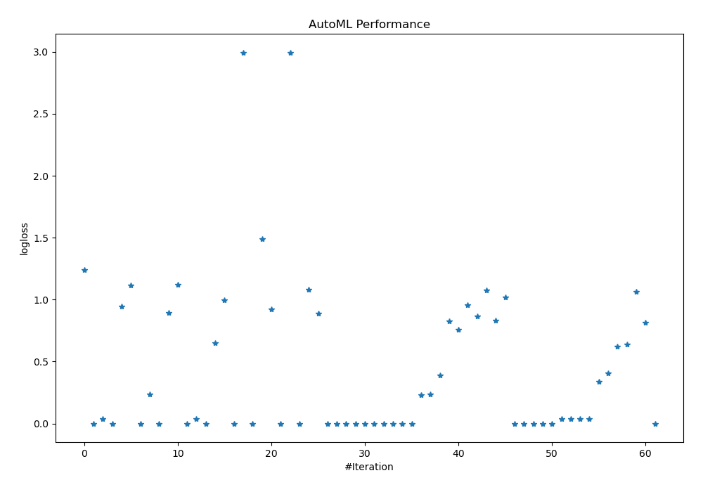
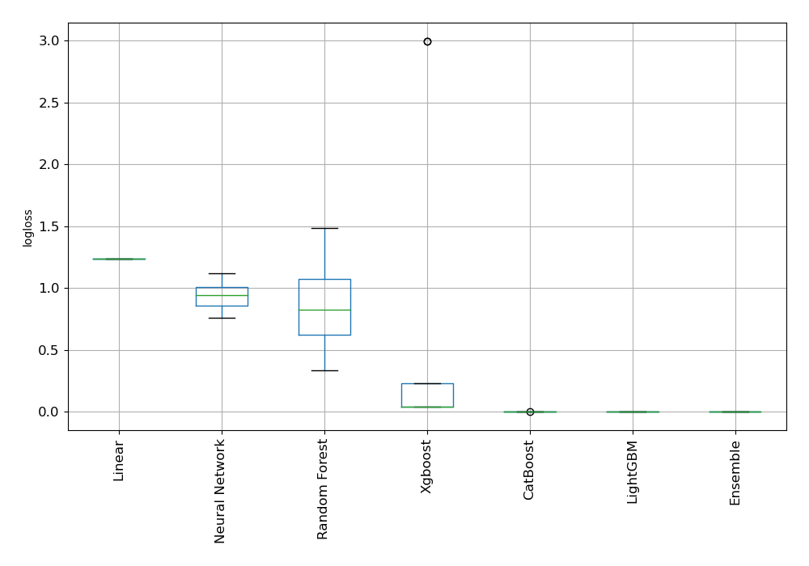
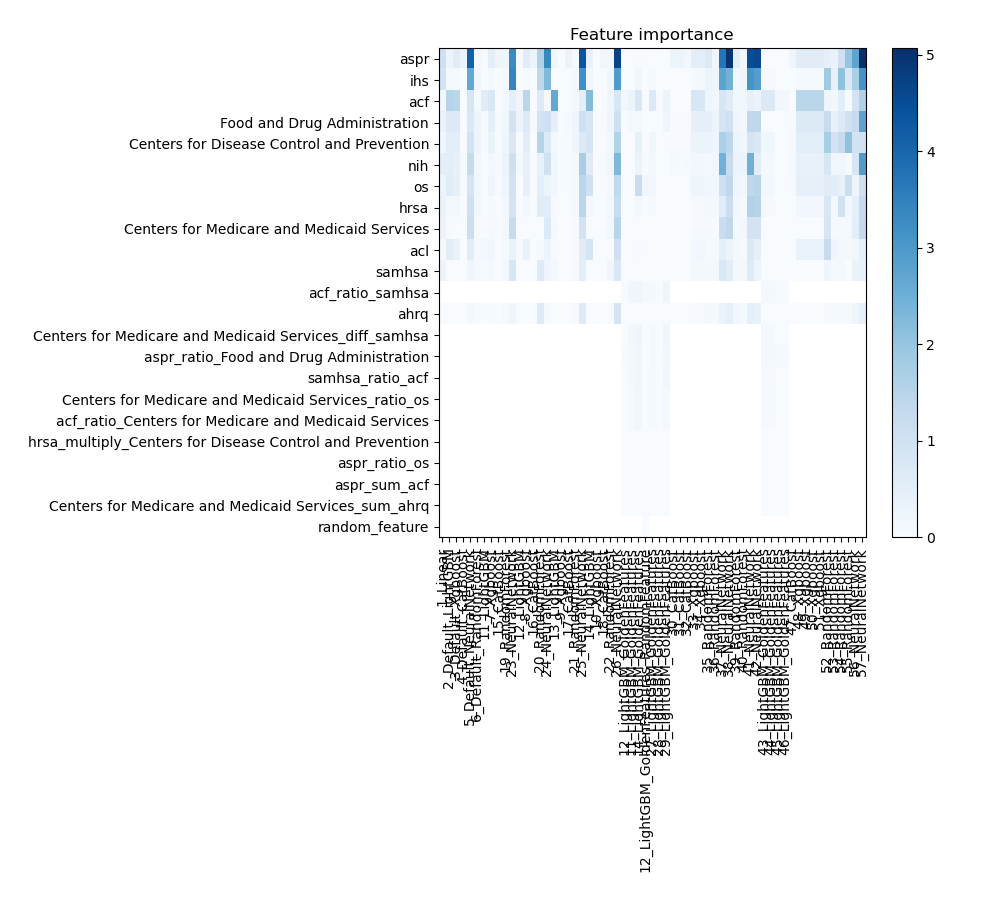
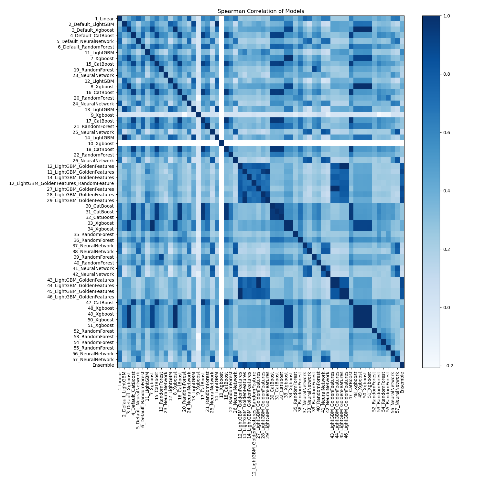

# AutoML Leaderboard

| Best model   | name                                                                                           | model_type     | metric_type   |   metric_value |   train_time |   single_prediction_time |
|:-------------|:-----------------------------------------------------------------------------------------------|:---------------|:--------------|---------------:|-------------:|-------------------------:|
|              | [1_Linear](1_Linear/README.md)                                                                 | Linear         | logloss       |    1.23882     |         6.31 |                   0.0258 |
|              | [2_Default_LightGBM](2_Default_LightGBM/README.md)                                             | LightGBM       | logloss       |    8.19596e-05 |        14.17 |                   0.021  |
|              | [3_Default_Xgboost](3_Default_Xgboost/README.md)                                               | Xgboost        | logloss       |    0.0394628   |        16.85 |                   0.025  |
|              | [4_Default_CatBoost](4_Default_CatBoost/README.md)                                             | CatBoost       | logloss       |    0.000227559 |        80.84 |                   0.0213 |
|              | [5_Default_NeuralNetwork](5_Default_NeuralNetwork/README.md)                                   | Neural Network | logloss       |    0.944295    |         3.96 |                   0.0265 |
|              | [6_Default_RandomForest](6_Default_RandomForest/README.md)                                     | Random Forest  | logloss       |    1.11256     |         5.44 |                   0.0671 |
|              | [11_LightGBM](11_LightGBM/README.md)                                                           | LightGBM       | logloss       |    7.46674e-05 |        13.93 |                   0.0224 |
|              | [7_Xgboost](7_Xgboost/README.md)                                                               | Xgboost        | logloss       |    0.233973    |        19.95 |                   0.022  |
|              | [15_CatBoost](15_CatBoost/README.md)                                                           | CatBoost       | logloss       |    0.000281281 |        52.3  |                   0.0195 |
|              | [19_RandomForest](19_RandomForest/README.md)                                                   | Random Forest  | logloss       |    0.891376    |         5.81 |                   0.0581 |
|              | [23_NeuralNetwork](23_NeuralNetwork/README.md)                                                 | Neural Network | logloss       |    1.11951     |         4.86 |                   0.0245 |
|              | [12_LightGBM](12_LightGBM/README.md)                                                           | LightGBM       | logloss       |    7.16619e-05 |         5.87 |                   0.0201 |
|              | [8_Xgboost](8_Xgboost/README.md)                                                               | Xgboost        | logloss       |    0.0394436   |        15.23 |                   0.021  |
|              | [16_CatBoost](16_CatBoost/README.md)                                                           | CatBoost       | logloss       |    0.000148326 |        79.29 |                   0.0183 |
|              | [20_RandomForest](20_RandomForest/README.md)                                                   | Random Forest  | logloss       |    0.649932    |        31.59 |                   0.053  |
|              | [24_NeuralNetwork](24_NeuralNetwork/README.md)                                                 | Neural Network | logloss       |    0.997457    |         7.3  |                   0.0371 |
|              | [13_LightGBM](13_LightGBM/README.md)                                                           | LightGBM       | logloss       |    8.205e-05   |        16.77 |                   0.02   |
|              | [9_Xgboost](9_Xgboost/README.md)                                                               | Xgboost        | logloss       |    2.99574     |         7.21 |                   0.0415 |
|              | [17_CatBoost](17_CatBoost/README.md)                                                           | CatBoost       | logloss       |    0.000131166 |       119.25 |                   0.02   |
|              | [21_RandomForest](21_RandomForest/README.md)                                                   | Random Forest  | logloss       |    1.48798     |         8.56 |                   0.0731 |
|              | [25_NeuralNetwork](25_NeuralNetwork/README.md)                                                 | Neural Network | logloss       |    0.923888    |         6.95 |                   0.0253 |
|              | [14_LightGBM](14_LightGBM/README.md)                                                           | LightGBM       | logloss       |    8.13621e-05 |        13.39 |                   0.021  |
|              | [10_Xgboost](10_Xgboost/README.md)                                                             | Xgboost        | logloss       |    2.99573     |         8.31 |                   0.022  |
|              | [18_CatBoost](18_CatBoost/README.md)                                                           | CatBoost       | logloss       |    0.00017467  |       114    |                   0.02   |
|              | [22_RandomForest](22_RandomForest/README.md)                                                   | Random Forest  | logloss       |    1.08369     |         8.61 |                   0.0592 |
|              | [26_NeuralNetwork](26_NeuralNetwork/README.md)                                                 | Neural Network | logloss       |    0.886157    |         7.73 |                   0.0244 |
|              | [12_LightGBM_GoldenFeatures](12_LightGBM_GoldenFeatures/README.md)                             | LightGBM       | logloss       |    5.93262e-05 |         9.42 |                   0.0371 |
|              | [11_LightGBM_GoldenFeatures](11_LightGBM_GoldenFeatures/README.md)                             | LightGBM       | logloss       |    6.52982e-05 |        22.5  |                   0.039  |
|              | [14_LightGBM_GoldenFeatures](14_LightGBM_GoldenFeatures/README.md)                             | LightGBM       | logloss       |    6.53941e-05 |        21.41 |                   0.0465 |
|              | [12_LightGBM_GoldenFeatures_RandomFeature](12_LightGBM_GoldenFeatures_RandomFeature/README.md) | LightGBM       | logloss       |    6.59582e-05 |        16.1  |                   0.038  |
|              | [27_LightGBM_GoldenFeatures](27_LightGBM_GoldenFeatures/README.md)                             | LightGBM       | logloss       |    5.90317e-05 |        10.95 |                   0.0401 |
|              | [28_LightGBM_GoldenFeatures](28_LightGBM_GoldenFeatures/README.md)                             | LightGBM       | logloss       |    6.84747e-05 |        23.79 |                   0.0395 |
|              | [29_LightGBM_GoldenFeatures](29_LightGBM_GoldenFeatures/README.md)                             | LightGBM       | logloss       |    6.51097e-05 |        23.47 |                   0.0405 |
|              | [30_CatBoost](30_CatBoost/README.md)                                                           | CatBoost       | logloss       |    0.000129498 |       131.25 |                   0.0189 |
|              | [31_CatBoost](31_CatBoost/README.md)                                                           | CatBoost       | logloss       |    0.000131239 |       151.92 |                   0.02   |
|              | [32_CatBoost](32_CatBoost/README.md)                                                           | CatBoost       | logloss       |    0.000148222 |       102.91 |                   0.0192 |
|              | [33_Xgboost](33_Xgboost/README.md)                                                             | Xgboost        | logloss       |    0.231766    |        21.53 |                   0.021  |
|              | [34_Xgboost](34_Xgboost/README.md)                                                             | Xgboost        | logloss       |    0.233973    |        24.87 |                   0.022  |
|              | [35_RandomForest](35_RandomForest/README.md)                                                   | Random Forest  | logloss       |    0.391698    |        11.69 |                   0.0657 |
|              | [36_RandomForest](36_RandomForest/README.md)                                                   | Random Forest  | logloss       |    0.823128    |        12.41 |                   0.0718 |
|              | [37_NeuralNetwork](37_NeuralNetwork/README.md)                                                 | Neural Network | logloss       |    0.757273    |        11.1  |                   0.0241 |
|              | [38_NeuralNetwork](38_NeuralNetwork/README.md)                                                 | Neural Network | logloss       |    0.958797    |        10.66 |                   0.0287 |
|              | [39_RandomForest](39_RandomForest/README.md)                                                   | Random Forest  | logloss       |    0.865506    |        11.98 |                   0.0626 |
|              | [40_RandomForest](40_RandomForest/README.md)                                                   | Random Forest  | logloss       |    1.07495     |        12.69 |                   0.0637 |
|              | [41_NeuralNetwork](41_NeuralNetwork/README.md)                                                 | Neural Network | logloss       |    0.83291     |        11.64 |                   0.0251 |
|              | [42_NeuralNetwork](42_NeuralNetwork/README.md)                                                 | Neural Network | logloss       |    1.01928     |        11.58 |                   0.025  |
|              | [43_LightGBM_GoldenFeatures](43_LightGBM_GoldenFeatures/README.md)                             | LightGBM       | logloss       |    5.90317e-05 |        12.54 |                   0.037  |
|              | [44_LightGBM_GoldenFeatures](44_LightGBM_GoldenFeatures/README.md)                             | LightGBM       | logloss       |    5.90317e-05 |        12.82 |                   0.036  |
|              | [45_LightGBM_GoldenFeatures](45_LightGBM_GoldenFeatures/README.md)                             | LightGBM       | logloss       |    5.93262e-05 |        13.39 |                   0.035  |
|              | [46_LightGBM_GoldenFeatures](46_LightGBM_GoldenFeatures/README.md)                             | LightGBM       | logloss       |    5.93262e-05 |        13.44 |                   0.036  |
|              | [47_CatBoost](47_CatBoost/README.md)                                                           | CatBoost       | logloss       |    0.000149923 |       102.04 |                   0.0197 |
|              | [48_Xgboost](48_Xgboost/README.md)                                                             | Xgboost        | logloss       |    0.0394628   |        24.67 |                   0.021  |
|              | [49_Xgboost](49_Xgboost/README.md)                                                             | Xgboost        | logloss       |    0.0389209   |        18.56 |                   0.02   |
|              | [50_Xgboost](50_Xgboost/README.md)                                                             | Xgboost        | logloss       |    0.0396484   |        30.62 |                   0.023  |
|              | [51_Xgboost](51_Xgboost/README.md)                                                             | Xgboost        | logloss       |    0.0394436   |        25.55 |                   0.022  |
|              | [52_RandomForest](52_RandomForest/README.md)                                                   | Random Forest  | logloss       |    0.335999    |        16.74 |                   0.0786 |
|              | [53_RandomForest](53_RandomForest/README.md)                                                   | Random Forest  | logloss       |    0.403412    |        15.74 |                   0.0697 |
|              | [54_RandomForest](54_RandomForest/README.md)                                                   | Random Forest  | logloss       |    0.620494    |        15.23 |                   0.0631 |
|              | [55_RandomForest](55_RandomForest/README.md)                                                   | Random Forest  | logloss       |    0.638132    |        15.15 |                   0.0597 |
|              | [56_NeuralNetwork](56_NeuralNetwork/README.md)                                                 | Neural Network | logloss       |    1.06202     |        14.39 |                   0.025  |
|              | [57_NeuralNetwork](57_NeuralNetwork/README.md)                                                 | Neural Network | logloss       |    0.813494    |        14.71 |                   0.0281 |
| **the best** | [Ensemble](Ensemble/README.md)                                                                 | Ensemble       | logloss       |    5.87714e-05 |         8.27 |                   0.0749 |

### AutoML Performance

### AutoML Performance Boxplot

### Features Importance

### Spearman Correlation of Models

