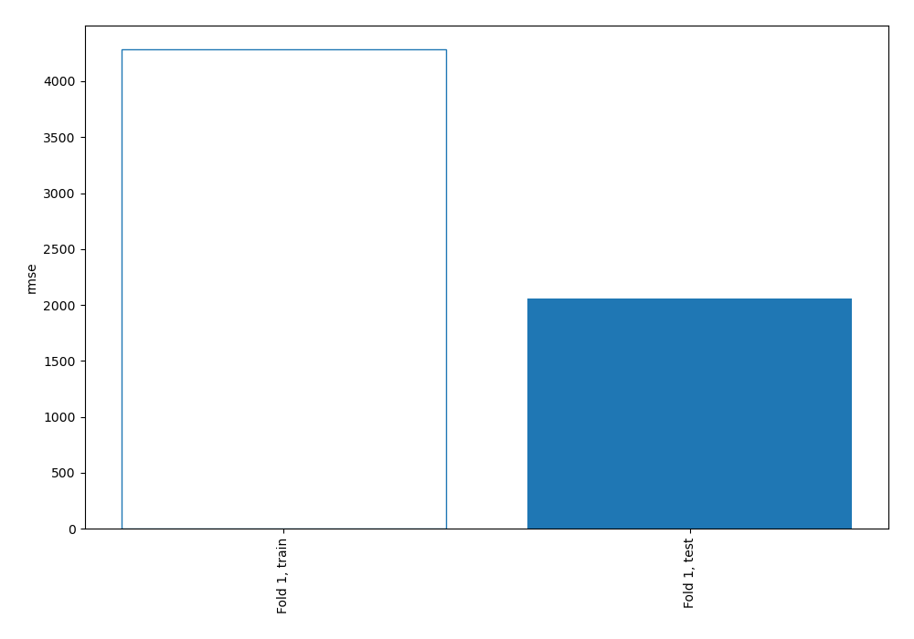
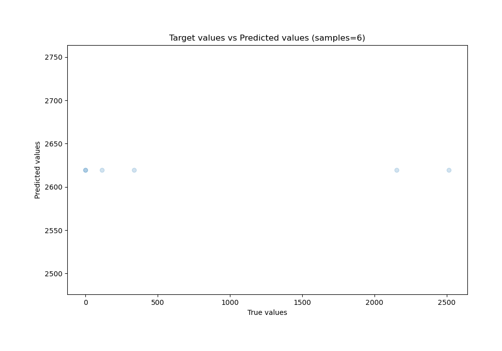
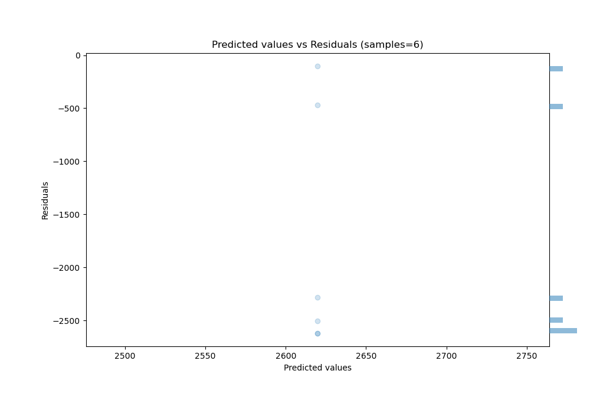

# Summary of 1_Baseline

[<< Go back](../README.md)

## Baseline Regressor (Baseline)
- **n_jobs**: -1
- **explain_level**: 2

## Validation
 - **validation_type**: split
 - **train_ratio**: 0.75
 - **shuffle**: True

## Optimized metric
rmse

## Training time

1.6 seconds

### Metric details:
| Metric   |          Score |
|:---------|---------------:|
| MAE      | 1766.72        |
| MSE      |    4.24003e+06 |
| RMSE     | 2059.13        |
| R2       |   -2.79003     |
| MAPE     | 4047.36        |

## Learning curves

## True vs Predicted

## Predicted vs Residuals

[<< Go back](../README.md)
