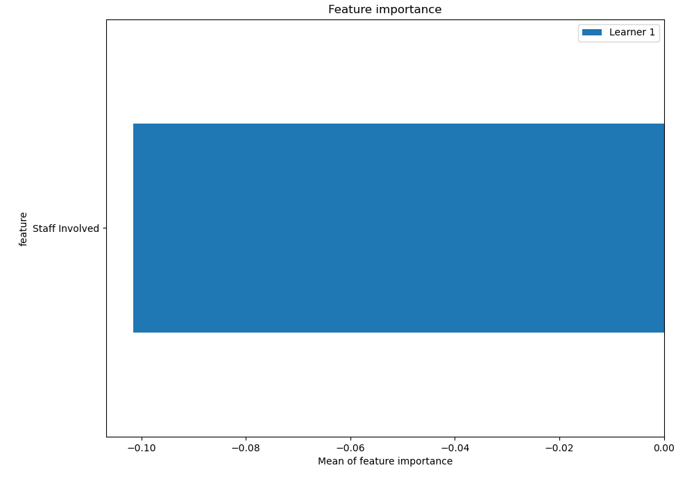

# Summary of 3_Linear

[<< Go back](../README.md)

## Linear Regression (Linear)
- **n_jobs**: -1
- **explain_level**: 2

## Validation
 - **validation_type**: split
 - **train_ratio**: 0.75
 - **shuffle**: True

## Optimized metric
rmse

## Training time

4.7 seconds

### Metric details:
| Metric   |          Score |
|:---------|---------------:|
| MAE      | 4483.92        |
| MSE      |    2.64423e+07 |
| RMSE     | 5142.21        |
| R2       |  -22.6359      |
| MAPE     | 9998.74        |

## Learning curves

## Coefficients
| feature        |   Learner_1 |
|:---------------|------------:|
| Staff Involved | 0.380505    |
| intercept      | 7.28584e-17 |

## Permutation-based Importance

## True vs Predicted

## Predicted vs Residuals

[<< Go back](../README.md)
