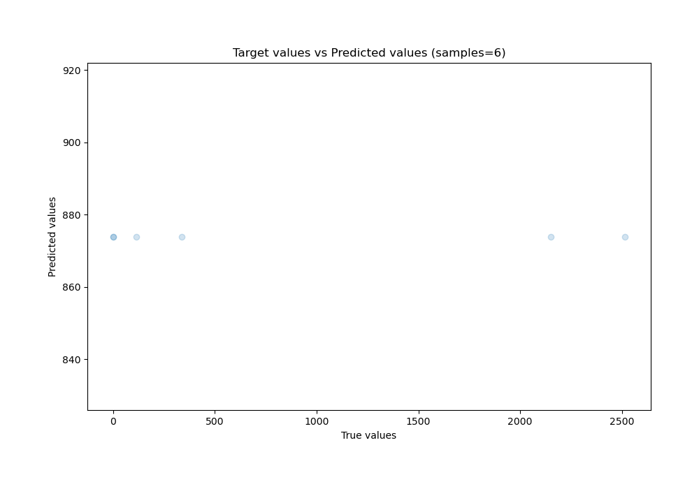
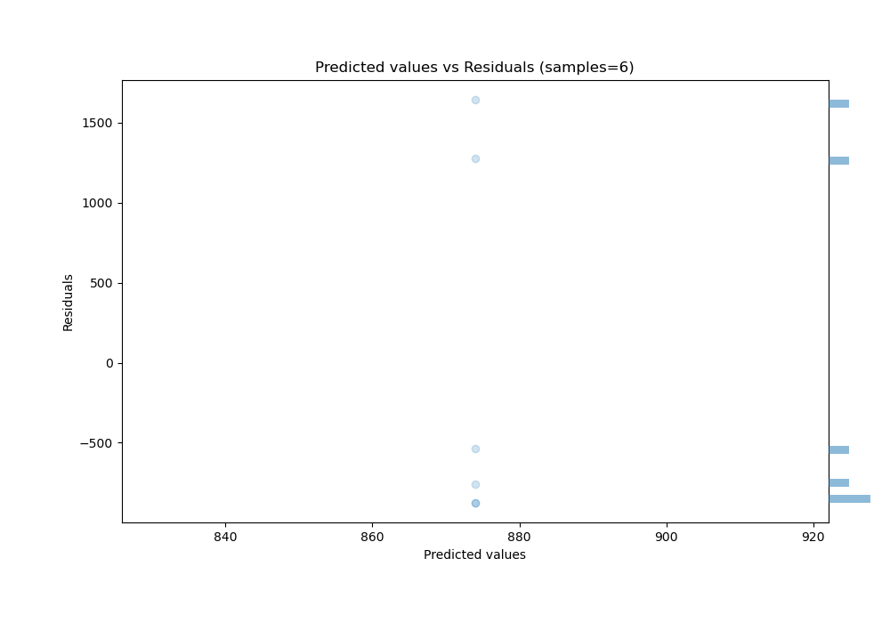

# Summary of Ensemble

[<< Go back](../README.md)

## Ensemble structure
| Model                  |   Weight |
|:-----------------------|---------:|
| 4_Default_Xgboost      |        2 |
| 6_Default_RandomForest |        1 |

### Metric details:
| Metric   |          Score |
|:---------|---------------:|
| MAE      |  993.581       |
| MSE      |    1.11917e+06 |
| RMSE     | 1057.91        |
| R2       |   -0.000390237 |
| MAPE     | 1349.96        |

## Learning curves

## True vs Predicted

## Predicted vs Residuals

[<< Go back](../README.md)
