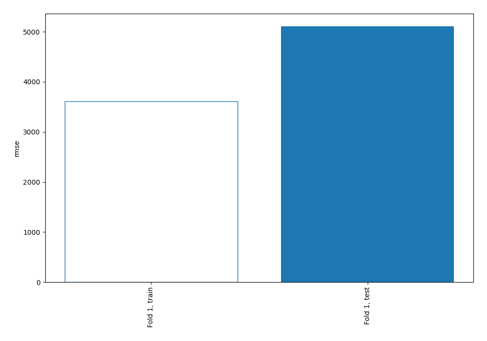
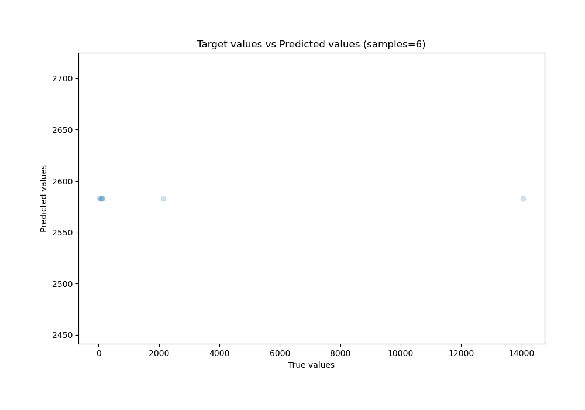
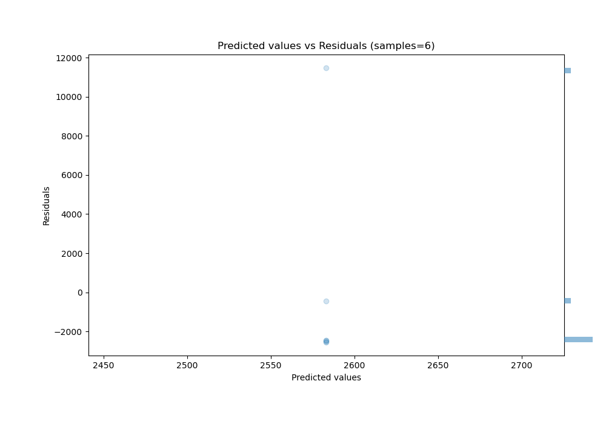

# Summary of 1_Baseline

[<< Go back](../README.md)

## Baseline Regressor (Baseline)
- **n_jobs**: -1
- **explain_level**: 2

## Validation
 - **validation_type**: split
 - **train_ratio**: 0.75
 - **shuffle**: True

## Optimized metric
rmse

## Training time

0.4 seconds

### Metric details:
| Metric   |          Score |
|:---------|---------------:|
| MAE      | 3645.1         |
| MSE      |    2.60899e+07 |
| RMSE     | 5107.83        |
| R2       |   -0.00120481  |
| MAPE     |   23.0654      |

## Learning curves

## True vs Predicted

## Predicted vs Residuals

[<< Go back](../README.md)
