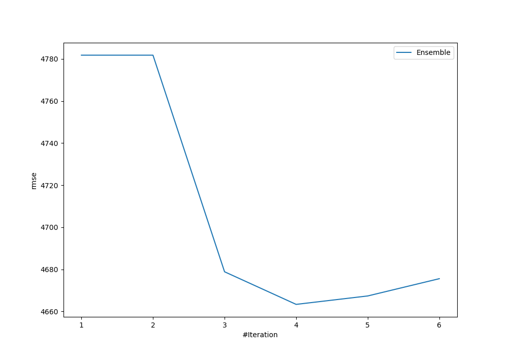
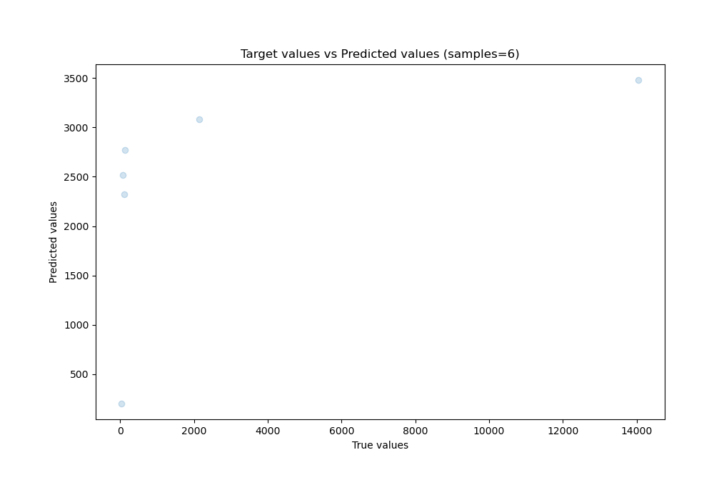
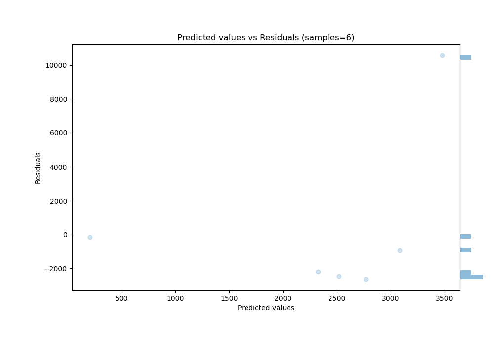

# Summary of Ensemble

[<< Go back](../README.md)

## Ensemble structure
| Model          |   Weight |
|:---------------|---------:|
| 2_DecisionTree |        1 |
| 3_Linear       |        3 |

### Metric details:
| Metric   |         Score |
|:---------|--------------:|
| MAE      | 3159.9        |
| MSE      |    2.1747e+07 |
| RMSE     | 4663.37       |
| R2       |    0.165454   |
| MAPE     |   13.3452     |

## Learning curves

## True vs Predicted

## Predicted vs Residuals

[<< Go back](../README.md)
