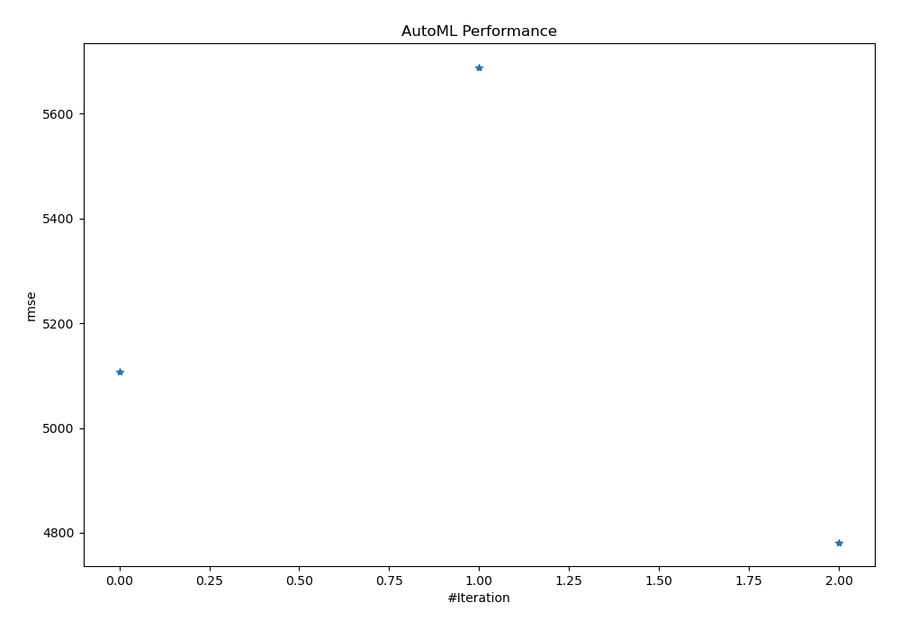
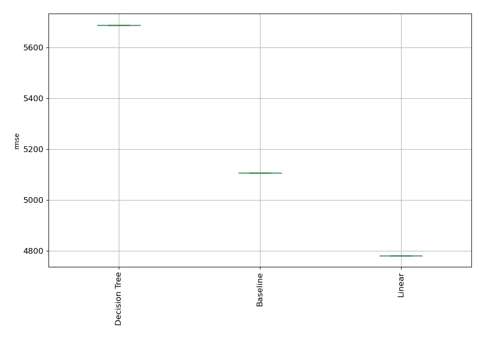

# AutoML Leaderboard

| Best model   | name                                       | model_type    | metric_type   |   metric_value |   train_time |
|:-------------|:-------------------------------------------|:--------------|:--------------|---------------:|-------------:|
|              | [1_Baseline](1_Baseline/README.md)         | Baseline      | rmse          |        5107.83 |         0.65 |
|              | [2_DecisionTree](2_DecisionTree/README.md) | Decision Tree | rmse          |        5689.06 |         1.45 |
| **the best** | [3_Linear](3_Linear/README.md)             | Linear        | rmse          |        4781.78 |         0.36 |

### AutoML Performance

### AutoML Performance Boxplot
