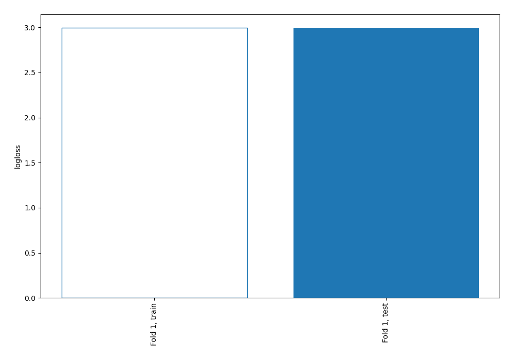
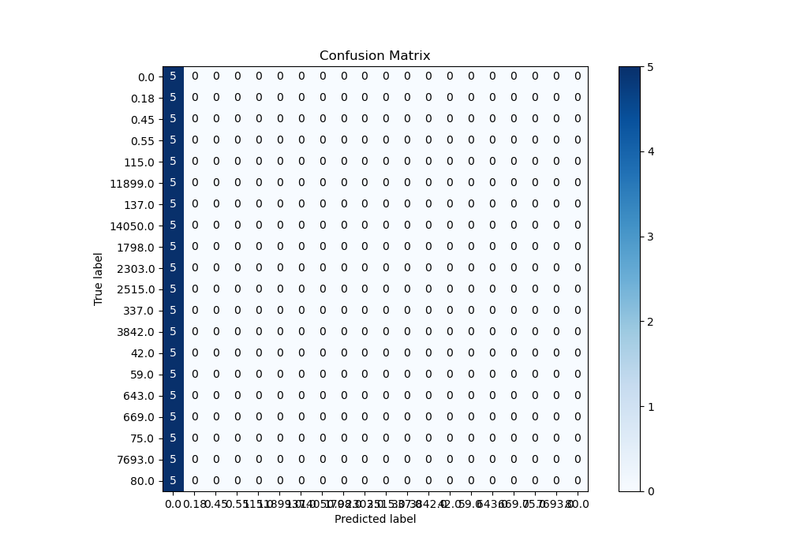
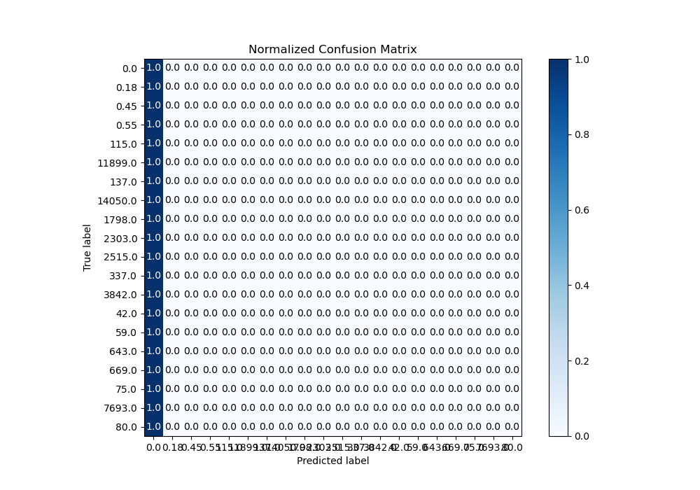
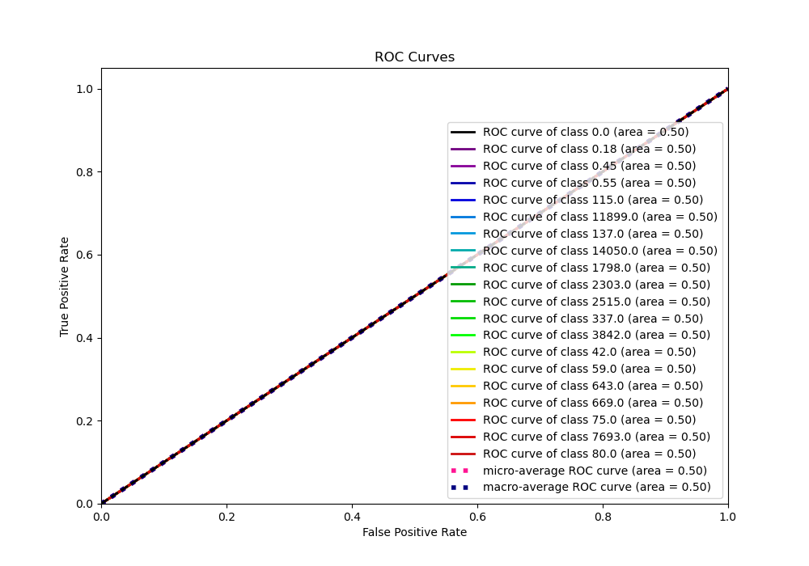
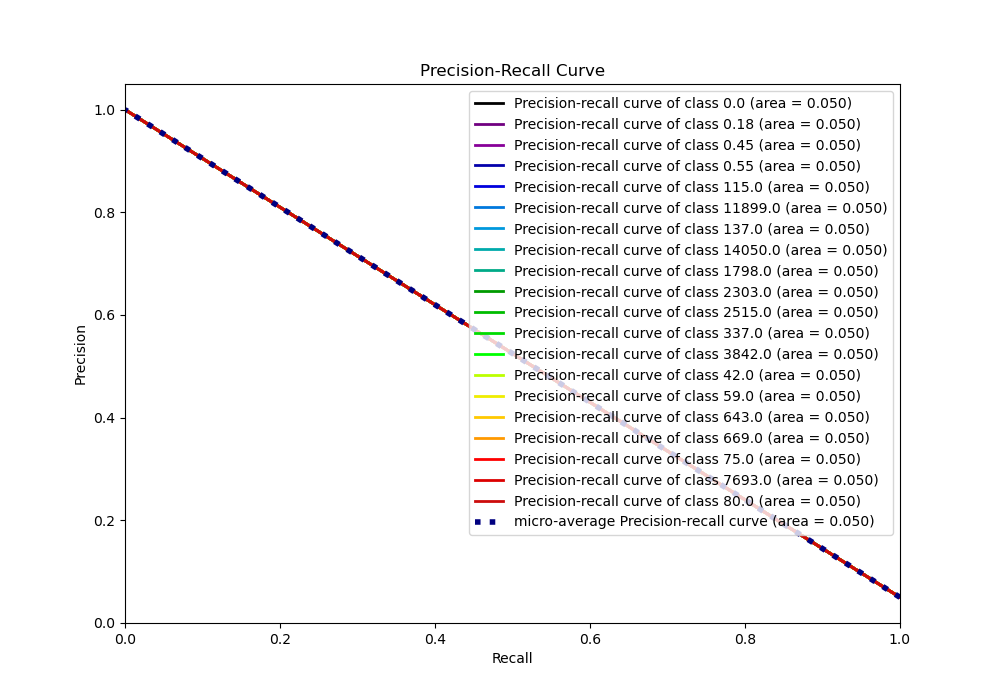

# Summary of 1_Baseline

[<< Go back](../README.md)

## Baseline Classifier (Baseline)
- **n_jobs**: -1
- **num_class**: 20
- **explain_level**: 2

## Validation
 - **validation_type**: split
 - **train_ratio**: 0.75
 - **shuffle**: True
 - **stratify**: True

## Optimized metric
logloss

## Training time

0.6 seconds

### Metric details
|           |       0.0 |   0.18 |   0.45 |   0.55 |   42.0 |   59.0 |   75.0 |   80.0 |   115.0 |   137.0 |   337.0 |   643.0 |   669.0 |   1798.0 |   2303.0 |   2515.0 |   3842.0 |   7693.0 |   11899.0 |   14050.0 |   accuracy |   macro avg |   weighted avg |   logloss |
|:----------|----------:|-------:|-------:|-------:|-------:|-------:|-------:|-------:|--------:|--------:|--------:|--------:|--------:|---------:|---------:|---------:|---------:|---------:|----------:|----------:|-----------:|------------:|---------------:|----------:|
| precision | 0.05      |      0 |      0 |      0 |      0 |      0 |      0 |      0 |       0 |       0 |       0 |       0 |       0 |        0 |        0 |        0 |        0 |        0 |         0 |         0 |       0.05 |   0.0025    |      0.0025    |   2.99573 |
| recall    | 1         |      0 |      0 |      0 |      0 |      0 |      0 |      0 |       0 |       0 |       0 |       0 |       0 |        0 |        0 |        0 |        0 |        0 |         0 |         0 |       0.05 |   0.05      |      0.05      |   2.99573 |
| f1-score  | 0.0952381 |      0 |      0 |      0 |      0 |      0 |      0 |      0 |       0 |       0 |       0 |       0 |       0 |        0 |        0 |        0 |        0 |        0 |         0 |         0 |       0.05 |   0.0047619 |      0.0047619 |   2.99573 |
| support   | 5         |      5 |      5 |      5 |      5 |      5 |      5 |      5 |       5 |       5 |       5 |       5 |       5 |        5 |        5 |        5 |        5 |        5 |         5 |         5 |       0.05 | 100         |    100         |   2.99573 |

## Confusion matrix
|                    |   Predicted as 0.0 |   Predicted as 0.18 |   Predicted as 0.45 |   Predicted as 0.55 |   Predicted as 42.0 |   Predicted as 59.0 |   Predicted as 75.0 |   Predicted as 80.0 |   Predicted as 115.0 |   Predicted as 137.0 |   Predicted as 337.0 |   Predicted as 643.0 |   Predicted as 669.0 |   Predicted as 1798.0 |   Predicted as 2303.0 |   Predicted as 2515.0 |   Predicted as 3842.0 |   Predicted as 7693.0 |   Predicted as 11899.0 |   Predicted as 14050.0 |
|:-------------------|-------------------:|--------------------:|--------------------:|--------------------:|--------------------:|--------------------:|--------------------:|--------------------:|---------------------:|---------------------:|---------------------:|---------------------:|---------------------:|----------------------:|----------------------:|----------------------:|----------------------:|----------------------:|-----------------------:|-----------------------:|
| Labeled as 0.0     |                  5 |                   0 |                   0 |                   0 |                   0 |                   0 |                   0 |                   0 |                    0 |                    0 |                    0 |                    0 |                    0 |                     0 |                     0 |                     0 |                     0 |                     0 |                      0 |                      0 |
| Labeled as 0.18    |                  5 |                   0 |                   0 |                   0 |                   0 |                   0 |                   0 |                   0 |                    0 |                    0 |                    0 |                    0 |                    0 |                     0 |                     0 |                     0 |                     0 |                     0 |                      0 |                      0 |
| Labeled as 0.45    |                  5 |                   0 |                   0 |                   0 |                   0 |                   0 |                   0 |                   0 |                    0 |                    0 |                    0 |                    0 |                    0 |                     0 |                     0 |                     0 |                     0 |                     0 |                      0 |                      0 |
| Labeled as 0.55    |                  5 |                   0 |                   0 |                   0 |                   0 |                   0 |                   0 |                   0 |                    0 |                    0 |                    0 |                    0 |                    0 |                     0 |                     0 |                     0 |                     0 |                     0 |                      0 |                      0 |
| Labeled as 42.0    |                  5 |                   0 |                   0 |                   0 |                   0 |                   0 |                   0 |                   0 |                    0 |                    0 |                    0 |                    0 |                    0 |                     0 |                     0 |                     0 |                     0 |                     0 |                      0 |                      0 |
| Labeled as 59.0    |                  5 |                   0 |                   0 |                   0 |                   0 |                   0 |                   0 |                   0 |                    0 |                    0 |                    0 |                    0 |                    0 |                     0 |                     0 |                     0 |                     0 |                     0 |                      0 |                      0 |
| Labeled as 75.0    |                  5 |                   0 |                   0 |                   0 |                   0 |                   0 |                   0 |                   0 |                    0 |                    0 |                    0 |                    0 |                    0 |                     0 |                     0 |                     0 |                     0 |                     0 |                      0 |                      0 |
| Labeled as 80.0    |                  5 |                   0 |                   0 |                   0 |                   0 |                   0 |                   0 |                   0 |                    0 |                    0 |                    0 |                    0 |                    0 |                     0 |                     0 |                     0 |                     0 |                     0 |                      0 |                      0 |
| Labeled as 115.0   |                  5 |                   0 |                   0 |                   0 |                   0 |                   0 |                   0 |                   0 |                    0 |                    0 |                    0 |                    0 |                    0 |                     0 |                     0 |                     0 |                     0 |                     0 |                      0 |                      0 |
| Labeled as 137.0   |                  5 |                   0 |                   0 |                   0 |                   0 |                   0 |                   0 |                   0 |                    0 |                    0 |                    0 |                    0 |                    0 |                     0 |                     0 |                     0 |                     0 |                     0 |                      0 |                      0 |
| Labeled as 337.0   |                  5 |                   0 |                   0 |                   0 |                   0 |                   0 |                   0 |                   0 |                    0 |                    0 |                    0 |                    0 |                    0 |                     0 |                     0 |                     0 |                     0 |                     0 |                      0 |                      0 |
| Labeled as 643.0   |                  5 |                   0 |                   0 |                   0 |                   0 |                   0 |                   0 |                   0 |                    0 |                    0 |                    0 |                    0 |                    0 |                     0 |                     0 |                     0 |                     0 |                     0 |                      0 |                      0 |
| Labeled as 669.0   |                  5 |                   0 |                   0 |                   0 |                   0 |                   0 |                   0 |                   0 |                    0 |                    0 |                    0 |                    0 |                    0 |                     0 |                     0 |                     0 |                     0 |                     0 |                      0 |                      0 |
| Labeled as 1798.0  |                  5 |                   0 |                   0 |                   0 |                   0 |                   0 |                   0 |                   0 |                    0 |                    0 |                    0 |                    0 |                    0 |                     0 |                     0 |                     0 |                     0 |                     0 |                      0 |                      0 |
| Labeled as 2303.0  |                  5 |                   0 |                   0 |                   0 |                   0 |                   0 |                   0 |                   0 |                    0 |                    0 |                    0 |                    0 |                    0 |                     0 |                     0 |                     0 |                     0 |                     0 |                      0 |                      0 |
| Labeled as 2515.0  |                  5 |                   0 |                   0 |                   0 |                   0 |                   0 |                   0 |                   0 |                    0 |                    0 |                    0 |                    0 |                    0 |                     0 |                     0 |                     0 |                     0 |                     0 |                      0 |                      0 |
| Labeled as 3842.0  |                  5 |                   0 |                   0 |                   0 |                   0 |                   0 |                   0 |                   0 |                    0 |                    0 |                    0 |                    0 |                    0 |                     0 |                     0 |                     0 |                     0 |                     0 |                      0 |                      0 |
| Labeled as 7693.0  |                  5 |                   0 |                   0 |                   0 |                   0 |                   0 |                   0 |                   0 |                    0 |                    0 |                    0 |                    0 |                    0 |                     0 |                     0 |                     0 |                     0 |                     0 |                      0 |                      0 |
| Labeled as 11899.0 |                  5 |                   0 |                   0 |                   0 |                   0 |                   0 |                   0 |                   0 |                    0 |                    0 |                    0 |                    0 |                    0 |                     0 |                     0 |                     0 |                     0 |                     0 |                      0 |                      0 |
| Labeled as 14050.0 |                  5 |                   0 |                   0 |                   0 |                   0 |                   0 |                   0 |                   0 |                    0 |                    0 |                    0 |                    0 |                    0 |                     0 |                     0 |                     0 |                     0 |                     0 |                      0 |                      0 |

## Learning curves

## Confusion Matrix

## Normalized Confusion Matrix

## ROC Curve

## Precision Recall Curve

[<< Go back](../README.md)
