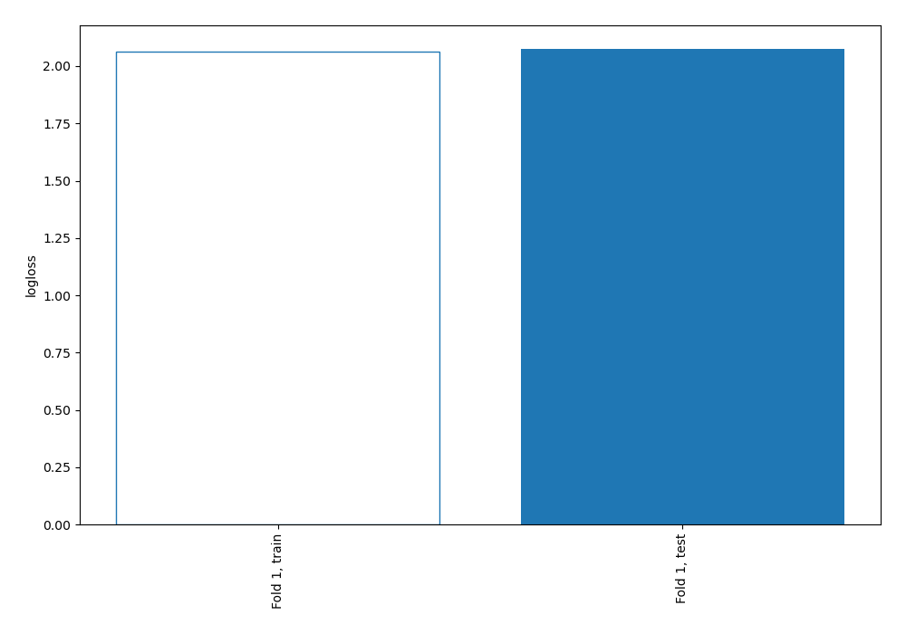
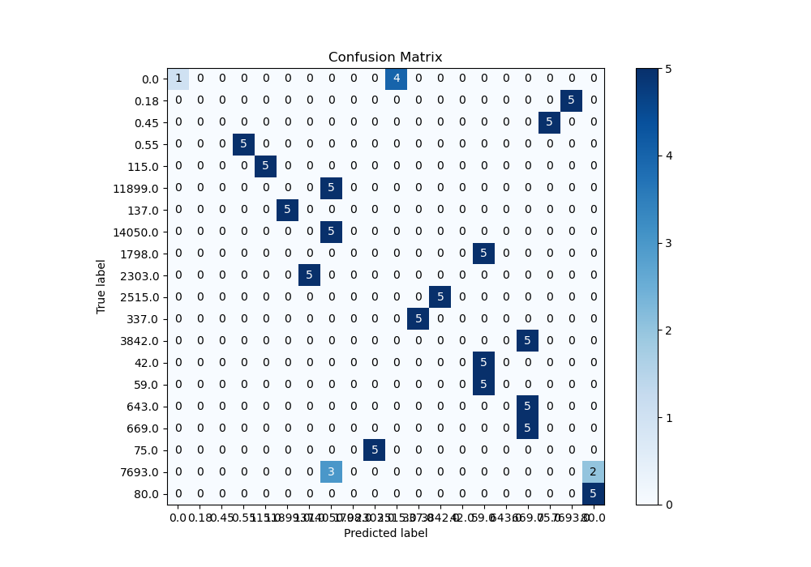
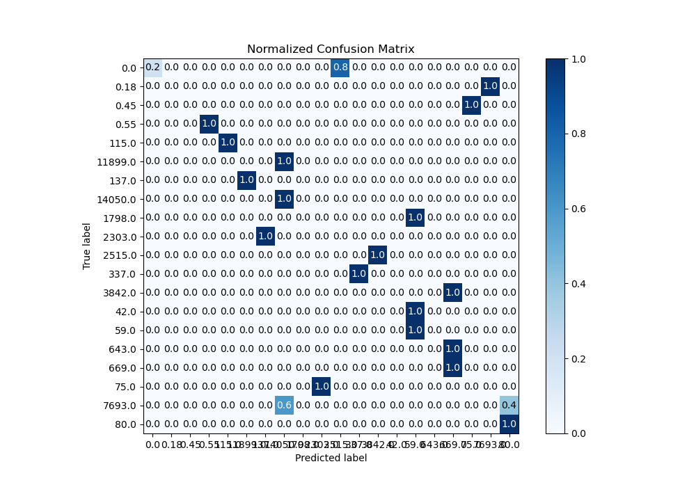
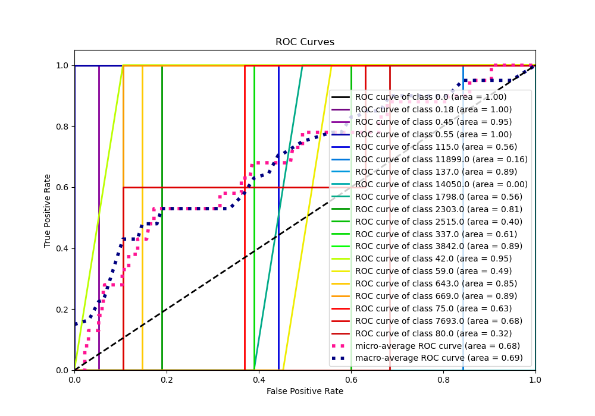
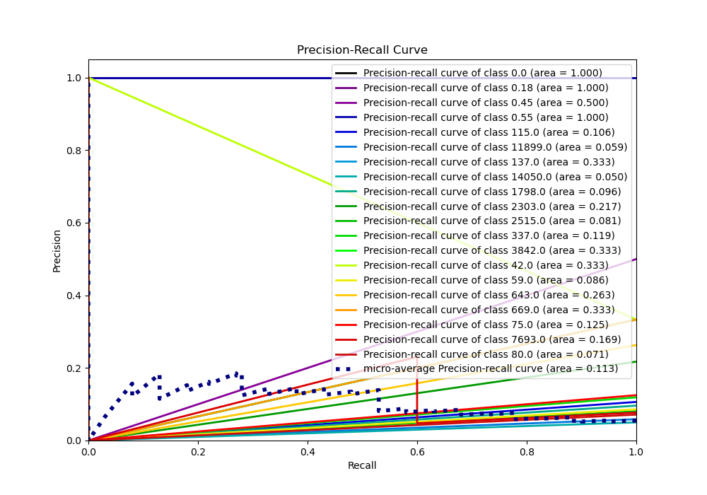
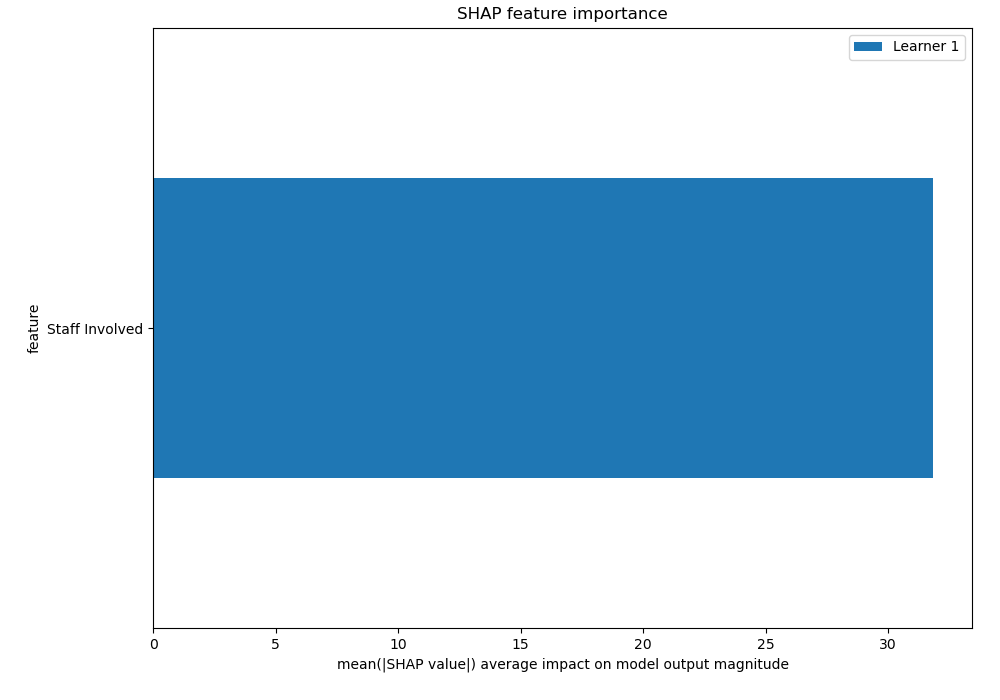
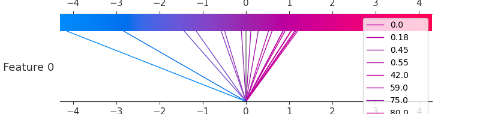
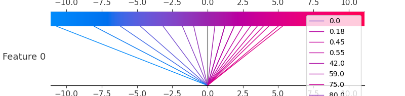

# Summary of 3_Linear

[<< Go back](../README.md)

## Logistic Regression (Linear)
- **n_jobs**: -1
- **num_class**: 20
- **explain_level**: 2

## Validation
 - **validation_type**: split
 - **train_ratio**: 0.75
 - **shuffle**: True
 - **stratify**: True

## Optimized metric
logloss

## Training time

8.2 seconds

### Metric details
|           |      0.0 |   0.18 |   0.45 |   0.55 |   42.0 |     59.0 |   75.0 |     80.0 |   115.0 |   137.0 |   337.0 |   643.0 |    669.0 |   1798.0 |   2303.0 |   2515.0 |   3842.0 |   7693.0 |   11899.0 |   14050.0 |   accuracy |   macro avg |   weighted avg |   logloss |
|:----------|---------:|-------:|-------:|-------:|-------:|---------:|-------:|---------:|--------:|--------:|--------:|--------:|---------:|---------:|---------:|---------:|---------:|---------:|----------:|----------:|-----------:|------------:|---------------:|----------:|
| precision | 1        |      0 |      0 |      1 |      0 | 0.333333 |      0 | 0.714286 |       1 |       0 |       1 |       0 | 0.333333 |        0 |        0 |        0 |        0 |        0 |         0 |  0.384615 |       0.36 |    0.288278 |       0.288278 |   2.07484 |
| recall    | 0.2      |      0 |      0 |      1 |      0 | 1        |      0 | 1        |       1 |       0 |       1 |       0 | 1        |        0 |        0 |        0 |        0 |        0 |         0 |  1        |       0.36 |    0.36     |       0.36     |   2.07484 |
| f1-score  | 0.333333 |      0 |      0 |      1 |      0 | 0.5      |      0 | 0.833333 |       1 |       0 |       1 |       0 | 0.5      |        0 |        0 |        0 |        0 |        0 |         0 |  0.555556 |       0.36 |    0.286111 |       0.286111 |   2.07484 |
| support   | 5        |      5 |      5 |      5 |      5 | 5        |      5 | 5        |       5 |       5 |       5 |       5 | 5        |        5 |        5 |        5 |        5 |        5 |         5 |  5        |       0.36 |  100        |     100        |   2.07484 |

## Confusion matrix
|                    |   Predicted as 0.0 |   Predicted as 0.18 |   Predicted as 0.45 |   Predicted as 0.55 |   Predicted as 42.0 |   Predicted as 59.0 |   Predicted as 75.0 |   Predicted as 80.0 |   Predicted as 115.0 |   Predicted as 137.0 |   Predicted as 337.0 |   Predicted as 643.0 |   Predicted as 669.0 |   Predicted as 1798.0 |   Predicted as 2303.0 |   Predicted as 2515.0 |   Predicted as 3842.0 |   Predicted as 7693.0 |   Predicted as 11899.0 |   Predicted as 14050.0 |
|:-------------------|-------------------:|--------------------:|--------------------:|--------------------:|--------------------:|--------------------:|--------------------:|--------------------:|---------------------:|---------------------:|---------------------:|---------------------:|---------------------:|----------------------:|----------------------:|----------------------:|----------------------:|----------------------:|-----------------------:|-----------------------:|
| Labeled as 0.0     |                  1 |                   0 |                   0 |                   0 |                   0 |                   0 |                   0 |                   0 |                    0 |                    0 |                    0 |                    0 |                    0 |                     0 |                     0 |                     4 |                     0 |                     0 |                      0 |                      0 |
| Labeled as 0.18    |                  0 |                   0 |                   0 |                   0 |                   0 |                   0 |                   0 |                   0 |                    0 |                    0 |                    0 |                    0 |                    0 |                     0 |                     0 |                     0 |                     0 |                     5 |                      0 |                      0 |
| Labeled as 0.45    |                  0 |                   0 |                   0 |                   0 |                   0 |                   0 |                   5 |                   0 |                    0 |                    0 |                    0 |                    0 |                    0 |                     0 |                     0 |                     0 |                     0 |                     0 |                      0 |                      0 |
| Labeled as 0.55    |                  0 |                   0 |                   0 |                   5 |                   0 |                   0 |                   0 |                   0 |                    0 |                    0 |                    0 |                    0 |                    0 |                     0 |                     0 |                     0 |                     0 |                     0 |                      0 |                      0 |
| Labeled as 42.0    |                  0 |                   0 |                   0 |                   0 |                   0 |                   5 |                   0 |                   0 |                    0 |                    0 |                    0 |                    0 |                    0 |                     0 |                     0 |                     0 |                     0 |                     0 |                      0 |                      0 |
| Labeled as 59.0    |                  0 |                   0 |                   0 |                   0 |                   0 |                   5 |                   0 |                   0 |                    0 |                    0 |                    0 |                    0 |                    0 |                     0 |                     0 |                     0 |                     0 |                     0 |                      0 |                      0 |
| Labeled as 75.0    |                  0 |                   0 |                   0 |                   0 |                   0 |                   0 |                   0 |                   0 |                    0 |                    0 |                    0 |                    0 |                    0 |                     0 |                     5 |                     0 |                     0 |                     0 |                      0 |                      0 |
| Labeled as 80.0    |                  0 |                   0 |                   0 |                   0 |                   0 |                   0 |                   0 |                   5 |                    0 |                    0 |                    0 |                    0 |                    0 |                     0 |                     0 |                     0 |                     0 |                     0 |                      0 |                      0 |
| Labeled as 115.0   |                  0 |                   0 |                   0 |                   0 |                   0 |                   0 |                   0 |                   0 |                    5 |                    0 |                    0 |                    0 |                    0 |                     0 |                     0 |                     0 |                     0 |                     0 |                      0 |                      0 |
| Labeled as 137.0   |                  0 |                   0 |                   0 |                   0 |                   0 |                   0 |                   0 |                   0 |                    0 |                    0 |                    0 |                    0 |                    0 |                     0 |                     0 |                     0 |                     0 |                     0 |                      5 |                      0 |
| Labeled as 337.0   |                  0 |                   0 |                   0 |                   0 |                   0 |                   0 |                   0 |                   0 |                    0 |                    0 |                    5 |                    0 |                    0 |                     0 |                     0 |                     0 |                     0 |                     0 |                      0 |                      0 |
| Labeled as 643.0   |                  0 |                   0 |                   0 |                   0 |                   0 |                   0 |                   0 |                   0 |                    0 |                    0 |                    0 |                    0 |                    5 |                     0 |                     0 |                     0 |                     0 |                     0 |                      0 |                      0 |
| Labeled as 669.0   |                  0 |                   0 |                   0 |                   0 |                   0 |                   0 |                   0 |                   0 |                    0 |                    0 |                    0 |                    0 |                    5 |                     0 |                     0 |                     0 |                     0 |                     0 |                      0 |                      0 |
| Labeled as 1798.0  |                  0 |                   0 |                   0 |                   0 |                   0 |                   5 |                   0 |                   0 |                    0 |                    0 |                    0 |                    0 |                    0 |                     0 |                     0 |                     0 |                     0 |                     0 |                      0 |                      0 |
| Labeled as 2303.0  |                  0 |                   0 |                   0 |                   0 |                   0 |                   0 |                   0 |                   0 |                    0 |                    5 |                    0 |                    0 |                    0 |                     0 |                     0 |                     0 |                     0 |                     0 |                      0 |                      0 |
| Labeled as 2515.0  |                  0 |                   0 |                   0 |                   0 |                   0 |                   0 |                   0 |                   0 |                    0 |                    0 |                    0 |                    0 |                    0 |                     0 |                     0 |                     0 |                     5 |                     0 |                      0 |                      0 |
| Labeled as 3842.0  |                  0 |                   0 |                   0 |                   0 |                   0 |                   0 |                   0 |                   0 |                    0 |                    0 |                    0 |                    0 |                    5 |                     0 |                     0 |                     0 |                     0 |                     0 |                      0 |                      0 |
| Labeled as 7693.0  |                  0 |                   0 |                   0 |                   0 |                   0 |                   0 |                   0 |                   2 |                    0 |                    0 |                    0 |                    0 |                    0 |                     0 |                     0 |                     0 |                     0 |                     0 |                      0 |                      3 |
| Labeled as 11899.0 |                  0 |                   0 |                   0 |                   0 |                   0 |                   0 |                   0 |                   0 |                    0 |                    0 |                    0 |                    0 |                    0 |                     0 |                     0 |                     0 |                     0 |                     0 |                      0 |                      5 |
| Labeled as 14050.0 |                  0 |                   0 |                   0 |                   0 |                   0 |                   0 |                   0 |                   0 |                    0 |                    0 |                    0 |                    0 |                    0 |                     0 |                     0 |                     0 |                     0 |                     0 |                      0 |                      5 |

## Learning curves

## Coefficients

### Coefficients learner #1
|                |       0.0 |     0.18 |     0.45 |     0.55 |      42.0 |      59.0 |     75.0 |      80.0 |     115.0 |     137.0 |     337.0 |    643.0 |    669.0 |    1798.0 |    2303.0 |    2515.0 |    3842.0 |   7693.0 |   11899.0 |   14050.0 |
|:---------------|----------:|---------:|---------:|---------:|----------:|----------:|---------:|----------:|----------:|----------:|----------:|---------:|---------:|----------:|----------:|----------:|----------:|---------:|----------:|----------:|
| intercept      |  0.322651 | 1.00234  | 0.676267 | 0.872524 | 1.06535   | 1.06535   | 0.411551 |  0.881864 |  0.708372 | -0.367468 |  1.06329  | -1.57103 | -2.75276 | 1.06535   | 0.0699201 | -0.233756 | -0.784587 | 1.00234  |  -1.70682 |  -2.79074 |
| Staff Involved | -2.01838  | 0.512029 | 1.37088  | 0.940789 | 0.0894451 | 0.0894451 | 1.80488  | -1.08363  | -1.44848  |  2.73024  | -0.319194 | -3.75977 | -4.61683 | 0.0894451 | 2.25227   | -2.62801  | -3.12849  | 0.512029 |   3.90232 |   4.70902 |

## Permutation-based Importance

## Confusion Matrix

## Normalized Confusion Matrix

## ROC Curve

## Precision Recall Curve

## SHAP Importance

## SHAP Dependence plots

### Dependence 0.0 (Fold 1)

### Dependence 0.18 (Fold 1)

### Dependence 0.45 (Fold 1)

### Dependence 0.55 (Fold 1)

### Dependence 115.0 (Fold 1)

### Dependence 11899.0 (Fold 1)

### Dependence 137.0 (Fold 1)

### Dependence 14050.0 (Fold 1)

### Dependence 1798.0 (Fold 1)

### Dependence 2303.0 (Fold 1)

### Dependence 2515.0 (Fold 1)

### Dependence 337.0 (Fold 1)

### Dependence 3842.0 (Fold 1)

### Dependence 42.0 (Fold 1)

### Dependence 59.0 (Fold 1)

### Dependence 643.0 (Fold 1)

### Dependence 669.0 (Fold 1)

### Dependence 75.0 (Fold 1)

### Dependence 7693.0 (Fold 1)

### Dependence 80.0 (Fold 1)

## SHAP Decision plots

### Worst decisions for selected sample 1 (Fold 1)

### Worst decisions for selected sample 2 (Fold 1)

### Worst decisions for selected sample 3 (Fold 1)

### Worst decisions for selected sample 4 (Fold 1)

### Best decisions for selected sample 1 (Fold 1)

### Best decisions for selected sample 2 (Fold 1)

### Best decisions for selected sample 3 (Fold 1)

### Best decisions for selected sample 4 (Fold 1)

[<< Go back](../README.md)
