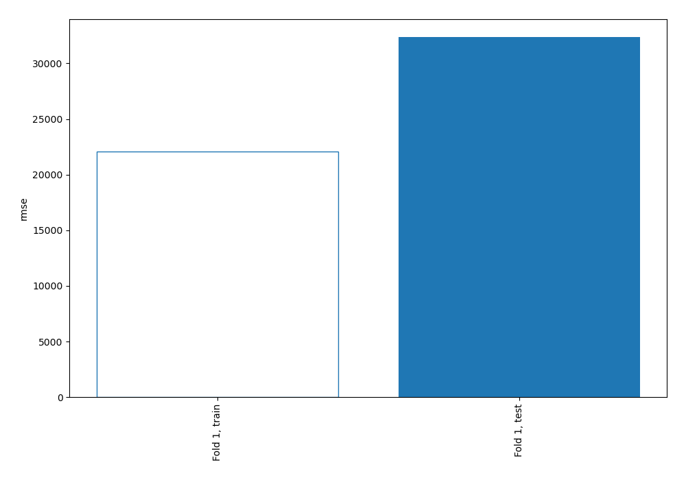
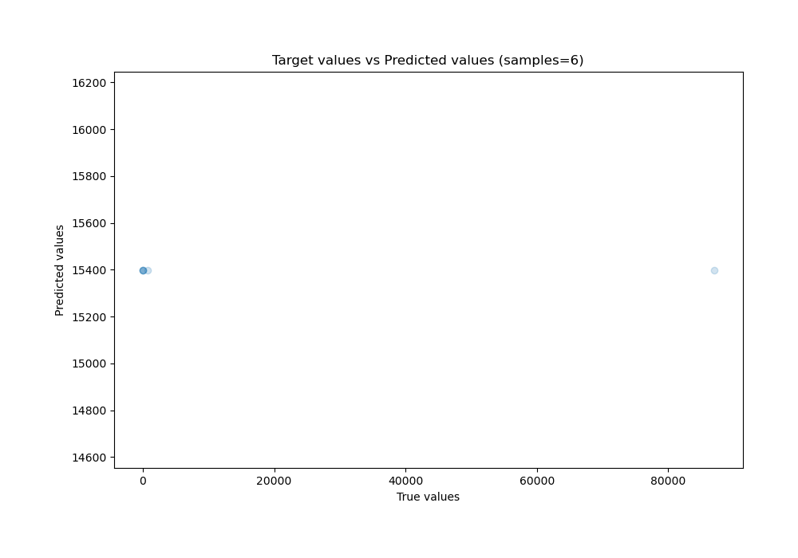
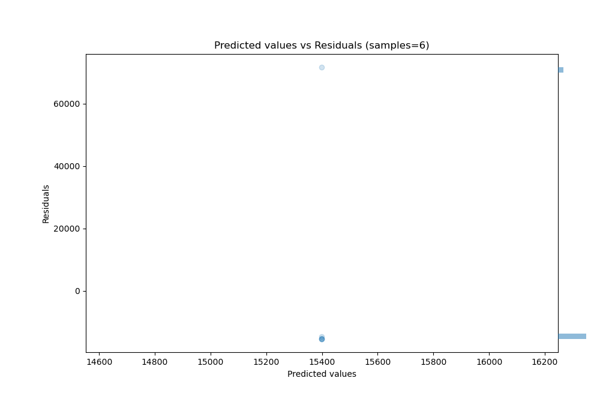

# Summary of 1_Baseline

[<< Go back](../README.md)

## Baseline Regressor (Baseline)
- **n_jobs**: -1
- **explain_level**: 2

## Validation
 - **validation_type**: split
 - **train_ratio**: 0.75
 - **shuffle**: True

## Optimized metric
rmse

## Training time

1.8 seconds

### Metric details:
| Metric   |           Score |
|:---------|----------------:|
| MAE      | 24625.3         |
| MSE      |     1.04735e+09 |
| RMSE     | 32362.7         |
| R2       |    -0.000561735 |
| MAPE     | 39311.1         |

## Learning curves

## True vs Predicted

## Predicted vs Residuals

[<< Go back](../README.md)
