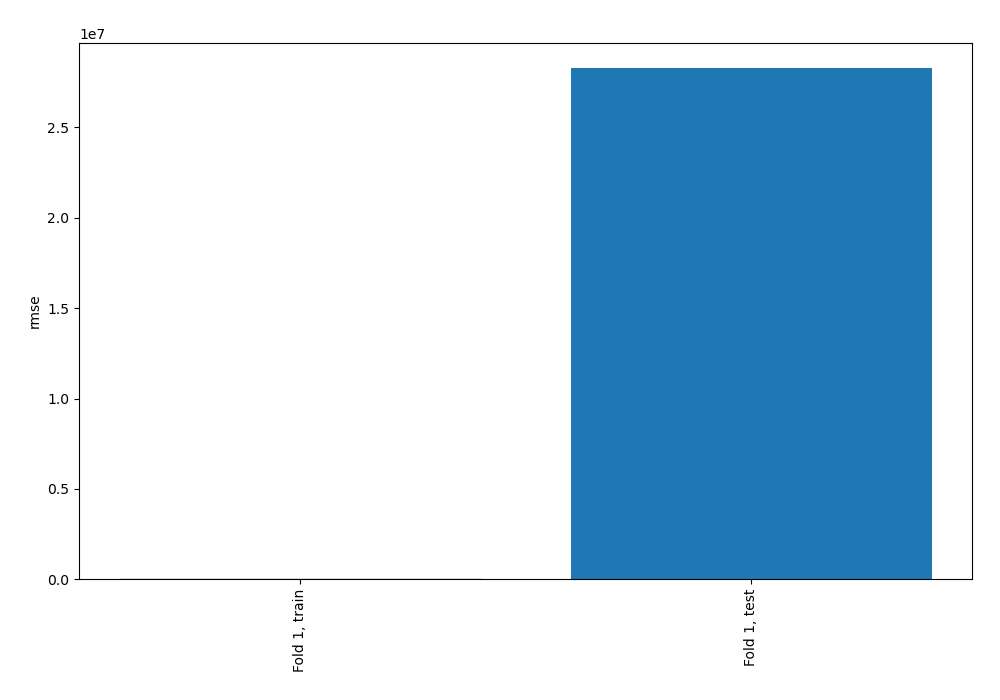
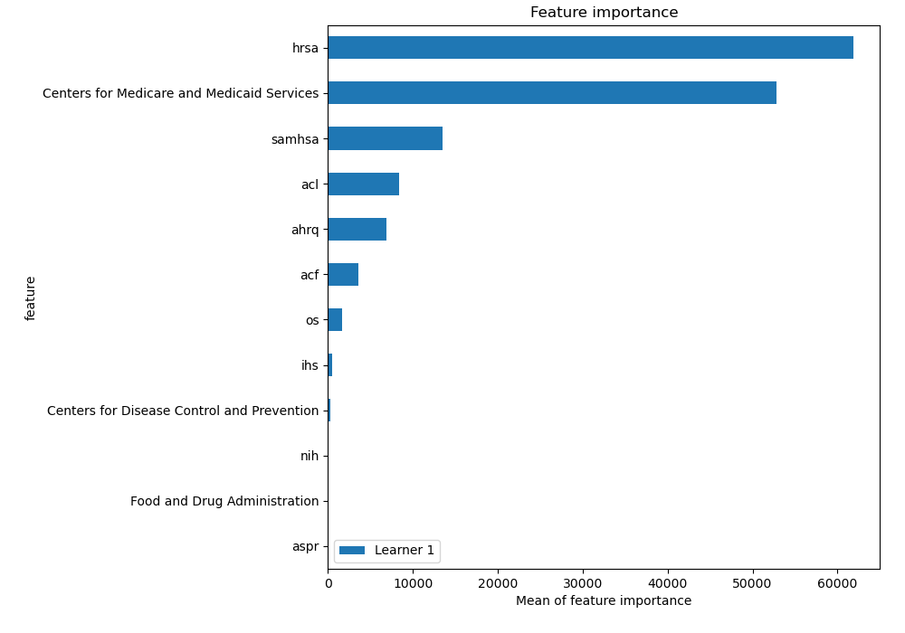
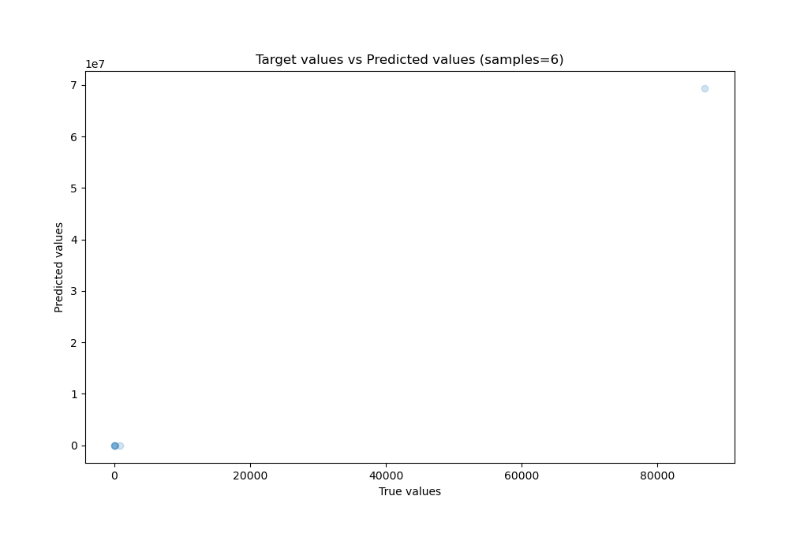
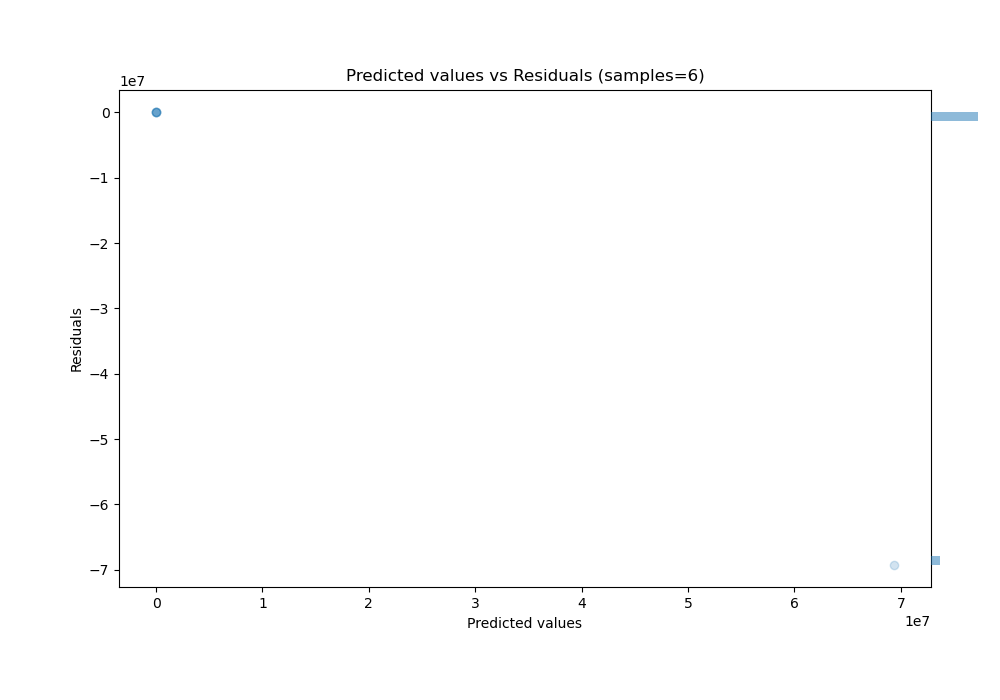

# Summary of 3_Linear

[<< Go back](../README.md)

## Linear Regression (Linear)
- **n_jobs**: -1
- **explain_level**: 2

## Validation
 - **validation_type**: split
 - **train_ratio**: 0.75
 - **shuffle**: True

## Optimized metric
rmse

## Training time

6.3 seconds

### Metric details:
| Metric   |             Score |
|:---------|------------------:|
| MAE      |       1.15393e+07 |
| MSE      |       7.98916e+14 |
| RMSE     |       2.82651e+07 |
| R2       | -763231           |
| MAPE     |     150.794       |

## Learning curves

## Coefficients
| feature                                    |      Learner_1 |
|:-------------------------------------------|---------------:|
| Centers for Medicare and Medicaid Services |  112.425       |
| samhsa                                     |   62.9896      |
| acf                                        |   30.2917      |
| os                                         |   19.0457      |
| nih                                        |    4.83257     |
| Food and Drug Administration               |    2.23691     |
| intercept                                  |   -1.27881e-14 |
| aspr                                       |   -1.13946     |
| Centers for Disease Control and Prevention |   -6.39477     |
| ihs                                        |  -13.6264      |
| ahrq                                       |  -44.6484      |
| acl                                        |  -48.2757      |
| hrsa                                       | -121.016       |

## Permutation-based Importance

## True vs Predicted

## Predicted vs Residuals

[<< Go back](../README.md)
