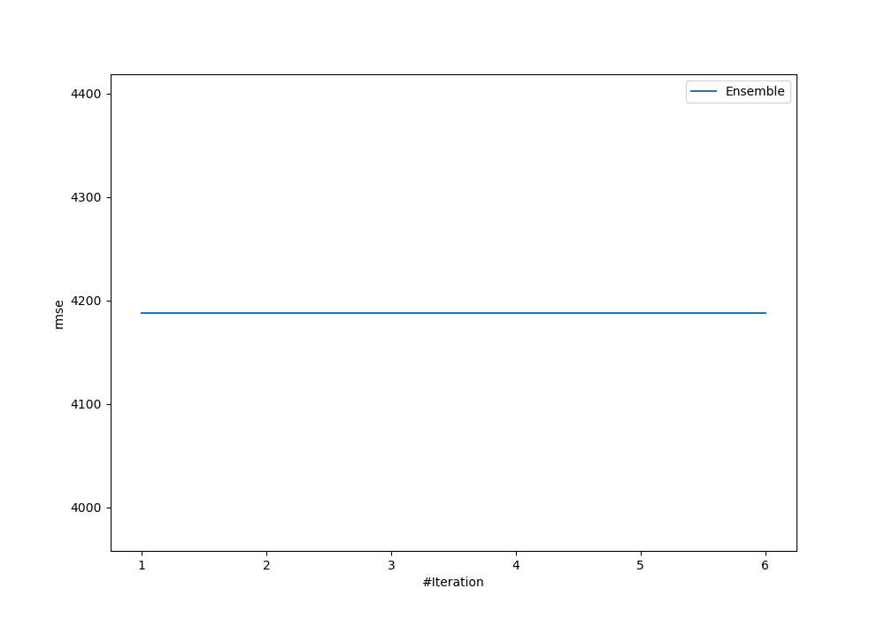
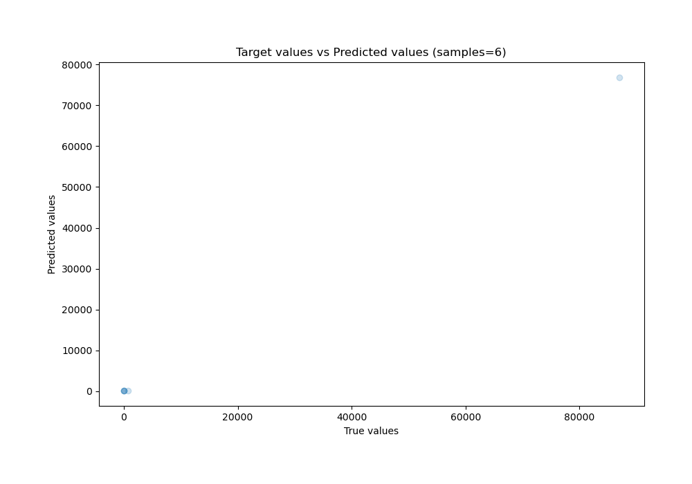
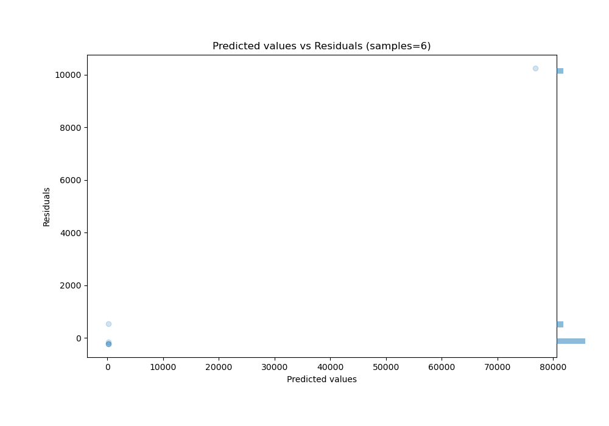

# Summary of Ensemble

[<< Go back](../README.md)

## Ensemble structure
| Model          |   Weight |
|:---------------|---------:|
| 2_DecisionTree |        1 |

### Metric details:
| Metric   |          Score |
|:---------|---------------:|
| MAE      | 1933.66        |
| MSE      |    1.75429e+07 |
| RMSE     | 4188.42        |
| R2       |    0.983241    |
| MAPE     |  569.413       |

## Learning curves

## True vs Predicted

## Predicted vs Residuals

[<< Go back](../README.md)
