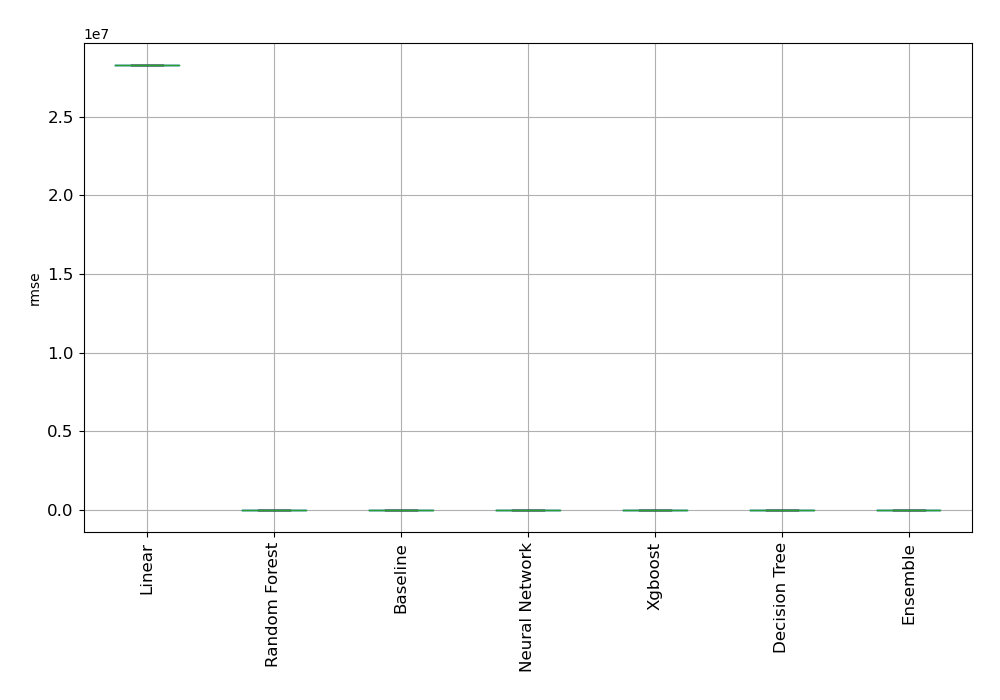

# AutoML Leaderboard

| Best model   | name                                                         | model_type     | metric_type   |    metric_value |   train_time |
|:-------------|:-------------------------------------------------------------|:---------------|:--------------|----------------:|-------------:|
|              | [1_Baseline](1_Baseline/README.md)                           | Baseline       | rmse          | 32362.7         |         1.95 |
| **the best** | [2_DecisionTree](2_DecisionTree/README.md)                   | Decision Tree  | rmse          |  4188.42        |        12.31 |
|              | [3_Linear](3_Linear/README.md)                               | Linear         | rmse          |     2.82651e+07 |         6.56 |
|              | [4_Default_Xgboost](4_Default_Xgboost/README.md)             | Xgboost        | rmse          |  4302.07        |         0.87 |
|              | [5_Default_NeuralNetwork](5_Default_NeuralNetwork/README.md) | Neural Network | rmse          | 28125           |         0.74 |
|              | [6_Default_RandomForest](6_Default_RandomForest/README.md)   | Random Forest  | rmse          | 35102.3         |         0.92 |
|              | [Ensemble](Ensemble/README.md)                               | Ensemble       | rmse          |  4188.42        |         0.14 |

### AutoML Performance

### AutoML Performance Boxplot

### Features Importance

### Spearman Correlation of Models

