# Summary of 2_DecisionTree

[<< Go back](../README.md)

## Decision Tree
- **n_jobs**: -1
- **criterion**: gini
- **max_depth**: 3
- **num_class**: 16
- **explain_level**: 2

## Validation
 - **validation_type**: split
 - **train_ratio**: 0.75
 - **shuffle**: True
 - **stratify**: True

## Optimized metric
logloss

## Training time

3.0 seconds

### Metric details
|           |       0.0 |   0.01 |   0.44 |   0.49 |   0.51 |   1.0 |   5.0 |   14.0 |   16.0 |   19.0 |   639.0 |   641.0 |   719.0 |   736.0 |   1439.0 |   1455.0 |   accuracy |   macro avg |   weighted avg |   logloss |
|:----------|----------:|-------:|-------:|-------:|-------:|------:|------:|-------:|-------:|-------:|--------:|--------:|--------:|--------:|---------:|---------:|-----------:|------------:|---------------:|----------:|
| precision | 0.0769231 |      1 |      1 |      1 |      0 |     0 |     0 |      0 |      0 |      0 |       0 |       0 |       0 |       0 |        0 |        0 |       0.25 |    0.192308 |       0.192308 |   2.08403 |
| recall    | 1         |      1 |      1 |      1 |      0 |     0 |     0 |      0 |      0 |      0 |       0 |       0 |       0 |       0 |        0 |        0 |       0.25 |    0.25     |       0.25     |   2.08403 |
| f1-score  | 0.142857  |      1 |      1 |      1 |      0 |     0 |     0 |      0 |      0 |      0 |       0 |       0 |       0 |       0 |        0 |        0 |       0.25 |    0.196429 |       0.196429 |   2.08403 |
| support   | 5         |      5 |      5 |      5 |      5 |     5 |     5 |      5 |      5 |      5 |       5 |       5 |       5 |       5 |        5 |        5 |       0.25 |   80        |      80        |   2.08403 |

## Confusion matrix
|                   |   Predicted as 0.0 |   Predicted as 0.01 |   Predicted as 0.44 |   Predicted as 0.49 |   Predicted as 0.51 |   Predicted as 1.0 |   Predicted as 5.0 |   Predicted as 14.0 |   Predicted as 16.0 |   Predicted as 19.0 |   Predicted as 639.0 |   Predicted as 641.0 |   Predicted as 719.0 |   Predicted as 736.0 |   Predicted as 1439.0 |   Predicted as 1455.0 |
|:------------------|-------------------:|--------------------:|--------------------:|--------------------:|--------------------:|-------------------:|-------------------:|--------------------:|--------------------:|--------------------:|---------------------:|---------------------:|---------------------:|---------------------:|----------------------:|----------------------:|
| Labeled as 0.0    |                  5 |                   0 |                   0 |                   0 |                   0 |                  0 |                  0 |                   0 |                   0 |                   0 |                    0 |                    0 |                    0 |                    0 |                     0 |                     0 |
| Labeled as 0.01   |                  0 |                   5 |                   0 |                   0 |                   0 |                  0 |                  0 |                   0 |                   0 |                   0 |                    0 |                    0 |                    0 |                    0 |                     0 |                     0 |
| Labeled as 0.44   |                  0 |                   0 |                   5 |                   0 |                   0 |                  0 |                  0 |                   0 |                   0 |                   0 |                    0 |                    0 |                    0 |                    0 |                     0 |                     0 |
| Labeled as 0.49   |                  0 |                   0 |                   0 |                   5 |                   0 |                  0 |                  0 |                   0 |                   0 |                   0 |                    0 |                    0 |                    0 |                    0 |                     0 |                     0 |
| Labeled as 0.51   |                  5 |                   0 |                   0 |                   0 |                   0 |                  0 |                  0 |                   0 |                   0 |                   0 |                    0 |                    0 |                    0 |                    0 |                     0 |                     0 |
| Labeled as 1.0    |                  5 |                   0 |                   0 |                   0 |                   0 |                  0 |                  0 |                   0 |                   0 |                   0 |                    0 |                    0 |                    0 |                    0 |                     0 |                     0 |
| Labeled as 5.0    |                  5 |                   0 |                   0 |                   0 |                   0 |                  0 |                  0 |                   0 |                   0 |                   0 |                    0 |                    0 |                    0 |                    0 |                     0 |                     0 |
| Labeled as 14.0   |                  5 |                   0 |                   0 |                   0 |                   0 |                  0 |                  0 |                   0 |                   0 |                   0 |                    0 |                    0 |                    0 |                    0 |                     0 |                     0 |
| Labeled as 16.0   |                  5 |                   0 |                   0 |                   0 |                   0 |                  0 |                  0 |                   0 |                   0 |                   0 |                    0 |                    0 |                    0 |                    0 |                     0 |                     0 |
| Labeled as 19.0   |                  5 |                   0 |                   0 |                   0 |                   0 |                  0 |                  0 |                   0 |                   0 |                   0 |                    0 |                    0 |                    0 |                    0 |                     0 |                     0 |
| Labeled as 639.0  |                  5 |                   0 |                   0 |                   0 |                   0 |                  0 |                  0 |                   0 |                   0 |                   0 |                    0 |                    0 |                    0 |                    0 |                     0 |                     0 |
| Labeled as 641.0  |                  5 |                   0 |                   0 |                   0 |                   0 |                  0 |                  0 |                   0 |                   0 |                   0 |                    0 |                    0 |                    0 |                    0 |                     0 |                     0 |
| Labeled as 719.0  |                  5 |                   0 |                   0 |                   0 |                   0 |                  0 |                  0 |                   0 |                   0 |                   0 |                    0 |                    0 |                    0 |                    0 |                     0 |                     0 |
| Labeled as 736.0  |                  5 |                   0 |                   0 |                   0 |                   0 |                  0 |                  0 |                   0 |                   0 |                   0 |                    0 |                    0 |                    0 |                    0 |                     0 |                     0 |
| Labeled as 1439.0 |                  5 |                   0 |                   0 |                   0 |                   0 |                  0 |                  0 |                   0 |                   0 |                   0 |                    0 |                    0 |                    0 |                    0 |                     0 |                     0 |
| Labeled as 1455.0 |                  5 |                   0 |                   0 |                   0 |                   0 |                  0 |                  0 |                   0 |                   0 |                   0 |                    0 |                    0 |                    0 |                    0 |                     0 |                     0 |

## Learning curves
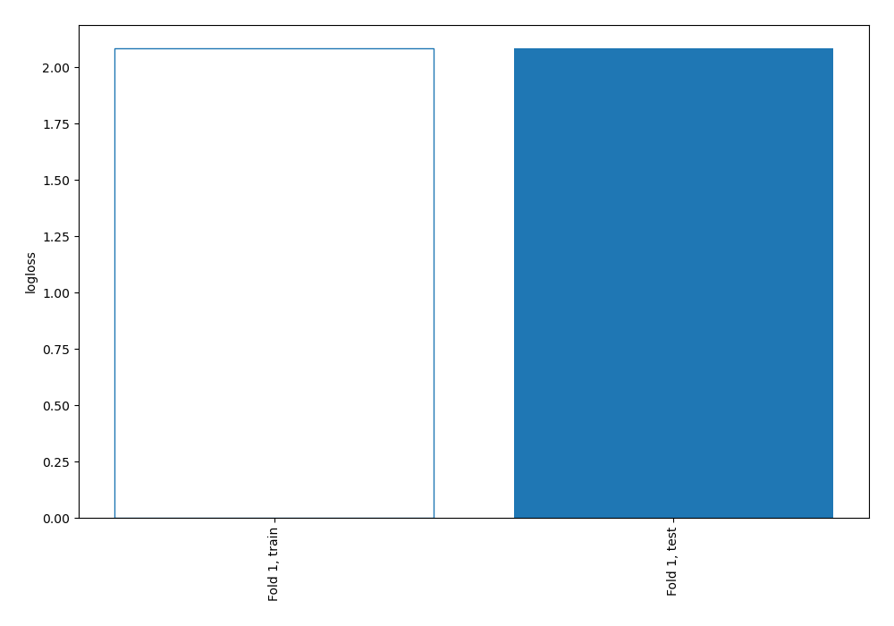

## Permutation-based Importance
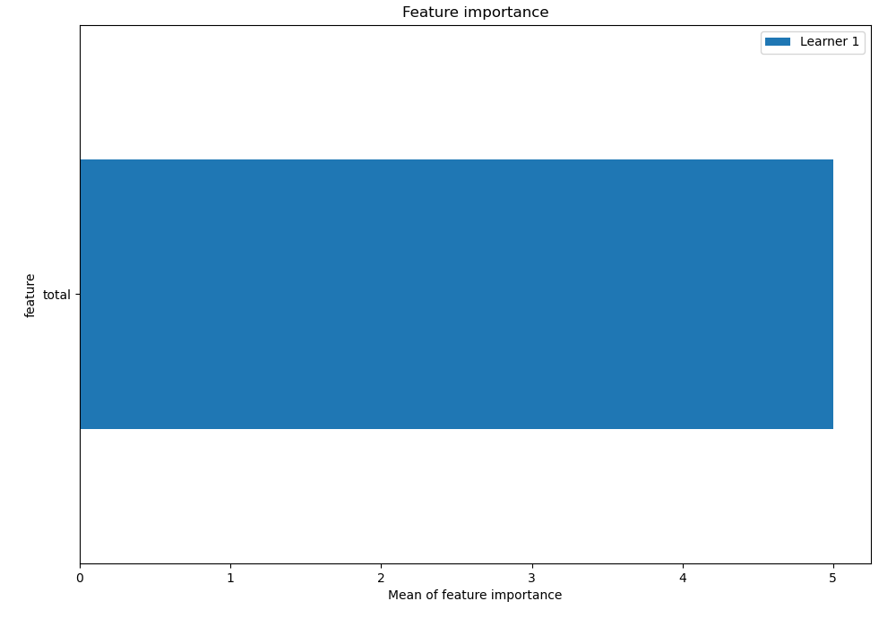
## Confusion Matrix

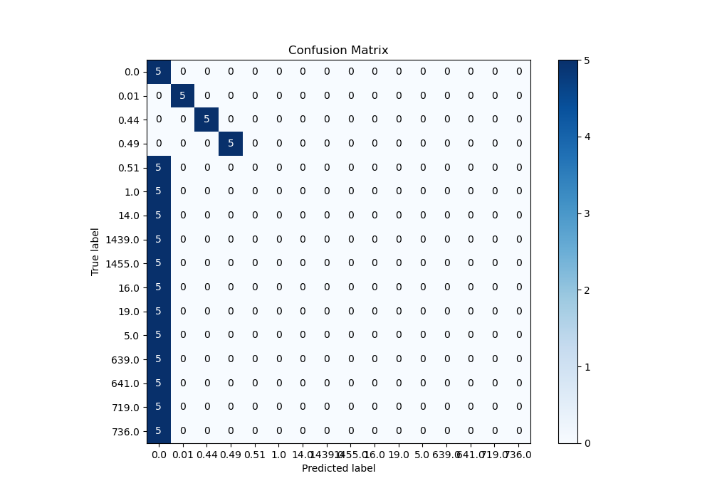

## Normalized Confusion Matrix

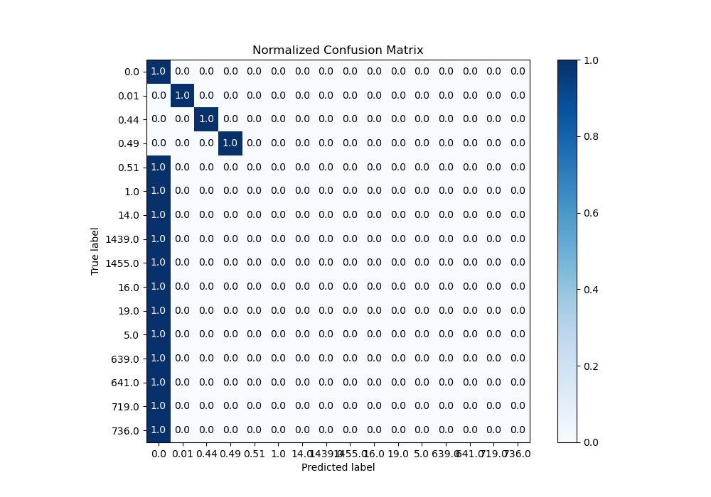

## ROC Curve

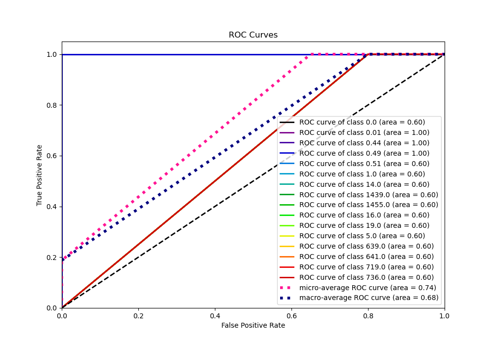

## Precision Recall Curve

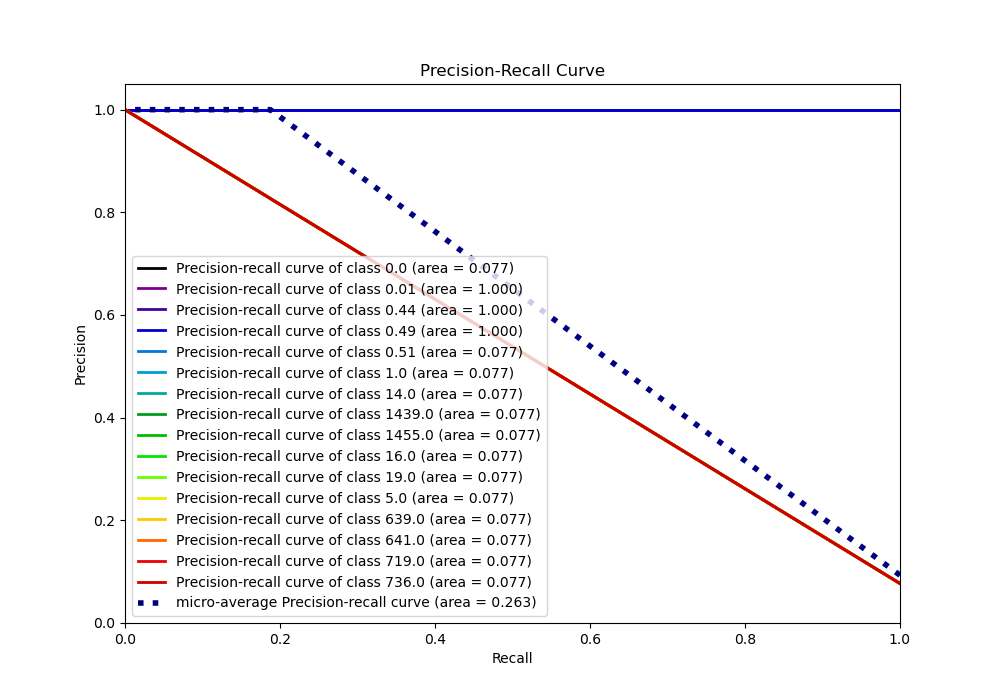

## SHAP Importance
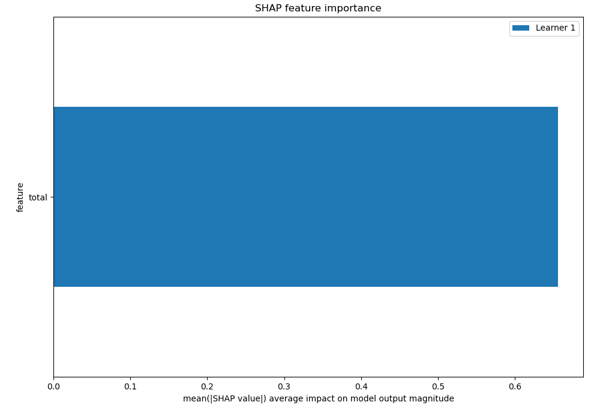

## SHAP Dependence plots

### Dependence 0.0 (Fold 1)

### Dependence 0.01 (Fold 1)
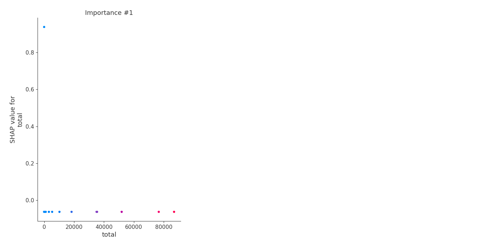
### Dependence 0.44 (Fold 1)

### Dependence 0.49 (Fold 1)

### Dependence 0.51 (Fold 1)

### Dependence 1.0 (Fold 1)

### Dependence 14.0 (Fold 1)

### Dependence 1439.0 (Fold 1)

### Dependence 1455.0 (Fold 1)

### Dependence 16.0 (Fold 1)

### Dependence 19.0 (Fold 1)

### Dependence 5.0 (Fold 1)
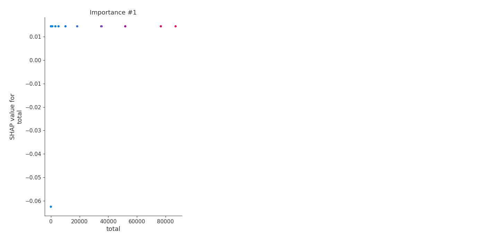
### Dependence 639.0 (Fold 1)

### Dependence 641.0 (Fold 1)

### Dependence 719.0 (Fold 1)

### Dependence 736.0 (Fold 1)

## SHAP Decision plots

### Worst decisions for selected sample 1 (Fold 1)
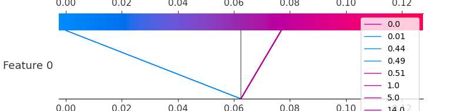
### Worst decisions for selected sample 2 (Fold 1)

### Worst decisions for selected sample 3 (Fold 1)

### Worst decisions for selected sample 4 (Fold 1)

### Best decisions for selected sample 1 (Fold 1)

### Best decisions for selected sample 2 (Fold 1)
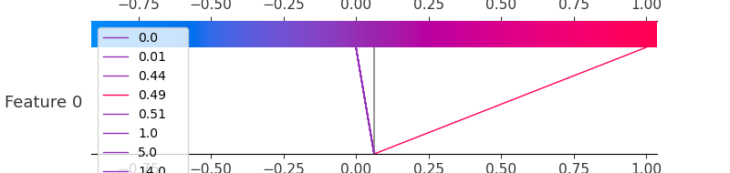
### Best decisions for selected sample 3 (Fold 1)

### Best decisions for selected sample 4 (Fold 1)

[<< Go back](../README.md)
