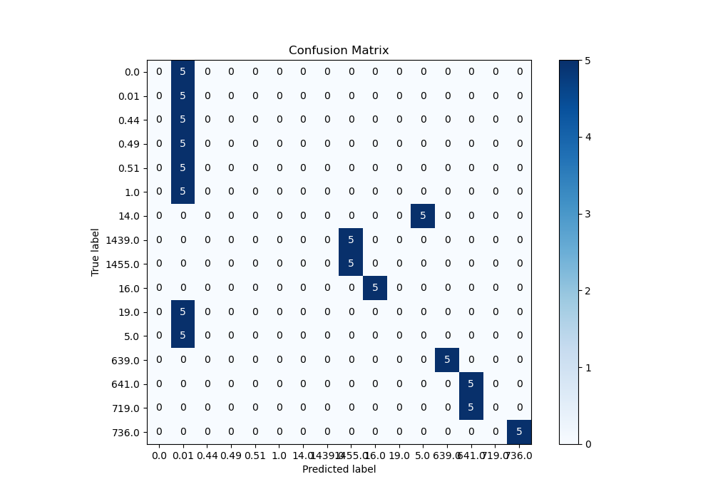
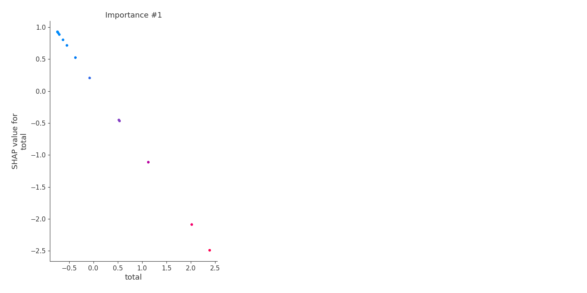

# Summary of 3_Linear

[<< Go back](../README.md)

## Logistic Regression (Linear)
- **n_jobs**: -1
- **num_class**: 16
- **explain_level**: 2

## Validation
 - **validation_type**: split
 - **train_ratio**: 0.75
 - **shuffle**: True
 - **stratify**: True

## Optimized metric
logloss

## Training time

3.0 seconds

### Metric details
|           |   0.0 |     0.01 |   0.44 |   0.49 |   0.51 |   1.0 |   5.0 |   14.0 |   16.0 |   19.0 |   639.0 |    641.0 |   719.0 |   736.0 |   1439.0 |   1455.0 |   accuracy |   macro avg |   weighted avg |   logloss |
|:----------|------:|---------:|-------:|-------:|-------:|------:|------:|-------:|-------:|-------:|--------:|---------:|--------:|--------:|---------:|---------:|-----------:|------------:|---------------:|----------:|
| precision |     0 | 0.125    |      0 |      0 |      0 |     0 |     0 |      0 |      1 |      0 |       1 | 0.5      |       0 |       1 |        0 | 0.5      |      0.375 |    0.257812 |       0.257812 |   2.00885 |
| recall    |     0 | 1        |      0 |      0 |      0 |     0 |     0 |      0 |      1 |      0 |       1 | 1        |       0 |       1 |        0 | 1        |      0.375 |    0.375    |       0.375    |   2.00885 |
| f1-score  |     0 | 0.222222 |      0 |      0 |      0 |     0 |     0 |      0 |      1 |      0 |       1 | 0.666667 |       0 |       1 |        0 | 0.666667 |      0.375 |    0.284722 |       0.284722 |   2.00885 |
| support   |     5 | 5        |      5 |      5 |      5 |     5 |     5 |      5 |      5 |      5 |       5 | 5        |       5 |       5 |        5 | 5        |      0.375 |   80        |      80        |   2.00885 |

## Confusion matrix
|                   |   Predicted as 0.0 |   Predicted as 0.01 |   Predicted as 0.44 |   Predicted as 0.49 |   Predicted as 0.51 |   Predicted as 1.0 |   Predicted as 5.0 |   Predicted as 14.0 |   Predicted as 16.0 |   Predicted as 19.0 |   Predicted as 639.0 |   Predicted as 641.0 |   Predicted as 719.0 |   Predicted as 736.0 |   Predicted as 1439.0 |   Predicted as 1455.0 |
|:------------------|-------------------:|--------------------:|--------------------:|--------------------:|--------------------:|-------------------:|-------------------:|--------------------:|--------------------:|--------------------:|---------------------:|---------------------:|---------------------:|---------------------:|----------------------:|----------------------:|
| Labeled as 0.0    |                  0 |                   5 |                   0 |                   0 |                   0 |                  0 |                  0 |                   0 |                   0 |                   0 |                    0 |                    0 |                    0 |                    0 |                     0 |                     0 |
| Labeled as 0.01   |                  0 |                   5 |                   0 |                   0 |                   0 |                  0 |                  0 |                   0 |                   0 |                   0 |                    0 |                    0 |                    0 |                    0 |                     0 |                     0 |
| Labeled as 0.44   |                  0 |                   5 |                   0 |                   0 |                   0 |                  0 |                  0 |                   0 |                   0 |                   0 |                    0 |                    0 |                    0 |                    0 |                     0 |                     0 |
| Labeled as 0.49   |                  0 |                   5 |                   0 |                   0 |                   0 |                  0 |                  0 |                   0 |                   0 |                   0 |                    0 |                    0 |                    0 |                    0 |                     0 |                     0 |
| Labeled as 0.51   |                  0 |                   5 |                   0 |                   0 |                   0 |                  0 |                  0 |                   0 |                   0 |                   0 |                    0 |                    0 |                    0 |                    0 |                     0 |                     0 |
| Labeled as 1.0    |                  0 |                   5 |                   0 |                   0 |                   0 |                  0 |                  0 |                   0 |                   0 |                   0 |                    0 |                    0 |                    0 |                    0 |                     0 |                     0 |
| Labeled as 5.0    |                  0 |                   5 |                   0 |                   0 |                   0 |                  0 |                  0 |                   0 |                   0 |                   0 |                    0 |                    0 |                    0 |                    0 |                     0 |                     0 |
| Labeled as 14.0   |                  0 |                   0 |                   0 |                   0 |                   0 |                  0 |                  5 |                   0 |                   0 |                   0 |                    0 |                    0 |                    0 |                    0 |                     0 |                     0 |
| Labeled as 16.0   |                  0 |                   0 |                   0 |                   0 |                   0 |                  0 |                  0 |                   0 |                   5 |                   0 |                    0 |                    0 |                    0 |                    0 |                     0 |                     0 |
| Labeled as 19.0   |                  0 |                   5 |                   0 |                   0 |                   0 |                  0 |                  0 |                   0 |                   0 |                   0 |                    0 |                    0 |                    0 |                    0 |                     0 |                     0 |
| Labeled as 639.0  |                  0 |                   0 |                   0 |                   0 |                   0 |                  0 |                  0 |                   0 |                   0 |                   0 |                    5 |                    0 |                    0 |                    0 |                     0 |                     0 |
| Labeled as 641.0  |                  0 |                   0 |                   0 |                   0 |                   0 |                  0 |                  0 |                   0 |                   0 |                   0 |                    0 |                    5 |                    0 |                    0 |                     0 |                     0 |
| Labeled as 719.0  |                  0 |                   0 |                   0 |                   0 |                   0 |                  0 |                  0 |                   0 |                   0 |                   0 |                    0 |                    5 |                    0 |                    0 |                     0 |                     0 |
| Labeled as 736.0  |                  0 |                   0 |                   0 |                   0 |                   0 |                  0 |                  0 |                   0 |                   0 |                   0 |                    0 |                    0 |                    0 |                    5 |                     0 |                     0 |
| Labeled as 1439.0 |                  0 |                   0 |                   0 |                   0 |                   0 |                  0 |                  0 |                   0 |                   0 |                   0 |                    0 |                    0 |                    0 |                    0 |                     0 |                     5 |
| Labeled as 1455.0 |                  0 |                   0 |                   0 |                   0 |                   0 |                  0 |                  0 |                   0 |                   0 |                   0 |                    0 |                    0 |                    0 |                    0 |                     0 |                     5 |

## Learning curves

## Coefficients

### Coefficients learner #1
|           |       0.0 |      0.01 |       0.44 |       0.49 |       0.51 |        1.0 |       5.0 |      14.0 |      16.0 |       19.0 |    639.0 |    641.0 |    719.0 |   736.0 |   1439.0 |   1455.0 |
|:----------|----------:|----------:|-----------:|-----------:|-----------:|-----------:|----------:|----------:|----------:|-----------:|---------:|---------:|---------:|--------:|---------:|---------:|
| intercept |  0.382868 | -0.097713 | -0.0976642 | -0.0976651 | -0.0976322 | -0.0951958 |  0.335445 |  0.540521 |  0.81812  |  0.0669911 | 0.999076 | 0.856634 | 0.865288 | 0.31566 | -1.44736 | -3.24737 |
| total     | -1.0952   | -1.93315  | -1.93307   | -1.93307   | -1.93302   | -1.929     | -1.18345  | -0.787248 | -0.141147 | -1.65753   | 0.591199 | 1.63114  | 1.61053  | 2.41432 |  3.67671 |  4.60199 |

## Permutation-based Importance

## Confusion Matrix

## Normalized Confusion Matrix

## ROC Curve

## Precision Recall Curve

## SHAP Importance

## SHAP Dependence plots

### Dependence 0.0 (Fold 1)

### Dependence 0.01 (Fold 1)

### Dependence 0.44 (Fold 1)

### Dependence 0.49 (Fold 1)

### Dependence 0.51 (Fold 1)

### Dependence 1.0 (Fold 1)

### Dependence 14.0 (Fold 1)

### Dependence 1439.0 (Fold 1)

### Dependence 1455.0 (Fold 1)

### Dependence 16.0 (Fold 1)

### Dependence 19.0 (Fold 1)

### Dependence 5.0 (Fold 1)

### Dependence 639.0 (Fold 1)

### Dependence 641.0 (Fold 1)

### Dependence 719.0 (Fold 1)

### Dependence 736.0 (Fold 1)

## SHAP Decision plots

### Worst decisions for selected sample 1 (Fold 1)

### Worst decisions for selected sample 2 (Fold 1)

### Worst decisions for selected sample 3 (Fold 1)

### Worst decisions for selected sample 4 (Fold 1)

### Best decisions for selected sample 1 (Fold 1)

### Best decisions for selected sample 2 (Fold 1)

### Best decisions for selected sample 3 (Fold 1)

### Best decisions for selected sample 4 (Fold 1)

[<< Go back](../README.md)
