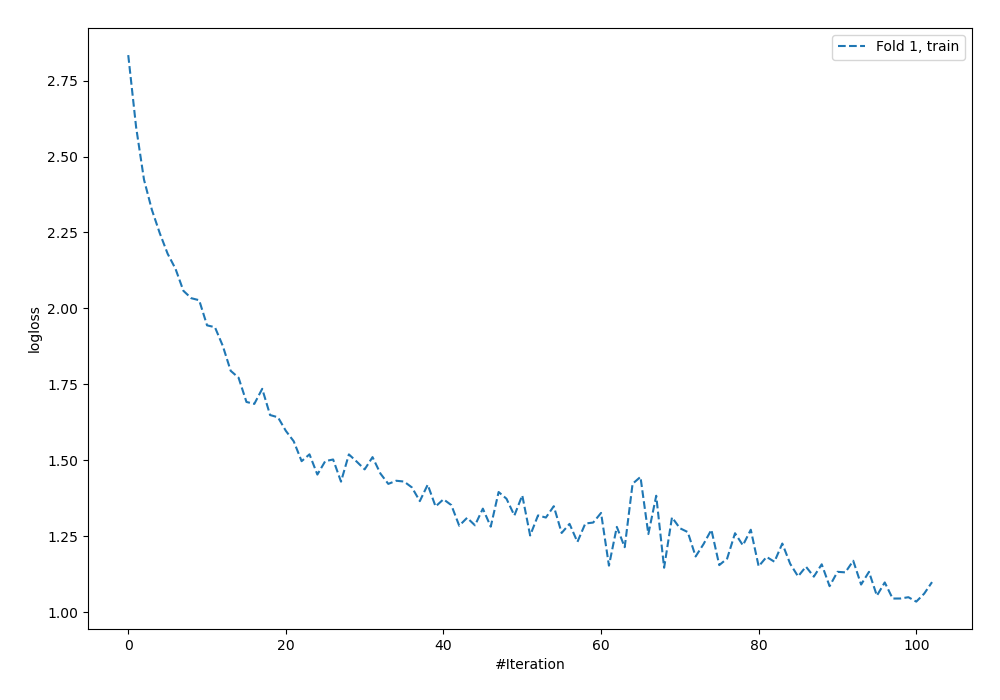
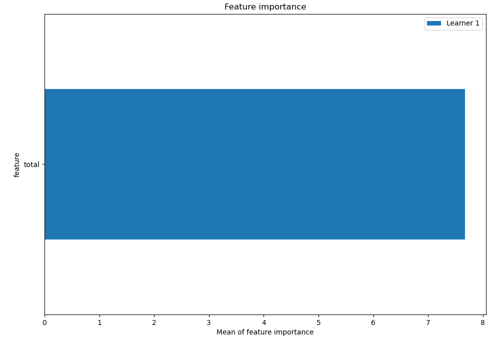
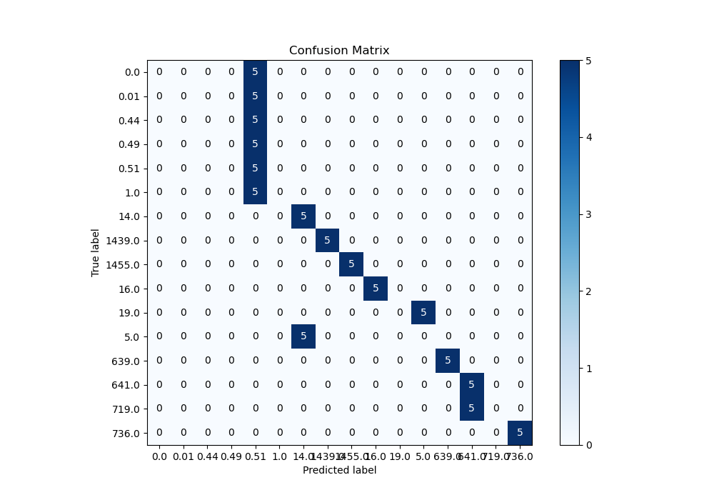
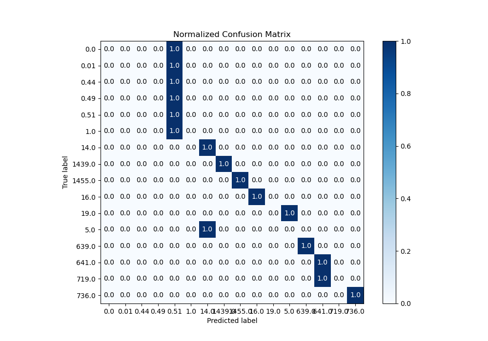
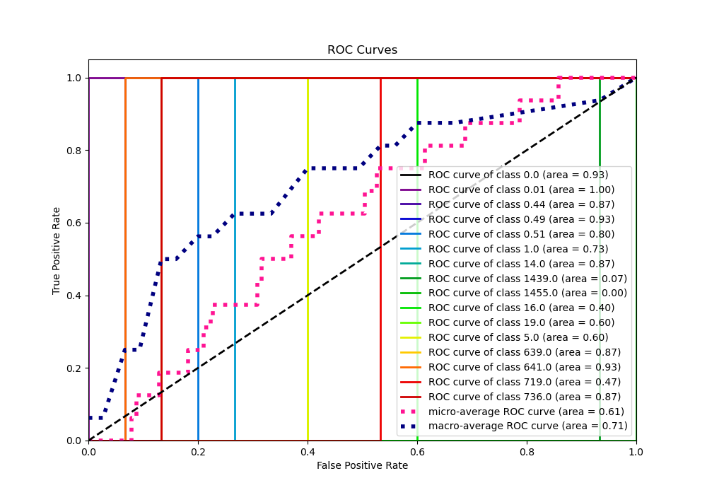
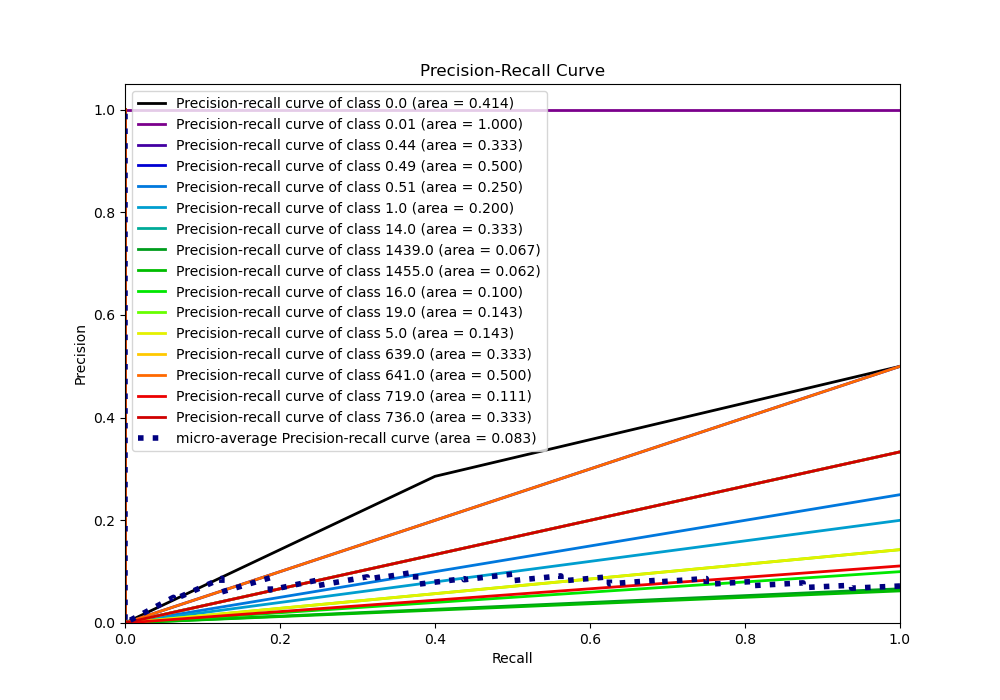

# Summary of 5_Default_NeuralNetwork

[<< Go back](../README.md)

## Neural Network
- **n_jobs**: -1
- **dense_1_size**: 32
- **dense_2_size**: 16
- **learning_rate**: 0.05
- **num_class**: 16
- **explain_level**: 2

## Validation
 - **validation_type**: split
 - **train_ratio**: 0.75
 - **shuffle**: True
 - **stratify**: True

## Optimized metric
logloss

## Training time

0.7 seconds

### Metric details
|           |   0.0 |   0.01 |   0.44 |   0.49 |     0.51 |   1.0 |   5.0 |     14.0 |   16.0 |   19.0 |   639.0 |    641.0 |   719.0 |   736.0 |   1439.0 |   1455.0 |   accuracy |   macro avg |   weighted avg |   logloss |
|:----------|------:|-------:|-------:|-------:|---------:|------:|------:|---------:|-------:|-------:|--------:|---------:|--------:|--------:|---------:|---------:|-----------:|------------:|---------------:|----------:|
| precision |     0 |      0 |      0 |      0 | 0.166667 |     0 |     0 | 0.5      |      1 |      0 |       1 | 0.5      |       0 |       1 |        1 |        1 |        0.5 |    0.385417 |       0.385417 |    1.2679 |
| recall    |     0 |      0 |      0 |      0 | 1        |     0 |     0 | 1        |      1 |      0 |       1 | 1        |       0 |       1 |        1 |        1 |        0.5 |    0.5      |       0.5      |    1.2679 |
| f1-score  |     0 |      0 |      0 |      0 | 0.285714 |     0 |     0 | 0.666667 |      1 |      0 |       1 | 0.666667 |       0 |       1 |        1 |        1 |        0.5 |    0.41369  |       0.41369  |    1.2679 |
| support   |     5 |      5 |      5 |      5 | 5        |     5 |     5 | 5        |      5 |      5 |       5 | 5        |       5 |       5 |        5 |        5 |        0.5 |   80        |      80        |    1.2679 |

## Confusion matrix
|                   |   Predicted as 0.0 |   Predicted as 0.01 |   Predicted as 0.44 |   Predicted as 0.49 |   Predicted as 0.51 |   Predicted as 1.0 |   Predicted as 5.0 |   Predicted as 14.0 |   Predicted as 16.0 |   Predicted as 19.0 |   Predicted as 639.0 |   Predicted as 641.0 |   Predicted as 719.0 |   Predicted as 736.0 |   Predicted as 1439.0 |   Predicted as 1455.0 |
|:------------------|-------------------:|--------------------:|--------------------:|--------------------:|--------------------:|-------------------:|-------------------:|--------------------:|--------------------:|--------------------:|---------------------:|---------------------:|---------------------:|---------------------:|----------------------:|----------------------:|
| Labeled as 0.0    |                  0 |                   0 |                   0 |                   0 |                   5 |                  0 |                  0 |                   0 |                   0 |                   0 |                    0 |                    0 |                    0 |                    0 |                     0 |                     0 |
| Labeled as 0.01   |                  0 |                   0 |                   0 |                   0 |                   5 |                  0 |                  0 |                   0 |                   0 |                   0 |                    0 |                    0 |                    0 |                    0 |                     0 |                     0 |
| Labeled as 0.44   |                  0 |                   0 |                   0 |                   0 |                   5 |                  0 |                  0 |                   0 |                   0 |                   0 |                    0 |                    0 |                    0 |                    0 |                     0 |                     0 |
| Labeled as 0.49   |                  0 |                   0 |                   0 |                   0 |                   5 |                  0 |                  0 |                   0 |                   0 |                   0 |                    0 |                    0 |                    0 |                    0 |                     0 |                     0 |
| Labeled as 0.51   |                  0 |                   0 |                   0 |                   0 |                   5 |                  0 |                  0 |                   0 |                   0 |                   0 |                    0 |                    0 |                    0 |                    0 |                     0 |                     0 |
| Labeled as 1.0    |                  0 |                   0 |                   0 |                   0 |                   5 |                  0 |                  0 |                   0 |                   0 |                   0 |                    0 |                    0 |                    0 |                    0 |                     0 |                     0 |
| Labeled as 5.0    |                  0 |                   0 |                   0 |                   0 |                   0 |                  0 |                  0 |                   5 |                   0 |                   0 |                    0 |                    0 |                    0 |                    0 |                     0 |                     0 |
| Labeled as 14.0   |                  0 |                   0 |                   0 |                   0 |                   0 |                  0 |                  0 |                   5 |                   0 |                   0 |                    0 |                    0 |                    0 |                    0 |                     0 |                     0 |
| Labeled as 16.0   |                  0 |                   0 |                   0 |                   0 |                   0 |                  0 |                  0 |                   0 |                   5 |                   0 |                    0 |                    0 |                    0 |                    0 |                     0 |                     0 |
| Labeled as 19.0   |                  0 |                   0 |                   0 |                   0 |                   0 |                  0 |                  5 |                   0 |                   0 |                   0 |                    0 |                    0 |                    0 |                    0 |                     0 |                     0 |
| Labeled as 639.0  |                  0 |                   0 |                   0 |                   0 |                   0 |                  0 |                  0 |                   0 |                   0 |                   0 |                    5 |                    0 |                    0 |                    0 |                     0 |                     0 |
| Labeled as 641.0  |                  0 |                   0 |                   0 |                   0 |                   0 |                  0 |                  0 |                   0 |                   0 |                   0 |                    0 |                    5 |                    0 |                    0 |                     0 |                     0 |
| Labeled as 719.0  |                  0 |                   0 |                   0 |                   0 |                   0 |                  0 |                  0 |                   0 |                   0 |                   0 |                    0 |                    5 |                    0 |                    0 |                     0 |                     0 |
| Labeled as 736.0  |                  0 |                   0 |                   0 |                   0 |                   0 |                  0 |                  0 |                   0 |                   0 |                   0 |                    0 |                    0 |                    0 |                    5 |                     0 |                     0 |
| Labeled as 1439.0 |                  0 |                   0 |                   0 |                   0 |                   0 |                  0 |                  0 |                   0 |                   0 |                   0 |                    0 |                    0 |                    0 |                    0 |                     5 |                     0 |
| Labeled as 1455.0 |                  0 |                   0 |                   0 |                   0 |                   0 |                  0 |                  0 |                   0 |                   0 |                   0 |                    0 |                    0 |                    0 |                    0 |                     0 |                     5 |

## Learning curves

## Permutation-based Importance

## Confusion Matrix

## Normalized Confusion Matrix

## ROC Curve

## Precision Recall Curve

[<< Go back](../README.md)
