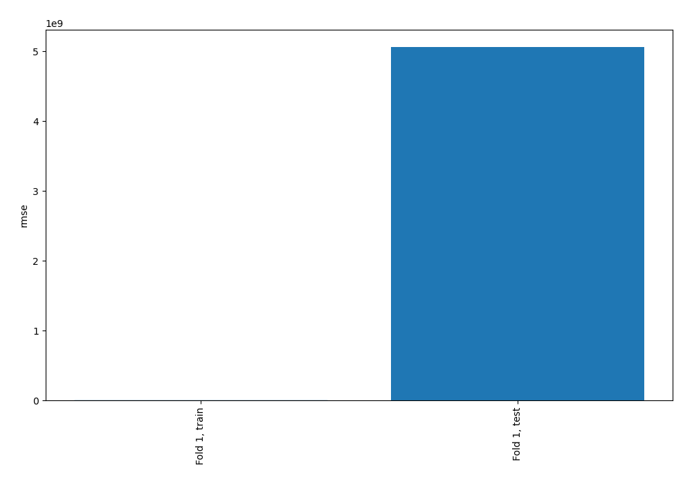
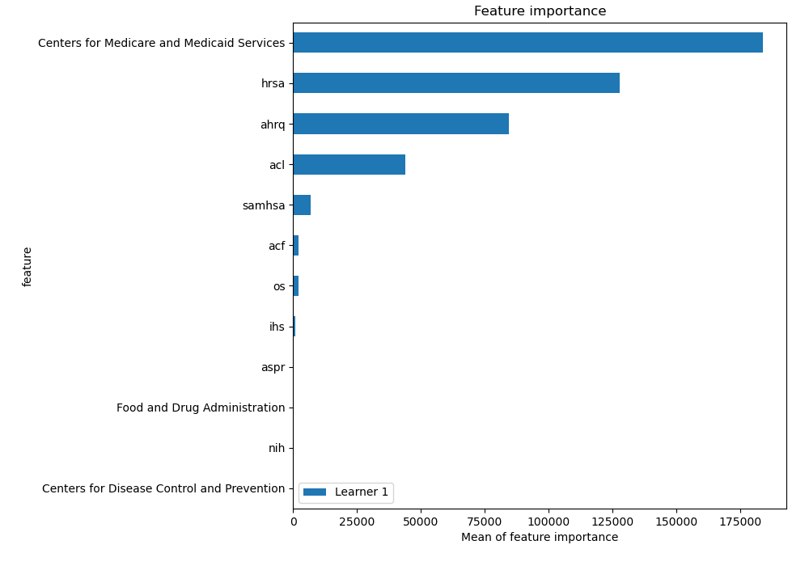
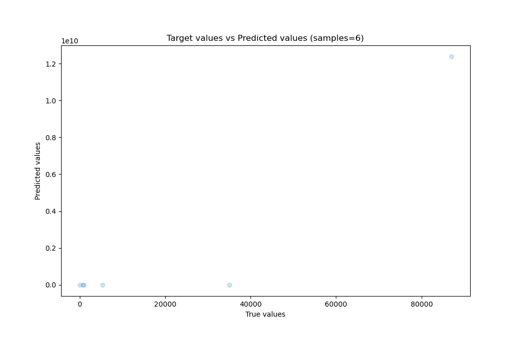
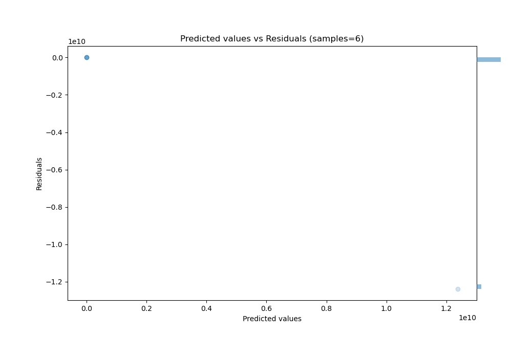

# Summary of 3_Linear

[<< Go back](../README.md)

## Linear Regression (Linear)
- **n_jobs**: -1
- **explain_level**: 2

## Validation
 - **validation_type**: split
 - **train_ratio**: 0.75
 - **shuffle**: True

## Optimized metric
rmse

## Training time

0.3 seconds

### Metric details:
| Metric   |           Score |
|:---------|----------------:|
| MAE      |     2.06354e+09 |
| MSE      |     2.5549e+19  |
| RMSE     |     5.0546e+09  |
| R2       |    -2.53744e+10 |
| MAPE     | 23731.1         |

## Learning curves

## Coefficients
| feature                                    |      Learner_1 |
|:-------------------------------------------|---------------:|
| hrsa                                       |  174.215       |
| ahrq                                       |  141.052       |
| acf                                        |   23.4376      |
| os                                         |   20.893       |
| nih                                        |    6.05995     |
| Centers for Disease Control and Prevention |    5.35574     |
| intercept                                  |    1.62303e-15 |
| aspr                                       |   -5.73612     |
| Food and Drug Administration               |   -6.59759     |
| ihs                                        |  -12.9389      |
| samhsa                                     |  -39.4476      |
| acl                                        | -100.725       |
| Centers for Medicare and Medicaid Services | -207.655       |

## Permutation-based Importance

## True vs Predicted

## Predicted vs Residuals

[<< Go back](../README.md)
