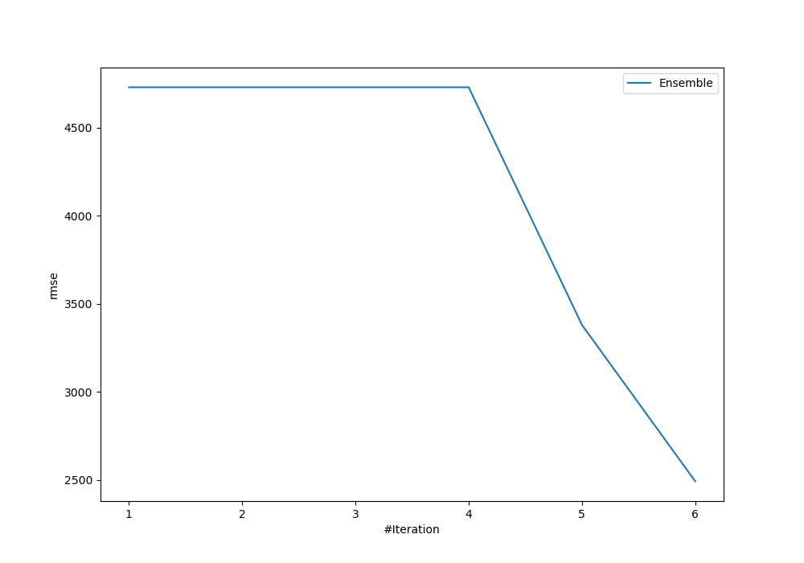
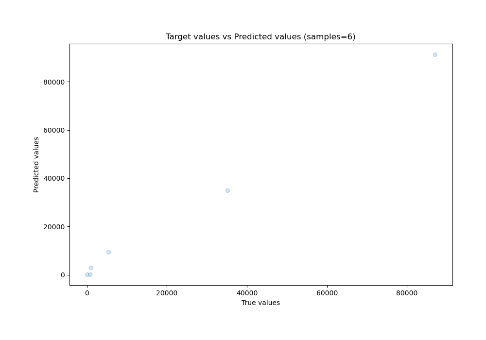
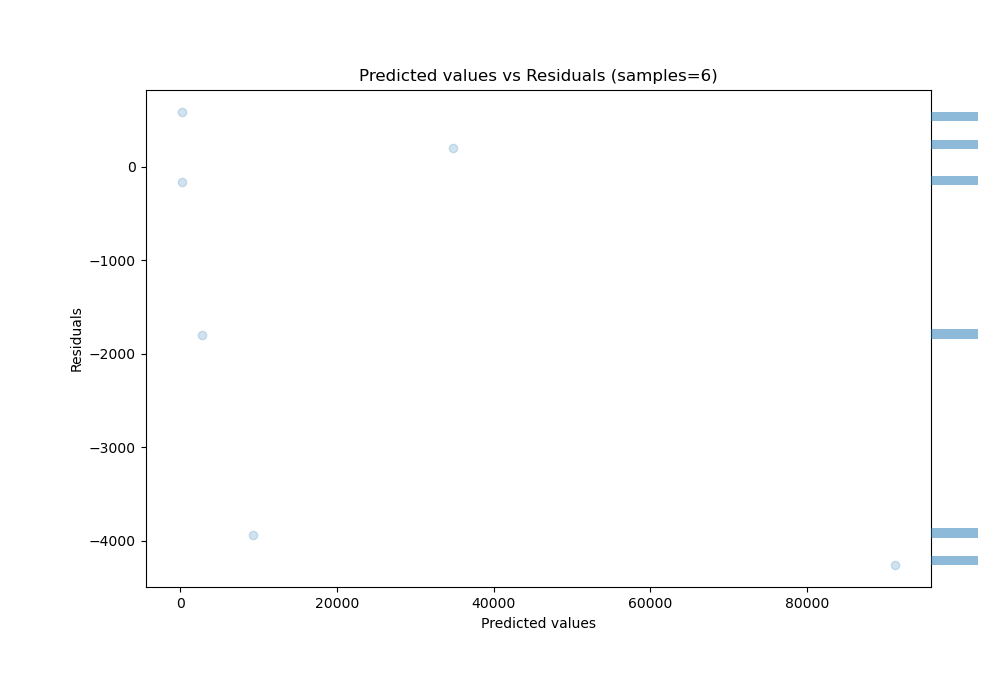

# Summary of Ensemble

[<< Go back](../README.md)

## Ensemble structure
| Model                   |   Weight |
|:------------------------|---------:|
| 2_DecisionTree          |        5 |
| 5_Default_NeuralNetwork |        1 |

### Metric details:
| Metric   |          Score |
|:---------|---------------:|
| MAE      | 1822.9         |
| MSE      |    6.21076e+06 |
| RMSE     | 2492.14        |
| R2       |    0.993832    |
| MAPE     |    2.30359     |

## Learning curves

## True vs Predicted

## Predicted vs Residuals

[<< Go back](../README.md)
