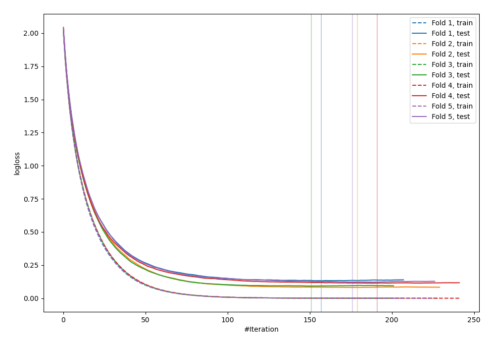
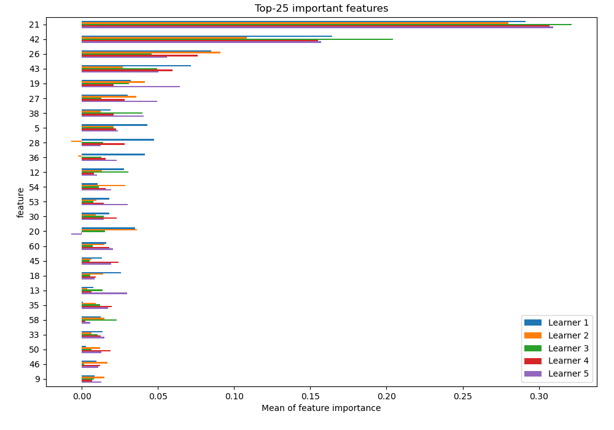
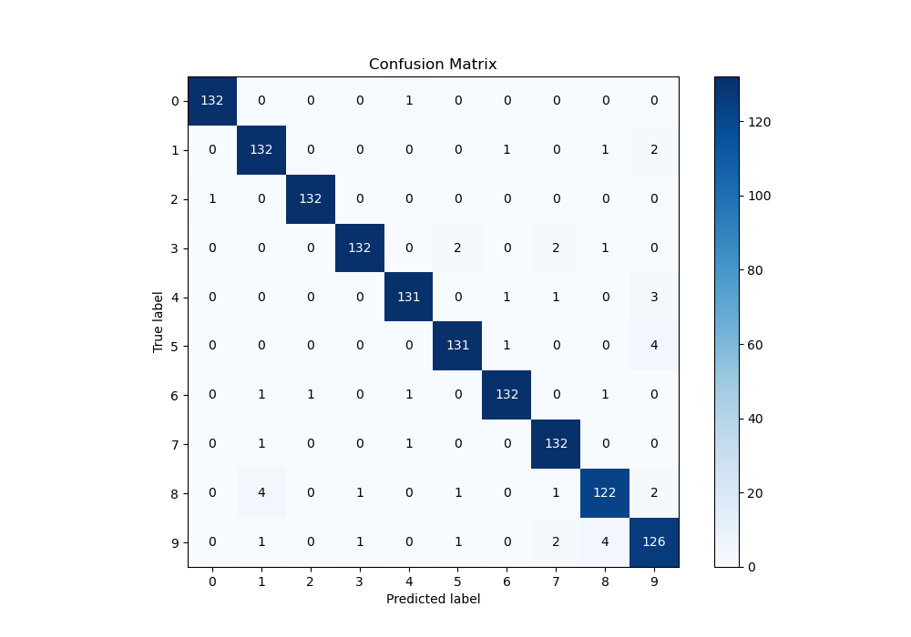
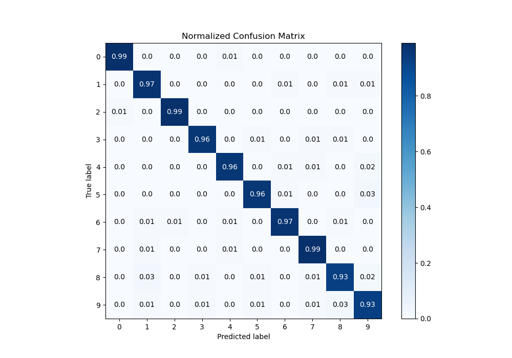
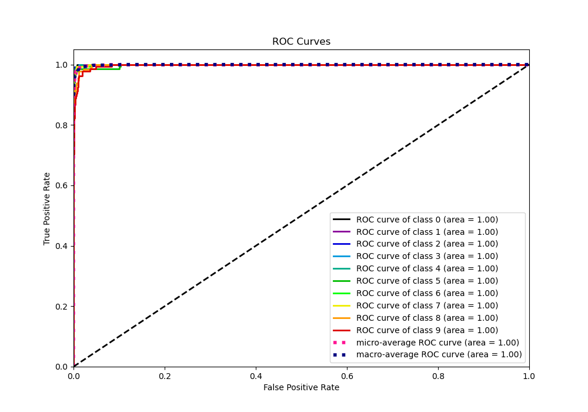
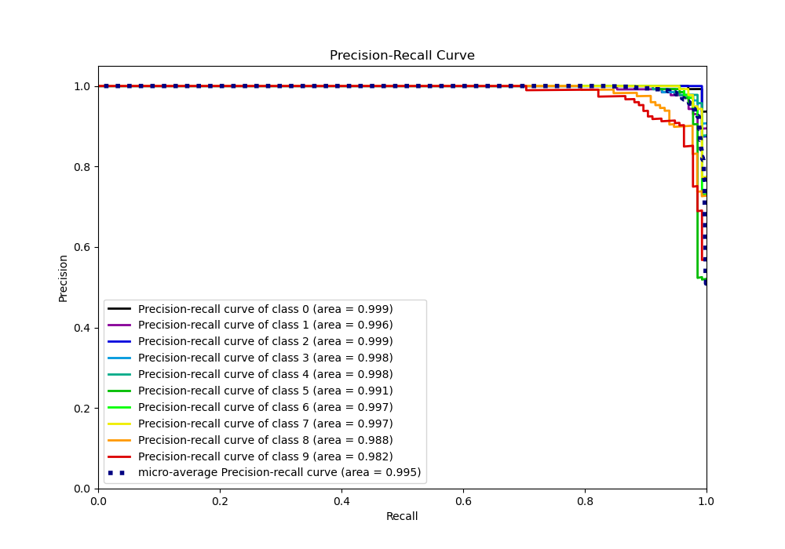

# Summary of 10_LightGBM

[<< Go back](../README.md)

## LightGBM
- **n_jobs**: -1
- **objective**: multiclass
- **num_leaves**: 15
- **learning_rate**: 0.05
- **feature_fraction**: 0.8
- **bagging_fraction**: 0.5
- **min_data_in_leaf**: 50
- **metric**: multi_logloss
- **custom_eval_metric_name**: None
- **num_class**: 10
- **explain_level**: 1

## Validation
 - **validation_type**: kfold
 - **k_folds**: 5
 - **shuffle**: True
 - **stratify**: True

## Optimized metric
logloss

## Training time

25.7 seconds

### Metric details
|           |          0 |          1 |          2 |          3 |          4 |          5 |          6 |          7 |          8 |          9 |   accuracy |   macro avg |   weighted avg |   logloss |
|:----------|-----------:|-----------:|-----------:|-----------:|-----------:|-----------:|-----------:|-----------:|-----------:|-----------:|-----------:|------------:|---------------:|----------:|
| precision |   0.992481 |   0.94964  |   0.992481 |   0.985075 |   0.977612 |   0.97037  |   0.977778 |   0.956522 |   0.945736 |   0.919708 |   0.966592 |    0.96674  |       0.966767 |  0.108165 |
| recall    |   0.992481 |   0.970588 |   0.992481 |   0.963504 |   0.963235 |   0.963235 |   0.970588 |   0.985075 |   0.931298 |   0.933333 |   0.966592 |    0.966582 |       0.966592 |  0.108165 |
| f1-score  |   0.992481 |   0.96     |   0.992481 |   0.97417  |   0.97037  |   0.96679  |   0.97417  |   0.970588 |   0.938462 |   0.926471 |   0.966592 |    0.966598 |       0.966617 |  0.108165 |
| support   | 133        | 136        | 133        | 137        | 136        | 136        | 136        | 134        | 131        | 135        |   0.966592 | 1347        |    1347        |  0.108165 |

## Confusion matrix
|              |   Predicted as 0 |   Predicted as 1 |   Predicted as 2 |   Predicted as 3 |   Predicted as 4 |   Predicted as 5 |   Predicted as 6 |   Predicted as 7 |   Predicted as 8 |   Predicted as 9 |
|:-------------|-----------------:|-----------------:|-----------------:|-----------------:|-----------------:|-----------------:|-----------------:|-----------------:|-----------------:|-----------------:|
| Labeled as 0 |              132 |                0 |                0 |                0 |                1 |                0 |                0 |                0 |                0 |                0 |
| Labeled as 1 |                0 |              132 |                0 |                0 |                0 |                0 |                1 |                0 |                1 |                2 |
| Labeled as 2 |                1 |                0 |              132 |                0 |                0 |                0 |                0 |                0 |                0 |                0 |
| Labeled as 3 |                0 |                0 |                0 |              132 |                0 |                2 |                0 |                2 |                1 |                0 |
| Labeled as 4 |                0 |                0 |                0 |                0 |              131 |                0 |                1 |                1 |                0 |                3 |
| Labeled as 5 |                0 |                0 |                0 |                0 |                0 |              131 |                1 |                0 |                0 |                4 |
| Labeled as 6 |                0 |                1 |                1 |                0 |                1 |                0 |              132 |                0 |                1 |                0 |
| Labeled as 7 |                0 |                1 |                0 |                0 |                1 |                0 |                0 |              132 |                0 |                0 |
| Labeled as 8 |                0 |                4 |                0 |                1 |                0 |                1 |                0 |                1 |              122 |                2 |
| Labeled as 9 |                0 |                1 |                0 |                1 |                0 |                1 |                0 |                2 |                4 |              126 |

## Learning curves

## Permutation-based Importance

## Confusion Matrix

## Normalized Confusion Matrix

## ROC Curve

## Precision Recall Curve

[<< Go back](../README.md)
