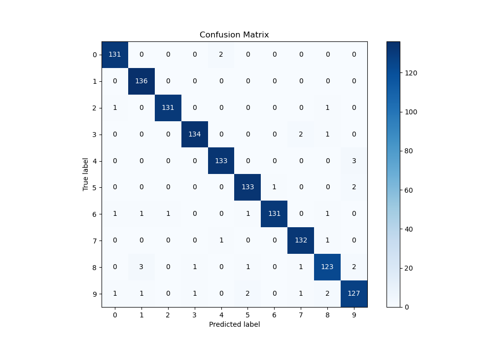
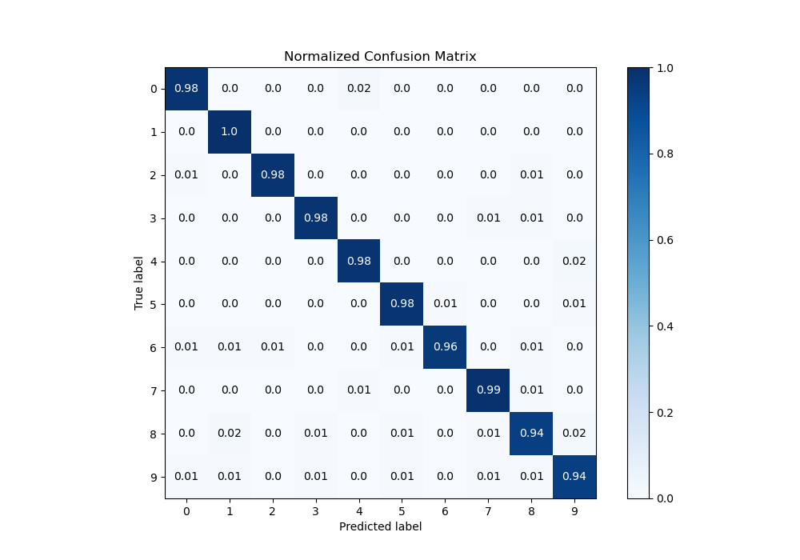

# Summary of 11_LightGBM

[<< Go back](../README.md)

## LightGBM
- **n_jobs**: -1
- **objective**: multiclass
- **num_leaves**: 63
- **learning_rate**: 0.2
- **feature_fraction**: 0.5
- **bagging_fraction**: 1.0
- **min_data_in_leaf**: 10
- **metric**: multi_logloss
- **custom_eval_metric_name**: None
- **num_class**: 10
- **explain_level**: 1

## Validation
 - **validation_type**: kfold
 - **k_folds**: 5
 - **shuffle**: True
 - **stratify**: True

## Optimized metric
logloss

## Training time

15.6 seconds

### Metric details
|           |          0 |          1 |          2 |          3 |          4 |          5 |          6 |          7 |          8 |          9 |   accuracy |   macro avg |   weighted avg |   logloss |
|:----------|-----------:|-----------:|-----------:|-----------:|-----------:|-----------:|-----------:|-----------:|-----------:|-----------:|-----------:|------------:|---------------:|----------:|
| precision |   0.977612 |   0.964539 |   0.992424 |   0.985294 |   0.977941 |   0.970803 |   0.992424 |   0.970588 |   0.953488 |   0.947761 |   0.973274 |    0.973288 |       0.973341 | 0.0942313 |
| recall    |   0.984962 |   1        |   0.984962 |   0.978102 |   0.977941 |   0.977941 |   0.963235 |   0.985075 |   0.938931 |   0.940741 |   0.973274 |    0.973189 |       0.973274 | 0.0942313 |
| f1-score  |   0.981273 |   0.981949 |   0.988679 |   0.981685 |   0.977941 |   0.974359 |   0.977612 |   0.977778 |   0.946154 |   0.944238 |   0.973274 |    0.973167 |       0.973235 | 0.0942313 |
| support   | 133        | 136        | 133        | 137        | 136        | 136        | 136        | 134        | 131        | 135        |   0.973274 | 1347        |    1347        | 0.0942313 |

## Confusion matrix
|              |   Predicted as 0 |   Predicted as 1 |   Predicted as 2 |   Predicted as 3 |   Predicted as 4 |   Predicted as 5 |   Predicted as 6 |   Predicted as 7 |   Predicted as 8 |   Predicted as 9 |
|:-------------|-----------------:|-----------------:|-----------------:|-----------------:|-----------------:|-----------------:|-----------------:|-----------------:|-----------------:|-----------------:|
| Labeled as 0 |              131 |                0 |                0 |                0 |                2 |                0 |                0 |                0 |                0 |                0 |
| Labeled as 1 |                0 |              136 |                0 |                0 |                0 |                0 |                0 |                0 |                0 |                0 |
| Labeled as 2 |                1 |                0 |              131 |                0 |                0 |                0 |                0 |                0 |                1 |                0 |
| Labeled as 3 |                0 |                0 |                0 |              134 |                0 |                0 |                0 |                2 |                1 |                0 |
| Labeled as 4 |                0 |                0 |                0 |                0 |              133 |                0 |                0 |                0 |                0 |                3 |
| Labeled as 5 |                0 |                0 |                0 |                0 |                0 |              133 |                1 |                0 |                0 |                2 |
| Labeled as 6 |                1 |                1 |                1 |                0 |                0 |                1 |              131 |                0 |                1 |                0 |
| Labeled as 7 |                0 |                0 |                0 |                0 |                1 |                0 |                0 |              132 |                1 |                0 |
| Labeled as 8 |                0 |                3 |                0 |                1 |                0 |                1 |                0 |                1 |              123 |                2 |
| Labeled as 9 |                1 |                1 |                0 |                1 |                0 |                2 |                0 |                1 |                2 |              127 |

## Learning curves

## Permutation-based Importance

## Confusion Matrix

## Normalized Confusion Matrix

## ROC Curve

## Precision Recall Curve

[<< Go back](../README.md)
