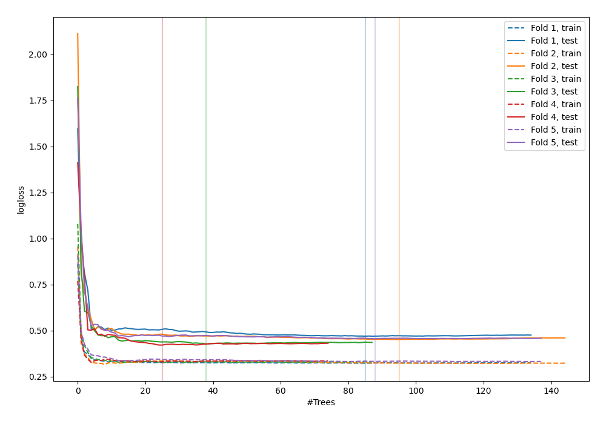
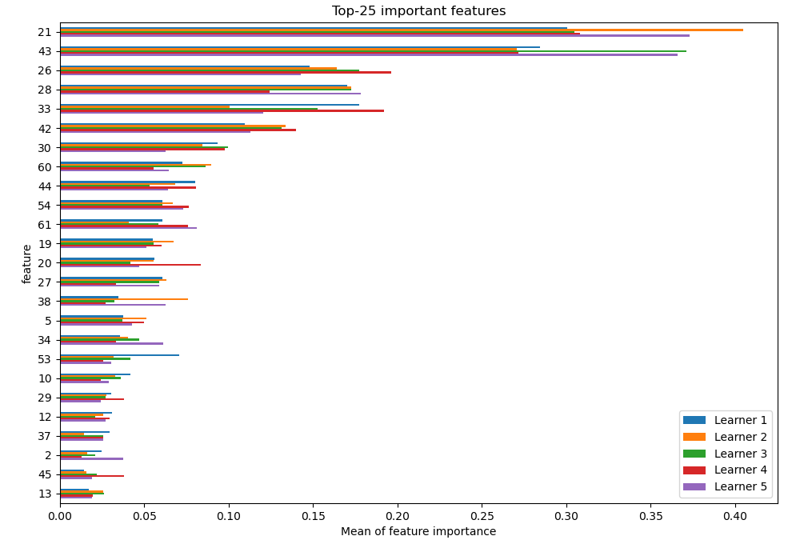
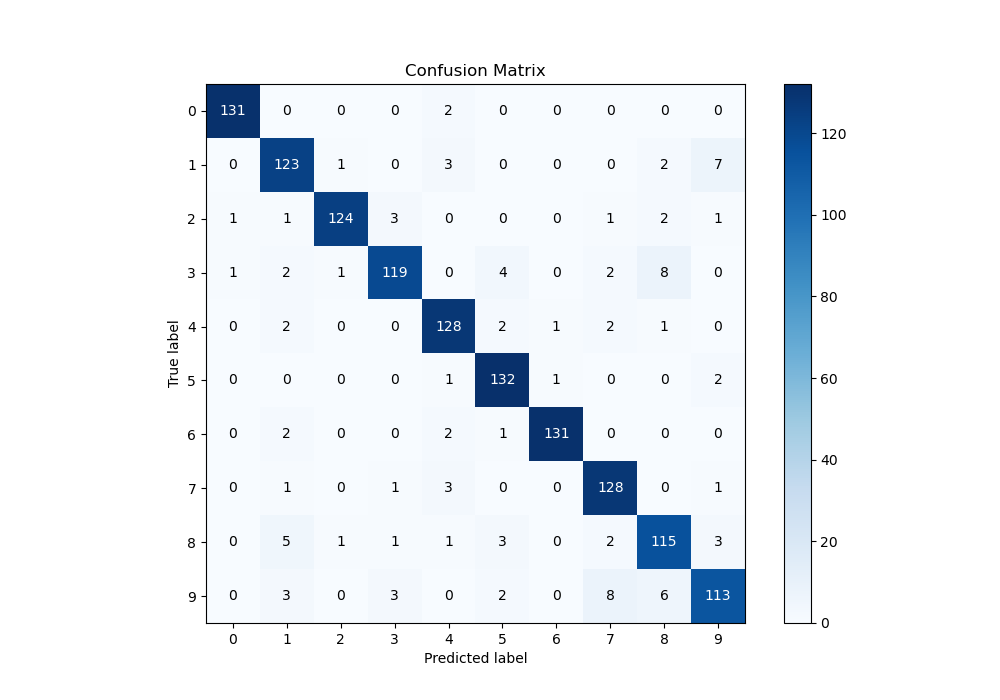
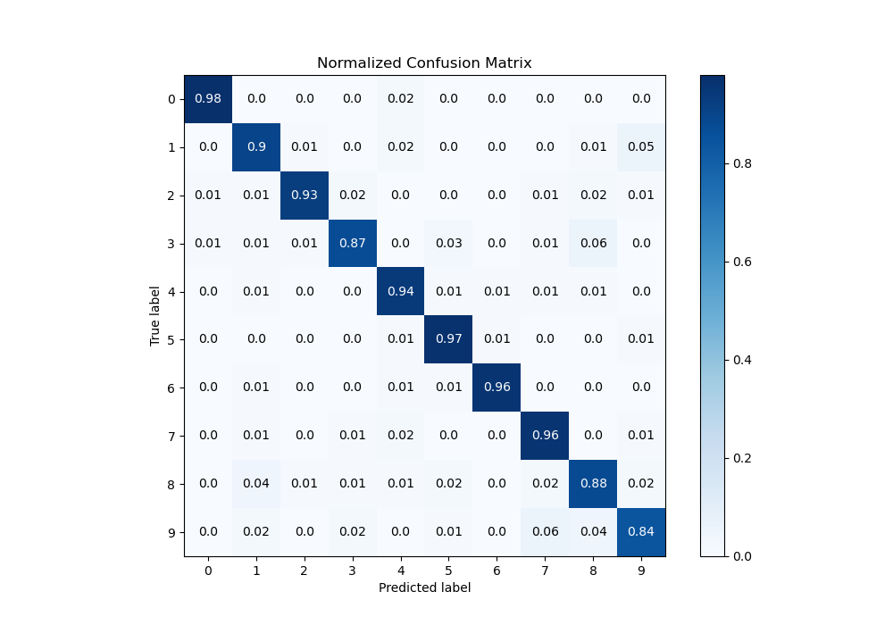
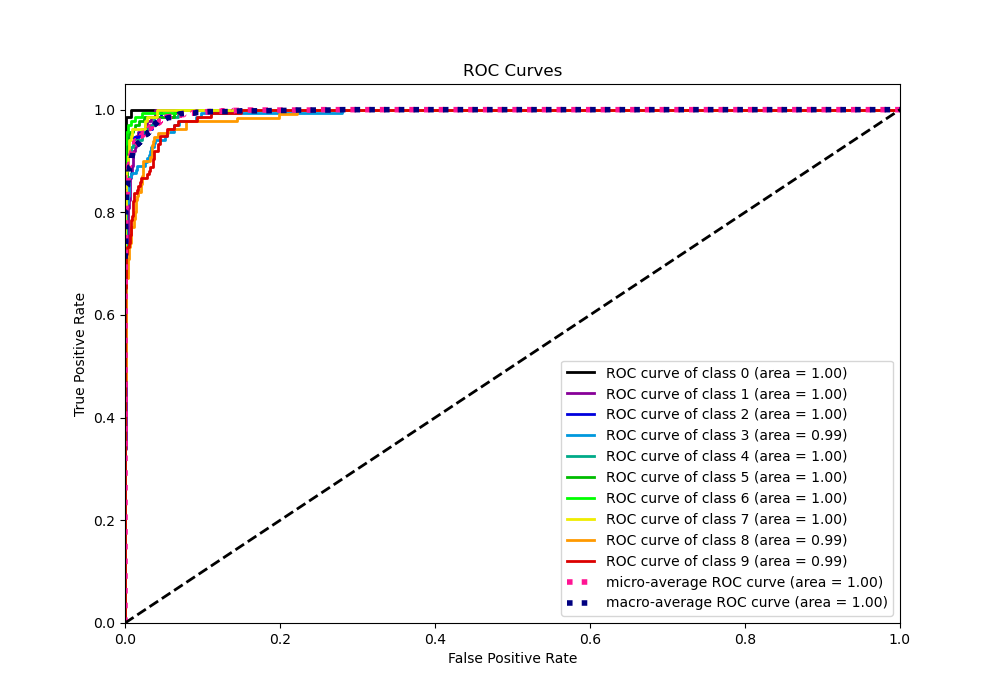
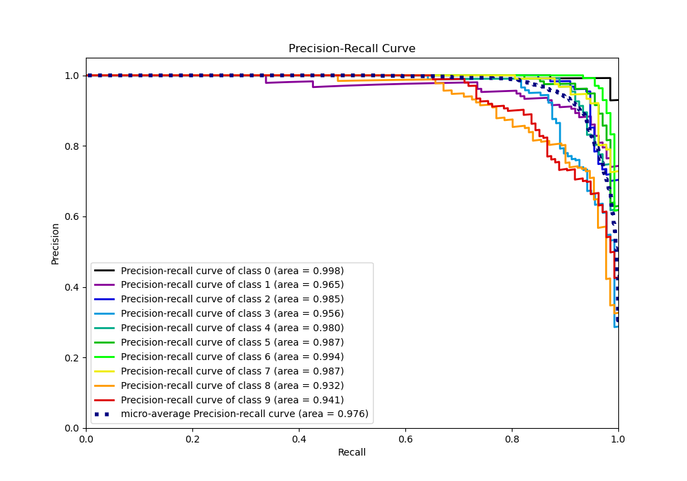

# Summary of 15_RandomForest_SelectedFeatures

[<< Go back](../README.md)

## Random Forest
- **n_jobs**: -1
- **criterion**: gini
- **max_features**: 0.7
- **min_samples_split**: 30
- **max_depth**: 7
- **eval_metric_name**: logloss
- **num_class**: 10
- **explain_level**: 1

## Validation
 - **validation_type**: kfold
 - **k_folds**: 5
 - **shuffle**: True
 - **stratify**: True

## Optimized metric
logloss

## Training time

14.3 seconds

### Metric details
|           |          0 |          1 |          2 |          3 |          4 |          5 |          6 |          7 |          8 |          9 |   accuracy |   macro avg |   weighted avg |   logloss |
|:----------|-----------:|-----------:|-----------:|-----------:|-----------:|-----------:|-----------:|-----------:|-----------:|-----------:|-----------:|------------:|---------------:|----------:|
| precision |   0.984962 |   0.884892 |   0.976378 |   0.937008 |   0.914286 |   0.916667 |   0.984962 |   0.895105 |   0.858209 |   0.889764 |   0.923534 |    0.924223 |       0.924295 |   0.44574 |
| recall    |   0.984962 |   0.904412 |   0.932331 |   0.868613 |   0.941176 |   0.970588 |   0.963235 |   0.955224 |   0.877863 |   0.837037 |   0.923534 |    0.923544 |       0.923534 |   0.44574 |
| f1-score  |   0.984962 |   0.894545 |   0.953846 |   0.901515 |   0.927536 |   0.942857 |   0.973978 |   0.924188 |   0.867925 |   0.862595 |   0.923534 |    0.923395 |       0.923423 |   0.44574 |
| support   | 133        | 136        | 133        | 137        | 136        | 136        | 136        | 134        | 131        | 135        |   0.923534 | 1347        |    1347        |   0.44574 |

## Confusion matrix
|              |   Predicted as 0 |   Predicted as 1 |   Predicted as 2 |   Predicted as 3 |   Predicted as 4 |   Predicted as 5 |   Predicted as 6 |   Predicted as 7 |   Predicted as 8 |   Predicted as 9 |
|:-------------|-----------------:|-----------------:|-----------------:|-----------------:|-----------------:|-----------------:|-----------------:|-----------------:|-----------------:|-----------------:|
| Labeled as 0 |              131 |                0 |                0 |                0 |                2 |                0 |                0 |                0 |                0 |                0 |
| Labeled as 1 |                0 |              123 |                1 |                0 |                3 |                0 |                0 |                0 |                2 |                7 |
| Labeled as 2 |                1 |                1 |              124 |                3 |                0 |                0 |                0 |                1 |                2 |                1 |
| Labeled as 3 |                1 |                2 |                1 |              119 |                0 |                4 |                0 |                2 |                8 |                0 |
| Labeled as 4 |                0 |                2 |                0 |                0 |              128 |                2 |                1 |                2 |                1 |                0 |
| Labeled as 5 |                0 |                0 |                0 |                0 |                1 |              132 |                1 |                0 |                0 |                2 |
| Labeled as 6 |                0 |                2 |                0 |                0 |                2 |                1 |              131 |                0 |                0 |                0 |
| Labeled as 7 |                0 |                1 |                0 |                1 |                3 |                0 |                0 |              128 |                0 |                1 |
| Labeled as 8 |                0 |                5 |                1 |                1 |                1 |                3 |                0 |                2 |              115 |                3 |
| Labeled as 9 |                0 |                3 |                0 |                3 |                0 |                2 |                0 |                8 |                6 |              113 |

## Learning curves

## Permutation-based Importance

## Confusion Matrix

## Normalized Confusion Matrix

## ROC Curve

## Precision Recall Curve

[<< Go back](../README.md)
