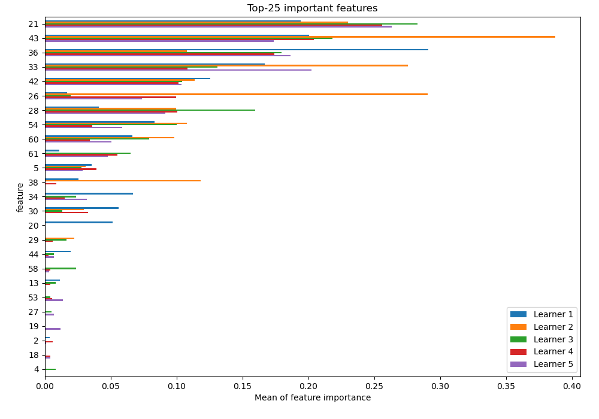

# Summary of 16_RandomForest

[<< Go back](../README.md)

## Random Forest
- **n_jobs**: -1
- **criterion**: gini
- **max_features**: 0.8
- **min_samples_split**: 40
- **max_depth**: 3
- **eval_metric_name**: logloss
- **num_class**: 10
- **explain_level**: 1

## Validation
 - **validation_type**: kfold
 - **k_folds**: 5
 - **shuffle**: True
 - **stratify**: True

## Optimized metric
logloss

## Training time

8.1 seconds

### Metric details
|           |          0 |           1 |          2 |          3 |          4 |          5 |          6 |          7 |          8 |          9 |   accuracy |   macro avg |   weighted avg |   logloss |
|:----------|-----------:|------------:|-----------:|-----------:|-----------:|-----------:|-----------:|-----------:|-----------:|-----------:|-----------:|------------:|---------------:|----------:|
| precision |   0.914894 |   1         |   0.569767 |   0.795775 |   0.703704 |   0.844444 |   0.831169 |   0.668712 |   0.472441 |   0.712329 |   0.723088 |    0.751323 |       0.752583 |   1.10438 |
| recall    |   0.969925 |   0.0367647 |   0.736842 |   0.824818 |   0.838235 |   0.838235 |   0.941176 |   0.813433 |   0.458015 |   0.77037  |   0.723088 |    0.722781 |       0.723088 |   1.10438 |
| f1-score  |   0.941606 |   0.070922  |   0.642623 |   0.810036 |   0.765101 |   0.841328 |   0.882759 |   0.734007 |   0.465116 |   0.740214 |   0.723088 |    0.689371 |       0.689731 |   1.10438 |
| support   | 133        | 136         | 133        | 137        | 136        | 136        | 136        | 134        | 131        | 135        |   0.723088 | 1347        |    1347        |   1.10438 |

## Confusion matrix
|              |   Predicted as 0 |   Predicted as 1 |   Predicted as 2 |   Predicted as 3 |   Predicted as 4 |   Predicted as 5 |   Predicted as 6 |   Predicted as 7 |   Predicted as 8 |   Predicted as 9 |
|:-------------|-----------------:|-----------------:|-----------------:|-----------------:|-----------------:|-----------------:|-----------------:|-----------------:|-----------------:|-----------------:|
| Labeled as 0 |              129 |                0 |                0 |                0 |                3 |                0 |                0 |                0 |                0 |                1 |
| Labeled as 1 |                0 |                5 |               22 |                9 |               20 |                5 |                6 |                9 |               47 |               13 |
| Labeled as 2 |                0 |                0 |               98 |                3 |                1 |                3 |               11 |                6 |                9 |                2 |
| Labeled as 3 |                0 |                0 |                8 |              113 |                0 |                5 |                0 |                3 |                3 |                5 |
| Labeled as 4 |                5 |                0 |                0 |                0 |              114 |                2 |                6 |                7 |                1 |                1 |
| Labeled as 5 |                4 |                0 |                0 |                0 |                1 |              114 |                3 |                2 |                0 |               12 |
| Labeled as 6 |                1 |                0 |                2 |                0 |                3 |                0 |              128 |                2 |                0 |                0 |
| Labeled as 7 |                0 |                0 |                1 |                0 |               18 |                4 |                0 |              109 |                0 |                2 |
| Labeled as 8 |                2 |                0 |               40 |                7 |                2 |                2 |                0 |               12 |               60 |                6 |
| Labeled as 9 |                0 |                0 |                1 |               10 |                0 |                0 |                0 |               13 |                7 |              104 |

## Learning curves

## Permutation-based Importance

## Confusion Matrix

## Normalized Confusion Matrix

## ROC Curve

## Precision Recall Curve

[<< Go back](../README.md)
