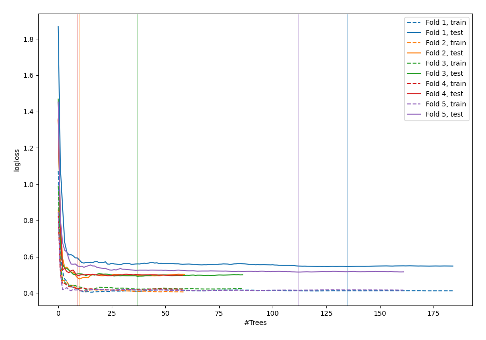
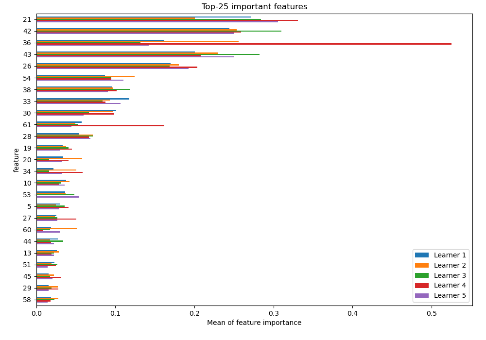
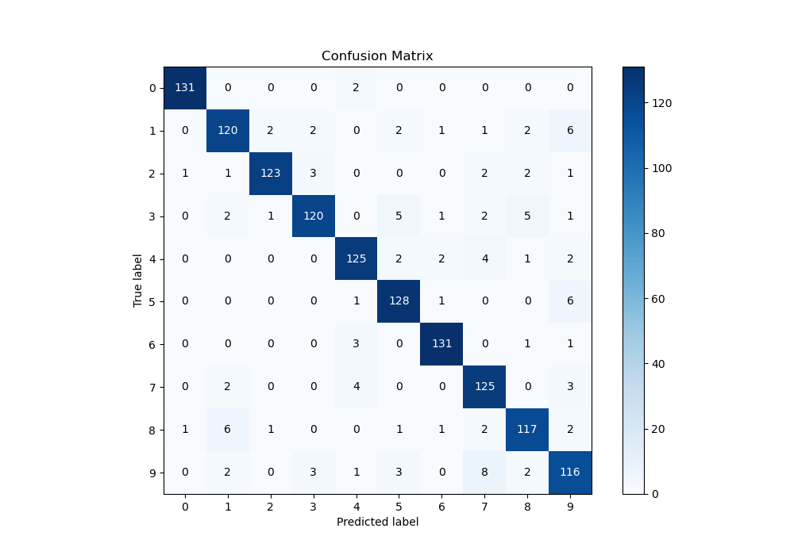
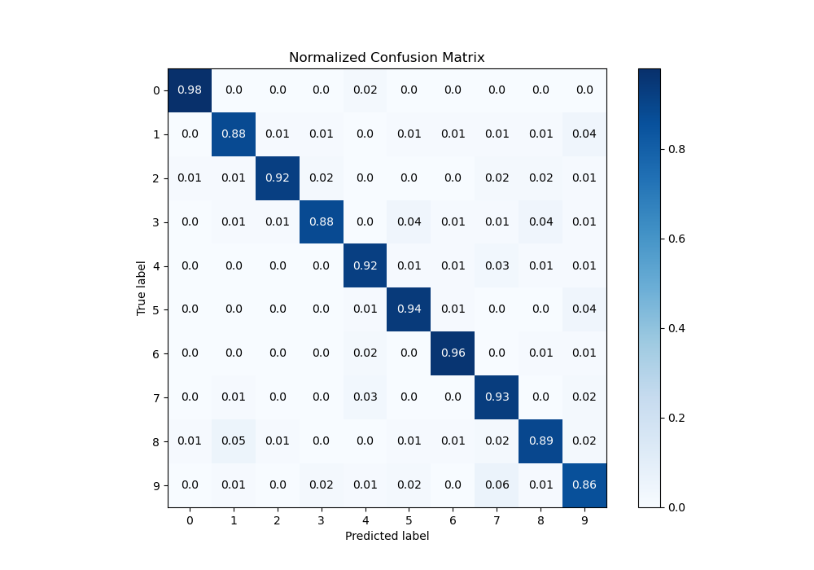
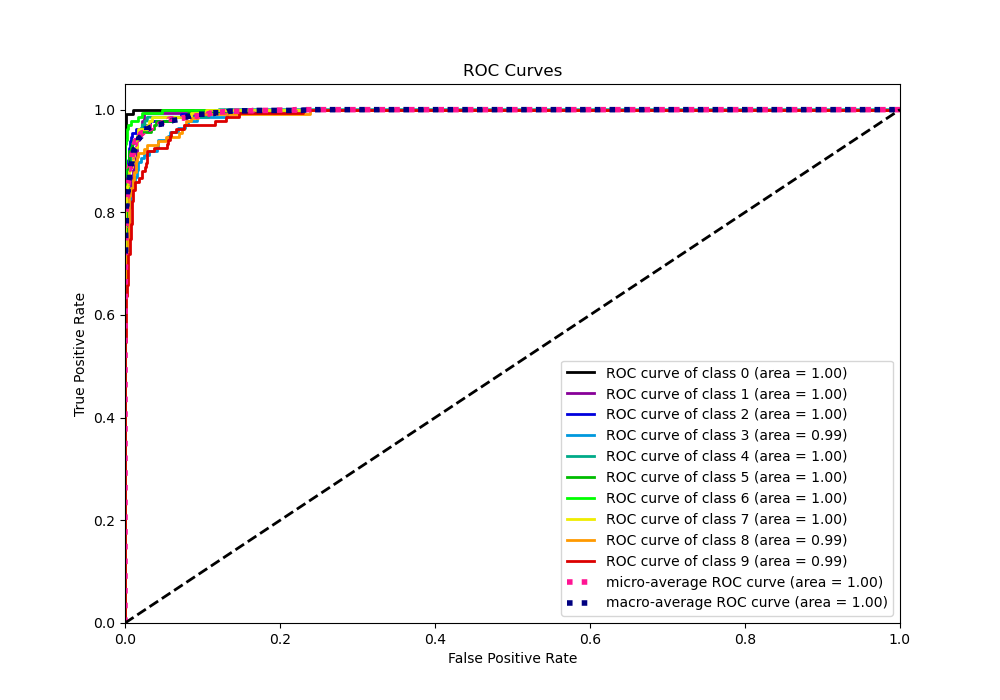
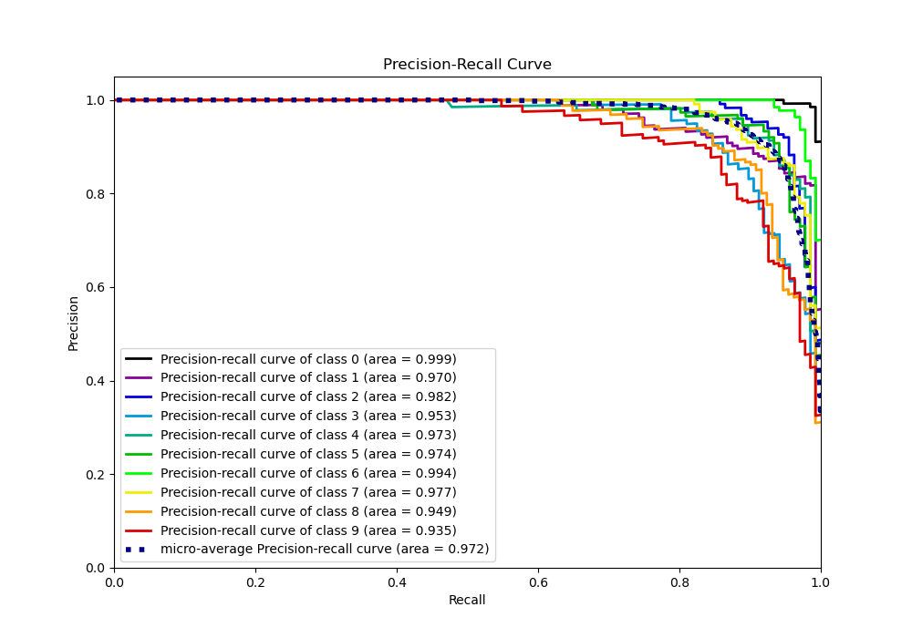

# Summary of 17_RandomForest

[<< Go back](../README.md)

## Random Forest
- **n_jobs**: -1
- **criterion**: entropy
- **max_features**: 0.6
- **min_samples_split**: 50
- **max_depth**: 6
- **eval_metric_name**: logloss
- **num_class**: 10
- **explain_level**: 1

## Validation
 - **validation_type**: kfold
 - **k_folds**: 5
 - **shuffle**: True
 - **stratify**: True

## Optimized metric
logloss

## Training time

12.5 seconds

### Metric details
|           |          0 |          1 |          2 |          3 |          4 |          5 |          6 |          7 |          8 |          9 |   accuracy |   macro avg |   weighted avg |   logloss |
|:----------|-----------:|-----------:|-----------:|-----------:|-----------:|-----------:|-----------:|-----------:|-----------:|-----------:|-----------:|------------:|---------------:|----------:|
| precision |   0.984962 |   0.902256 |   0.968504 |   0.9375   |   0.919118 |   0.907801 |   0.956204 |   0.868056 |   0.9      |   0.84058  |   0.917595 |    0.918498 |       0.918454 |  0.505358 |
| recall    |   0.984962 |   0.882353 |   0.924812 |   0.875912 |   0.919118 |   0.941176 |   0.963235 |   0.932836 |   0.89313  |   0.859259 |   0.917595 |    0.917679 |       0.917595 |  0.505358 |
| f1-score  |   0.984962 |   0.892193 |   0.946154 |   0.90566  |   0.919118 |   0.924188 |   0.959707 |   0.899281 |   0.896552 |   0.849817 |   0.917595 |    0.917763 |       0.917698 |  0.505358 |
| support   | 133        | 136        | 133        | 137        | 136        | 136        | 136        | 134        | 131        | 135        |   0.917595 | 1347        |    1347        |  0.505358 |

## Confusion matrix
|              |   Predicted as 0 |   Predicted as 1 |   Predicted as 2 |   Predicted as 3 |   Predicted as 4 |   Predicted as 5 |   Predicted as 6 |   Predicted as 7 |   Predicted as 8 |   Predicted as 9 |
|:-------------|-----------------:|-----------------:|-----------------:|-----------------:|-----------------:|-----------------:|-----------------:|-----------------:|-----------------:|-----------------:|
| Labeled as 0 |              131 |                0 |                0 |                0 |                2 |                0 |                0 |                0 |                0 |                0 |
| Labeled as 1 |                0 |              120 |                2 |                2 |                0 |                2 |                1 |                1 |                2 |                6 |
| Labeled as 2 |                1 |                1 |              123 |                3 |                0 |                0 |                0 |                2 |                2 |                1 |
| Labeled as 3 |                0 |                2 |                1 |              120 |                0 |                5 |                1 |                2 |                5 |                1 |
| Labeled as 4 |                0 |                0 |                0 |                0 |              125 |                2 |                2 |                4 |                1 |                2 |
| Labeled as 5 |                0 |                0 |                0 |                0 |                1 |              128 |                1 |                0 |                0 |                6 |
| Labeled as 6 |                0 |                0 |                0 |                0 |                3 |                0 |              131 |                0 |                1 |                1 |
| Labeled as 7 |                0 |                2 |                0 |                0 |                4 |                0 |                0 |              125 |                0 |                3 |
| Labeled as 8 |                1 |                6 |                1 |                0 |                0 |                1 |                1 |                2 |              117 |                2 |
| Labeled as 9 |                0 |                2 |                0 |                3 |                1 |                3 |                0 |                8 |                2 |              116 |

## Learning curves

## Permutation-based Importance

## Confusion Matrix

## Normalized Confusion Matrix

## ROC Curve

## Precision Recall Curve

[<< Go back](../README.md)
