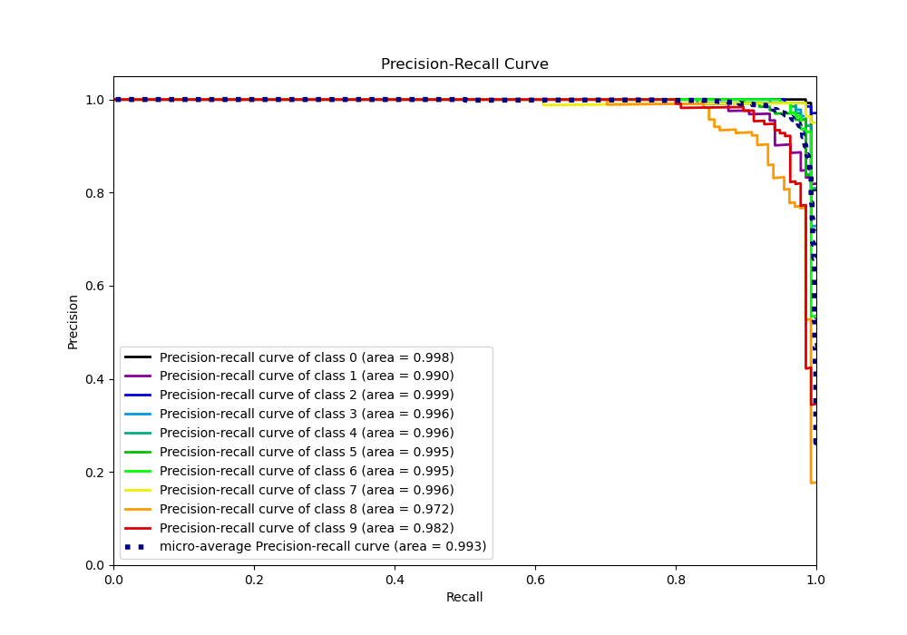

# Summary of 1_Linear_GoldenFeatures

[<< Go back](../README.md)

## Logistic Regression (Linear)
- **n_jobs**: -1
- **num_class**: 10
- **explain_level**: 1

## Validation
 - **validation_type**: kfold
 - **k_folds**: 5
 - **shuffle**: True
 - **stratify**: True

## Optimized metric
logloss

## Training time

5.4 seconds

### Metric details
|           |          0 |          1 |          2 |          3 |          4 |          5 |          6 |          7 |          8 |          9 |   accuracy |   macro avg |   weighted avg |   logloss |
|:----------|-----------:|-----------:|-----------:|-----------:|-----------:|-----------:|-----------:|-----------:|-----------:|-----------:|-----------:|------------:|---------------:|----------:|
| precision |   1        |   0.903448 |   0.984962 |   0.992537 |   0.984848 |   0.95     |   0.97037  |   0.977778 |   0.908397 |   0.954198 |   0.962138 |    0.962654 |       0.962729 |  0.124872 |
| recall    |   0.984962 |   0.963235 |   0.984962 |   0.970803 |   0.955882 |   0.977941 |   0.963235 |   0.985075 |   0.908397 |   0.925926 |   0.962138 |    0.962042 |       0.962138 |  0.124872 |
| f1-score  |   0.992424 |   0.932384 |   0.984962 |   0.98155  |   0.970149 |   0.963768 |   0.96679  |   0.981413 |   0.908397 |   0.93985  |   0.962138 |    0.962169 |       0.962253 |  0.124872 |
| support   | 133        | 136        | 133        | 137        | 136        | 136        | 136        | 134        | 131        | 135        |   0.962138 | 1347        |    1347        |  0.124872 |

## Confusion matrix
|              |   Predicted as 0 |   Predicted as 1 |   Predicted as 2 |   Predicted as 3 |   Predicted as 4 |   Predicted as 5 |   Predicted as 6 |   Predicted as 7 |   Predicted as 8 |   Predicted as 9 |
|:-------------|-----------------:|-----------------:|-----------------:|-----------------:|-----------------:|-----------------:|-----------------:|-----------------:|-----------------:|-----------------:|
| Labeled as 0 |              131 |                0 |                0 |                0 |                2 |                0 |                0 |                0 |                0 |                0 |
| Labeled as 1 |                0 |              131 |                0 |                0 |                0 |                0 |                1 |                0 |                3 |                1 |
| Labeled as 2 |                0 |                2 |              131 |                0 |                0 |                0 |                0 |                0 |                0 |                0 |
| Labeled as 3 |                0 |                0 |                1 |              133 |                0 |                3 |                0 |                0 |                0 |                0 |
| Labeled as 4 |                0 |                1 |                0 |                0 |              130 |                0 |                1 |                1 |                2 |                1 |
| Labeled as 5 |                0 |                0 |                0 |                0 |                0 |              133 |                1 |                0 |                0 |                2 |
| Labeled as 6 |                0 |                3 |                0 |                0 |                0 |                1 |              131 |                0 |                1 |                0 |
| Labeled as 7 |                0 |                0 |                0 |                0 |                0 |                0 |                0 |              132 |                1 |                1 |
| Labeled as 8 |                0 |                6 |                1 |                0 |                0 |                2 |                1 |                1 |              119 |                1 |
| Labeled as 9 |                0 |                2 |                0 |                1 |                0 |                1 |                0 |                1 |                5 |              125 |

## Learning curves

## Coefficients

### Coefficients learner #1
|                |            0 |            1 |            2 |            3 |            4 |            5 |            6 |            7 |            8 |            9 |
|:---------------|-------------:|-------------:|-------------:|-------------:|-------------:|-------------:|-------------:|-------------:|-------------:|-------------:|
| intercept      | -0.514798    | -0.786408    | -0.397157    |  0.1297      | -0.169263    | -0.236198    | -0.564857    |  0.149082    |  2.08026     |  0.309638    |
| 1              | -0.0385632   | -0.000531801 | -0.017237    |  0.200641    | -0.18861     |  0.186977    | -0.0131236   |  0.210998    | -0.103178    | -0.237373    |
| 2              | -0.0780471   |  0.0675437   |  0.116439    | -0.169295    | -0.142152    |  0.526069    | -0.337686    |  0.161569    | -0.058881    | -0.0855602   |
| 3              |  0.0867673   |  0.198264    |  0.102515    |  0.209243    | -0.943018    |  0.0456242   | -0.221632    |  0.328594    | -0.448972    |  0.642614    |
| 4              | -0.0227413   | -1.00646     |  0.0807475   |  0.791311    | -0.528495    |  0.0631779   |  0.0572777   |  0.128788    |  0.0541393   |  0.382258    |
| 5              | -0.262062    |  1.01156     | -0.0695342   |  0.0208496   | -0.982532    |  0.528753    | -0.114835    |  0.0423141   | -0.107763    | -0.0667491   |
| 6              | -0.142621    | -0.0833306   | -0.115034    |  0.0546931   | -0.461732    |  0.672271    | -0.182999    |  0.368832    | -0.544488    |  0.434409    |
| 7              | -0.0673306   | -0.0576695   | -0.0381702   | -0.052668    |  0.276561    | -0.162596    | -0.000236596 |  0.152784    | -0.0126457   | -0.0380281   |
| 8              | -0.00177422  | -0.00279524  | -0.145531    | -0.0696393   | -0.00287554  |  0.0204574   | -0.00415108  | -6.22835e-05 |  0.216325    | -0.00995421  |
| 9              | -0.122351    | -0.799473    |  0.459151    |  0.243844    | -0.14499     | -0.110435    | -0.258584    |  0.113736    |  0.171987    |  0.447115    |
| 10             |  0.0683868   | -1.00319     |  0.174409    |  0.234724    | -0.2471      |  0.472481    | -0.295993    |  0.12198     |  0.192283    |  0.282021    |
| 11             |  0.299442    | -0.372089    | -0.187578    |  0.105528    | -0.569004    |  0.267126    | -0.0716592   |  0.100725    |  0.171977    |  0.255534    |
| 12             |  0.0443583   |  0.862014    |  0.615258    |  0.257027    | -0.635377    | -0.382765    | -0.486905    |  0.588929    | -0.626042    | -0.236499    |
| 13             |  0.213126    |  0.153027    | -0.080809    |  0.339298    | -0.526262    | -0.112862    | -0.417641    |  0.068079    |  0.430029    | -0.0659852   |
| 14             | -0.150306    | -0.354413    | -0.190622    |  0.444794    | -0.326285    |  0.151528    | -0.204998    |  0.0579484   |  0.182057    |  0.390296    |
| 15             | -0.0607235   | -0.0944628   | -0.00515916  |  0.0896422   |  0.0661439   | -0.131466    | -0.00140961  |  0.187858    | -0.0161882   | -0.0342343   |
| 16             | -0.0412525   |  0.421351    | -0.0601509   | -0.0451804   | -0.12912     | -0.0682082   | -0.0068287   | -8.09823e-05 | -0.0443214   | -0.0262079   |
| 17             |  0.0894524   |  0.325992    | -0.0762587   |  0.0348221   |  0.171331    | -0.0206955   | -0.455435    | -0.477982    |  0.233427    |  0.175345    |
| 18             |  0.314393    | -0.144483    | -0.266179    | -0.834993    |  0.243022    |  0.508135    |  0.0943901   | -0.581115    |  0.296193    |  0.370636    |
| 19             | -0.0583059   |  1.60373     | -0.59077     | -1.02086     |  0.181994    | -0.181499    |  0.0208041   | -0.377737    |  0.0627179   |  0.359928    |
| 20             | -0.570773    |  0.768255    |  0.310248    |  0.372631    |  0.0730143   | -0.985897    | -0.62298     |  0.0523565   |  0.201561    |  0.401583    |
| 21             |  0.45596     | -0.364288    |  0.0492253   | -0.569709    | -0.032669    | -1.01437     | -0.868549    |  0.138194    |  0.712833    |  1.49337     |
| 22             |  0.113663    |  0.258483    |  0.0176819   | -0.0243557   |  0.0320808   | -0.680023    | -0.260183    |  0.422643    |  0.200262    | -0.0802515   |
| 23             | -0.0131765   | -0.0229496   | -1.84145e-05 | -0.00250973  |  0.196925    | -0.00721998  | -0.00126486  | -0.061667    | -0.00762328  | -0.0804961   |
| 24             | -0.0205977   |  0.086281    | -0.00272825  | -3.83906e-06 |  0.0611672   | -0.0333266   | -0.00246398  | -3.39767e-05 | -0.0765575   | -0.0117364   |
| 25             |  0.225666    |  0.252248    | -0.246959    | -0.223281    |  0.363216    |  0.36059     | -0.074934    | -0.490838    | -0.163001    | -0.00270728  |
| 26             |  0.297504    |  0.164404    | -0.932102    | -1.25398     |  0.595499    |  0.748837    |  0.120051    | -0.169263    | -0.161855    |  0.590906    |
| 27             | -0.477862    |  0.49332     | -1.13772     | -0.219111    | -0.122207    |  0.340378    | -0.0224231   | -0.503665    |  0.729642    |  0.919644    |
| 28             | -0.853745    |  0.306337    | -0.159269    |  0.516912    |  0.0504443   |  0.29547     | -0.258671    | -0.0151873   | -0.171988    |  0.289697    |
| 29             |  0.146243    |  0.208709    | -0.0695093   | -0.808421    |  0.050909    | -0.228244    | -0.260509    |  0.252134    | -0.0755159   |  0.784205    |
| 30             |  0.32088     | -0.173117    | -0.00959018  | -0.730233    |  0.629003    | -0.401335    | -0.472798    |  0.532363    | -0.0992999   |  0.404127    |
| 31             | -0.000195525 | -5.86283e-06 | -4.88018e-07 | -8.70575e-07 |  0.0234837   | -4.47184e-06 | -2.23328e-05 | -0.0219115   | -0.000139454 | -0.00120316  |
| 33             |  0.364921    | -0.19596     | -0.216153    | -0.209774    |  0.464961    | -0.0191161   |  0.337384    |  0.331621    | -0.24186     | -0.616023    |
| 34             |  0.291139    |  0.171838    | -0.739902    | -0.328467    |  0.305239    |  0.0180719   |  0.51632     |  0.000220957 |  0.033752    | -0.268211    |
| 35             | -0.500426    |  0.0411539   | -0.352251    | -0.11935     |  0.002624    | -0.343484    |  0.421729    |  0.105663    |  0.549897    |  0.194445    |
| 36             | -0.683783    |  0.186428    | -0.0809129   |  0.11978     |  0.507695    | -0.329292    |  0.089377    |  0.156856    |  0.36711     | -0.333259    |
| 37             |  0.0921757   |  0.143708    | -0.567856    | -0.136287    |  0.265256    |  0.222782    |  0.0175757   |  0.401395    | -0.521246    |  0.0824981   |
| 38             |  0.195456    | -0.607636    | -0.498177    | -0.0036502   |  0.576887    |  0.554859    |  0.144878    |  0.637666    | -0.922759    | -0.0775223   |
| 40             | -0.000556172 | -2.08788e-05 | -1.24091e-06 | -1.72697e-07 |  0.00245809  | -5.92311e-07 | -0.00184707  | -6.63651e-06 | -2.52069e-05 | -1.10931e-07 |
| 41             |  0.0440979   | -0.132844    |  0.0682934   | -0.0817576   |  0.820769    | -0.374558    | -0.111059    |  0.0567342   |  0.151087    | -0.440764    |
| 42             |  0.540381    | -0.0486571   |  0.326073    | -0.646573    | -0.157036    | -0.876561    |  0.862214    |  0.0185228   |  0.747498    | -0.765862    |
| 43             | -0.386843    |  0.703023    |  0.945761    | -1.04714     |  0.852744    | -0.61697     |  0.396715    |  0.283675    |  0.441248    | -1.57221     |
| 44             | -0.116758    |  0.111183    | -0.703561    |  0.184101    |  0.73263     |  0.0258008   |  0.125786    |  0.140126    |  0.191996    | -0.691304    |
| 45             |  0.218196    | -0.240912    | -0.846283    |  0.559717    |  0.030104    |  0.355279    |  0.0468477   | -0.0374021   |  0.17032     | -0.255867    |
| 46             |  0.0625083   | -0.647331    | -0.403172    |  0.548155    |  0.0337444   |  0.0746044   |  0.408668    | -0.0818159   |  0.18378     | -0.17914     |
| 47             | -0.00061653  | -0.105384    |  0.03154     | -0.0320704   | -0.00930882  | -0.000988625 |  0.125273    | -0.000874951 | -0.00674697  | -0.000822738 |
| 48             | -0.0012645   | -0.00391105  |  0.0054301   | -1.12273e-05 |  0.001091    |  3.46548e-07 | -0.000163699 | -4.0424e-05  | -0.00112893  | -1.618e-06   |
| 49             | -0.191365    | -0.0484256   |  0.275725    | -0.012673    |  0.304067    | -0.275812    | -0.214713    | -0.109546    | -0.0635111   |  0.336253    |
| 50             |  0.393547    | -0.0909676   |  0.210281    | -0.228076    | -0.367396    | -0.00906636  |  0.111264    | -0.259481    |  0.486401    | -0.246506    |
| 51             | -0.164906    |  0.411718    |  0.978727    | -0.622869    |  0.100315    | -0.11754     |  0.404765    |  0.352151    | -0.617985    | -0.724375    |
| 52             |  0.219551    |  0.383791    |  0.427746    |  0.182943    |  0.116212    |  0.194964    | -0.0222711   | -0.639394    | -0.394794    | -0.468749    |
| 53             |  0.0522865   | -0.191174    |  0.55363     |  0.354719    | -0.560896    | -0.199246    |  0.629606    | -0.655782    |  0.370732    | -0.353875    |
| 54             | -0.151928    | -0.164602    |  0.484526    |  0.632142    | -0.386609    | -0.45421     |  0.29574     | -0.231337    | -0.0420239   |  0.0183031   |
| 55             | -0.125055    |  0.297527    |  0.152362    | -0.0973726   | -0.0294245   | -0.0383389   | -0.200272    | -0.0180777   | -0.0971464   |  0.155798    |
| 56             | -3.1801e-07  | -0.00129767  |  0.00181126  | -3.69131e-06 | -0.000128679 |  1.43015e-07 | -1.53866e-06 | -5.05954e-06 | -0.000373896 | -5.5217e-07  |
| 57             | -0.0440718   | -0.0669256   |  0.327315    |  0.250086    | -0.157403    |  0.235662    | -0.014263    | -0.0897008   | -0.0902175   | -0.350481    |
| 58             | -0.149404    | -0.413488    |  0.153444    |  0.390692    | -0.0283364   |  0.283852    | -0.254023    |  0.143941    | -0.46825     |  0.341573    |
| 59             |  0.246103    | -0.0857521   |  0.151388    |  0.0442346   | -0.378524    |  0.558374    | -0.254485    | -0.323308    |  0.098737    | -0.0567666   |
| 60             | -0.0927521   |  0.0369735   |  0.247105    |  0.120592    | -0.33663     |  0.215652    |  0.18887     | -0.917592    |  0.383958    |  0.153825    |
| 61             | -0.158017    |  0.257531    |  0.397808    |  0.11837     | -0.515878    |  0.0439052   |  0.816495    | -0.501957    | -0.22191     | -0.236348    |
| 62             | -0.153331    |  0.412868    |  0.598488    |  0.0497123   | -0.229465    | -0.481522    |  0.0986367   | -0.120626    | -0.281636    |  0.106874    |
| 63             | -0.112642    |  0.474487    |  0.334336    | -0.0832511   | -0.0280073   | -0.241993    | -0.145312    | -0.012581    | -0.0986136   | -0.086424    |
| 36_multiply_28 | -0.321559    |  0.586056    | -0.157838    |  0.199992    |  0.414814    | -0.40144     | -0.357213    |  0.121544    |  0.0477747   | -0.132131    |
| 18_ratio_26    | -0.0356567   | -0.147887    |  0.417267    |  0.0160584   | -0.114191    | -0.289773    | -0.159248    |  0.058374    |  0.225357    |  0.0296992   |
| 36_multiply_4  | -0.501462    | -0.0549313   |  0.149023    |  0.36796     | -0.0456359   | -0.278476    |  0.0913815   |  0.39423     | -0.109577    | -0.0125131   |
| 52_ratio_36    | -0.0713542   |  0.102308    |  0.224027    |  0.349348    |  0.019315    | -0.0675509   | -0.224939    | -0.126297    | -0.170483    | -0.0343724   |
| 57_sum_2       | -0.0773014   |  0.047464    |  0.163758    | -0.103717    | -0.155088    |  0.509741    | -0.301802    |  0.126549    | -0.068875    | -0.140728    |
| 61_ratio_3     | -0.209945    |  0.226667    |  0.0947525   | -0.0457248   |  0.0190104   |  0.0450301   |  0.0787033   | -0.193581    |  0.0176066   | -0.0325193   |
| 59_ratio_2     | -0.103829    |  0.156075    |  0.111511    |  0.0233621   | -0.21562     | -0.0977548   |  0.178825    |  0.0532926   | -0.00401048  | -0.101851    |
| 61_ratio_34    |  0.0247092   | -0.0282501   |  0.111344    |  0.0344391   | -0.224253    | -0.155711    | -0.035652    | -0.101142    |  0.318354    |  0.0561622   |
| 13_ratio_2     |  0.00709505  | -0.360581    | -0.259525    |  0.101515    | -0.164369    | -0.241946    |  0.0399392   |  0.209974    |  0.359035    |  0.308863    |
| 2_ratio_13     | -0.0276767   | -0.00289325  |  0.0124396   | -0.113471    | -0.14677     |  0.197713    | -0.0797891   | -0.0343193   |  0.334207    | -0.13944     |

### Coefficients learner #2
|                |            0 |            1 |            2 |            3 |           4 |            5 |            6 |            7 |            8 |            9 |
|:---------------|-------------:|-------------:|-------------:|-------------:|------------:|-------------:|-------------:|-------------:|-------------:|-------------:|
| intercept      | -0.334869    | -0.794236    | -0.449628    | -0.201923    | -0.422417   |  0.240663    | -0.189762    | -0.0619419   |  2.03224     |  0.181871    |
| 1              |  0.0168903   |  0.021191    |  0.0465611   |  0.109249    | -0.0800914  |  0.18861     | -0.0791672   |  0.208509    | -0.056716    | -0.375037    |
| 2              | -0.133798    |  0.0524884   |  0.122916    | -0.105089    | -0.15749    |  0.37237     | -0.291906    |  0.0635562   |  0.0105665   |  0.0663852   |
| 3              |  0.247544    |  0.16307     |  0.218467    |  0.0536807   | -0.865264   | -0.240544    | -0.0304311   |  0.195037    | -0.286811    |  0.545252    |
| 4              |  0.0339278   | -0.912794    |  0.0296487   |  0.698958    | -0.571964   |  0.139513    | -0.175814    |  0.166151    |  0.154785    |  0.43759     |
| 5              | -0.299451    |  0.782674    | -0.0660512   |  0.248176    | -0.81539    |  0.68589     | -0.345253    |  0.110266    | -0.022003    | -0.278858    |
| 6              | -0.133937    | -0.208155    | -0.0965514   |  0.0636942   | -0.438483   |  0.54781     | -0.107153    |  0.399605    | -0.37089     |  0.34406     |
| 7              | -0.0604072   | -0.0334829   | -0.00766917  | -0.0166885   | -0.0188096  | -0.0146109   | -0.000342122 |  0.189276    | -0.0192937   | -0.0179718   |
| 8              | -0.00288652  | -0.0126035   | -0.14593     | -0.0784097   | -0.00373491 |  0.0194071   | -0.0104031   | -0.000124279 |  0.256783    | -0.0220984   |
| 9              |  0.0150163   | -0.8092      |  0.413742    |  0.287181    | -0.226024   | -0.139034    | -0.373846    |  0.188568    |  0.184224    |  0.459373    |
| 10             | -0.120552    | -0.948743    |  0.202879    |  0.421844    | -0.265972   |  0.281531    | -0.245699    |  0.146441    |  0.282671    |  0.2456      |
| 11             |  0.254761    | -0.299696    | -0.152103    |  0.0357367   | -0.583659   |  0.324235    |  0.0436197   |  0.0821746   |  0.118022    |  0.176909    |
| 12             |  0.111998    |  0.921563    |  0.599407    |  0.256555    | -0.612842   | -0.268924    | -0.623771    |  0.672303    | -0.841096    | -0.215193    |
| 13             |  0.160854    |  0.232922    | -0.106559    |  0.501865    | -0.669774   | -0.293871    | -0.244787    | -0.0122041   |  0.440566    | -0.0090121   |
| 14             | -0.116063    | -0.129597    | -0.239399    |  0.405894    | -0.337638   |  0.00704279  | -0.0135124   |  0.0527548   |  0.0899635   |  0.280554    |
| 15             | -0.0681909   | -0.0604158   | -0.00190435  |  0.0597308   |  0.0585165  | -0.063639    | -0.00311499  |  0.148883    | -0.0175993   | -0.0522655   |
| 16             | -0.056596    |  0.522904    | -0.0556548   | -0.0543594   | -0.163158   | -0.0473263   | -0.113886    | -0.000101449 |  0.0018984   | -0.0337206   |
| 17             |  0.0608181   |  0.405997    | -0.216077    |  0.108638    |  0.227555   | -0.125197    | -0.271439    | -0.532438    |  0.194235    |  0.147908    |
| 18             |  0.120304    | -0.134672    | -0.285724    | -0.930249    |  0.327531   |  0.565575    |  0.252934    | -0.719046    |  0.455047    |  0.3483      |
| 19             | -0.138841    |  1.61741     | -0.589446    | -0.924261    |  0.133557   | -0.130304    | -0.0321432   | -0.483301    |  0.0458767   |  0.501451    |
| 20             | -0.547496    |  0.828028    |  0.269805    |  0.353299    | -0.0375654  | -0.874728    | -0.535089    |  0.111779    |  0.160691    |  0.271277    |
| 21             |  0.366016    | -0.266786    |  0.0196066   | -0.457411    | -0.110838   | -1.03638     | -0.819026    |  0.207418    |  0.445967    |  1.65143     |
| 22             |  0.146945    |  0.288       | -0.0559498   |  0.000508131 |  0.125058   | -0.911709    | -0.215031    |  0.348787    |  0.120162    |  0.153229    |
| 23             | -0.0138373   | -0.0457313   | -2.74292e-05 | -0.00139552  |  0.0743242  | -0.0148863   | -0.00347387  | -0.0388851   | -0.00485375  |  0.0487664   |
| 24             | -0.0279615   |  0.071431    | -0.000789885 | -1.61165e-06 |  0.11214    | -0.0224842   | -0.0549396   | -4.82402e-05 | -0.0617071   | -0.0156392   |
| 25             |  0.160555    |  0.236229    | -0.23452     | -0.394402    |  0.324494   |  0.129955    |  0.232693    | -0.281292    | -0.307106    |  0.133395    |
| 26             |  0.226902    |  0.3092      | -0.88496     | -1.18428     |  0.525611   |  0.867904    |  0.214538    | -0.229842    | -0.413334    |  0.568256    |
| 27             | -0.487344    |  0.52336     | -1.32423     | -0.193206    | -0.196283   |  0.0321349   |  0.25332     | -0.539283    |  1.04263     |  0.888898    |
| 28             | -0.895438    |  0.204011    | -0.128408    |  0.403612    | -0.0729024  |  0.356248    | -0.0234443   | -0.0883486   | -0.342222    |  0.586892    |
| 29             |  0.148386    |  0.106859    | -0.059866    | -0.789375    | -0.0298139  | -0.334815    | -0.268485    |  0.32596     |  0.12424     |  0.776909    |
| 30             |  0.297508    |  0.0877779   | -0.0761436   | -0.609123    |  0.675512   | -0.512301    | -0.418858    |  0.444164    | -0.115846    |  0.22731     |
| 31             | -0.000217554 | -2.84401e-05 | -2.00412e-07 | -4.03451e-07 |  0.00274236 | -2.27824e-05 | -5.53836e-05 | -0.00197614  | -1.04962e-05 | -0.000430963 |
| 33             |  0.267015    |  0.098949    | -0.174274    | -0.151322    |  0.429974   |  0.0704648   |  0.331698    |  0.109917    | -0.184882    | -0.797539    |
| 34             |  0.313274    |  0.260095    | -0.561852    | -0.541137    |  0.253634   | -0.00269286  |  0.494579    |  0.130963    | -0.000554061 | -0.346308    |
| 35             | -0.543612    | -0.192047    | -0.333587    | -0.0607028   | -0.147283   | -0.400803    |  0.549142    |  0.177369    |  0.670962    |  0.280562    |
| 36             | -0.751702    |  0.274525    |  0.0365325   |  0.16871     |  0.548319   | -0.218399    |  0.0439393   |  0.214884    |  0.186514    | -0.503321    |
| 37             |  0.0940645   |  0.175681    | -0.605129    | -0.133644    |  0.173756   |  0.25507     | -0.137966    |  0.586048    | -0.561179    |  0.153298    |
| 38             |  0.273974    | -0.514531    | -0.47175     | -0.265916    |  0.55816    |  0.603337    |  0.227557    |  0.535376    | -0.826314    | -0.119893    |
| 40             | -0.000408261 | -2.27572e-05 | -1.04316e-06 | -2.69812e-07 |  0.00505906 | -1.50873e-06 | -0.00460906  | -7.94768e-06 | -7.91419e-06 | -3.04119e-07 |
| 41             | -0.0319219   | -0.193347    |  0.072688    | -0.0874439   |  0.759745   | -0.515385    | -0.0482757   |  0.144918    |  0.0538087   | -0.154787    |
| 42             |  0.610487    | -0.323385    |  0.256146    | -0.637958    | -0.0850236  | -0.641403    |  0.831735    | -0.138128    |  0.77861     | -0.651081    |
| 43             | -0.20838     |  0.740814    |  0.880158    | -1.20926     |  0.930816   | -0.364896    |  0.408652    |  0.272961    |  0.171694    | -1.62256     |
| 44             | -0.222283    |  0.121322    | -0.554846    |  0.195754    |  0.814398   | -0.128403    |  0.279857    |  0.0984972   |  0.218264    | -0.82256     |
| 45             |  0.246557    | -0.365975    | -0.805202    |  0.587423    |  0.060805   |  0.298042    |  0.22732     | -0.118475    |  0.218171    | -0.348665    |
| 46             |  0.0351794   | -0.68338     | -0.413478    |  0.50206     |  0.0604239  |  0.172477    |  0.456239    | -0.114419    |  0.154788    | -0.16989     |
| 47             | -0.00283434  | -0.0932728   |  0.031729    | -0.0321679   | -0.00838662 | -0.00297332  |  0.116037    | -0.000721571 | -0.00676366  | -0.000645912 |
| 48             | -0.00112762  | -1.92131e-05 | -1.57476e-06 | -2.66855e-07 |  0.00141794 | -1.11635e-07 | -0.000237286 | -2.90132e-05 | -2.44157e-06 | -4.11235e-07 |
| 49             | -0.347972    | -0.181637    |  0.248953    |  0.109788    |  0.323767   | -0.410946    | -0.122576    | -0.0531558   | -0.0446417   |  0.478422    |
| 50             |  0.312082    |  0.125911    |  0.189621    | -0.222216    | -0.387408   | -0.271933    |  0.468446    | -0.140241    |  0.31764     | -0.391903    |
| 51             |  0.0586676   |  0.20984     |  0.875657    | -0.445472    |  0.19898    | -0.279156    |  0.251389    |  0.308017    | -0.736331    | -0.441592    |
| 52             |  0.224168    |  0.438026    |  0.470984    | -0.0537103   |  0.162074   |  0.119702    | -0.162702    | -0.599971    | -0.242619    | -0.355952    |
| 53             |  0.210244    | -0.117807    |  0.567035    |  0.363659    | -0.532759   |  0.0383411   |  0.513284    | -0.7352      |  0.0964817   | -0.403278    |
| 54             | -0.0956848   | -0.304343    |  0.40205     |  0.491765    | -0.435641   | -0.451705    |  0.406842    | -0.196368    |  0.122952    |  0.0601325   |
| 55             | -0.0696949   |  0.383781    |  0.156586    |  0.0240552   | -0.0366224  | -0.0700129   | -0.257597    | -0.01638     | -0.176096    |  0.0619796   |
| 56             |  0           |  0           |  0           |  0           |  0          |  0           |  0           |  0           |  0           |  0           |
| 57             | -0.0569577   |  0.0281758   |  0.275739    |  0.157531    | -0.0811532  |  0.288384    | -0.0532149   | -0.0973927   | -0.165286    | -0.295825    |
| 58             | -0.177205    | -0.318494    |  0.272199    |  0.432036    | -0.040875   |  0.515491    | -0.294731    |  0.106585    | -0.595083    |  0.100076    |
| 59             |  0.190636    |  0.0491617   |  0.199724    | -0.00777592  | -0.575345   |  0.560871    | -0.199511    | -0.327991    |  0.0317583   |  0.0784722   |
| 60             | -0.0117761   |  0.274558    |  0.258112    |  0.0138486   | -0.408329   |  0.143723    |  0.132301    | -0.804608    |  0.406544    | -0.00437281  |
| 61             | -0.0810408   |  0.38772     |  0.396793    |  0.122325    | -0.546317   | -0.0280168   |  0.456464    | -0.562047    | -0.0898923   | -0.0559873   |
| 62             | -0.115069    |  0.363626    |  0.568351    |  0.15492     | -0.292966   | -0.515789    |  0.0663181   | -0.122198    | -0.252966    |  0.145773    |
| 63             | -0.0876095   |  0.448276    |  0.419724    | -0.163245    | -0.0435045  | -0.195596    | -0.213931    | -0.00610566  | -0.103229    | -0.0547795   |
| 36_multiply_28 | -0.323325    |  0.500063    | -0.118244    |  0.0133878   |  0.506264   | -0.227185    | -0.475786    |  0.121377    |  0.22793     | -0.224481    |
| 18_ratio_26    | -0.0713347   | -0.0525192   |  0.339588    | -0.117595    | -0.0269502  | -0.265515    | -0.164627    |  0.156459    |  0.0353953   |  0.167098    |
| 36_multiply_4  | -0.583241    |  0.00577966  |  0.214302    |  0.381862    | -0.194      | -0.259216    |  0.103903    |  0.359075    | -0.134597    |  0.106131    |
| 52_ratio_36    | -0.134324    |  0.0790264   |  0.214957    |  0.29879     | -0.0146751  | -0.127369    |  0.129833    | -0.168504    | -0.185126    | -0.092608    |
| 57_sum_2       | -0.130094    |  0.0521514   |  0.161783    | -0.0638963   | -0.155792   |  0.386654    | -0.270392    |  0.0382565   | -0.0219409   |  0.00326971  |
| 61_ratio_3     | -0.121094    |  0.16114     |  0.356006    | -0.16006     | -0.105811   | -0.0544931   | -0.0146009   | -0.202909    |  0.141556    |  0.00026611  |
| 59_ratio_2     | -0.0851785   |  0.177709    |  0.10542     |  0.0221275   | -0.161051   |  0.0813602   |  0.00120135  |  0.0800134   | -0.212404    | -0.00919715  |
| 61_ratio_34    |  0.0388488   | -0.0589748   |  0.0797467   | -0.201432    | -0.241282   | -0.105449    | -0.0384178   | -0.112966    |  0.470838    |  0.169087    |
| 13_ratio_2     |  0.010117    | -0.428186    | -0.217856    |  0.131698    | -0.161681   | -0.24656     | -0.14455     |  0.227032    |  0.670419    |  0.159567    |
| 2_ratio_13     | -0.029835    | -0.0346928   |  0.0633045   |  0.193642    | -0.0871779  |  0.0774203   | -0.333155    |  0.0372959   |  0.360767    | -0.247569    |

### Coefficients learner #3
|                |            0 |            1 |            2 |            3 |            4 |            5 |            6 |            7 |            8 |            9 |
|:---------------|-------------:|-------------:|-------------:|-------------:|-------------:|-------------:|-------------:|-------------:|-------------:|-------------:|
| intercept      | -0.41316     | -0.895869    | -0.58658     |  0.187197    | -0.292806    |  0.430506    | -0.279809    | -0.00258401  |  2.1464      | -0.293297    |
| 1              |  0.0479353   | -0.0668029   | -0.0382629   |  0.386737    | -0.159967    |  0.0925384   | -0.0546648   |  0.0861227   |  0.0175037   | -0.31114     |
| 2              | -0.129751    |  0.0278238   |  0.132724    | -0.0705756   | -0.120059    |  0.545613    | -0.208963    |  0.0465431   | -0.0345336   | -0.188821    |
| 3              |  0.0550011   |  0.230911    |  0.187751    |  0.140212    | -0.922323    | -0.194781    | -0.160995    |  0.307083    | -0.188828    |  0.54597     |
| 4              | -0.0718134   | -0.822678    |  0.0386615   |  0.875542    | -0.534176    |  0.153086    | -0.253739    |  0.285125    | -0.0031238   |  0.333115    |
| 5              | -0.225371    |  1.00186     | -0.0995426   |  0.10279     | -0.830067    |  0.683871    | -0.403309    |  0.13914     | -0.000449329 | -0.368921    |
| 6              | -0.143946    | -0.160083    | -0.127909    | -0.121302    | -0.330163    |  0.742867    | -0.122659    |  0.365559    | -0.456174    |  0.35381     |
| 7              | -0.0688623   | -0.0410563   | -0.0128167   | -0.0198442   |  0.198631    | -0.045534    | -0.000686505 |  0.0632459   | -0.012772    | -0.0603053   |
| 8              | -0.00187613  | -0.0227279   | -0.157962    | -0.0292835   | -0.00170031  |  0.0157946   | -0.000889924 | -3.97007e-05 |  0.213527    | -0.0148419   |
| 9              | -0.000137349 | -0.77703     |  0.41282     |  0.127308    | -0.0955498   |  0.00295934  | -0.397406    |  0.107452    |  0.136094    |  0.483489    |
| 10             | -0.0833341   | -0.916102    |  0.217296    |  0.317625    | -0.31771     |  0.439304    | -0.361121    |  0.0547784   |  0.306925    |  0.342341    |
| 11             |  0.276136    | -0.489122    | -0.165517    |  0.106795    | -0.441137    |  0.485925    | -0.0731244   |  0.114289    | -0.071228    |  0.256983    |
| 12             |  0.181459    |  0.871275    |  0.587919    |  0.357279    | -0.690812    | -0.358352    | -0.78588     |  0.515601    | -0.665403    | -0.013086    |
| 13             |  0.16566     | -0.031312    | -0.0387657   |  0.477687    | -0.615006    | -0.290908    | -0.266333    | -0.027587    |  0.557971    |  0.0685953   |
| 14             | -0.0538488   | -0.265841    | -0.229814    |  0.241346    | -0.260925    | -0.0350791   |  0.0200037   |  0.114415    |  0.0998272   |  0.369917    |
| 15             | -0.0826552   | -0.0483264   | -0.00221902  |  0.0464136   |  0.0598412   | -0.070408    | -0.00170358  |  0.273546    | -0.00893941  | -0.165549    |
| 16             | -0.0564721   |  0.459992    | -0.0740278   | -0.016904    | -0.117196    | -0.0442902   | -0.0138001   | -4.26527e-05 | -0.0568648   | -0.0803937   |
| 17             |  0.0764238   |  0.468175    | -0.00467187  | -0.206845    |  0.14064     |  0.0430966   | -0.35987     | -0.522415    |  0.0840409   |  0.281425    |
| 18             |  0.253764    | -0.23689     | -0.295517    | -1.01117     |  0.421745    |  0.454757    |  0.370696    | -0.689495    |  0.280537    |  0.451572    |
| 19             | -0.114088    |  1.489       | -0.501014    | -0.907984    |  0.208913    | -0.181729    |  0.0809467   | -0.417297    |  0.153114    |  0.190143    |
| 20             | -0.575127    |  0.928071    |  0.321016    |  0.286965    |  0.0166889   | -0.957827    | -0.571231    | -0.005206    |  0.36745     |  0.1892      |
| 21             |  0.372011    | -0.334678    |  0.0510692   | -0.448624    | -0.0477955   | -0.997185    | -0.762939    |  0.173396    |  0.452096    |  1.54265     |
| 22             |  0.0978845   |  0.488396    | -0.0512022   | -0.0647047   | -0.010733    | -0.824655    | -0.256805    |  0.304985    |  0.145689    |  0.171144    |
| 23             | -0.0207703   | -0.0375336   | -1.51875e-05 | -0.000206958 |  0.226769    | -0.0178515   | -0.00357592  | -0.00665957  | -0.00440251  | -0.135753    |
| 24             | -0.0281838   |  0.0829746   | -0.00253322  | -1.68168e-06 |  0.095402    | -0.0217039   | -0.00704303  | -4.86407e-05 | -0.0792364   | -0.0396259   |
| 25             |  0.172669    |  0.179968    | -0.262546    | -0.0746207   |  0.150256    |  0.0812717   |  0.168058    | -0.392721    | -0.0254827   |  0.0031479   |
| 26             |  0.255732    |  0.217425    | -0.914527    | -1.14561     |  0.485891    |  0.733639    |  0.191043    | -0.236526    | -0.144859    |  0.557796    |
| 27             | -0.531864    |  0.738518    | -1.12534     | -0.148367    | -0.247745    | -0.000429958 |  0.222253    | -0.590239    |  0.856795    |  0.826419    |
| 28             | -0.897758    |  0.233282    | -0.174476    |  0.396283    | -0.0666647   |  0.467439    | -0.00898043  | -0.0310997   | -0.253936    |  0.335911    |
| 29             |  0.174364    |  0.159353    | -0.104655    | -0.927189    | -0.0221595   | -0.176976    | -0.192633    |  0.31574     | -0.194347    |  0.968503    |
| 30             |  0.337108    | -0.064749    | -0.158062    | -0.593518    |  0.657235    | -0.43056     | -0.465012    |  0.51814     | -0.101718    |  0.301136    |
| 31             | -0.000277424 | -1.10792e-05 | -5.52336e-07 | -1.22457e-07 |  0.0192201   | -2.01192e-07 | -1.37859e-05 | -0.0147556   | -3.38606e-05 | -0.00412745  |
| 33             |  0.326929    | -0.0741685   | -0.136029    | -0.214373    |  0.586923    |  0.0600345   |  0.575186    |  0.21941     | -0.307517    | -1.0364      |
| 34             |  0.236399    |  0.358135    | -0.659057    | -0.448588    |  0.238254    |  0.100417    |  0.481038    |  0.197123    | -0.266866    | -0.236855    |
| 35             | -0.52416     |  0.114253    | -0.253488    | -0.304433    |  0.0418407   | -0.340895    |  0.449482    |  0.128464    |  0.436098    |  0.252837    |
| 36             | -0.723764    |  0.0939296   | -0.027565    |  0.190407    |  0.55536     | -0.203295    |  0.163282    |  0.218423    |  0.375963    | -0.64274     |
| 37             |  0.115585    |  0.19393     | -0.59168     |  0.0784751   |  0.209585    |  0.168027    | -0.00832068  |  0.367765    | -0.356614    | -0.176752    |
| 38             |  0.255759    | -0.657499    | -0.520578    | -0.040165    |  0.564562    |  0.558087    |  0.220337    |  0.436797    | -0.98574     |  0.16844     |
| 40             | -0.000544165 | -7.39589e-06 | -1.01091e-06 | -9.27425e-08 |  0.000586225 | -5.47409e-08 | -2.2594e-05  | -9.80145e-06 | -1.06731e-06 | -4.2706e-08  |
| 41             | -0.0954932   | -0.211453    |  0.143654    | -0.175851    |  0.750971    | -0.4488      | -0.135981    |  0.112676    |  0.132435    | -0.0721586   |
| 42             |  0.489708    | -0.138902    |  0.279606    | -0.540753    | -0.166428    | -0.62703     |  0.84709     | -0.0515213   |  0.848001    | -0.93977     |
| 43             | -0.28207     |  0.70878     |  0.878633    | -1.02522     |  0.920479    | -0.490667    |  0.248517    |  0.223861    |  0.270115    | -1.45242     |
| 44             | -0.242802    |  0.359692    | -0.73825     |  0.0761547   |  0.701039    | -0.142776    |  0.169272    |  0.193489    |  0.249068    | -0.624887    |
| 45             |  0.208951    | -0.219015    | -0.726884    |  0.621337    |  0.0468632   |  0.208032    |  0.218283    | -0.0212592   |  0.198247    | -0.534555    |
| 46             |  0.0740633   | -0.684609    | -0.46324     |  0.348731    | -0.051968    |  0.0126413   |  0.421151    | -0.0407715   |  0.199364    |  0.184638    |
| 47             | -0.00161665  | -0.0116505   |  0.0321003   | -0.030874    | -0.00560865  | -0.00596865  |  0.0314503   | -0.000485271 | -0.0060284   | -0.00131848  |
| 48             | -0.00217737  | -0.000327549 |  0.00256864  | -4.92606e-06 |  0.00108784  |  7.88424e-07 | -9.52124e-05 | -0.000137244 | -0.000904768 | -1.02072e-05 |
| 49             | -0.224246    | -0.165683    |  0.320284    | -0.0668648   |  0.281558    | -0.299771    | -0.206877    | -0.0885819   | -0.0296203   |  0.479802    |
| 50             |  0.213853    | -0.0520951   |  0.246391    | -0.0368746   | -0.409647    | -0.300785    |  0.537566    |  0.0153551   |  0.365263    | -0.579026    |
| 51             | -0.0421789   |  0.369612    |  0.938571    | -0.559819    |  0.238522    | -0.219358    |  0.275774    |  0.302459    | -0.61794     | -0.685643    |
| 52             |  0.299916    |  0.48327     |  0.46066     |  0.0905343   |  0.141813    | -0.0507949   | -0.0673274   | -0.724786    | -0.271505    | -0.36178     |
| 53             |  0.173911    | -0.0147401   |  0.5254      |  0.35493     | -0.500086    | -0.0369337   |  0.514332    | -0.73205     |  0.14583     | -0.430594    |
| 54             | -0.135041    | -0.299647    |  0.422538    |  0.543456    | -0.418039    | -0.421631    |  0.397013    | -0.190939    | -0.0752803   |  0.177569    |
| 55             | -0.213709    |  0.361773    |  0.259907    | -0.0799844   | -0.0352039   | -0.0818534   | -0.184457    | -0.0191723   | -0.197729    |  0.190429    |
| 56             | -3.64296e-07 | -9.93686e-05 |  0.000857747 | -1.53636e-06 | -0.000424615 |  2.96714e-07 | -7.51648e-07 | -2.79684e-05 | -0.000300098 | -3.34154e-06 |
| 57             | -0.0425775   |  0.01159     |  0.318411    |  0.0117103   | -0.15446     |  0.116516    | -0.0401403   |  0.0470162   | -0.0505865   | -0.217479    |
| 58             | -0.15763     | -0.377283    |  0.182774    |  0.447918    |  0.0182876   |  0.42229     | -0.165107    |  0.119986    | -0.526225    |  0.0349877   |
| 59             |  0.263572    |  0.14099     |  0.233298    |  0.129959    | -0.54578     |  0.528391    | -0.413957    | -0.348202    |  0.0881792   | -0.0764507   |
| 60             | -0.0402168   |  0.0551655   |  0.254102    | -0.0469104   | -0.335676    |  0.242493    |  0.126091    | -0.904676    |  0.66762     | -0.0179921   |
| 61             | -0.120887    |  0.603004    |  0.386453    |  0.299899    | -0.492112    |  0.0575768   |  0.418024    | -0.557287    |  0.050934    | -0.645605    |
| 62             | -0.106431    |  0.391348    |  0.428061    |  0.0246981   | -0.283847    | -0.250416    |  0.151086    | -0.138657    | -0.130018    | -0.0858246   |
| 63             | -0.0972831   |  0.359908    |  0.414099    | -0.112257    | -0.0419643   | -0.251892    | -0.222958    | -0.00684621  | -0.0817901   |  0.0409832   |
| 36_multiply_28 | -0.317371    |  0.524918    | -0.14144     |  0.0618612   |  0.477602    | -0.194455    | -0.515078    |  0.114663    |  0.1005      | -0.1112      |
| 18_ratio_26    | -0.0543438   | -0.0877798   |  0.302227    | -0.0691313   |  0.0124391   | -0.335784    | -0.118588    |  0.156168    |  0.0981847   |  0.0966079   |
| 36_multiply_4  | -0.585955    | -0.162585    |  0.163578    |  0.443812    | -0.151057    | -0.188319    |  0.278644    |  0.454678    | -0.0551599   | -0.197637    |
| 52_ratio_36    | -0.129053    |  0.161032    |  0.156096    |  0.357254    |  0.0193092   | -0.137508    |  0.079351    | -0.207061    | -0.0688391   | -0.23058     |
| 57_sum_2       | -0.124733    |  0.0272047   |  0.179107    | -0.0613085   | -0.136983    |  0.51282     | -0.195565    |  0.0506765   | -0.0405973   | -0.210621    |
| 61_ratio_3     | -0.148709    |  0.139045    |  0.331576    | -0.0622656   | -0.0383348   |  0.0496984   | -0.122134    | -0.216651    |  0.0939918   | -0.0262171   |
| 59_ratio_2     | -0.18779     |  0.225901    |  0.128794    |  0.0219557   | -0.213759    |  0.068715    |  0.117276    |  0.0366707   | -0.0940955   | -0.103668    |
| 61_ratio_34    | -0.040903    | -0.0487241   |  0.155531    | -0.0697777   | -0.263429    | -0.0901844   | -0.0519531   | -0.107561    |  0.347249    |  0.169752    |
| 13_ratio_2     | -0.0520786   | -0.159572    | -0.154178    |  0.0653773   | -0.163636    | -0.291258    | -0.105893    |  0.204234    |  0.334805    |  0.3222      |
| 2_ratio_13     | -0.0175182   | -0.0527517   |  0.0650946   |  0.0517082   | -0.229296    |  0.125022    | -0.24898     | -0.0084284   |  0.239889    |  0.0752597   |

### Coefficients learner #4
|                |            0 |            1 |            2 |            3 |            4 |            5 |            6 |            7 |            8 |            9 |
|:---------------|-------------:|-------------:|-------------:|-------------:|-------------:|-------------:|-------------:|-------------:|-------------:|-------------:|
| intercept      | -0.364496    | -0.41048     | -0.570588    |  0.12469     | -0.19638     |  0.0413639   | -0.536488    |  0.223734    |  1.56349     |  0.12515     |
| 1              |  0.0391668   | -0.0634934   |  0.0188281   |  0.214779    | -0.161614    |  0.206171    | -0.0388503   |  0.142942    |  0.0211122   | -0.37904     |
| 2              | -0.107256    |  0.133122    |  0.086661    | -0.209681    | -0.174443    |  0.41729     | -0.263185    |  0.138761    | -0.0880571   |  0.0667885   |
| 3              |  0.170022    |  0.103944    |  0.182265    |  0.0486717   | -0.700492    | -0.158762    | -0.127529    |  0.277853    | -0.446263    |  0.650291    |
| 4              | -0.00909133  | -0.764339    |  0.132506    |  0.772717    | -0.37669     |  0.038347    | -0.18555     |  0.144638    | -0.164706    |  0.412168    |
| 5              | -0.264521    |  0.817816    | -0.151709    |  0.0560652   | -0.849459    |  0.810949    | -0.237252    |  0.119594    |  0.0673776   | -0.36886     |
| 6              | -0.132913    | -0.121959    | -0.170828    | -0.0420666   | -0.493099    |  0.841314    | -0.11127     |  0.419343    | -0.50458     |  0.316058    |
| 7              | -0.0309392   | -0.0706789   | -0.000873837 | -0.0333749   |  0.279149    | -0.0528217   | -0.000712631 |  0.114495    | -0.0182551   | -0.185988    |
| 8              | -0.000318299 | -0.0066461   | -0.0203821   | -0.00334048  | -0.000372374 | -0.000501139 | -0.000197876 | -2.57149e-05 |  0.0497045   | -0.0179204   |
| 9              |  0.0177499   | -0.670344    |  0.540443    |  0.192389    | -0.0785314   |  0.0111619   | -0.307785    |  0.0320711   | -0.0201473   |  0.282993    |
| 10             |  0.0219078   | -1.01139     |  0.120439    |  0.252186    | -0.240844    |  0.517408    | -0.383152    |  0.0902784   |  0.283341    |  0.349823    |
| 11             |  0.286204    | -0.283874    | -0.287109    | -0.0425656   | -0.352674    |  0.423206    |  0.0994317   |  0.107775    | -0.166303    |  0.215909    |
| 12             |  0.086101    |  0.759441    |  0.670766    |  0.341648    | -0.528971    | -0.316866    | -0.774604    |  0.636892    | -0.609869    | -0.264539    |
| 13             |  0.105161    |  0.138659    | -0.0559045   |  0.356643    | -0.819179    | -0.252765    | -0.270544    |  0.0958641   |  0.673736    |  0.02833     |
| 14             | -0.0603532   | -0.309515    | -0.218663    |  0.476527    | -0.370239    | -0.230323    | -0.0231015   |  0.0519441   |  0.14182     |  0.541903    |
| 15             | -0.0265478   | -0.0630596   | -0.000383859 | -0.0045898   |  0.0301081   | -0.0773277   | -0.00150151  |  0.101899    | -0.0114482   |  0.052851    |
| 16             | -3.95374e-07 |  4.64315e-09 | -0.00020249  |  0.00242407  | -4.93673e-08 | -1.63656e-05 |  8.60666e-09 | -3.46346e-07 | -2.06514e-06 | -0.00220237  |
| 17             |  0.205965    |  0.340702    | -0.0249954   | -0.0281646   | -0.11685     |  0.00700042  | -0.270851    | -0.531483    |  0.334292    |  0.0843835   |
| 18             |  0.16774     | -0.0225711   | -0.316503    | -0.863842    |  0.319773    |  0.457392    |  0.283197    | -0.631882    |  0.221368    |  0.38533     |
| 19             | -0.0175232   |  1.34599     | -0.591276    | -0.838523    |  0.352741    | -0.0322545   | -0.00408431  | -0.464242    |  0.0793288   |  0.169841    |
| 20             | -0.558791    |  1.0475      |  0.285259    |  0.288258    |  0.047436    | -0.925562    | -0.498835    |  0.0954096   | -0.207371    |  0.426695    |
| 21             |  0.274969    | -0.458379    | -0.0846812   | -0.480622    |  0.186314    | -0.882537    | -0.844693    |  0.188054    |  0.515689    |  1.58589     |
| 22             |  0.130458    |  0.184901    |  0.0160257   | -0.159031    |  0.286603    | -0.744267    | -0.247548    |  0.345954    |  0.119329    |  0.067576    |
| 23             | -0.00494991  | -0.0403898   | -1.8508e-05  | -0.000838859 |  0.160542    | -0.00538123  | -0.00157962  | -0.0435723   | -0.00263276  | -0.061179    |
| 24             |  0           |  0           |  0           |  0           |  0           |  0           |  0           |  0           |  0           |  0           |
| 25             |  0.283618    |  0.229969    | -0.348725    | -0.247167    |  0.139101    |  0.208431    |  0.180921    | -0.339518    | -0.217989    |  0.11136     |
| 26             |  0.205501    |  0.058382    | -0.900675    | -1.21895     |  0.461453    |  0.826301    |  0.113664    | -0.161264    |  0.0151997   |  0.600386    |
| 27             | -0.365149    |  0.624951    | -1.1389      | -0.222596    | -0.172779    | -0.0536922   |  0.220815    | -0.562779    |  0.879694    |  0.790434    |
| 28             | -0.858454    |  0.269859    | -0.29646     |  0.475353    | -0.222786    |  0.30525     | -0.13449     | -0.0939089   | -0.10222     |  0.657857    |
| 29             |  0.091202    |  0.313722    | -0.00183397  | -0.897151    | -0.089264    | -0.333056    | -0.305471    |  0.367751    |  0.0028687   |  0.851232    |
| 30             |  0.372481    | -0.102154    | -0.0699425   | -0.632693    |  0.710852    | -0.495717    | -0.437117    |  0.614606    | -0.21922     |  0.258905    |
| 31             | -0.000490202 | -4.884e-06   | -3.55463e-07 | -3.59927e-07 |  0.0258534   | -2.64724e-06 | -3.14512e-05 | -0.0241839   | -0.000171986 | -0.000967607 |
| 33             |  0.328184    | -0.185027    | -0.143079    | -0.268893    |  0.517744    | -0.0341604   |  0.514309    |  0.194472    | -0.167454    | -0.756096    |
| 34             |  0.262498    |  0.376489    | -0.615782    | -0.194854    |  0.0846969   | -0.022866    |  0.516946    |  0.0911288   | -0.0915193   | -0.406738    |
| 35             | -0.476845    | -0.0488813   | -0.333957    | -0.0998474   | -0.185827    | -0.277365    |  0.343804    |  0.0921053   |  0.810847    |  0.175966    |
| 36             | -0.699213    |  0.210135    | -0.0550543   |  0.187553    |  0.442379    | -0.211399    |  0.0202765   |  0.219778    |  0.458561    | -0.573015    |
| 37             |  0.0723849   |  0.126774    | -0.5597      | -0.287747    |  0.357139    |  0.230964    |  0.0957128   |  0.440299    | -0.529941    |  0.0541132   |
| 38             |  0.231803    | -0.374347    | -0.557682    |  0.10372     |  0.509667    |  0.620594    |  0.11212     |  0.431499    | -0.928249    | -0.149126    |
| 40             | -0.000949833 | -4.09881e-06 | -1.45827e-06 | -2.56019e-07 |  0.0102087   | -5.63833e-09 | -0.00923552  | -5.39561e-06 | -1.19429e-05 | -1.50603e-07 |
| 41             |  0.0633481   | -0.0318191   |  0.100373    | -0.10807     |  0.783622    | -0.583804    | -0.12654     |  0.0517602   |  0.0842026   | -0.233073    |
| 42             |  0.544166    | -0.340991    |  0.247666    | -0.80553     | -0.116694    | -0.569785    |  0.936263    | -0.125035    |  0.663216    | -0.433276    |
| 43             | -0.277633    |  0.489722    |  0.929864    | -1.09631     |  0.744627    | -0.457524    |  0.275568    |  0.261593    |  0.539894    | -1.4098      |
| 44             | -0.374942    |  0.357457    | -0.585372    |  0.202253    |  0.807247    | -0.142088    |  0.365128    |  0.190604    |  0.0804203   | -0.900709    |
| 45             |  0.197928    | -0.502508    | -0.750843    |  0.569177    | -0.0717157   |  0.367891    |  0.306356    |  0.0119375   |  0.102439    | -0.230663    |
| 46             |  0.0917234   | -0.539154    | -0.437338    |  0.527326    | -0.0205912   |  0.053526    |  0.371728    | -0.0114143   |  0.173401    | -0.209206    |
| 47             | -0.00291783  | -0.11815     |  0.0249801   | -0.0382177   | -0.0194373   | -0.00451673  |  0.172258    | -0.00179686  | -0.0114204   | -0.000781401 |
| 48             | -0.00312095  | -0.000559873 |  0.0109956   | -5.82393e-05 |  0.00229364  | -9.19162e-09 | -0.00040337  | -0.000209877 | -0.0089324   | -4.54833e-06 |
| 49             | -0.176753    | -0.307349    |  0.232197    |  0.0282009   |  0.220704    | -0.316328    | -0.10175     | -0.0315728   |  0.0649866   |  0.387663    |
| 50             |  0.293679    | -0.0510597   |  0.284289    | -0.284247    | -0.446597    | -0.169942    |  0.466332    | -0.0395039   |  0.541758    | -0.594708    |
| 51             | -0.0157749   |  0.312336    |  0.906044    | -0.484932    |  0.183148    | -0.05026     |  0.342582    |  0.315988    | -0.813357    | -0.695774    |
| 52             |  0.388913    |  0.489211    |  0.438767    |  0.0630582   |  0.194123    | -0.057389    | -0.0988283   | -0.648753    | -0.3687      | -0.400402    |
| 53             |  0.135798    | -0.0789639   |  0.554959    |  0.360292    | -0.53889     |  0.0114187   |  0.466803    | -0.755703    |  0.31216     | -0.467875    |
| 54             | -0.126691    | -0.258105    |  0.352591    |  0.571785    | -0.296902    | -0.548665    |  0.360155    | -0.167829    |  0.0813746   |  0.0322869   |
| 55             | -0.147701    |  0.338506    |  0.203213    | -0.04586     | -0.0646274   | -0.0536056   | -0.191079    | -0.0167319   | -0.162151    |  0.140037    |
| 56             | -1.64168e-06 | -0.000185894 |  0.00366599  | -1.93307e-05 | -0.00041265  |  2.76581e-08 | -4.15614e-06 | -6.41406e-05 | -0.00297665  | -1.55945e-06 |
| 57             | -0.054654    | -0.0795706   |  0.235303    |  0.288607    | -0.176909    |  0.2647      | -0.0292935   | -0.103497    |  0.0682921   | -0.412977    |
| 58             | -0.160961    | -0.228241    |  0.280625    |  0.497957    | -0.0848513   |  0.334748    | -0.258138    |  0.0942224   | -0.526547    |  0.0511857   |
| 59             |  0.155874    | -0.235202    |  0.22002     |  0.109892    | -0.670249    |  0.381855    | -0.0992666   | -0.325286    |  0.426318    |  0.0360441   |
| 60             |  0.0476972   | -0.097992    |  0.238248    |  0.124755    | -0.294953    |  0.185478    |  0.259566    | -0.895096    |  0.400133    |  0.0321634   |
| 61             | -0.0317989   |  0.447318    |  0.455422    |  0.0850348   | -0.451619    |  0.042145    |  0.460153    | -0.516967    | -0.23169     | -0.257997    |
| 62             | -0.0642437   |  0.257193    |  0.453801    |  0.0327277   | -0.197902    | -0.438437    |  0.0125452   | -0.0597258   | -0.136404    |  0.140447    |
| 63             | -0.0900374   |  0.391086    |  0.411135    | -0.0757928   | -0.064739    | -0.187757    | -0.25593     | -0.0147117   | -0.0873656   | -0.0258879   |
| 36_multiply_28 | -0.277069    |  0.276149    | -0.238163    |  0.106988    |  0.380656    | -0.118318    | -0.500238    |  0.0822197   |  0.287315    |  0.00046016  |
| 18_ratio_26    |  0.0515148   | -0.0749904   |  0.278485    | -0.15021     | -0.0169005   | -0.3255      | -0.0781885   |  0.166435    |  0.150568    | -0.00121326  |
| 36_multiply_4  | -0.50597     | -0.128686    |  0.234761    |  0.387916    | -0.134393    | -0.265012    |  0.0762207   |  0.414356    | -0.0589631   | -0.0202286   |
| 52_ratio_36    | -0.427538    |  0.110077    |  0.150145    |  0.243406    |  0.217282    |  0.0859396   |  0.249073    | -0.202048    | -0.236348    | -0.189987    |
| 57_sum_2       | -0.105921    |  0.104074    |  0.121117    | -0.133505    | -0.188633    |  0.421765    | -0.240371    |  0.104631    | -0.0659931   | -0.0171643   |
| 61_ratio_3     | -0.177075    |  0.0786245   |  0.324239    | -0.130446    | -0.0692497   | -0.0396572   |  0.0935199   | -0.183954    |  0.175557    | -0.0715574   |
| 59_ratio_2     | -0.22446     |  0.319945    |  0.160886    |  0.154617    | -0.211456    |  0.0439745   | -0.10678     |  0.00940879  | -0.0110244   | -0.135111    |
| 61_ratio_34    | -0.0267732   |  0.0128481   |  0.156367    | -0.0194198   | -0.18244     | -0.134872    | -0.145235    | -0.123178    |  0.301974    |  0.160728    |
| 13_ratio_2     | -0.0291389   | -0.20509     | -0.341353    |  0.16755     | -0.249573    | -0.253429    |  0.0706927   |  0.183477    |  0.3629      |  0.293964    |
| 2_ratio_13     | -0.0444165   |  0.197231    | -0.00729892  |  0.142091    |  0.240474    |  0.273427    | -0.345409    |  0.0248879   | -0.181201    | -0.299786    |

### Coefficients learner #5
|                |            0 |            1 |            2 |            3 |            4 |            5 |            6 |            7 |            8 |            9 |
|:---------------|-------------:|-------------:|-------------:|-------------:|-------------:|-------------:|-------------:|-------------:|-------------:|-------------:|
| intercept      | -0.392662    | -0.957821    | -0.66047     |  0.324686    | -0.366796    |  0.203022    | -0.435136    |  0.131035    |  1.78277     |  0.371367    |
| 1              |  0.015451    |  0.0178604   |  0.0266492   |  0.186858    | -0.143054    |  0.18858     | -0.0663611   |  0.0755341   | -0.0413274   | -0.26019     |
| 2              | -0.109858    |  0.00914453  |  0.257292    | -0.135709    | -0.165267    |  0.367156    | -0.313311    |  0.118676    | -0.0457789   |  0.0176548   |
| 3              |  0.128823    |  0.0329489   |  0.210555    |  0.262413    | -0.897096    |  0.0906504   | -0.108945    |  0.302884    | -0.40762     |  0.385387    |
| 4              |  0.0280915   | -0.878064    |  0.161369    |  0.732916    | -0.528777    |  0.327044    | -0.158762    |  0.17046     |  0.0681547   |  0.0775673   |
| 5              | -0.220808    |  0.737129    | -0.128642    |  0.00630585  | -0.871774    |  0.675934    | -0.130823    |  0.235875    | -0.146098    | -0.157099    |
| 6              | -0.155678    | -0.0607786   | -0.000865249 | -0.199253    | -0.464839    |  0.744367    | -0.138678    |  0.369495    | -0.395395    |  0.301625    |
| 7              | -0.0507414   | -0.131074    | -0.00461683  | -0.0122489   |  0.291693    | -0.021781    | -0.000490235 |  0.297452    | -0.0211698   | -0.347023    |
| 8              | -0.00144952  | -0.00402541  | -0.110955    | -0.0536638   | -0.00257582  |  0.0235351   | -0.00153971  | -1.37366e-05 |  0.16053     | -0.00984215  |
| 9              |  0.0105645   | -0.869957    |  0.407508    |  0.281896    | -0.0483978   |  0.0207542   | -0.384659    | -0.100902    |  0.286561    |  0.396632    |
| 10             | -0.0667893   | -0.927178    |  0.283539    |  0.134333    | -0.260465    |  0.445161    | -0.279197    |  0.20253     |  0.195304    |  0.272762    |
| 11             |  0.251032    | -0.434275    | -0.0221855   |  0.109483    | -0.642178    |  0.261725    | -0.126745    |  0.167905    |  0.136156    |  0.299083    |
| 12             |  0.142825    |  0.806686    |  0.662962    |  0.176028    | -0.666799    | -0.241759    | -0.716301    |  0.435854    | -0.487848    | -0.111649    |
| 13             |  0.221245    |  0.20285     | -0.0811126   |  0.255385    | -0.657782    | -0.456301    | -0.22103     |  0.122495    |  0.520873    |  0.0933783   |
| 14             | -0.139261    | -0.212084    | -0.0433597   |  0.242962    | -0.21313     |  0.0223598   | -0.0287387   | -0.038268    |  0.183621    |  0.225899    |
| 15             | -0.0548811   | -0.154495    | -0.00208216  |  0.0709796   | -0.00829626  | -0.0875077   | -0.00202851  |  0.330786    | -0.0217976   | -0.0706774   |
| 16             | -0.0732646   |  0.495009    | -0.0300752   | -0.0468172   | -0.106914    | -0.0448199   | -0.0225516   | -3.62428e-05 | -0.0899062   | -0.0806233   |
| 17             |  0.0720305   |  0.290015    | -0.0499736   |  0.00348492  |  0.139522    | -0.0707743   | -0.339727    | -0.533608    |  0.260964    |  0.228067    |
| 18             |  0.229438    | -0.00480887  | -0.304081    | -0.992411    |  0.401216    |  0.400468    |  0.262823    | -0.618345    |  0.248087    |  0.377614    |
| 19             | -0.0214107   |  1.35642     | -0.557055    | -0.891834    |  0.24004     | -0.171266    |  0.0784653   | -0.413354    |  0.0339844   |  0.346012    |
| 20             | -0.555816    |  1.14356     |  0.211609    |  0.515065    |  0.0677917   | -1.33291     | -0.602678    |  0.188999    | -0.00561576  |  0.369995    |
| 21             |  0.427128    | -0.231729    |  0.117026    | -0.59193     |  0.00959286  | -1.03765     | -0.863922    |  0.0214743   |  0.608879    |  1.54113     |
| 22             |  0.0825227   |  0.205252    |  0.100036    |  0.132421    |  0.0458326   | -0.834629    | -0.28505     |  0.0557818   |  0.101216    |  0.396616    |
| 23             | -0.00850196  | -0.0127523   | -8.58207e-06 | -0.00216451  |  0.177903    | -0.0114873   | -0.00170509  | -0.0969354   | -0.0070873   | -0.0372611   |
| 24             | -0.0365386   |  0.128789    | -0.00133879  | -6.02542e-06 |  0.0686171   | -0.0233702   | -0.0111927   | -4.33178e-05 | -0.0851777   | -0.0397384   |
| 25             |  0.167927    |  0.327242    | -0.270415    | -0.168052    |  0.237477    |  0.187479    |  0.211921    | -0.341937    | -0.14959     | -0.202052    |
| 26             |  0.298142    |  0.175499    | -0.986706    | -1.10986     |  0.542784    |  0.645217    |  0.183064    | -0.228436    | -0.0409291   |  0.521223    |
| 27             | -0.474178    |  0.810099    | -1.11093     | -0.249043    | -0.148554    |  0.0232621   |  0.188871    | -0.56337     |  0.779411    |  0.744433    |
| 28             | -0.99791     |  0.353737    | -0.0507268   |  0.33534     | -0.0510598   |  0.360589    | -0.0939557   | -0.0852063   | -0.1025      |  0.331693    |
| 29             |  0.106685    |  0.264673    | -0.076279    | -0.630871    | -0.0789096   | -0.122985    | -0.2467      |  0.401174    | -0.234194    |  0.617406    |
| 30             |  0.340495    | -0.0284209   | -0.0625277   | -0.614443    |  0.683519    | -0.378498    | -0.469289    |  0.50096     | -0.103264    |  0.131469    |
| 31             | -7.67311e-05 | -2.55458e-06 | -2.08696e-07 | -7.68498e-06 |  0.0285098   | -1.31043e-05 | -2.09205e-05 | -0.0282131   | -2.2232e-05  | -0.000153246 |
| 33             |  0.337752    | -0.189414    | -0.149234    | -0.0946087   |  0.474015    |  0.064342    |  0.559994    |  0.122395    | -0.419067    | -0.706174    |
| 34             |  0.345755    |  0.103267    | -0.649246    | -0.365718    |  0.209687    |  0.134128    |  0.534273    |  0.0935639   | -0.0903533   | -0.315356    |
| 35             | -0.537345    | -0.169946    | -0.225207    | -0.156367    | -0.0851513   | -0.329162    |  0.527398    | -0.0383083   |  0.847511    |  0.166579    |
| 36             | -0.720202    |  0.0845521   | -0.172611    |  0.229658    |  0.558304    | -0.0160119   | -0.0282796   |  0.197093    |  0.382979    | -0.515482    |
| 37             |  0.0510726   |  0.200141    | -0.558109    | -0.191132    |  0.182287    |  0.291739    | -0.0415714   |  0.574679    | -0.597095    |  0.0879889   |
| 38             |  0.243545    | -0.53285     | -0.496367    |  0.0360547   |  0.56585     |  0.191478    |  0.24781     |  0.54903     | -0.838524    |  0.0339737   |
| 40             | -0.000535018 | -3.24578e-05 |  8.45883e-08 | -4.42961e-07 |  0.0109401   | -4.0019e-07  | -0.0103472   | -5.00864e-06 | -1.92418e-05 | -4.71266e-07 |
| 41             | -0.00849798  | -0.0310375   | -0.0545281   | -0.0965474   |  0.775259    | -0.473912    | -0.141554    |  0.0881614   |  0.201222    | -0.258566    |
| 42             |  0.499432    | -0.275874    |  0.224779    | -0.786369    | -0.164643    | -0.604526    |  0.850378    | -0.0818454   |  0.944975    | -0.606306    |
| 43             | -0.220905    |  0.832712    |  0.949023    | -1.22262     |  0.909777    | -0.531538    |  0.280295    |  0.265672    |  0.108018    | -1.37043     |
| 44             | -0.210026    |  0.188367    | -0.56615     |  0.141421    |  0.893173    | -0.226242    |  0.284393    |  0.167373    |  0.235434    | -0.907744    |
| 45             |  0.198693    | -0.279016    | -0.655163    |  0.585619    |  0.0837225   |  0.191345    |  0.0867867   | -0.0862005   |  0.326963    | -0.452751    |
| 46             |  0.0787137   | -0.55194     | -0.392137    |  0.519383    |  0.0659509   |  0.0631782   |  0.437808    | -0.0834788   |  0.255735    | -0.393213    |
| 47             | -0.00170517  | -0.0393615   |  0.00169417  | -0.00925619  | -0.00554964  | -0.00211662  |  0.0648242   | -0.00107527  | -0.00705721  | -0.000396769 |
| 48             | -1.70127e-05 | -0.0145496   |  0.0208496   | -6.24862e-06 | -0.00112869  |  5.26166e-07 | -0.000198711 | -0.000941656 | -0.00399408  | -1.41363e-05 |
| 49             | -0.151699    |  0.0104641   |  0.204357    | -0.10065     |  0.21574     | -0.30452     | -0.050998    |  0.0625263   | -0.0562808   |  0.171061    |
| 50             |  0.245093    | -0.0762256   |  0.249463    | -0.333926    | -0.463537    | -0.210422    |  0.581919    | -0.140206    |  0.492953    | -0.345111    |
| 51             | -0.00643401  |  0.333336    |  0.865988    | -0.523282    |  0.164489    | -0.139791    |  0.287156    |  0.251042    | -0.685432    | -0.547074    |
| 52             |  0.184848    |  0.381219    |  0.504858    |  0.0818064   |  0.261378    | -0.0464606   |  0.0830501   | -0.552162    | -0.302782    | -0.595755    |
| 53             |  0.137571    | -0.148876    |  0.611935    |  0.308242    | -0.516544    |  0.0356597   |  0.564689    | -0.706431    |  0.0565691   | -0.342815    |
| 54             | -0.150241    | -0.439827    |  0.45296     |  0.543602    | -0.379231    | -0.323205    |  0.469587    | -0.240514    |  0.0776882   | -0.0108207   |
| 55             | -0.180502    |  0.325864    |  0.151189    | -0.00888754  | -0.030191    | -0.064601    | -0.121147    | -0.0288586   | -0.174809    |  0.131942    |
| 56             | -4.94797e-06 | -0.00484987  |  0.00694979  | -2.0821e-06  | -0.000440734 |  1.2726e-07  | -1.41156e-05 | -0.000302762 | -0.00133073  | -4.67261e-06 |
| 57             | -0.0574303   | -0.0567465   |  0.254352    |  0.177685    | -0.143893    |  0.20302     | -0.0523486   | -0.0383519   |  0.0246691   | -0.310956    |
| 58             | -0.150486    | -0.339463    |  0.22884     |  0.584036    | -0.0199318   |  0.480717    | -0.241802    |  0.0776654   | -0.517615    | -0.101961    |
| 59             |  0.236612    |  0.117588    |  0.187555    | -0.0431861   | -0.409237    |  0.415096    | -0.285759    | -0.331549    | -0.0192685   |  0.13215     |
| 60             | -0.0883929   |  0.0577751   |  0.206578    |  0.0810886   | -0.331115    |  0.0634223   |  0.122157    | -0.852241    |  0.531316    |  0.209411    |
| 61             | -0.000447137 |  0.35289     |  0.331053    |  0.0557004   | -0.583963    | -0.1268      |  0.630603    | -0.399445    | -0.215557    | -0.044034    |
| 62             | -0.121953    |  0.297588    |  0.41764     | -0.0652881   | -0.27786     | -0.250008    |  0.146182    | -0.129407    | -0.189427    |  0.172532    |
| 63             | -0.116104    |  0.508814    |  0.398939    | -0.127       | -0.0722325   | -0.141689    | -0.335925    | -0.0169012   | -0.0484269   | -0.0494746   |
| 36_multiply_28 | -0.335436    |  0.575201    | -0.12623     |  0.155732    |  0.462102    | -0.157975    | -0.499152    |  0.0944831   |  0.019437    | -0.188162    |
| 18_ratio_26    | -0.0186198   | -0.240381    |  0.284133    | -0.0416537   | -0.0337726   | -0.190679    | -0.138401    |  0.168848    |  0.0600238   |  0.150502    |
| 36_multiply_4  | -0.584538    | -0.253875    |  0.0772095   |  0.454625    | -0.169129    | -0.12867     |  0.146798    |  0.394319    |  0.00188066  |  0.0613806   |
| 52_ratio_36    | -0.170658    |  0.0842893   |  0.212691    |  0.172185    | -0.04906     | -0.067184    |  0.12757     | -0.203658    | -0.0119281   | -0.0942466   |
| 57_sum_2       | -0.110165    | -0.00264458  |  0.281036    | -0.0882824   | -0.176765    |  0.370305    | -0.29273     |  0.0996808   | -0.0365835   | -0.0438525   |
| 61_ratio_3     | -0.163002    |  0.229601    |  0.500533    | -0.126381    | -0.0260284   | -0.0904478   | -0.133844    | -0.176121    |  0.17243     | -0.186741    |
| 59_ratio_2     | -0.17657     |  0.27454     | -0.0688681   |  0.123671    | -0.215654    |  0.0742392   |  0.142589    |  0.0161827   | -0.000303827 | -0.169826    |
| 61_ratio_34    |  0.0232544   | -0.189281    |  0.068282    | -0.0317956   | -0.272081    | -0.00548682  | -0.086452    | -0.0890772   |  0.414933    |  0.167705    |
| 13_ratio_2     | -0.0452958   | -0.411624    | -0.0422276   |  0.179795    | -0.179017    | -0.25431     | -0.0384985   |  0.16331     |  0.470851    |  0.157017    |
| 2_ratio_13     | -0.00824893  | -0.142086    |  0.0857342   |  0.11383     | -0.111609    |  0.0938329   | -0.195605    | -0.108772    |  0.445583    | -0.172659    |

## Permutation-based Importance

## Confusion Matrix

## Normalized Confusion Matrix

## ROC Curve

## Precision Recall Curve

[<< Go back](../README.md)
