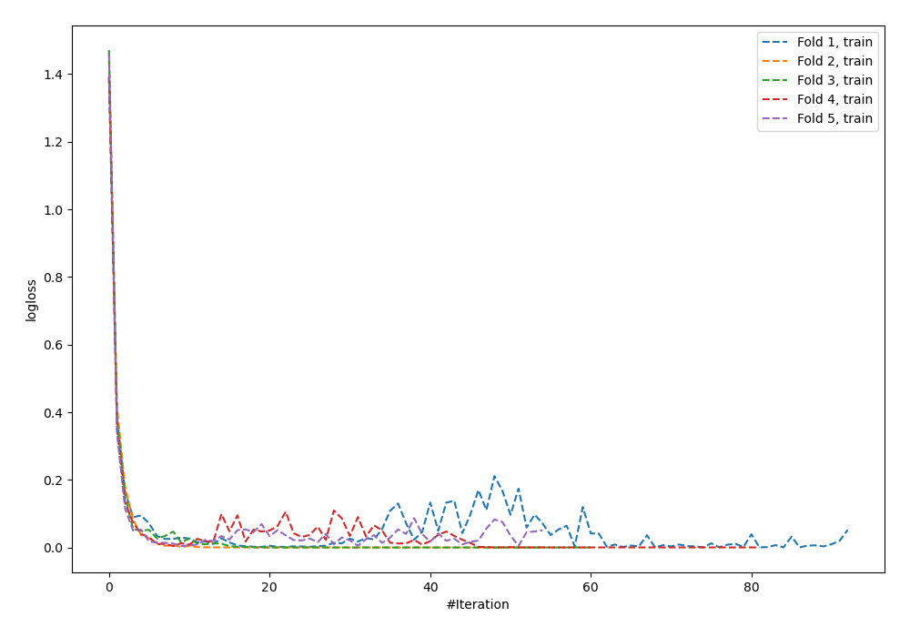
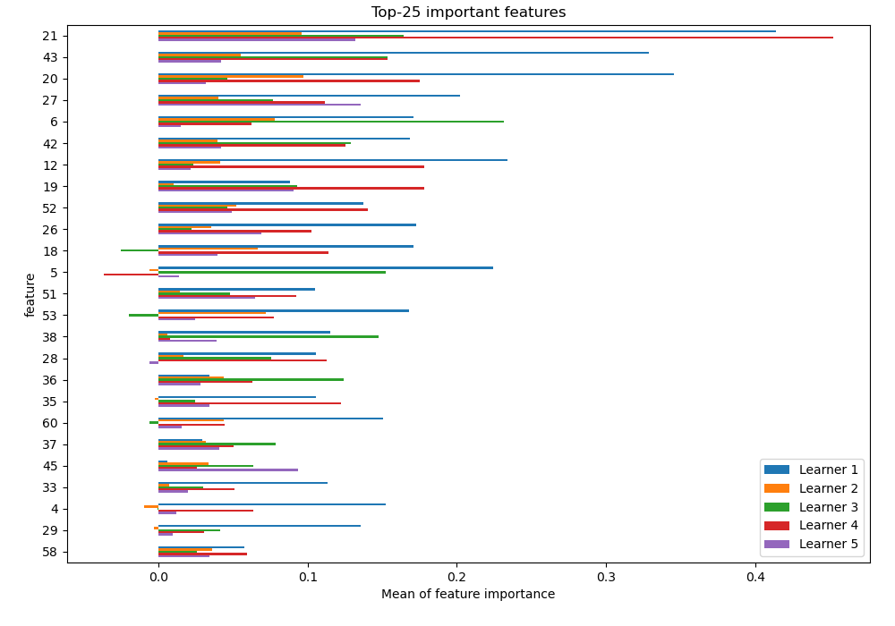
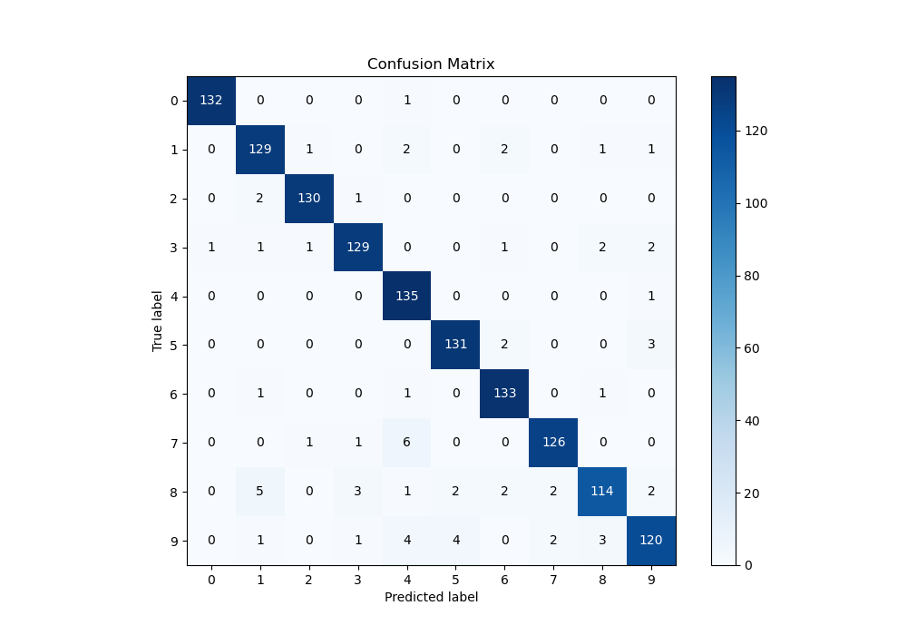
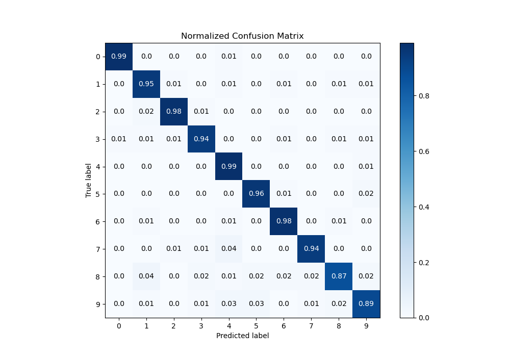
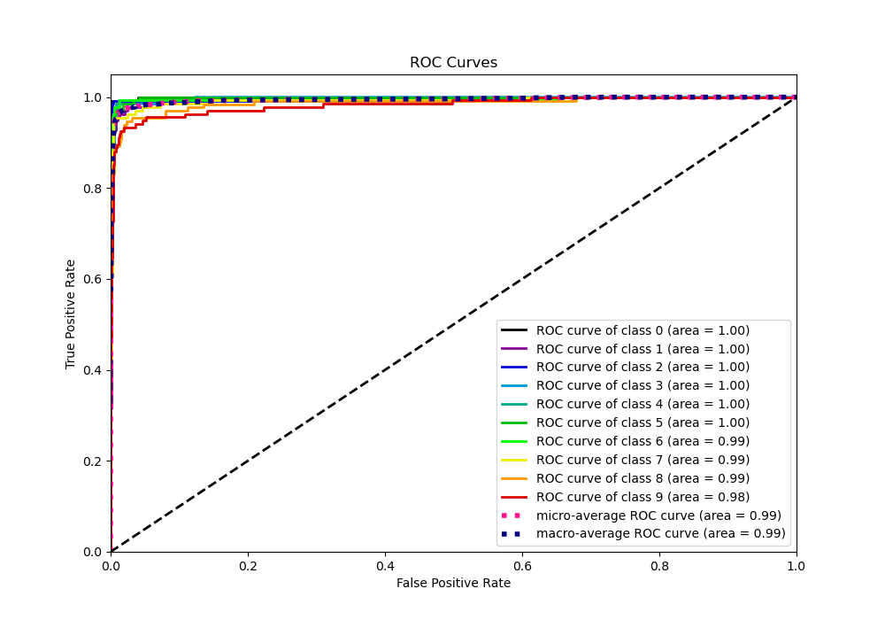
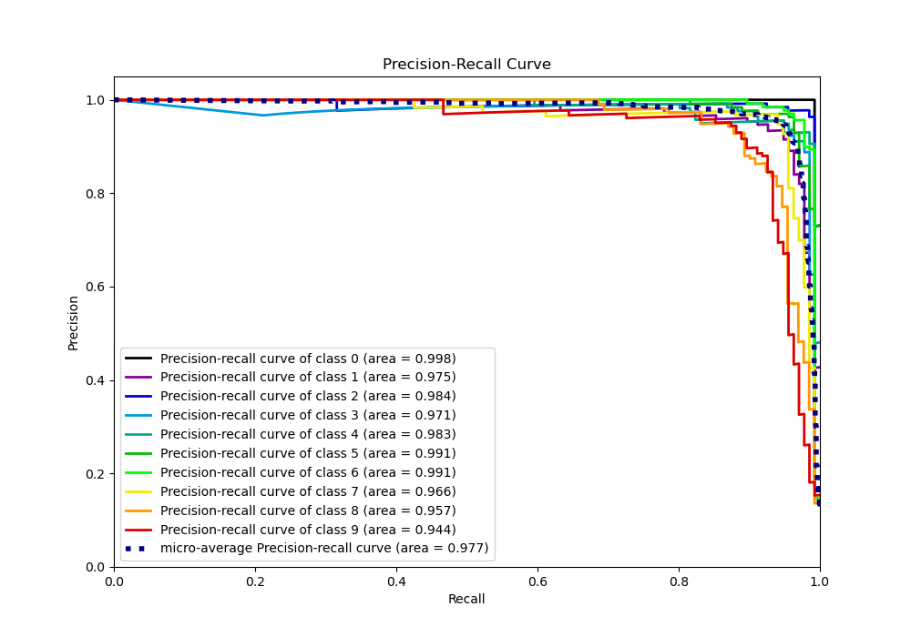

# Summary of 21_NeuralNetwork

[<< Go back](../README.md)

## Neural Network
- **n_jobs**: -1
- **dense_1_size**: 32
- **dense_2_size**: 32
- **learning_rate**: 0.05
- **num_class**: 10
- **explain_level**: 1

## Validation
 - **validation_type**: kfold
 - **k_folds**: 5
 - **shuffle**: True
 - **stratify**: True

## Optimized metric
logloss

## Training time

5.8 seconds

### Metric details
|           |          0 |          1 |          2 |          3 |          4 |          5 |          6 |          7 |          8 |          9 |   accuracy |   macro avg |   weighted avg |   logloss |
|:----------|-----------:|-----------:|-----------:|-----------:|-----------:|-----------:|-----------:|-----------:|-----------:|-----------:|-----------:|------------:|---------------:|----------:|
| precision |   0.992481 |   0.928058 |   0.977444 |   0.955556 |   0.9      |   0.956204 |   0.95     |   0.969231 |   0.942149 |   0.930233 |   0.949517 |    0.950135 |       0.95     |  0.358318 |
| recall    |   0.992481 |   0.948529 |   0.977444 |   0.941606 |   0.992647 |   0.963235 |   0.977941 |   0.940299 |   0.870229 |   0.888889 |   0.949517 |    0.94933  |       0.949517 |  0.358318 |
| f1-score  |   0.992481 |   0.938182 |   0.977444 |   0.948529 |   0.944056 |   0.959707 |   0.963768 |   0.954545 |   0.904762 |   0.909091 |   0.949517 |    0.949257 |       0.949284 |  0.358318 |
| support   | 133        | 136        | 133        | 137        | 136        | 136        | 136        | 134        | 131        | 135        |   0.949517 | 1347        |    1347        |  0.358318 |

## Confusion matrix
|              |   Predicted as 0 |   Predicted as 1 |   Predicted as 2 |   Predicted as 3 |   Predicted as 4 |   Predicted as 5 |   Predicted as 6 |   Predicted as 7 |   Predicted as 8 |   Predicted as 9 |
|:-------------|-----------------:|-----------------:|-----------------:|-----------------:|-----------------:|-----------------:|-----------------:|-----------------:|-----------------:|-----------------:|
| Labeled as 0 |              132 |                0 |                0 |                0 |                1 |                0 |                0 |                0 |                0 |                0 |
| Labeled as 1 |                0 |              129 |                1 |                0 |                2 |                0 |                2 |                0 |                1 |                1 |
| Labeled as 2 |                0 |                2 |              130 |                1 |                0 |                0 |                0 |                0 |                0 |                0 |
| Labeled as 3 |                1 |                1 |                1 |              129 |                0 |                0 |                1 |                0 |                2 |                2 |
| Labeled as 4 |                0 |                0 |                0 |                0 |              135 |                0 |                0 |                0 |                0 |                1 |
| Labeled as 5 |                0 |                0 |                0 |                0 |                0 |              131 |                2 |                0 |                0 |                3 |
| Labeled as 6 |                0 |                1 |                0 |                0 |                1 |                0 |              133 |                0 |                1 |                0 |
| Labeled as 7 |                0 |                0 |                1 |                1 |                6 |                0 |                0 |              126 |                0 |                0 |
| Labeled as 8 |                0 |                5 |                0 |                3 |                1 |                2 |                2 |                2 |              114 |                2 |
| Labeled as 9 |                0 |                1 |                0 |                1 |                4 |                4 |                0 |                2 |                3 |              120 |

## Learning curves

## Permutation-based Importance

## Confusion Matrix

## Normalized Confusion Matrix

## ROC Curve

## Precision Recall Curve

[<< Go back](../README.md)
