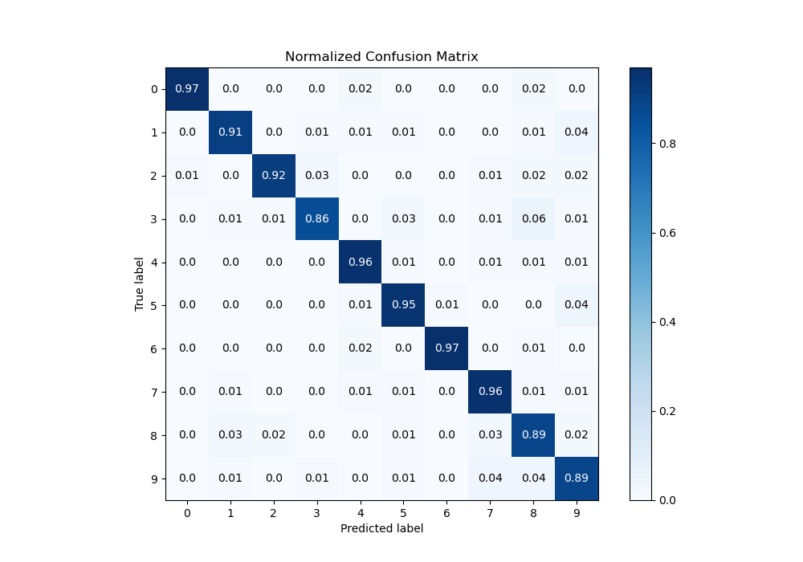

# Summary of 30_RandomForest_SelectedFeatures

[<< Go back](../README.md)

## Random Forest
- **n_jobs**: -1
- **criterion**: entropy
- **max_features**: 0.7
- **min_samples_split**: 30
- **max_depth**: 7
- **eval_metric_name**: logloss
- **num_class**: 10
- **explain_level**: 1

## Validation
 - **validation_type**: kfold
 - **k_folds**: 5
 - **shuffle**: True
 - **stratify**: True

## Optimized metric
logloss

## Training time

13.6 seconds

### Metric details
|           |          0 |          1 |          2 |          3 |          4 |          5 |          6 |          7 |          8 |          9 |   accuracy |   macro avg |   weighted avg |   logloss |
|:----------|-----------:|-----------:|-----------:|-----------:|-----------:|-----------:|-----------:|-----------:|-----------:|-----------:|-----------:|------------:|---------------:|----------:|
| precision |   0.992308 |   0.932331 |   0.968504 |   0.936508 |   0.942029 |   0.928058 |   0.992481 |   0.901408 |   0.841727 |   0.857143 |   0.927988 |    0.92925  |       0.929447 |  0.414753 |
| recall    |   0.969925 |   0.911765 |   0.924812 |   0.861314 |   0.955882 |   0.948529 |   0.970588 |   0.955224 |   0.89313  |   0.888889 |   0.927988 |    0.928006 |       0.927988 |  0.414753 |
| f1-score  |   0.980989 |   0.921933 |   0.946154 |   0.897338 |   0.948905 |   0.938182 |   0.981413 |   0.927536 |   0.866667 |   0.872727 |   0.927988 |    0.928184 |       0.928274 |  0.414753 |
| support   | 133        | 136        | 133        | 137        | 136        | 136        | 136        | 134        | 131        | 135        |   0.927988 | 1347        |    1347        |  0.414753 |

## Confusion matrix
|              |   Predicted as 0 |   Predicted as 1 |   Predicted as 2 |   Predicted as 3 |   Predicted as 4 |   Predicted as 5 |   Predicted as 6 |   Predicted as 7 |   Predicted as 8 |   Predicted as 9 |
|:-------------|-----------------:|-----------------:|-----------------:|-----------------:|-----------------:|-----------------:|-----------------:|-----------------:|-----------------:|-----------------:|
| Labeled as 0 |              129 |                0 |                0 |                0 |                2 |                0 |                0 |                0 |                2 |                0 |
| Labeled as 1 |                0 |              124 |                0 |                2 |                1 |                1 |                0 |                0 |                2 |                6 |
| Labeled as 2 |                1 |                0 |              123 |                4 |                0 |                0 |                0 |                1 |                2 |                2 |
| Labeled as 3 |                0 |                2 |                1 |              118 |                0 |                4 |                0 |                2 |                8 |                2 |
| Labeled as 4 |                0 |                0 |                0 |                0 |              130 |                2 |                0 |                2 |                1 |                1 |
| Labeled as 5 |                0 |                0 |                0 |                0 |                1 |              129 |                1 |                0 |                0 |                5 |
| Labeled as 6 |                0 |                0 |                0 |                0 |                3 |                0 |              132 |                0 |                1 |                0 |
| Labeled as 7 |                0 |                1 |                0 |                0 |                1 |                1 |                0 |              128 |                1 |                2 |
| Labeled as 8 |                0 |                4 |                3 |                0 |                0 |                1 |                0 |                4 |              117 |                2 |
| Labeled as 9 |                0 |                2 |                0 |                2 |                0 |                1 |                0 |                5 |                5 |              120 |

## Learning curves

## Permutation-based Importance

## Confusion Matrix

## Normalized Confusion Matrix

## ROC Curve

## Precision Recall Curve

[<< Go back](../README.md)
