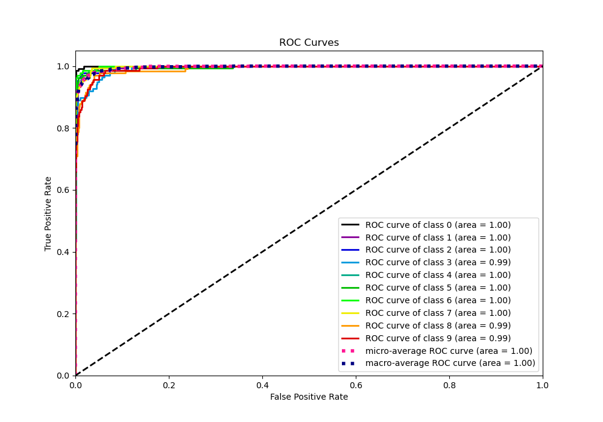

# Summary of 31_RandomForest

[<< Go back](../README.md)

## Random Forest
- **n_jobs**: -1
- **criterion**: entropy
- **max_features**: 0.7
- **min_samples_split**: 30
- **max_depth**: 7
- **eval_metric_name**: logloss
- **num_class**: 10
- **explain_level**: 1

## Validation
 - **validation_type**: kfold
 - **k_folds**: 5
 - **shuffle**: True
 - **stratify**: True

## Optimized metric
logloss

## Training time

19.3 seconds

### Metric details
|           |          0 |          1 |          2 |          3 |          4 |          5 |          6 |          7 |          8 |          9 |   accuracy |   macro avg |   weighted avg |   logloss |
|:----------|-----------:|-----------:|-----------:|-----------:|-----------:|-----------:|-----------:|-----------:|-----------:|-----------:|-----------:|------------:|---------------:|----------:|
| precision |   0.977444 |   0.928058 |   0.953846 |   0.959016 |   0.941176 |   0.921986 |   0.992481 |   0.907143 |   0.852941 |   0.883212 |   0.930958 |    0.93173  |       0.931964 |  0.409467 |
| recall    |   0.977444 |   0.948529 |   0.932331 |   0.854015 |   0.941176 |   0.955882 |   0.970588 |   0.947761 |   0.885496 |   0.896296 |   0.930958 |    0.930952 |       0.930958 |  0.409467 |
| f1-score  |   0.977444 |   0.938182 |   0.942966 |   0.903475 |   0.941176 |   0.938628 |   0.981413 |   0.927007 |   0.868914 |   0.889706 |   0.930958 |    0.930891 |       0.931007 |  0.409467 |
| support   | 133        | 136        | 133        | 137        | 136        | 136        | 136        | 134        | 131        | 135        |   0.930958 | 1347        |    1347        |  0.409467 |

## Confusion matrix
|              |   Predicted as 0 |   Predicted as 1 |   Predicted as 2 |   Predicted as 3 |   Predicted as 4 |   Predicted as 5 |   Predicted as 6 |   Predicted as 7 |   Predicted as 8 |   Predicted as 9 |
|:-------------|-----------------:|-----------------:|-----------------:|-----------------:|-----------------:|-----------------:|-----------------:|-----------------:|-----------------:|-----------------:|
| Labeled as 0 |              130 |                0 |                0 |                0 |                2 |                0 |                0 |                0 |                1 |                0 |
| Labeled as 1 |                0 |              129 |                0 |                1 |                0 |                1 |                0 |                0 |                2 |                3 |
| Labeled as 2 |                1 |                1 |              124 |                2 |                0 |                0 |                0 |                2 |                1 |                2 |
| Labeled as 3 |                0 |                2 |                2 |              117 |                0 |                4 |                0 |                3 |                6 |                3 |
| Labeled as 4 |                0 |                0 |                0 |                0 |              128 |                2 |                0 |                3 |                3 |                0 |
| Labeled as 5 |                0 |                0 |                0 |                0 |                1 |              130 |                1 |                0 |                0 |                4 |
| Labeled as 6 |                1 |                0 |                0 |                0 |                2 |                0 |              132 |                0 |                1 |                0 |
| Labeled as 7 |                0 |                1 |                0 |                0 |                1 |                2 |                0 |              127 |                2 |                1 |
| Labeled as 8 |                1 |                4 |                4 |                0 |                1 |                0 |                0 |                2 |              116 |                3 |
| Labeled as 9 |                0 |                2 |                0 |                2 |                1 |                2 |                0 |                3 |                4 |              121 |

## Learning curves

## Permutation-based Importance

## Confusion Matrix

## Normalized Confusion Matrix

## ROC Curve

## Precision Recall Curve

[<< Go back](../README.md)
