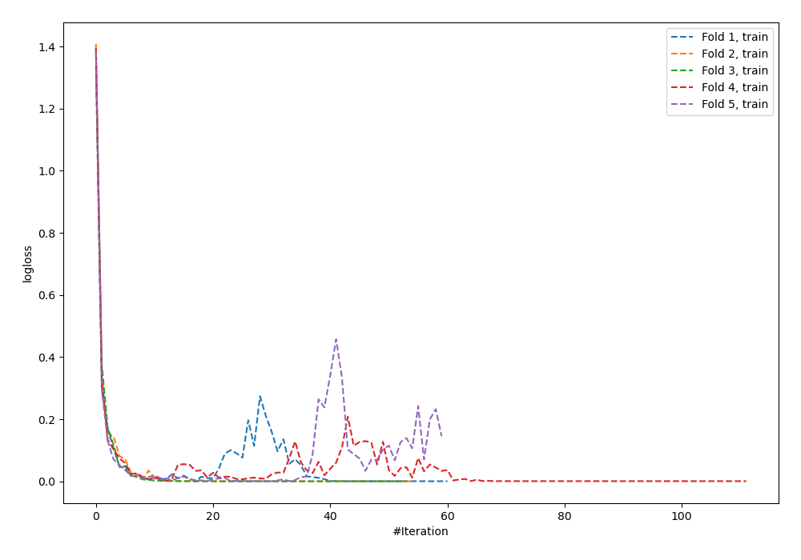
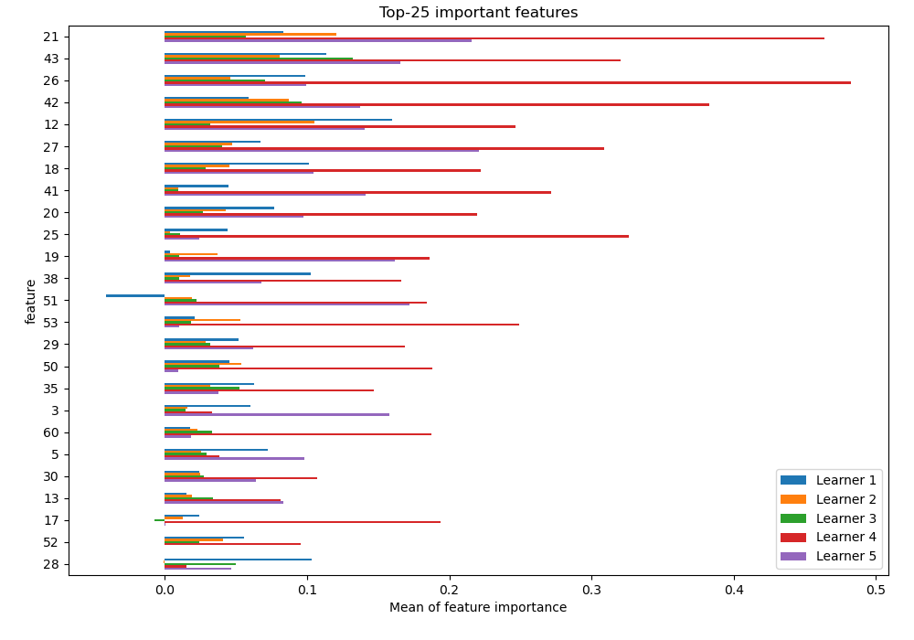
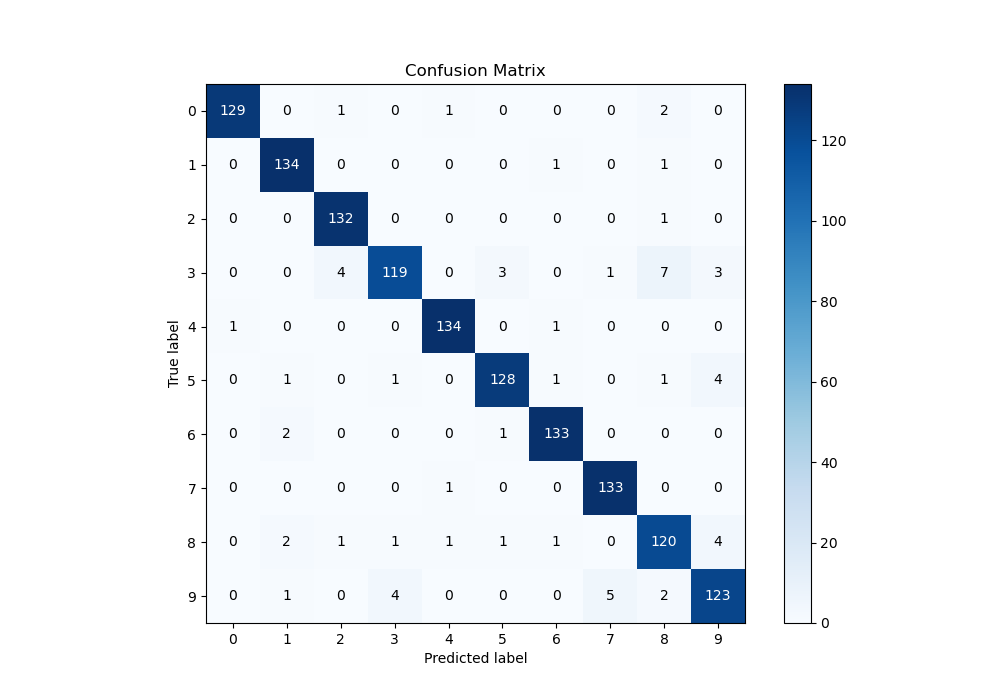
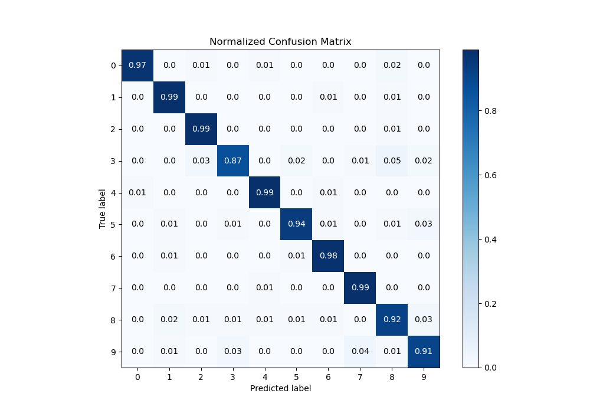
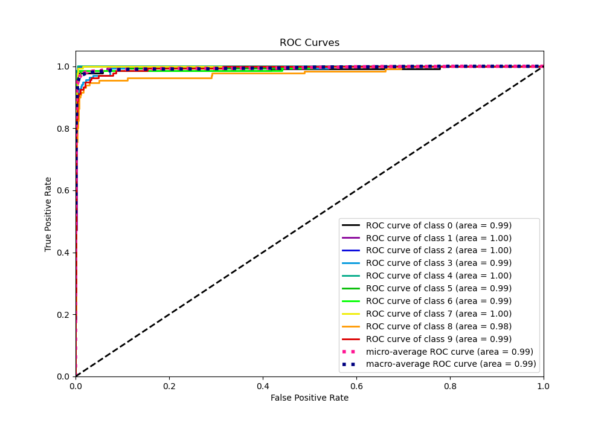
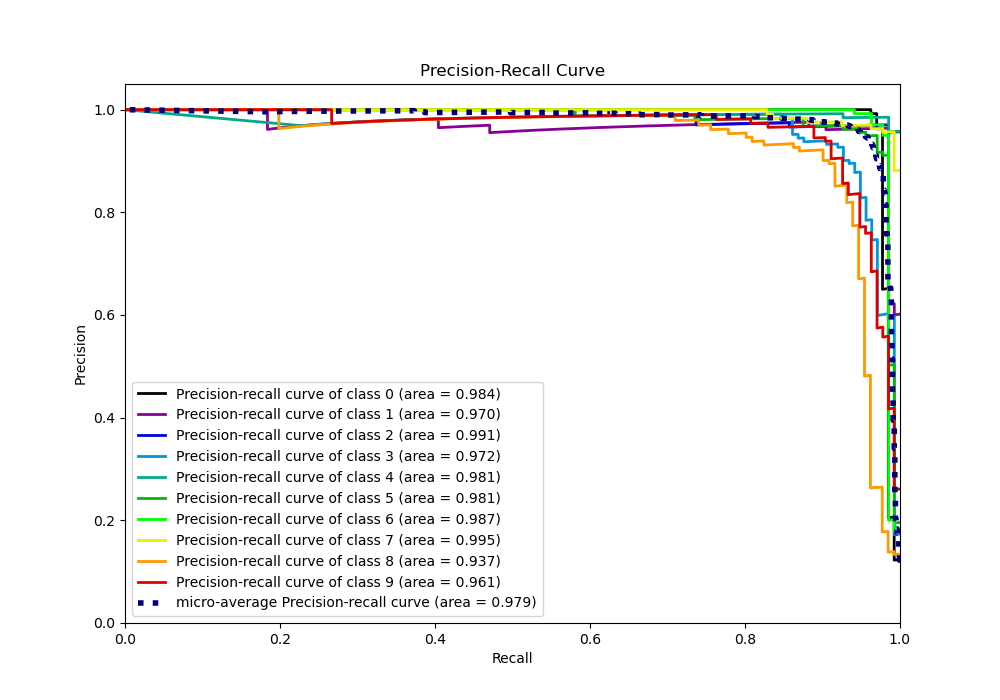

# Summary of 35_NeuralNetwork_SelectedFeatures

[<< Go back](../README.md)

## Neural Network
- **n_jobs**: -1
- **dense_1_size**: 64
- **dense_2_size**: 16
- **learning_rate**: 0.05
- **num_class**: 10
- **explain_level**: 1

## Validation
 - **validation_type**: kfold
 - **k_folds**: 5
 - **shuffle**: True
 - **stratify**: True

## Optimized metric
logloss

## Training time

8.7 seconds

### Metric details
|           |          0 |          1 |          2 |          3 |          4 |          5 |          6 |          7 |          8 |          9 |   accuracy |   macro avg |   weighted avg |   logloss |
|:----------|-----------:|-----------:|-----------:|-----------:|-----------:|-----------:|-----------:|-----------:|-----------:|-----------:|-----------:|------------:|---------------:|----------:|
| precision |   0.992308 |   0.957143 |   0.956522 |   0.952    |   0.978102 |   0.962406 |   0.970803 |   0.956835 |   0.895522 |   0.91791  |   0.953972 |    0.953955 |       0.954102 |  0.295979 |
| recall    |   0.969925 |   0.985294 |   0.992481 |   0.868613 |   0.985294 |   0.941176 |   0.977941 |   0.992537 |   0.916031 |   0.911111 |   0.953972 |    0.95404  |       0.953972 |  0.295979 |
| f1-score  |   0.980989 |   0.971014 |   0.97417  |   0.908397 |   0.981685 |   0.951673 |   0.974359 |   0.974359 |   0.90566  |   0.914498 |   0.953972 |    0.95368  |       0.953717 |  0.295979 |
| support   | 133        | 136        | 133        | 137        | 136        | 136        | 136        | 134        | 131        | 135        |   0.953972 | 1347        |    1347        |  0.295979 |

## Confusion matrix
|              |   Predicted as 0 |   Predicted as 1 |   Predicted as 2 |   Predicted as 3 |   Predicted as 4 |   Predicted as 5 |   Predicted as 6 |   Predicted as 7 |   Predicted as 8 |   Predicted as 9 |
|:-------------|-----------------:|-----------------:|-----------------:|-----------------:|-----------------:|-----------------:|-----------------:|-----------------:|-----------------:|-----------------:|
| Labeled as 0 |              129 |                0 |                1 |                0 |                1 |                0 |                0 |                0 |                2 |                0 |
| Labeled as 1 |                0 |              134 |                0 |                0 |                0 |                0 |                1 |                0 |                1 |                0 |
| Labeled as 2 |                0 |                0 |              132 |                0 |                0 |                0 |                0 |                0 |                1 |                0 |
| Labeled as 3 |                0 |                0 |                4 |              119 |                0 |                3 |                0 |                1 |                7 |                3 |
| Labeled as 4 |                1 |                0 |                0 |                0 |              134 |                0 |                1 |                0 |                0 |                0 |
| Labeled as 5 |                0 |                1 |                0 |                1 |                0 |              128 |                1 |                0 |                1 |                4 |
| Labeled as 6 |                0 |                2 |                0 |                0 |                0 |                1 |              133 |                0 |                0 |                0 |
| Labeled as 7 |                0 |                0 |                0 |                0 |                1 |                0 |                0 |              133 |                0 |                0 |
| Labeled as 8 |                0 |                2 |                1 |                1 |                1 |                1 |                1 |                0 |              120 |                4 |
| Labeled as 9 |                0 |                1 |                0 |                4 |                0 |                0 |                0 |                5 |                2 |              123 |

## Learning curves

## Permutation-based Importance

## Confusion Matrix

## Normalized Confusion Matrix

## ROC Curve

## Precision Recall Curve

[<< Go back](../README.md)
