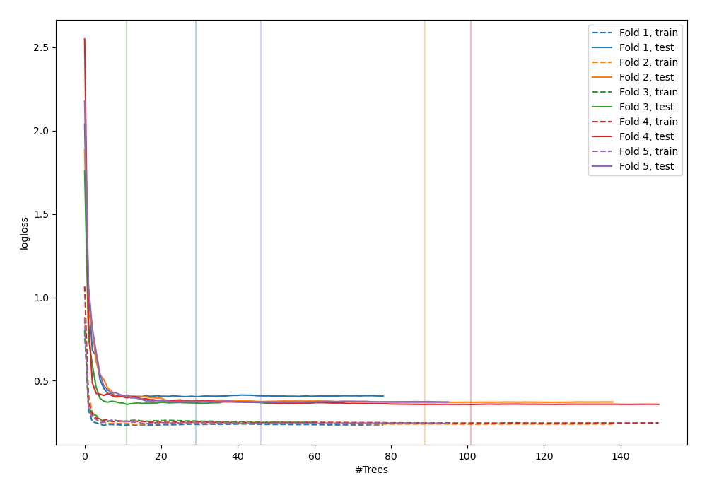
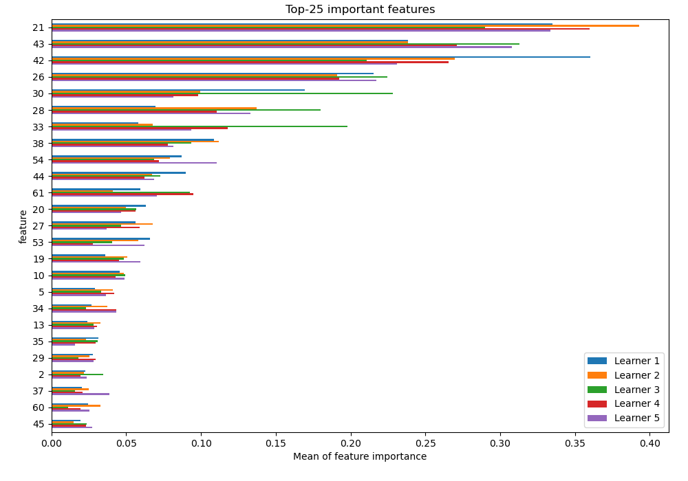
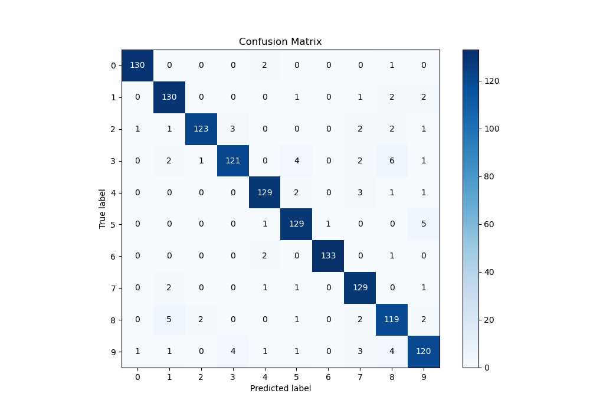
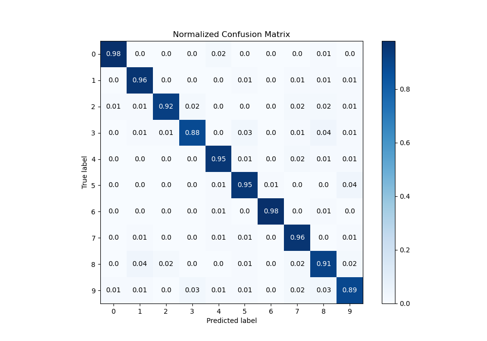
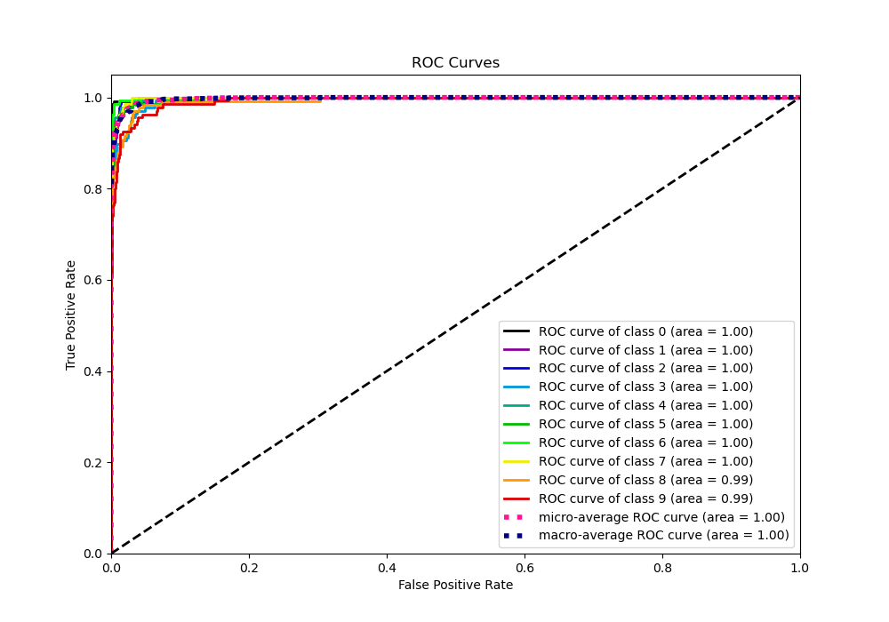
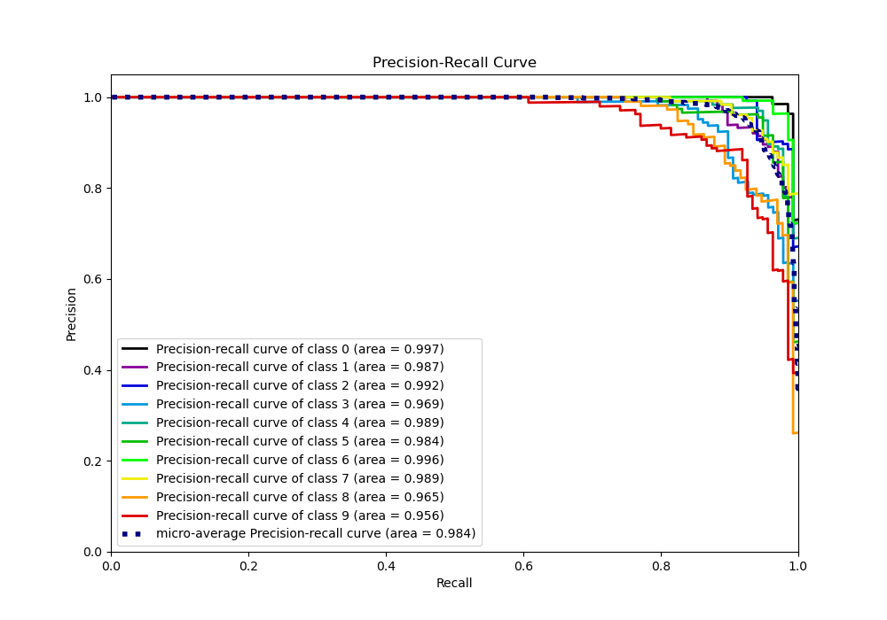

# Summary of 39_RandomForest_SelectedFeatures

[<< Go back](../README.md)

## Random Forest
- **n_jobs**: -1
- **criterion**: entropy
- **max_features**: 0.7
- **min_samples_split**: 20
- **max_depth**: 7
- **eval_metric_name**: logloss
- **num_class**: 10
- **explain_level**: 1

## Validation
 - **validation_type**: kfold
 - **k_folds**: 5
 - **shuffle**: True
 - **stratify**: True

## Optimized metric
logloss

## Training time

14.0 seconds

### Metric details
|           |          0 |          1 |          2 |          3 |          4 |          5 |          6 |          7 |          8 |          9 |   accuracy |   macro avg |   weighted avg |   logloss |
|:----------|-----------:|-----------:|-----------:|-----------:|-----------:|-----------:|-----------:|-----------:|-----------:|-----------:|-----------:|------------:|---------------:|----------:|
| precision |   0.984848 |   0.921986 |   0.97619  |   0.945312 |   0.948529 |   0.928058 |   0.992537 |   0.908451 |   0.875    |   0.902256 |   0.937639 |    0.938317 |       0.93844  |  0.372102 |
| recall    |   0.977444 |   0.955882 |   0.924812 |   0.883212 |   0.948529 |   0.948529 |   0.977941 |   0.962687 |   0.908397 |   0.888889 |   0.937639 |    0.937632 |       0.937639 |  0.372102 |
| f1-score  |   0.981132 |   0.938628 |   0.949807 |   0.913208 |   0.948529 |   0.938182 |   0.985185 |   0.934783 |   0.891386 |   0.895522 |   0.937639 |    0.937636 |       0.937701 |  0.372102 |
| support   | 133        | 136        | 133        | 137        | 136        | 136        | 136        | 134        | 131        | 135        |   0.937639 | 1347        |    1347        |  0.372102 |

## Confusion matrix
|              |   Predicted as 0 |   Predicted as 1 |   Predicted as 2 |   Predicted as 3 |   Predicted as 4 |   Predicted as 5 |   Predicted as 6 |   Predicted as 7 |   Predicted as 8 |   Predicted as 9 |
|:-------------|-----------------:|-----------------:|-----------------:|-----------------:|-----------------:|-----------------:|-----------------:|-----------------:|-----------------:|-----------------:|
| Labeled as 0 |              130 |                0 |                0 |                0 |                2 |                0 |                0 |                0 |                1 |                0 |
| Labeled as 1 |                0 |              130 |                0 |                0 |                0 |                1 |                0 |                1 |                2 |                2 |
| Labeled as 2 |                1 |                1 |              123 |                3 |                0 |                0 |                0 |                2 |                2 |                1 |
| Labeled as 3 |                0 |                2 |                1 |              121 |                0 |                4 |                0 |                2 |                6 |                1 |
| Labeled as 4 |                0 |                0 |                0 |                0 |              129 |                2 |                0 |                3 |                1 |                1 |
| Labeled as 5 |                0 |                0 |                0 |                0 |                1 |              129 |                1 |                0 |                0 |                5 |
| Labeled as 6 |                0 |                0 |                0 |                0 |                2 |                0 |              133 |                0 |                1 |                0 |
| Labeled as 7 |                0 |                2 |                0 |                0 |                1 |                1 |                0 |              129 |                0 |                1 |
| Labeled as 8 |                0 |                5 |                2 |                0 |                0 |                1 |                0 |                2 |              119 |                2 |
| Labeled as 9 |                1 |                1 |                0 |                4 |                1 |                1 |                0 |                3 |                4 |              120 |

## Learning curves

## Permutation-based Importance

## Confusion Matrix

## Normalized Confusion Matrix

## ROC Curve

## Precision Recall Curve

[<< Go back](../README.md)
