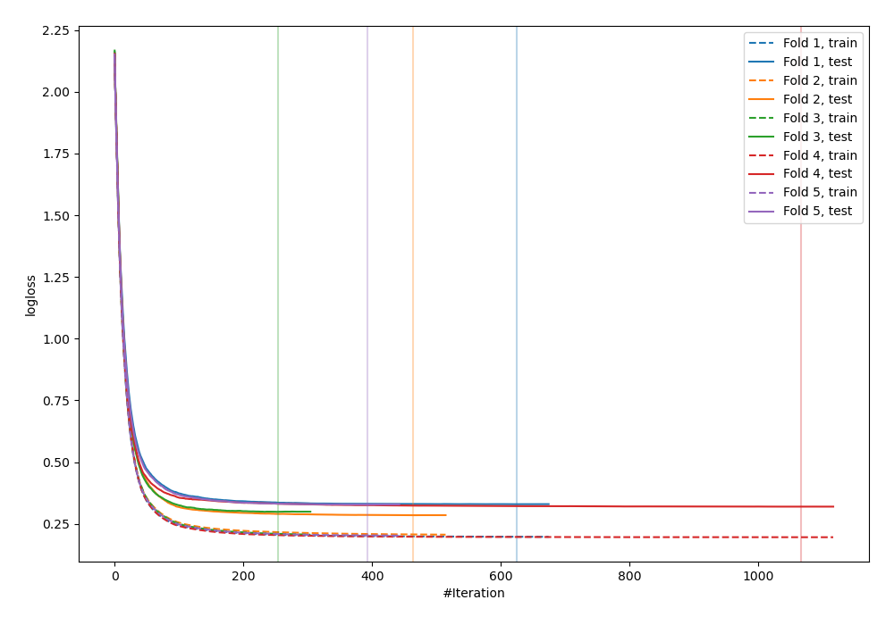

# Summary of 8_Xgboost

[<< Go back](../README.md)

## Extreme Gradient Boosting (Xgboost)
- **n_jobs**: -1
- **objective**: multi:softprob
- **eta**: 0.1
- **max_depth**: 7
- **min_child_weight**: 25
- **subsample**: 0.9
- **colsample_bytree**: 0.6
- **eval_metric**: mlogloss
- **num_class**: 10
- **explain_level**: 1

## Validation
 - **validation_type**: kfold
 - **k_folds**: 5
 - **shuffle**: True
 - **stratify**: True

## Optimized metric
logloss

## Training time

37.5 seconds

### Metric details
|           |          0 |          1 |          2 |          3 |          4 |          5 |          6 |          7 |          8 |          9 |   accuracy |   macro avg |   weighted avg |   logloss |
|:----------|-----------:|-----------:|-----------:|-----------:|-----------:|-----------:|-----------:|-----------:|-----------:|-----------:|-----------:|------------:|---------------:|----------:|
| precision |   0.955882 |   0.837838 |   0.970149 |   0.945736 |   0.931298 |   0.93985  |   0.962687 |   0.927007 |   0.880952 |   0.848921 |   0.919079 |    0.920032 |       0.920047 |  0.312174 |
| recall    |   0.977444 |   0.911765 |   0.977444 |   0.890511 |   0.897059 |   0.919118 |   0.948529 |   0.947761 |   0.847328 |   0.874074 |   0.919079 |    0.919103 |       0.919079 |  0.312174 |
| f1-score  |   0.966543 |   0.873239 |   0.973783 |   0.917293 |   0.913858 |   0.929368 |   0.955556 |   0.937269 |   0.863813 |   0.861314 |   0.919079 |    0.919204 |       0.919197 |  0.312174 |
| support   | 133        | 136        | 133        | 137        | 136        | 136        | 136        | 134        | 131        | 135        |   0.919079 | 1347        |    1347        |  0.312174 |

## Confusion matrix
|              |   Predicted as 0 |   Predicted as 1 |   Predicted as 2 |   Predicted as 3 |   Predicted as 4 |   Predicted as 5 |   Predicted as 6 |   Predicted as 7 |   Predicted as 8 |   Predicted as 9 |
|:-------------|-----------------:|-----------------:|-----------------:|-----------------:|-----------------:|-----------------:|-----------------:|-----------------:|-----------------:|-----------------:|
| Labeled as 0 |              130 |                0 |                0 |                0 |                2 |                1 |                0 |                0 |                0 |                0 |
| Labeled as 1 |                0 |              124 |                1 |                1 |                1 |                1 |                0 |                0 |                1 |                7 |
| Labeled as 2 |                1 |                1 |              130 |                1 |                0 |                0 |                0 |                0 |                0 |                0 |
| Labeled as 3 |                0 |                3 |                2 |              122 |                0 |                3 |                0 |                3 |                3 |                1 |
| Labeled as 4 |                2 |                2 |                0 |                0 |              122 |                0 |                3 |                3 |                2 |                2 |
| Labeled as 5 |                1 |                2 |                0 |                2 |                0 |              125 |                1 |                0 |                0 |                5 |
| Labeled as 6 |                1 |                3 |                0 |                0 |                1 |                0 |              129 |                0 |                1 |                1 |
| Labeled as 7 |                0 |                1 |                0 |                0 |                3 |                1 |                0 |              127 |                2 |                0 |
| Labeled as 8 |                0 |                9 |                0 |                1 |                1 |                1 |                1 |                2 |              111 |                5 |
| Labeled as 9 |                1 |                3 |                1 |                2 |                1 |                1 |                0 |                2 |                6 |              118 |

## Learning curves

## Permutation-based Importance

## Confusion Matrix

## Normalized Confusion Matrix

## ROC Curve

## Precision Recall Curve

[<< Go back](../README.md)
