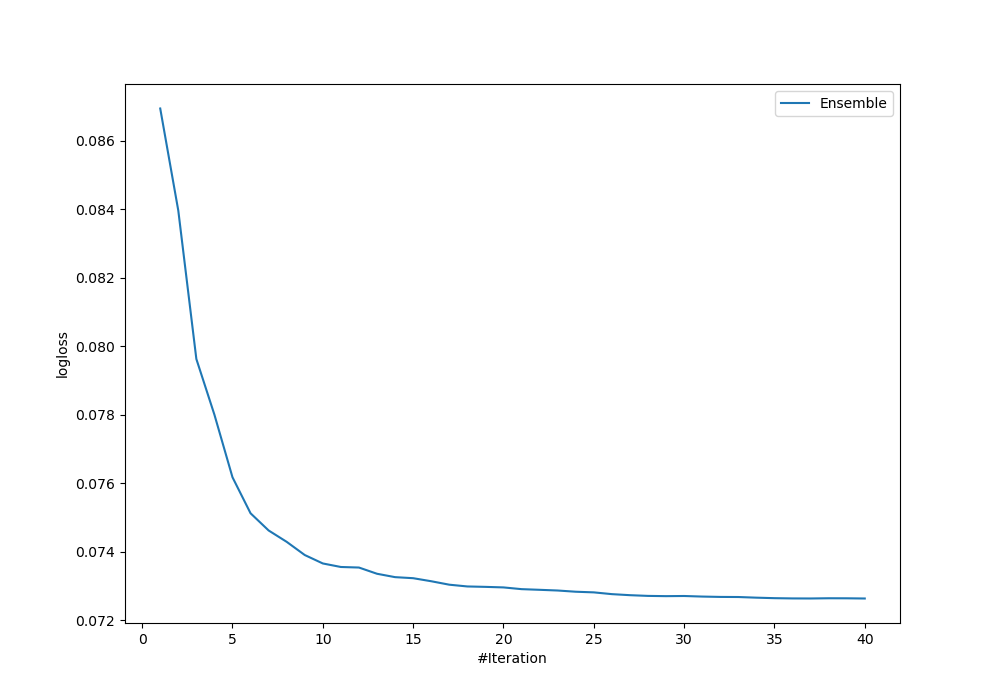
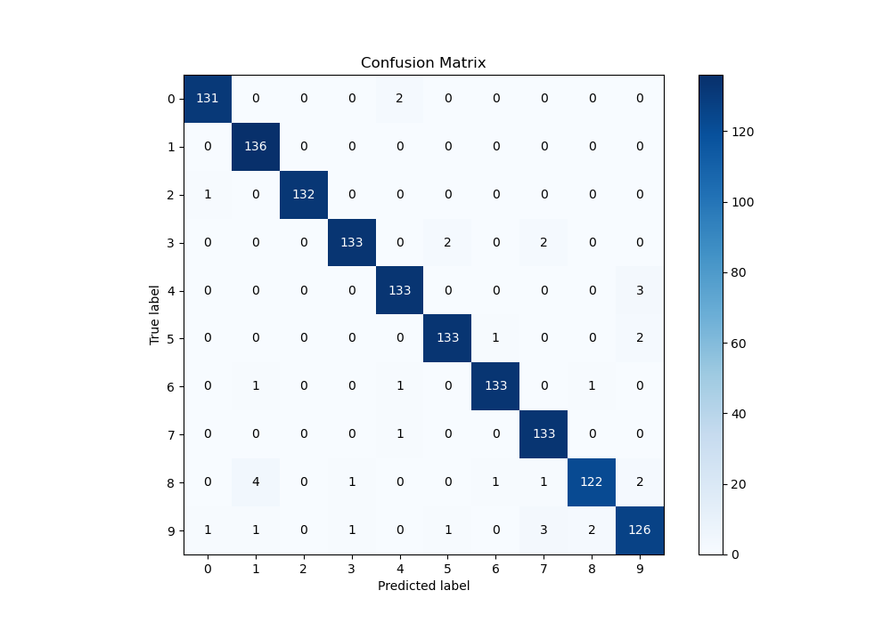
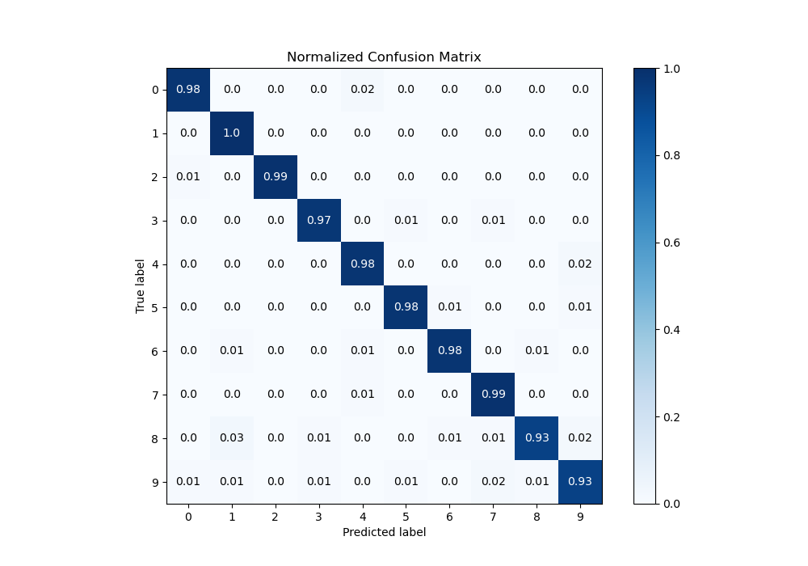
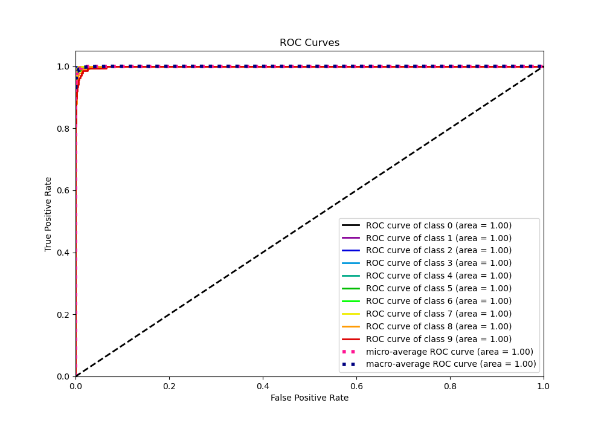
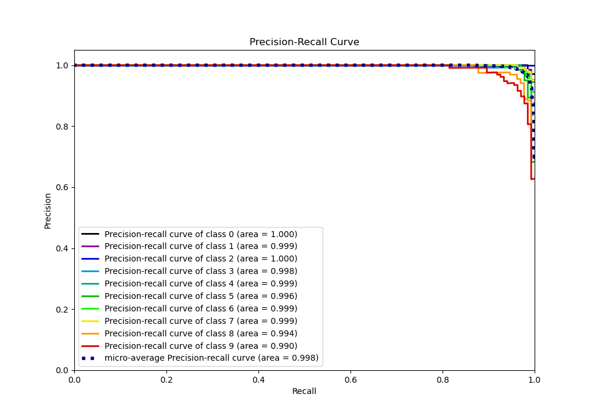

# Summary of Ensemble

[<< Go back](../README.md)

## Ensemble structure
| Model                             |   Weight |
|:----------------------------------|---------:|
| 11_LightGBM                       |        2 |
| 11_LightGBM_GoldenFeatures        |        8 |
| 12_LightGBM                       |        1 |
| 1_Linear                          |        1 |
| 20_NeuralNetwork                  |        1 |
| 21_NeuralNetwork                  |        1 |
| 32_LightGBM                       |       18 |
| 35_NeuralNetwork_SelectedFeatures |        4 |
| 36_NeuralNetwork                  |        4 |

### Metric details
|           |          0 |          1 |          2 |          3 |          4 |          5 |          6 |          7 |          8 |          9 |   accuracy |   macro avg |   weighted avg |   logloss |
|:----------|-----------:|-----------:|-----------:|-----------:|-----------:|-----------:|-----------:|-----------:|-----------:|-----------:|-----------:|------------:|---------------:|----------:|
| precision |   0.984962 |   0.957746 |   1        |   0.985185 |   0.970803 |   0.977941 |   0.985185 |   0.956835 |   0.976    |   0.947368 |   0.974016 |    0.974203 |       0.974168 | 0.0726386 |
| recall    |   0.984962 |   1        |   0.992481 |   0.970803 |   0.977941 |   0.977941 |   0.977941 |   0.992537 |   0.931298 |   0.933333 |   0.974016 |    0.973924 |       0.974016 | 0.0726386 |
| f1-score  |   0.984962 |   0.978417 |   0.996226 |   0.977941 |   0.974359 |   0.977941 |   0.98155  |   0.974359 |   0.953125 |   0.940299 |   0.974016 |    0.973918 |       0.973948 | 0.0726386 |
| support   | 133        | 136        | 133        | 137        | 136        | 136        | 136        | 134        | 131        | 135        |   0.974016 | 1347        |    1347        | 0.0726386 |

## Confusion matrix
|              |   Predicted as 0 |   Predicted as 1 |   Predicted as 2 |   Predicted as 3 |   Predicted as 4 |   Predicted as 5 |   Predicted as 6 |   Predicted as 7 |   Predicted as 8 |   Predicted as 9 |
|:-------------|-----------------:|-----------------:|-----------------:|-----------------:|-----------------:|-----------------:|-----------------:|-----------------:|-----------------:|-----------------:|
| Labeled as 0 |              131 |                0 |                0 |                0 |                2 |                0 |                0 |                0 |                0 |                0 |
| Labeled as 1 |                0 |              136 |                0 |                0 |                0 |                0 |                0 |                0 |                0 |                0 |
| Labeled as 2 |                1 |                0 |              132 |                0 |                0 |                0 |                0 |                0 |                0 |                0 |
| Labeled as 3 |                0 |                0 |                0 |              133 |                0 |                2 |                0 |                2 |                0 |                0 |
| Labeled as 4 |                0 |                0 |                0 |                0 |              133 |                0 |                0 |                0 |                0 |                3 |
| Labeled as 5 |                0 |                0 |                0 |                0 |                0 |              133 |                1 |                0 |                0 |                2 |
| Labeled as 6 |                0 |                1 |                0 |                0 |                1 |                0 |              133 |                0 |                1 |                0 |
| Labeled as 7 |                0 |                0 |                0 |                0 |                1 |                0 |                0 |              133 |                0 |                0 |
| Labeled as 8 |                0 |                4 |                0 |                1 |                0 |                0 |                1 |                1 |              122 |                2 |
| Labeled as 9 |                1 |                1 |                0 |                1 |                0 |                1 |                0 |                3 |                2 |              126 |

## Learning curves

## Confusion Matrix

## Normalized Confusion Matrix

## ROC Curve

## Precision Recall Curve

[<< Go back](../README.md)
