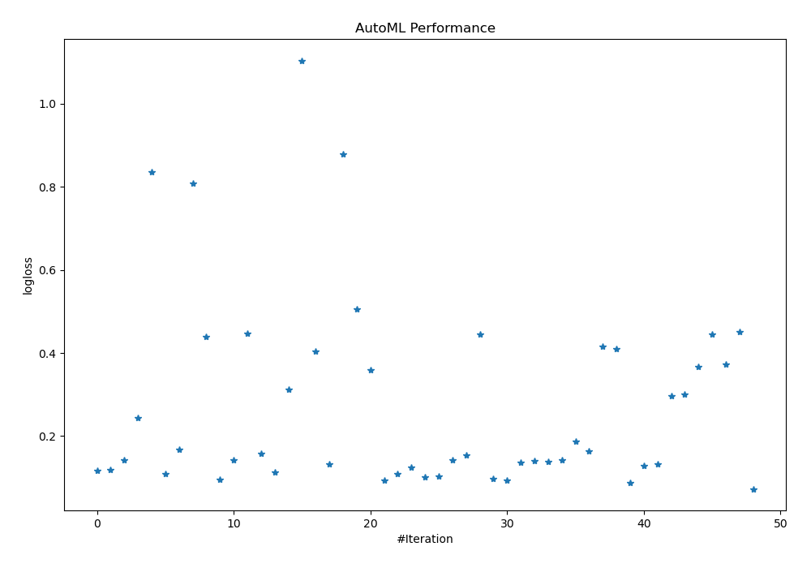
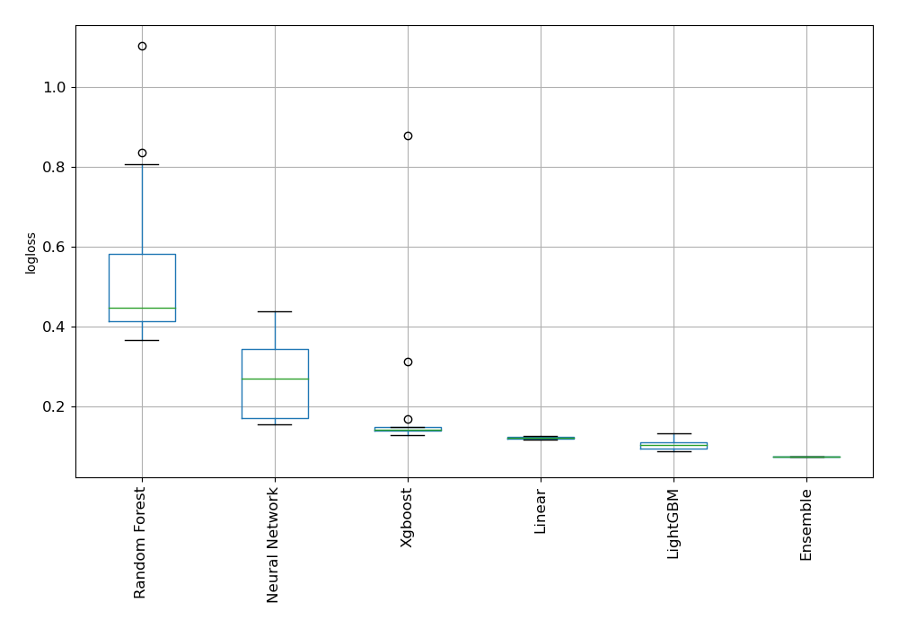
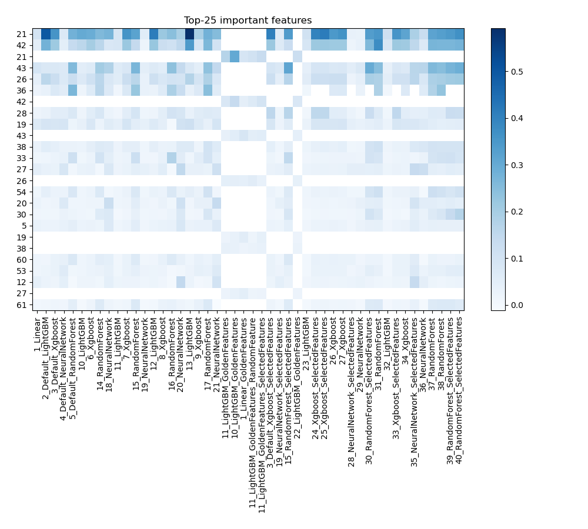
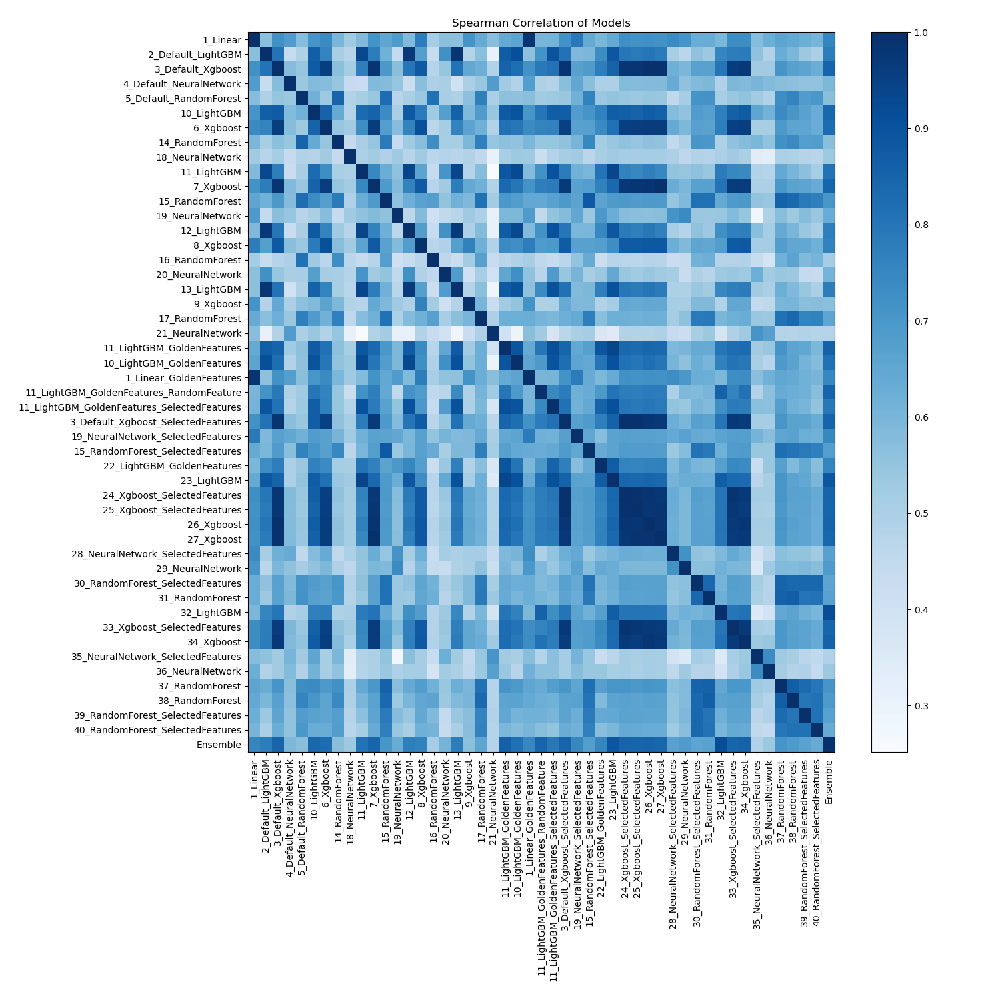

# AutoML Leaderboard

| Best model   | name                                                                                                 | model_type     | metric_type   |   metric_value |   train_time |   single_prediction_time |
|:-------------|:-----------------------------------------------------------------------------------------------------|:---------------|:--------------|---------------:|-------------:|-------------------------:|
|              | [1_Linear](1_Linear/README.md)                                                                       | Linear         | logloss       |      0.11709   |         3.9  |                   0.0515 |
|              | [2_Default_LightGBM](2_Default_LightGBM/README.md)                                                   | LightGBM       | logloss       |      0.119508  |        57.83 |                   0.0555 |
|              | [3_Default_Xgboost](3_Default_Xgboost/README.md)                                                     | Xgboost        | logloss       |      0.141544  |        35.61 |                   0.049  |
|              | [4_Default_NeuralNetwork](4_Default_NeuralNetwork/README.md)                                         | Neural Network | logloss       |      0.244656  |         4.76 |                   0.0518 |
|              | [5_Default_RandomForest](5_Default_RandomForest/README.md)                                           | Random Forest  | logloss       |      0.835827  |        11.59 |                   0.1076 |
|              | [10_LightGBM](10_LightGBM/README.md)                                                                 | LightGBM       | logloss       |      0.108165  |        26.44 |                   0.0542 |
|              | [6_Xgboost](6_Xgboost/README.md)                                                                     | Xgboost        | logloss       |      0.167262  |        54.91 |                   0.0507 |
|              | [14_RandomForest](14_RandomForest/README.md)                                                         | Random Forest  | logloss       |      0.807765  |        11.02 |                   0.1066 |
|              | [18_NeuralNetwork](18_NeuralNetwork/README.md)                                                       | Neural Network | logloss       |      0.438477  |         7.18 |                   0.0696 |
|              | [11_LightGBM](11_LightGBM/README.md)                                                                 | LightGBM       | logloss       |      0.0942313 |        16.38 |                   0.0465 |
|              | [7_Xgboost](7_Xgboost/README.md)                                                                     | Xgboost        | logloss       |      0.141853  |        44.15 |                   0.0615 |
|              | [15_RandomForest](15_RandomForest/README.md)                                                         | Random Forest  | logloss       |      0.447175  |        17.04 |                   0.1427 |
|              | [19_NeuralNetwork](19_NeuralNetwork/README.md)                                                       | Neural Network | logloss       |      0.15857   |         6.24 |                   0.055  |
|              | [12_LightGBM](12_LightGBM/README.md)                                                                 | LightGBM       | logloss       |      0.112702  |       523.4  |                   0.049  |
|              | [8_Xgboost](8_Xgboost/README.md)                                                                     | Xgboost        | logloss       |      0.312174  |        38.24 |                   0.049  |
|              | [16_RandomForest](16_RandomForest/README.md)                                                         | Random Forest  | logloss       |      1.10438   |         8.84 |                   0.0873 |
|              | [20_NeuralNetwork](20_NeuralNetwork/README.md)                                                       | Neural Network | logloss       |      0.404874  |         6.33 |                   0.0524 |
|              | [13_LightGBM](13_LightGBM/README.md)                                                                 | LightGBM       | logloss       |      0.132     |        75.89 |                   0.0545 |
|              | [9_Xgboost](9_Xgboost/README.md)                                                                     | Xgboost        | logloss       |      0.877835  |        33.85 |                   0.0475 |
|              | [17_RandomForest](17_RandomForest/README.md)                                                         | Random Forest  | logloss       |      0.505358  |        13.24 |                   0.1094 |
|              | [21_NeuralNetwork](21_NeuralNetwork/README.md)                                                       | Neural Network | logloss       |      0.358318  |         6.66 |                   0.0582 |
|              | [11_LightGBM_GoldenFeatures](11_LightGBM_GoldenFeatures/README.md)                                   | LightGBM       | logloss       |      0.0939664 |        18.57 |                   0.0645 |
|              | [10_LightGBM_GoldenFeatures](10_LightGBM_GoldenFeatures/README.md)                                   | LightGBM       | logloss       |      0.108449  |        32.99 |                   0.0695 |
|              | [1_Linear_GoldenFeatures](1_Linear_GoldenFeatures/README.md)                                         | Linear         | logloss       |      0.124872  |         6.19 |                   0.0957 |
|              | [11_LightGBM_GoldenFeatures_RandomFeature](11_LightGBM_GoldenFeatures_RandomFeature/README.md)       | LightGBM       | logloss       |      0.101164  |        18.02 |                   0.0665 |
|              | [11_LightGBM_GoldenFeatures_SelectedFeatures](11_LightGBM_GoldenFeatures_SelectedFeatures/README.md) | LightGBM       | logloss       |      0.103646  |        16.08 |                   0.0571 |
|              | [3_Default_Xgboost_SelectedFeatures](3_Default_Xgboost_SelectedFeatures/README.md)                   | Xgboost        | logloss       |      0.141114  |        44.66 |                   0.0465 |
|              | [19_NeuralNetwork_SelectedFeatures](19_NeuralNetwork_SelectedFeatures/README.md)                     | Neural Network | logloss       |      0.153551  |         7.55 |                   0.0451 |
|              | [15_RandomForest_SelectedFeatures](15_RandomForest_SelectedFeatures/README.md)                       | Random Forest  | logloss       |      0.44574   |        15.03 |                   0.1091 |
|              | [22_LightGBM_GoldenFeatures](22_LightGBM_GoldenFeatures/README.md)                                   | LightGBM       | logloss       |      0.0962352 |        31.33 |                   0.0676 |
|              | [23_LightGBM](23_LightGBM/README.md)                                                                 | LightGBM       | logloss       |      0.0935454 |        30.71 |                   0.047  |
|              | [24_Xgboost_SelectedFeatures](24_Xgboost_SelectedFeatures/README.md)                                 | Xgboost        | logloss       |      0.136842  |        44.71 |                   0.042  |
|              | [25_Xgboost_SelectedFeatures](25_Xgboost_SelectedFeatures/README.md)                                 | Xgboost        | logloss       |      0.139399  |        54.13 |                   0.0435 |
|              | [26_Xgboost](26_Xgboost/README.md)                                                                   | Xgboost        | logloss       |      0.138523  |        68.13 |                   0.0515 |
|              | [27_Xgboost](27_Xgboost/README.md)                                                                   | Xgboost        | logloss       |      0.141792  |        58.05 |                   0.0511 |
|              | [28_NeuralNetwork_SelectedFeatures](28_NeuralNetwork_SelectedFeatures/README.md)                     | Neural Network | logloss       |      0.18616   |         8.13 |                   0.0475 |
|              | [29_NeuralNetwork](29_NeuralNetwork/README.md)                                                       | Neural Network | logloss       |      0.164307  |         8.91 |                   0.056  |
|              | [30_RandomForest_SelectedFeatures](30_RandomForest_SelectedFeatures/README.md)                       | Random Forest  | logloss       |      0.414753  |        14.39 |                   0.1062 |
|              | [31_RandomForest](31_RandomForest/README.md)                                                         | Random Forest  | logloss       |      0.409467  |        20.1  |                   0.1493 |
| **the best** | [32_LightGBM](32_LightGBM/README.md)                                                                 | LightGBM       | logloss       |      0.0869372 |        55.45 |                   0.051  |
|              | [33_Xgboost_SelectedFeatures](33_Xgboost_SelectedFeatures/README.md)                                 | Xgboost        | logloss       |      0.128594  |        54.5  |                   0.0471 |
|              | [34_Xgboost](34_Xgboost/README.md)                                                                   | Xgboost        | logloss       |      0.13254   |        61.95 |                   0.049  |
|              | [35_NeuralNetwork_SelectedFeatures](35_NeuralNetwork_SelectedFeatures/README.md)                     | Neural Network | logloss       |      0.295979  |         9.61 |                   0.0484 |
|              | [36_NeuralNetwork](36_NeuralNetwork/README.md)                                                       | Neural Network | logloss       |      0.300124  |        10.21 |                   0.056  |
|              | [37_RandomForest](37_RandomForest/README.md)                                                         | Random Forest  | logloss       |      0.365933  |        22.8  |                   0.1695 |
|              | [38_RandomForest](38_RandomForest/README.md)                                                         | Random Forest  | logloss       |      0.444465  |        23.84 |                   0.1444 |
|              | [39_RandomForest_SelectedFeatures](39_RandomForest_SelectedFeatures/README.md)                       | Random Forest  | logloss       |      0.372102  |        15.04 |                   0.1239 |
|              | [40_RandomForest_SelectedFeatures](40_RandomForest_SelectedFeatures/README.md)                       | Random Forest  | logloss       |      0.450868  |        13.95 |                   0.0972 |
|              | [Ensemble](Ensemble/README.md)                                                                       | Ensemble       | logloss       |      0.0726386 |         4.51 |                   0.6096 |

### AutoML Performance

### AutoML Performance Boxplot

### Features Importance

### Spearman Correlation of Models

