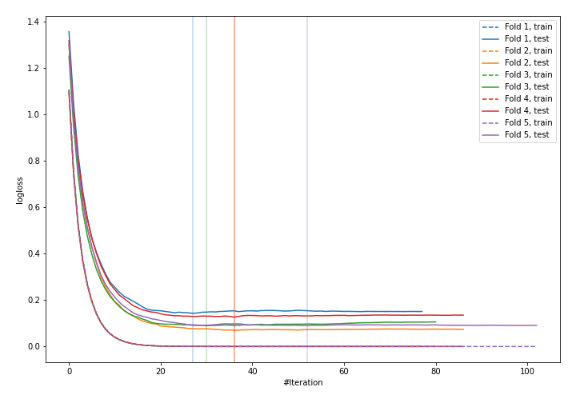
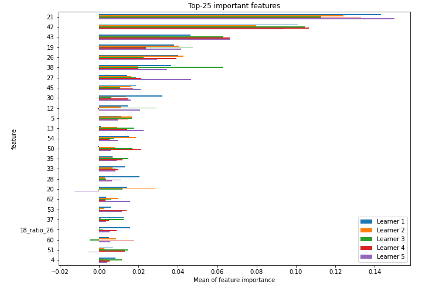
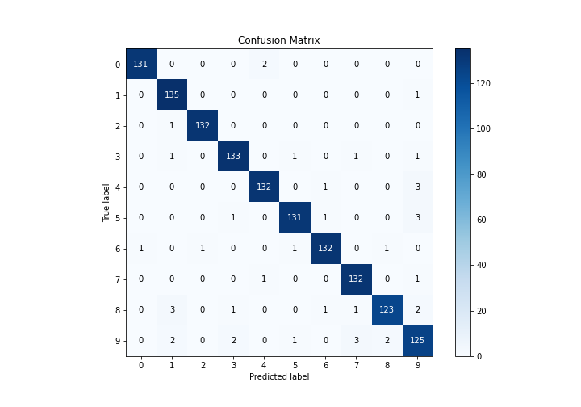
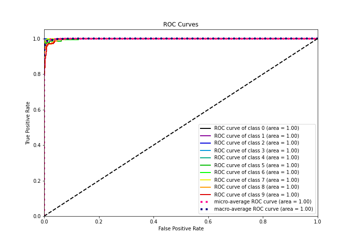
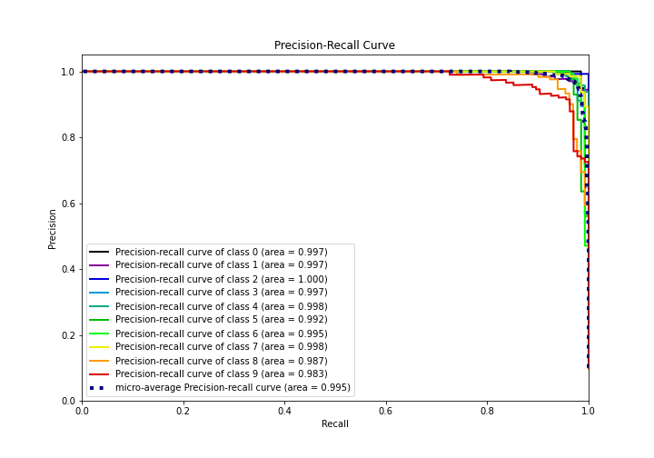

# Summary of 11_LightGBM_GoldenFeatures_SelectedFeatures

[<< Go back](../README.md)

## LightGBM
- **n_jobs**: -1
- **objective**: multiclass
- **num_leaves**: 63
- **learning_rate**: 0.2
- **feature_fraction**: 0.5
- **bagging_fraction**: 1.0
- **min_data_in_leaf**: 10
- **metric**: multi_logloss
- **custom_eval_metric_name**: None
- **num_class**: 10
- **explain_level**: 1

## Validation
 - **validation_type**: kfold
 - **k_folds**: 5
 - **shuffle**: True
 - **stratify**: True

## Optimized metric
logloss

## Training time

29.0 seconds

### Metric details
|           |          0 |          1 |          2 |          3 |          4 |          5 |          6 |          7 |          8 |          9 |   accuracy |   macro avg |   weighted avg |   logloss |
|:----------|-----------:|-----------:|-----------:|-----------:|-----------:|-----------:|-----------:|-----------:|-----------:|-----------:|-----------:|------------:|---------------:|----------:|
| precision |   0.992424 |   0.950704 |   0.992481 |   0.970803 |   0.977778 |   0.977612 |   0.977778 |   0.963504 |   0.97619  |   0.919118 |   0.969562 |    0.969839 |       0.969763 |  0.103646 |
| recall    |   0.984962 |   0.992647 |   0.992481 |   0.970803 |   0.970588 |   0.963235 |   0.970588 |   0.985075 |   0.938931 |   0.925926 |   0.969562 |    0.969524 |       0.969562 |  0.103646 |
| f1-score  |   0.988679 |   0.971223 |   0.992481 |   0.970803 |   0.97417  |   0.97037  |   0.97417  |   0.97417  |   0.957198 |   0.922509 |   0.969562 |    0.969577 |       0.969559 |  0.103646 |
| support   | 133        | 136        | 133        | 137        | 136        | 136        | 136        | 134        | 131        | 135        |   0.969562 | 1347        |    1347        |  0.103646 |

## Confusion matrix
|              |   Predicted as 0 |   Predicted as 1 |   Predicted as 2 |   Predicted as 3 |   Predicted as 4 |   Predicted as 5 |   Predicted as 6 |   Predicted as 7 |   Predicted as 8 |   Predicted as 9 |
|:-------------|-----------------:|-----------------:|-----------------:|-----------------:|-----------------:|-----------------:|-----------------:|-----------------:|-----------------:|-----------------:|
| Labeled as 0 |              131 |                0 |                0 |                0 |                2 |                0 |                0 |                0 |                0 |                0 |
| Labeled as 1 |                0 |              135 |                0 |                0 |                0 |                0 |                0 |                0 |                0 |                1 |
| Labeled as 2 |                0 |                1 |              132 |                0 |                0 |                0 |                0 |                0 |                0 |                0 |
| Labeled as 3 |                0 |                1 |                0 |              133 |                0 |                1 |                0 |                1 |                0 |                1 |
| Labeled as 4 |                0 |                0 |                0 |                0 |              132 |                0 |                1 |                0 |                0 |                3 |
| Labeled as 5 |                0 |                0 |                0 |                1 |                0 |              131 |                1 |                0 |                0 |                3 |
| Labeled as 6 |                1 |                0 |                1 |                0 |                0 |                1 |              132 |                0 |                1 |                0 |
| Labeled as 7 |                0 |                0 |                0 |                0 |                1 |                0 |                0 |              132 |                0 |                1 |
| Labeled as 8 |                0 |                3 |                0 |                1 |                0 |                0 |                1 |                1 |              123 |                2 |
| Labeled as 9 |                0 |                2 |                0 |                2 |                0 |                1 |                0 |                3 |                2 |              125 |

## Learning curves

## Permutation-based Importance

## Confusion Matrix

## Normalized Confusion Matrix

## ROC Curve

## Precision Recall Curve

[<< Go back](../README.md)
