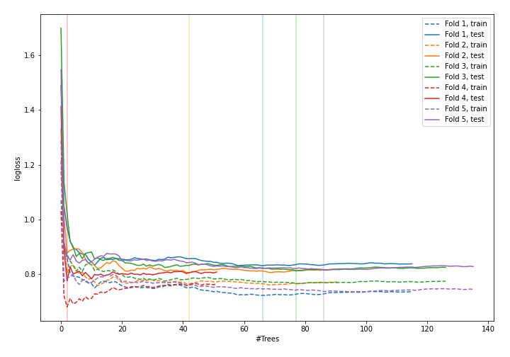
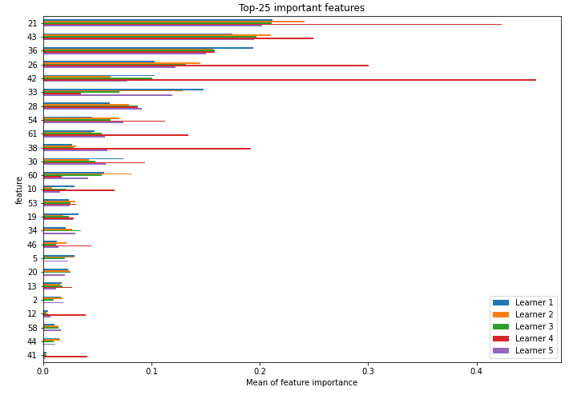
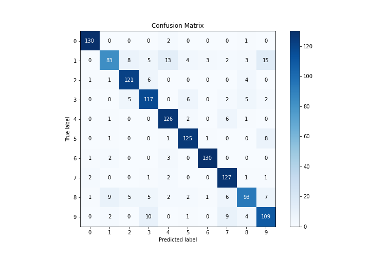
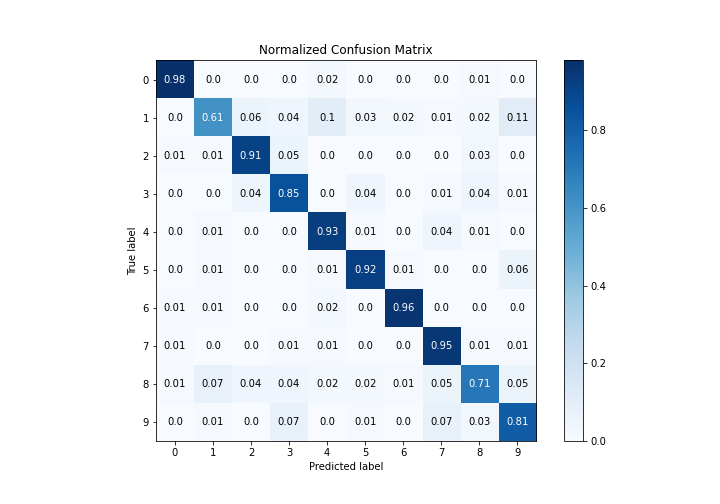
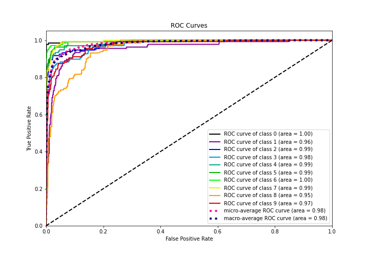
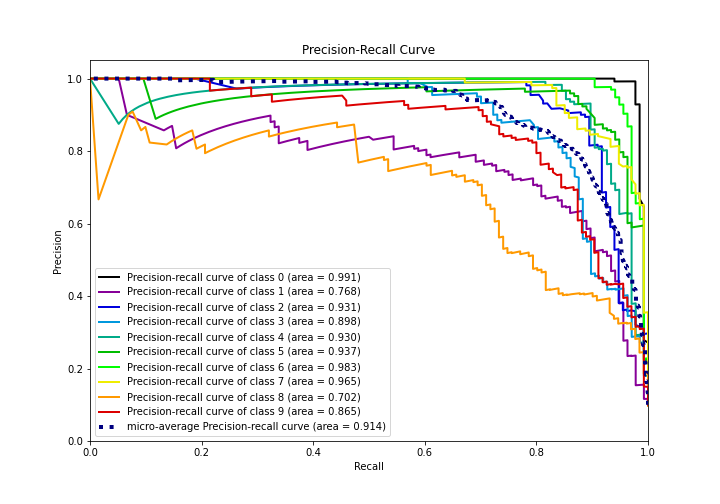

# Summary of 14_RandomForest

[<< Go back](../README.md)

## Random Forest
- **n_jobs**: -1
- **criterion**: gini
- **max_features**: 0.5
- **min_samples_split**: 20
- **max_depth**: 4
- **eval_metric_name**: logloss
- **num_class**: 10
- **explain_level**: 1

## Validation
 - **validation_type**: kfold
 - **k_folds**: 5
 - **shuffle**: True
 - **stratify**: True

## Optimized metric
logloss

## Training time

13.3 seconds

### Metric details
|           |          0 |          1 |          2 |          3 |          4 |          5 |          6 |          7 |          8 |          9 |   accuracy |   macro avg |   weighted avg |   logloss |
|:----------|-----------:|-----------:|-----------:|-----------:|-----------:|-----------:|-----------:|-----------:|-----------:|-----------:|-----------:|------------:|---------------:|----------:|
| precision |   0.962963 |   0.838384 |   0.870504 |   0.8125   |   0.845638 |   0.892857 |   0.962963 |   0.835526 |   0.830357 |   0.767606 |   0.861915 |    0.86193  |       0.861875 |  0.807765 |
| recall    |   0.977444 |   0.610294 |   0.909774 |   0.854015 |   0.926471 |   0.919118 |   0.955882 |   0.947761 |   0.709924 |   0.807407 |   0.861915 |    0.861809 |       0.861915 |  0.807765 |
| f1-score  |   0.970149 |   0.706383 |   0.889706 |   0.83274  |   0.884211 |   0.905797 |   0.95941  |   0.888112 |   0.765432 |   0.787004 |   0.861915 |    0.858894 |       0.858915 |  0.807765 |
| support   | 133        | 136        | 133        | 137        | 136        | 136        | 136        | 134        | 131        | 135        |   0.861915 | 1347        |    1347        |  0.807765 |

## Confusion matrix
|              |   Predicted as 0 |   Predicted as 1 |   Predicted as 2 |   Predicted as 3 |   Predicted as 4 |   Predicted as 5 |   Predicted as 6 |   Predicted as 7 |   Predicted as 8 |   Predicted as 9 |
|:-------------|-----------------:|-----------------:|-----------------:|-----------------:|-----------------:|-----------------:|-----------------:|-----------------:|-----------------:|-----------------:|
| Labeled as 0 |              130 |                0 |                0 |                0 |                2 |                0 |                0 |                0 |                1 |                0 |
| Labeled as 1 |                0 |               83 |                8 |                5 |               13 |                4 |                3 |                2 |                3 |               15 |
| Labeled as 2 |                1 |                1 |              121 |                6 |                0 |                0 |                0 |                0 |                4 |                0 |
| Labeled as 3 |                0 |                0 |                5 |              117 |                0 |                6 |                0 |                2 |                5 |                2 |
| Labeled as 4 |                0 |                1 |                0 |                0 |              126 |                2 |                0 |                6 |                1 |                0 |
| Labeled as 5 |                0 |                1 |                0 |                0 |                1 |              125 |                1 |                0 |                0 |                8 |
| Labeled as 6 |                1 |                2 |                0 |                0 |                3 |                0 |              130 |                0 |                0 |                0 |
| Labeled as 7 |                2 |                0 |                0 |                1 |                2 |                0 |                0 |              127 |                1 |                1 |
| Labeled as 8 |                1 |                9 |                5 |                5 |                2 |                2 |                1 |                6 |               93 |                7 |
| Labeled as 9 |                0 |                2 |                0 |               10 |                0 |                1 |                0 |                9 |                4 |              109 |

## Learning curves

## Permutation-based Importance

## Confusion Matrix

## Normalized Confusion Matrix

## ROC Curve

## Precision Recall Curve

[<< Go back](../README.md)
