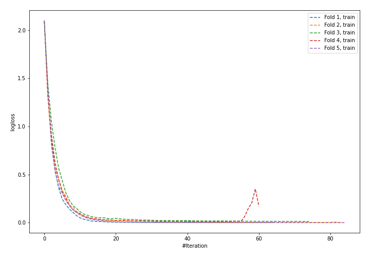
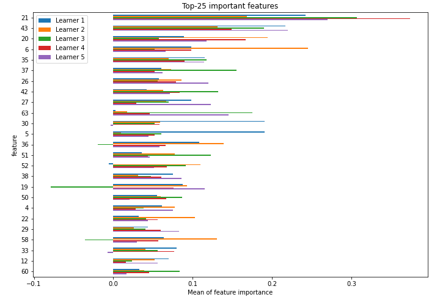
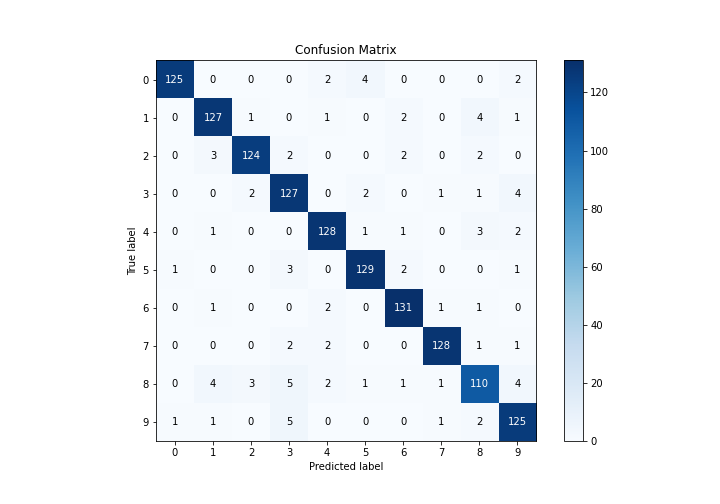
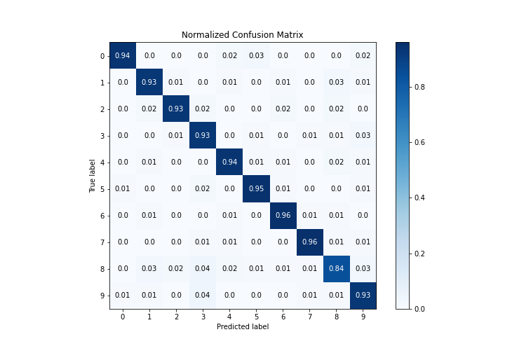
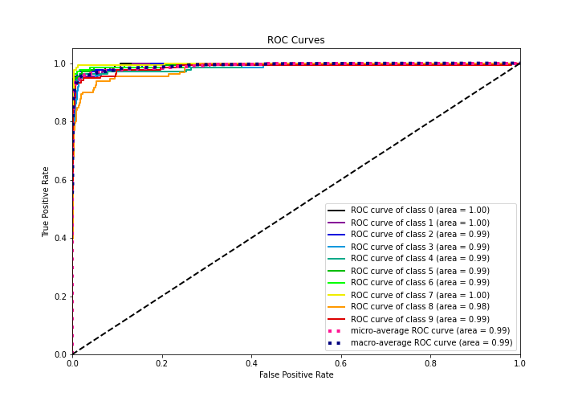
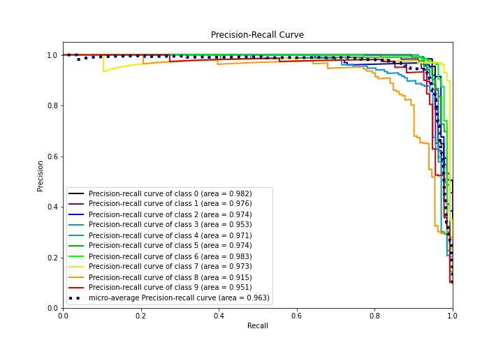

# Summary of 18_NeuralNetwork

[<< Go back](../README.md)

## Neural Network
- **n_jobs**: -1
- **dense_1_size**: 32
- **dense_2_size**: 4
- **learning_rate**: 0.05
- **num_class**: 10
- **explain_level**: 1

## Validation
 - **validation_type**: kfold
 - **k_folds**: 5
 - **shuffle**: True
 - **stratify**: True

## Optimized metric
logloss

## Training time

4.8 seconds

### Metric details
|           |          0 |          1 |          2 |          3 |          4 |          5 |          6 |          7 |          8 |          9 |   accuracy |   macro avg |   weighted avg |   logloss |
|:----------|-----------:|-----------:|-----------:|-----------:|-----------:|-----------:|-----------:|-----------:|-----------:|-----------:|-----------:|------------:|---------------:|----------:|
| precision |   0.984252 |   0.927007 |   0.953846 |   0.881944 |   0.934307 |   0.941606 |   0.942446 |   0.969697 |   0.887097 |   0.892857 |   0.930958 |    0.931506 |       0.931439 |  0.438477 |
| recall    |   0.93985  |   0.933824 |   0.932331 |   0.927007 |   0.941176 |   0.948529 |   0.963235 |   0.955224 |   0.839695 |   0.925926 |   0.930958 |    0.93068  |       0.930958 |  0.438477 |
| f1-score  |   0.961538 |   0.930403 |   0.942966 |   0.903915 |   0.937729 |   0.945055 |   0.952727 |   0.962406 |   0.862745 |   0.909091 |   0.930958 |    0.930857 |       0.930964 |  0.438477 |
| support   | 133        | 136        | 133        | 137        | 136        | 136        | 136        | 134        | 131        | 135        |   0.930958 | 1347        |    1347        |  0.438477 |

## Confusion matrix
|              |   Predicted as 0 |   Predicted as 1 |   Predicted as 2 |   Predicted as 3 |   Predicted as 4 |   Predicted as 5 |   Predicted as 6 |   Predicted as 7 |   Predicted as 8 |   Predicted as 9 |
|:-------------|-----------------:|-----------------:|-----------------:|-----------------:|-----------------:|-----------------:|-----------------:|-----------------:|-----------------:|-----------------:|
| Labeled as 0 |              125 |                0 |                0 |                0 |                2 |                4 |                0 |                0 |                0 |                2 |
| Labeled as 1 |                0 |              127 |                1 |                0 |                1 |                0 |                2 |                0 |                4 |                1 |
| Labeled as 2 |                0 |                3 |              124 |                2 |                0 |                0 |                2 |                0 |                2 |                0 |
| Labeled as 3 |                0 |                0 |                2 |              127 |                0 |                2 |                0 |                1 |                1 |                4 |
| Labeled as 4 |                0 |                1 |                0 |                0 |              128 |                1 |                1 |                0 |                3 |                2 |
| Labeled as 5 |                1 |                0 |                0 |                3 |                0 |              129 |                2 |                0 |                0 |                1 |
| Labeled as 6 |                0 |                1 |                0 |                0 |                2 |                0 |              131 |                1 |                1 |                0 |
| Labeled as 7 |                0 |                0 |                0 |                2 |                2 |                0 |                0 |              128 |                1 |                1 |
| Labeled as 8 |                0 |                4 |                3 |                5 |                2 |                1 |                1 |                1 |              110 |                4 |
| Labeled as 9 |                1 |                1 |                0 |                5 |                0 |                0 |                0 |                1 |                2 |              125 |

## Learning curves

## Permutation-based Importance

## Confusion Matrix

## Normalized Confusion Matrix

## ROC Curve

## Precision Recall Curve

[<< Go back](../README.md)
