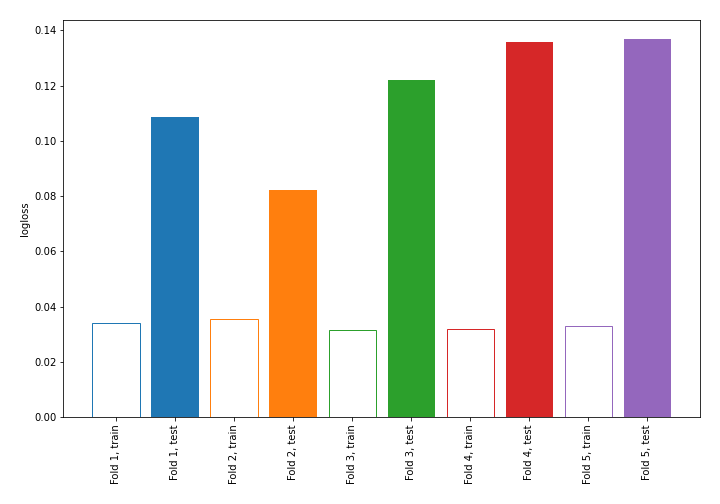
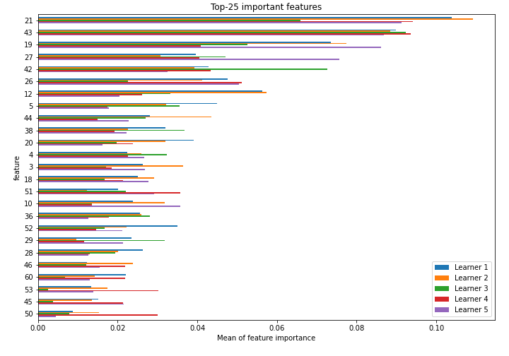
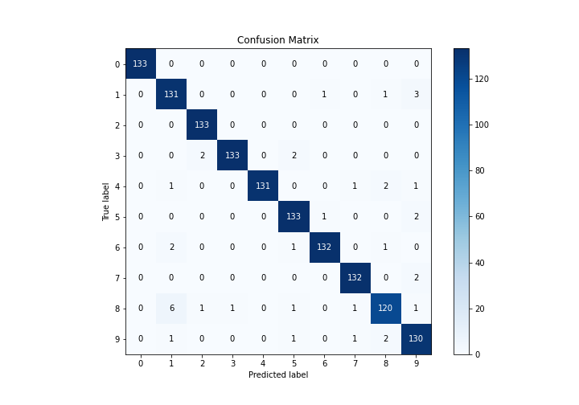
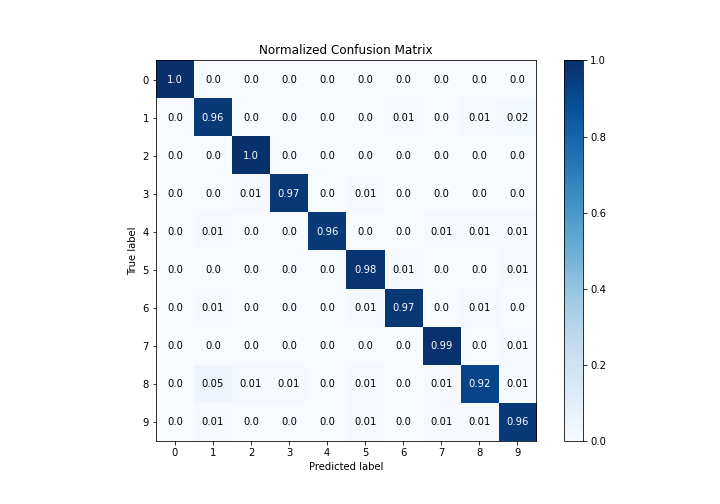
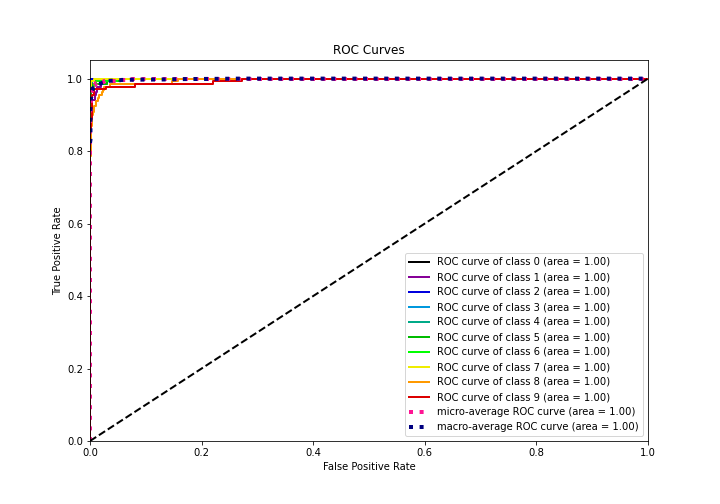
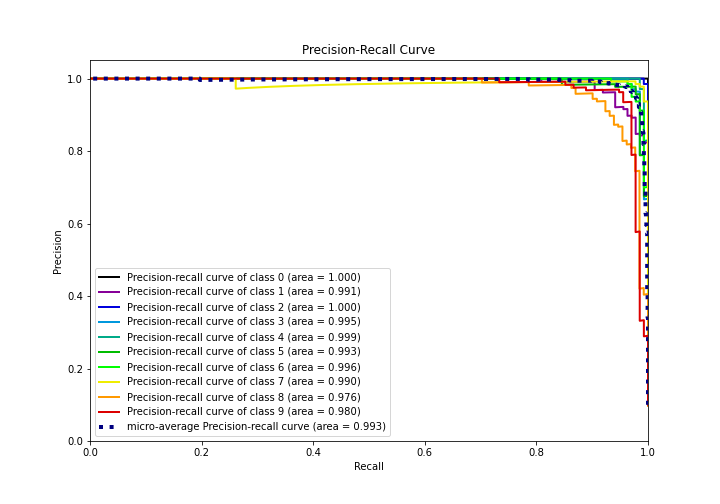

# Summary of 1_Linear

[<< Go back](../README.md)

## Logistic Regression (Linear)
- **n_jobs**: -1
- **num_class**: 10
- **explain_level**: 1

## Validation
 - **validation_type**: kfold
 - **k_folds**: 5
 - **shuffle**: True
 - **stratify**: True

## Optimized metric
logloss

## Training time

14.6 seconds

### Metric details
|           |   0 |          1 |          2 |          3 |          4 |          5 |          6 |          7 |          8 |          9 |   accuracy |   macro avg |   weighted avg |   logloss |
|:----------|----:|-----------:|-----------:|-----------:|-----------:|-----------:|-----------:|-----------:|-----------:|-----------:|-----------:|------------:|---------------:|----------:|
| precision |   1 |   0.929078 |   0.977941 |   0.992537 |   1        |   0.963768 |   0.985075 |   0.977778 |   0.952381 |   0.935252 |   0.971047 |    0.971381 |       0.971406 |   0.11709 |
| recall    |   1 |   0.963235 |   1        |   0.970803 |   0.963235 |   0.977941 |   0.970588 |   0.985075 |   0.916031 |   0.962963 |   0.971047 |    0.970987 |       0.971047 |   0.11709 |
| f1-score  |   1 |   0.945848 |   0.988848 |   0.98155  |   0.981273 |   0.970803 |   0.977778 |   0.981413 |   0.933852 |   0.948905 |   0.971047 |    0.971027 |       0.97107  |   0.11709 |
| support   | 133 | 136        | 133        | 137        | 136        | 136        | 136        | 134        | 131        | 135        |   0.971047 | 1347        |    1347        |   0.11709 |

## Confusion matrix
|              |   Predicted as 0 |   Predicted as 1 |   Predicted as 2 |   Predicted as 3 |   Predicted as 4 |   Predicted as 5 |   Predicted as 6 |   Predicted as 7 |   Predicted as 8 |   Predicted as 9 |
|:-------------|-----------------:|-----------------:|-----------------:|-----------------:|-----------------:|-----------------:|-----------------:|-----------------:|-----------------:|-----------------:|
| Labeled as 0 |              133 |                0 |                0 |                0 |                0 |                0 |                0 |                0 |                0 |                0 |
| Labeled as 1 |                0 |              131 |                0 |                0 |                0 |                0 |                1 |                0 |                1 |                3 |
| Labeled as 2 |                0 |                0 |              133 |                0 |                0 |                0 |                0 |                0 |                0 |                0 |
| Labeled as 3 |                0 |                0 |                2 |              133 |                0 |                2 |                0 |                0 |                0 |                0 |
| Labeled as 4 |                0 |                1 |                0 |                0 |              131 |                0 |                0 |                1 |                2 |                1 |
| Labeled as 5 |                0 |                0 |                0 |                0 |                0 |              133 |                1 |                0 |                0 |                2 |
| Labeled as 6 |                0 |                2 |                0 |                0 |                0 |                1 |              132 |                0 |                1 |                0 |
| Labeled as 7 |                0 |                0 |                0 |                0 |                0 |                0 |                0 |              132 |                0 |                2 |
| Labeled as 8 |                0 |                6 |                1 |                1 |                0 |                1 |                0 |                1 |              120 |                1 |
| Labeled as 9 |                0 |                1 |                0 |                0 |                0 |                1 |                0 |                1 |                2 |              130 |

## Learning curves

## Coefficients

### Coefficients learner #1
|           |            0 |            1 |            2 |            3 |            4 |            5 |            6 |            7 |            8 |            9 |
|:----------|-------------:|-------------:|-------------:|-------------:|-------------:|-------------:|-------------:|-------------:|-------------:|-------------:|
| intercept | -0.196477    | -0.766086    | -0.431867    |  0.16018     | -0.486025    | -0.232137    | -0.566123    | -0.0430656   |  2.21039     |  0.351211    |
| 1         | -0.039867    | -0.0187862   | -0.0120165   |  0.155125    | -0.211025    |  0.303093    | -0.0196043   |  0.277112    | -0.121448    | -0.312582    |
| 2         | -0.062832    |  0.0538221   |  0.156768    | -0.262285    | -0.226316    |  0.846093    | -0.449519    |  0.111934    |  0.00878605  | -0.176451    |
| 3         |  0.135006    |  0.158789    |  0.0912025   |  0.196394    | -1.07271     |  0.0484719   | -0.183477    |  0.377363    | -0.415444    |  0.664404    |
| 4         | -0.0863922   | -1.00887     |  0.0156274   |  0.90194     | -0.62561     | -0.0514111   |  0.0578878   |  0.307081    |  0.103588    |  0.386163    |
| 5         | -0.320915    |  1.04779     | -0.0999846   |  0.0766143   | -0.961301    |  0.511008    | -0.167932    |  0.0832325   | -0.136391    | -0.0321252   |
| 6         | -0.150649    |  0.209011    | -0.104505    |  0.00281205  | -0.479461    |  0.631962    | -0.155393    |  0.313605    | -0.576269    |  0.308887    |
| 7         | -0.0697732   | -0.0809432   | -0.0079082   | -0.0466312   |  0.272513    | -0.160671    | -0.000157259 |  0.122006    | -0.0181191   | -0.010317    |
| 8         | -0.00219293  | -0.00306048  | -0.162357    | -0.0685214   | -0.00347906  |  0.0109484   | -0.00361984  | -5.83378e-05 |  0.24214     | -0.009799    |
| 9         | -0.102298    | -0.812536    |  0.482637    |  0.215348    | -0.159335    | -0.0970444   | -0.291873    |  0.114771    |  0.133268    |  0.517062    |
| 10        |  0.0559548   | -1.04466     |  0.217194    |  0.266587    | -0.334629    |  0.570872    | -0.345114    |  0.122131    |  0.248877    |  0.242785    |
| 11        |  0.241034    | -0.31543     | -0.201926    |  0.17239     | -0.583512    |  0.228599    | -0.0672756   |  0.114709    |  0.173958    |  0.237453    |
| 12        |  0.0564904   |  0.743601    |  0.620826    |  0.252373    | -0.639499    | -0.351999    | -0.564648    |  0.672622    | -0.578599    | -0.211167    |
| 13        |  0.162695    |  0.100849    | -0.0914193   |  0.396778    | -0.484308    | -0.16348     | -0.489761    |  0.1568      |  0.445055    | -0.0332087   |
| 14        | -0.182362    | -0.471768    | -0.156131    |  0.480428    | -0.283054    |  0.0664221   | -0.166524    |  0.0313533   |  0.259428    |  0.422207    |
| 15        | -0.0660261   | -0.108634    | -0.00177841  |  0.0801791   |  0.0854972   | -0.123879    | -0.00126551  |  0.181489    | -0.022923    | -0.022659    |
| 16        | -0.0306841   |  0.477474    | -0.0666422   | -0.0440311   | -0.119498    | -0.0691441   | -0.013837    | -0.000122558 | -0.0983234   | -0.0351922   |
| 17        |  0.0491684   |  0.53115     | -0.0582156   | -0.0427124   |  0.309135    | -0.0582239   | -0.446141    | -0.517841    |  0.197189    |  0.0364913   |
| 18        |  0.301048    | -0.159386    | -0.112436    | -0.868874    |  0.198935    |  0.388143    |  0.0946011   | -0.554957    |  0.37299     |  0.339936    |
| 19        | -0.0215616   |  1.72122     | -0.562205    | -1.06008     |  0.171684    | -0.208786    |  0.0290714   | -0.420068    |  0.018508    |  0.332212    |
| 20        | -0.586692    |  0.794126    |  0.27803     |  0.344784    |  0.0486655   | -1.02265     | -0.61291     |  0.0505781   |  0.300601    |  0.405469    |
| 21        |  0.452022    | -0.443778    |  0.0489139   | -0.550746    | -0.0656159   | -1.033       | -0.881171    |  0.231661    |  0.722332    |  1.51938     |
| 22        |  0.106195    |  0.170654    |  0.0401563   | -0.00625286  |  0.0728877   | -0.777389    | -0.26683     |  0.466986    |  0.206303    | -0.0127104   |
| 23        | -0.0169312   | -0.0114364   | -2.70666e-05 | -0.00274454  |  0.214139    | -0.00645387  | -0.00117406  | -0.052008    | -0.01485     | -0.108514    |
| 24        | -0.0153202   |  0.0831448   | -0.00246643  | -2.26627e-06 |  0.0977774   | -0.0335093   | -0.0061633   | -5.6402e-05  | -0.10745     | -0.0159542   |
| 25        |  0.20532     |  0.103362    | -0.321024    | -0.17471     |  0.382533    |  0.382648    | -0.0107209   | -0.45617     | -0.139056    |  0.027819    |
| 26        |  0.291794    |  0.142701    | -1.04201     | -1.25213     |  0.672053    |  0.768973    |  0.176806    | -0.182861    | -0.235251    |  0.65992     |
| 27        | -0.503214    |  0.283566    | -1.03884     | -0.187862    | -0.111149    |  0.359439    | -0.0344223   | -0.537492    |  0.876943    |  0.893027    |
| 28        | -0.963445    |  0.598806    | -0.253437    |  0.63081     |  0.190851    |  0.134297    | -0.319694    |  0.0573246   | -0.293477    |  0.217965    |
| 29        |  0.107766    |  0.250736    | -0.0260042   | -0.907998    |  0.0531885   | -0.199762    | -0.292628    |  0.320164    |  0.0138964   |  0.680642    |
| 30        |  0.348748    | -0.171882    | -0.0591056   | -0.791369    |  0.678045    | -0.373588    | -0.506717    |  0.479198    |  0.00562515  |  0.391045    |
| 31        | -0.000127772 | -5.03678e-06 | -4.45972e-07 | -5.49891e-07 |  0.0210717   | -2.16312e-06 | -9.6631e-06  | -0.0187156   | -0.000247429 | -0.00196313  |
| 33        |  0.382406    | -0.37454     | -0.249984    | -0.212979    |  0.47395     | -0.0147897   |  0.419736    |  0.294378    | -0.0913511   | -0.626825    |
| 34        |  0.28517     |  0.296092    | -0.734881    | -0.379267    |  0.385182    |  0.0989891   |  0.581415    | -0.0547607   | -0.16093     | -0.317008    |
| 35        | -0.561091    | -0.0312329   | -0.358373    | -0.0621369   |  0.0348799   | -0.348937    |  0.398147    |  0.11469     |  0.572912    |  0.241144    |
| 36        | -0.856719    |  0.365861    | -0.113771    |  0.287419    |  0.610693    | -0.609643    |  0.0710615   |  0.310631    |  0.355405    | -0.420938    |
| 37        |  0.0911219   |  0.204827    | -0.587057    | -0.144086    |  0.248873    |  0.197105    | -0.0626842   |  0.427517    | -0.449889    |  0.0742718   |
| 38        |  0.214007    | -0.620708    | -0.515978    | -0.0340961   |  0.553542    |  0.618289    |  0.1337      |  0.66125     | -0.935652    | -0.0743518   |
| 40        | -0.000394943 | -2.98237e-05 | -8.3623e-07  | -4.58378e-07 |  0.00197044  | -2.81425e-07 | -0.00152174  | -3.70253e-06 | -1.82904e-05 | -3.62421e-07 |
| 41        |  0.0619537   | -0.0353251   |  0.0620422   | -0.0816632   |  0.93217     | -0.348639    | -0.0966364   |  0.0168826   |  0.0483802   | -0.559165    |
| 42        |  0.564425    | -0.0174878   |  0.32537     | -0.674392    | -0.1555      | -0.899892    |  0.87717     |  0.0395013   |  0.724921    | -0.784117    |
| 43        | -0.40721     |  0.700836    |  0.935063    | -1.06736     |  0.913171    | -0.637477    |  0.390469    |  0.347374    |  0.41213     | -1.587       |
| 44        | -0.140756    |  0.0637984   | -0.761951    |  0.171943    |  0.764507    |  0.0451562   |  0.0938795   |  0.175638    |  0.377595    | -0.789809    |
| 45        |  0.204388    | -0.263585    | -0.865479    |  0.672722    |  0.0435028   |  0.280579    |  0.071947    | -0.0508203   |  0.156929    | -0.250185    |
| 46        |  0.0593039   | -0.714851    | -0.402043    |  0.508567    |  0.0619442   |  0.089324    |  0.41911     | -0.041662    |  0.255899    | -0.235592    |
| 47        | -0.000799242 | -0.0872579   |  0.0436198   | -0.0421239   | -0.00436939  | -0.00120135  |  0.10427     | -0.000720003 | -0.00972586  | -0.00169223  |
| 48        | -0.00081851  | -0.00909993  |  0.0114482   | -2.27653e-05 |  0.000601094 |  4.11017e-07 | -8.00967e-05 | -5.43538e-05 | -0.00197005  | -4.03257e-06 |
| 49        | -0.168285    | -0.00115128  |  0.243237    |  0.00699293  |  0.268306    | -0.298425    | -0.221249    | -0.12865     | -0.0511105   |  0.350336    |
| 50        |  0.422505    | -0.0618115   |  0.231108    | -0.203167    | -0.395244    | -0.0243859   |  0.0267296   | -0.282749    |  0.523949    | -0.236935    |
| 51        | -0.143673    |  0.277729    |  0.990694    | -0.566067    |  0.201363    | -0.224147    |  0.362649    |  0.327092    | -0.587577    | -0.638062    |
| 52        |  0.192093    |  0.515228    |  0.495468    |  0.256596    |  0.214074    |  0.149823    | -0.124466    | -0.618214    | -0.565983    | -0.514619    |
| 53        |  0.0158563   | -0.179499    |  0.621595    |  0.352403    | -0.528782    | -0.212618    |  0.712837    | -0.745949    |  0.365086    | -0.40093     |
| 54        | -0.124774    | -0.222014    |  0.405205    |  0.672415    | -0.425796    | -0.517771    |  0.336405    | -0.25638     |  0.0367438   |  0.095965    |
| 55        | -0.0983797   |  0.311328    |  0.133014    | -0.105525    | -0.0205493   | -0.0317181   | -0.221752    | -0.0165659   | -0.123305    |  0.173454    |
| 56        | -1.52713e-06 | -0.00302533  |  0.00381691  | -7.43533e-06 | -0.000112356 |  2.44162e-07 | -1.36938e-06 | -1.3114e-05  | -0.000654732 | -1.28759e-06 |
| 57        | -0.0458612   | -0.0856065   |  0.362926    |  0.218073    | -0.184953    |  0.299212    | -0.0164391   | -0.0580698   | -0.11211     | -0.377172    |
| 58        | -0.139964    | -0.344637    |  0.205923    |  0.385465    | -0.0808051   |  0.447074    | -0.323676    |  0.0848856   | -0.478393    |  0.244127    |
| 59        |  0.293045    | -0.0609565   |  0.12367     |  0.0452045   | -0.436758    |  0.593734    | -0.206932    | -0.321259    |  0.00177773  | -0.0315255   |
| 60        | -0.142085    |  0.0836493   |  0.231195    |  0.116527    | -0.372188    |  0.177783    |  0.25684     | -0.927672    |  0.368763    |  0.207188    |
| 61        | -0.191769    |  0.261952    |  0.432179    |  0.0586078   | -0.547072    |  0.090902    |  0.831056    | -0.590614    | -0.105034    | -0.240207    |
| 62        | -0.159528    |  0.479854    |  0.670477    |  0.0743683   | -0.275168    | -0.586318    |  0.0483955   | -0.185063    | -0.215696    |  0.148679    |
| 63        | -0.104084    |  0.450595    |  0.293439    | -0.0658451   | -0.0150401   | -0.145601    | -0.159379    | -0.0126204   | -0.113821    | -0.127644    |

### Coefficients learner #2
|           |            0 |            1 |            2 |            3 |           4 |            5 |            6 |            7 |            8 |            9 |
|:----------|-------------:|-------------:|-------------:|-------------:|------------:|-------------:|-------------:|-------------:|-------------:|-------------:|
| intercept | -0.00539832  | -0.800659    | -0.316562    | -0.265994    | -0.661118   |  0.183427    | -0.237148    | -0.145548    |  2.10172     |  0.147281    |
| 1         |  0.0206367   |  0.0302765   |  0.013061    |  0.0621581   | -0.124705   |  0.230323    | -0.0623608   |  0.260768    | -0.00261558  | -0.427542    |
| 2         | -0.147341    |  0.0155154   |  0.197466    | -0.114865    | -0.256848   |  0.522088    | -0.39684     |  0.0216846   |  0.105852    |  0.0532878   |
| 3         |  0.320652    |  0.129505    |  0.106834    |  0.123776    | -0.954658   | -0.233448    | -0.0794493   |  0.307074    | -0.244393    |  0.524108    |
| 4         | -0.0306166   | -0.943368    |  0.0156349   |  0.814967    | -0.715374   |  0.0745806   | -0.216116    |  0.323934    |  0.176057    |  0.5003      |
| 5         | -0.374621    |  0.793459    | -0.120654    |  0.317463    | -0.836542   |  0.671352    | -0.316905    |  0.148802    | -0.0658396   | -0.216514    |
| 6         | -0.12654     |  0.0149202   | -0.0594252   |  0.00444108  | -0.419448   |  0.521041    | -0.131723    |  0.392003    | -0.445074    |  0.249804    |
| 7         | -0.0562438   | -0.0387307   | -0.00529263  | -0.0124944   | -0.0257191  | -0.0146716   | -0.000518355 |  0.167468    | -0.0321203   |  0.0183232   |
| 8         | -0.00395079  | -0.0155756   | -0.148252    | -0.0623399   | -0.00383293 |  0.0148243   | -0.00593493  | -0.000120961 |  0.247258    | -0.0220752   |
| 9         |  0.0400177   | -0.772687    |  0.418351    |  0.340223    | -0.251295   | -0.139235    | -0.401924    |  0.195117    |  0.0629445   |  0.508487    |
| 10        | -0.178592    | -0.959839    |  0.178676    |  0.553559    | -0.327344   |  0.318008    | -0.373511    |  0.1986      |  0.362452    |  0.227991    |
| 11        |  0.22541     | -0.389662    | -0.193709    |  0.075093    | -0.564318   |  0.331322    |  0.0600194   |  0.0928855   |  0.153701    |  0.209258    |
| 12        |  0.142463    |  0.811829    |  0.622371    |  0.24996     | -0.714036   | -0.242548    | -0.731638    |  0.761528    | -0.701103    | -0.198827    |
| 13        |  0.123336    |  0.179772    | -0.152672    |  0.558346    | -0.694049   | -0.313601    | -0.283817    |  0.047267    |  0.533455    |  0.00196261  |
| 14        | -0.129545    | -0.263635    | -0.176726    |  0.462615    | -0.34847    | -0.0401221   | -0.0127027   |  0.0167571   |  0.211806    |  0.280021    |
| 15        | -0.0688285   | -0.0544512   | -0.00269875  |  0.0517475   |  0.0411713  | -0.0614569   | -0.00478589  |  0.147918    | -0.0222655   | -0.0263506   |
| 16        | -0.0524753   |  0.56239     | -0.0592323   | -0.0436044   | -0.162496   | -0.0540336   | -0.0759525   | -0.000132445 | -0.0751918   | -0.0392715   |
| 17        |  0.00912223  |  0.581199    | -0.138651    | -0.0824314   |  0.36652    | -0.182652    | -0.204932    | -0.604395    |  0.193674    |  0.0625464   |
| 18        |  0.11258     | -0.117774    | -0.164347    | -1.06333     |  0.306791   |  0.511166    |  0.238053    | -0.614186    |  0.386638    |  0.40441     |
| 19        | -0.108713    |  1.74294     | -0.584035    | -0.969986    |  0.145349   | -0.126462    |  0.0137077   | -0.545019    | -0.0350471   |  0.46727     |
| 20        | -0.552731    |  0.768738    |  0.202153    |  0.294226    | -0.0248748  | -0.893144    | -0.590225    |  0.149969    |  0.303699    |  0.34219     |
| 21        |  0.35438     | -0.301113    | -0.00202448  | -0.449658    | -0.0733866  | -1.05097     | -0.936707    |  0.286999    |  0.556464    |  1.61602     |
| 22        |  0.0956597   |  0.179493    |  0.0534856   | -0.0421794   |  0.153585   | -0.952295    | -0.263205    |  0.387669    |  0.150048    |  0.237739    |
| 23        | -0.0140188   | -0.0214586   | -4.44304e-05 | -0.000925186 |  0.065422   | -0.0107406   | -0.00444634  | -0.042854    | -0.0059549   |  0.0350207   |
| 24        | -0.0259364   |  0.0270971   | -0.0010109   | -5.33819e-07 |  0.17727    | -0.0268208   | -0.0373205   | -6.06083e-05 | -0.0947851   | -0.0184321   |
| 25        |  0.153944    |  0.117525    | -0.365288    | -0.253095    |  0.278036   |  0.172386    |  0.318537    | -0.273403    | -0.268338    |  0.119696    |
| 26        |  0.258313    |  0.209735    | -1.03382     | -1.2279      |  0.542735   |  0.922933    |  0.272827    | -0.217863    | -0.291057    |  0.564104    |
| 27        | -0.465995    |  0.3975      | -1.26743     | -0.2947      | -0.191282   |  0.0773505   |  0.311532    | -0.569015    |  1.13009     |  0.871951    |
| 28        | -1.03875     |  0.52813     | -0.266788    |  0.446276    |  0.11968    |  0.288175    | -0.173983    |  0.0140873   | -0.377558    |  0.460732    |
| 29        |  0.108633    |  0.182137    |  0.0525411   | -0.908689    | -0.0257245  | -0.361693    | -0.267398    |  0.362032    |  0.141485    |  0.716676    |
| 30        |  0.305756    |  0.106097    | -0.156965    | -0.662277    |  0.65304    | -0.475458    | -0.389466    |  0.427685    | -0.0278212   |  0.21941     |
| 31        | -0.000182552 | -3.76377e-05 | -3.90253e-07 | -3.31824e-07 |  0.00383532 | -4.75172e-05 | -0.000132466 | -0.00238337  | -1.83918e-05 | -0.00103266  |
| 33        |  0.283942    |  0.0604137   | -0.174516    | -0.182552    |  0.415245   |  0.0571078   |  0.386297    |  0.0721223   | -0.113838    | -0.804223    |
| 34        |  0.306606    |  0.384081    | -0.537017    | -0.519182    |  0.374105   |  0.0657592   |  0.534297    |  0.0658792   | -0.257784    | -0.416746    |
| 35        | -0.608106    | -0.205226    | -0.276715    | -0.0819231   | -0.155935   | -0.42679     |  0.573683    |  0.1641      |  0.699556    |  0.317356    |
| 36        | -0.95947     |  0.450291    | -0.0600694   |  0.321886    |  0.638091   | -0.404374    | -0.107237    |  0.339426    |  0.269929    | -0.488473    |
| 37        |  0.0291469   |  0.256217    | -0.682842    | -0.122895    |  0.181488   |  0.197496    | -0.152828    |  0.64633     | -0.500477    |  0.148364    |
| 38        |  0.309787    | -0.576902    | -0.572537    | -0.245602    |  0.591923   |  0.684164    |  0.265283    |  0.55372     | -0.939152    | -0.0706851   |
| 40        | -0.000214871 | -1.70993e-05 | -1.35219e-06 | -5.36342e-07 |  0.00663038 | -1.01032e-06 | -0.00638133  | -5.87227e-06 | -7.79947e-06 | -5.1026e-07  |
| 41        | -0.0269602   | -0.19278     |  0.135081    | -0.123747    |  0.833198   | -0.534992    |  0.00431537  |  0.1367      |  0.0369261   | -0.267741    |
| 42        |  0.622207    | -0.304761    |  0.241525    | -0.599434    | -0.126955   | -0.680331    |  0.91235     | -0.105125    |  0.740504    | -0.699981    |
| 43        | -0.245306    |  0.813125    |  0.918729    | -1.31525     |  1.01652    | -0.385894    |  0.344959    |  0.345327    |  0.172691    | -1.6649      |
| 44        | -0.284772    |  0.0473849   | -0.678758    |  0.20594     |  0.86128    | -0.142479    |  0.341653    |  0.150666    |  0.39602     | -0.896935    |
| 45        |  0.191573    | -0.325735    | -0.749911    |  0.620669    |  0.0584641  |  0.200899    |  0.291552    | -0.069806    |  0.182362    | -0.400067    |
| 46        |  0.0459532   | -0.791786    | -0.428666    |  0.428475    |  0.0808918  |  0.205903    |  0.46999     | -0.0692209   |  0.341185    | -0.282724    |
| 47        | -0.00314469  | -0.0723436   |  0.0475661   | -0.0478275   | -0.00650769 | -0.00267739  |  0.0996991   | -0.000530564 | -0.0136925   | -0.000541335 |
| 48        | -0.000495822 | -1.02285e-05 | -2.57833e-06 | -5.68849e-07 |  0.00117015 | -3.95739e-07 | -0.000635228 | -2.18354e-05 | -3.00801e-06 | -4.87431e-07 |
| 49        | -0.362134    | -0.229149    |  0.194134    |  0.163892    |  0.33029    | -0.385155    | -0.0994005   | -0.0719925   |  0.0139041   |  0.445611    |
| 50        |  0.345782    |  0.130411    |  0.188498    | -0.256828    | -0.500714   | -0.261389    |  0.547655    | -0.191649    |  0.351283    | -0.353048    |
| 51        |  0.0482004   |  0.129802    |  0.902743    | -0.39331     |  0.290813   | -0.395351    |  0.223128    |  0.307013    | -0.661684    | -0.451354    |
| 52        |  0.213646    |  0.639142    |  0.582392    | -0.0549504   |  0.189807   |  0.140745    | -0.117272    | -0.656792    | -0.490091    | -0.446626    |
| 53        |  0.186509    | -0.149857    |  0.605621    |  0.397909    | -0.51703    |  0.0413866   |  0.526466    | -0.793865    |  0.139488    | -0.436627    |
| 54        | -0.052565    | -0.335937    |  0.404874    |  0.456845    | -0.448931   | -0.47283     |  0.438946    | -0.220418    |  0.0942651   |  0.135753    |
| 55        | -0.0822463   |  0.39849     |  0.143121    |  0.0725164   | -0.0358038  | -0.0470245   | -0.272912    | -0.0111306   | -0.188385    |  0.0233738   |
| 56        |  0           |  0           |  0           |  0           |  0          |  0           |  0           |  0           |  0           |  0           |
| 57        | -0.0682488   |  0.0534156   |  0.230733    |  0.0855487   | -0.108245   |  0.399181    | -0.0470684   | -0.0839037   | -0.144332    | -0.31708     |
| 58        | -0.157368    | -0.271929    |  0.36327     |  0.488222    | -0.0816126  |  0.615504    | -0.399544    |  0.0284106   | -0.651229    |  0.0662756   |
| 59        |  0.217238    |  0.0790738   |  0.139007    |  0.0484795   | -0.624518   |  0.597713    | -0.277171    | -0.248926    | -0.03966     |  0.108764    |
| 60        | -0.0191571   |  0.36056     |  0.272148    |  0.0002097   | -0.46285    |  0.111125    |  0.102518    | -0.843977    |  0.430661    |  0.0487625   |
| 61        | -0.0653885   |  0.292401    |  0.491212    |  0.124707    | -0.643081   | -0.0118436   |  0.424735    | -0.65203     |  0.0640802   | -0.0247931   |
| 62        | -0.110272    |  0.473993    |  0.576118    |  0.104453    | -0.372853   | -0.628831    |  0.0358854   | -0.183653    | -0.0956791   |  0.20084     |
| 63        | -0.0724796   |  0.40737     |  0.381971    | -0.154718    | -0.0391465  | -0.131328    | -0.229206    | -0.00698492  | -0.118806    | -0.0366728   |

### Coefficients learner #3
|           |            0 |            1 |            2 |            3 |            4 |            5 |            6 |            7 |            8 |            9 |
|:----------|-------------:|-------------:|-------------:|-------------:|-------------:|-------------:|-------------:|-------------:|-------------:|-------------:|
| intercept | -0.113211    | -0.980657    | -0.40913     |  0.152595    | -0.503933    |  0.369387    | -0.359936    | -0.028046    |  2.20046     | -0.327526    |
| 1         |  0.0629056   | -0.0547246   | -0.0498031   |  0.357356    | -0.174033    |  0.159139    | -0.0580845   |  0.11542     |  0.00698713  | -0.365162    |
| 2         | -0.135474    | -0.0302335   |  0.193959    | -0.133604    | -0.213867    |  0.853129    | -0.306546    |  0.00320457  |  0.0669831   | -0.297553    |
| 3         |  0.136259    |  0.226474    |  0.0864004   |  0.186026    | -0.985827    | -0.213674    | -0.184296    |  0.386737    | -0.153738    |  0.51564     |
| 4         | -0.119326    | -0.934381    |  0.0280695   |  1.00176     | -0.647276    |  0.0751295   | -0.234119    |  0.435611    |  0.0784842   |  0.316047    |
| 5         | -0.294603    |  1.0649      | -0.130709    |  0.184583    | -0.818353    |  0.665214    | -0.420801    |  0.156135    | -0.0639613   | -0.342406    |
| 6         | -0.170846    | -0.0534681   | -0.0962709   | -0.138288    | -0.30765     |  0.754949    | -0.12586     |  0.345274    | -0.472172    |  0.264332    |
| 7         | -0.0695981   | -0.050555    | -0.0120856   | -0.0183919   |  0.204646    | -0.0404319   | -0.000971211 |  0.0398498   | -0.0177342   | -0.0347282   |
| 8         | -0.00411154  | -0.0244591   | -0.147788    | -0.028602    | -0.00212315  |  0.0130005   | -0.000725709 | -8.03892e-05 |  0.211527    | -0.0166382   |
| 9         |  0.0342919   | -0.832731    |  0.408878    |  0.170361    | -0.136264    |  0.0159887   | -0.431567    |  0.129942    |  0.12729     |  0.513811    |
| 10        | -0.159086    | -0.872444    |  0.22626     |  0.352921    | -0.43879     |  0.483445    | -0.422577    |  0.112924    |  0.343174    |  0.374173    |
| 11        |  0.259573    | -0.487015    | -0.152324    |  0.18559     | -0.471312    |  0.469407    | -0.0868269   |  0.159819    | -0.0773314   |  0.20042     |
| 12        |  0.206958    |  0.842146    |  0.622877    |  0.338508    | -0.766493    | -0.34163     | -0.861716    |  0.550709    | -0.642807    |  0.0514477   |
| 13        |  0.129595    | -0.0338656   | -0.106469    |  0.550957    | -0.582819    | -0.323873    | -0.335001    |  0.0388729   |  0.587043    |  0.0755598   |
| 14        | -0.0854198   | -0.321967    | -0.168708    |  0.26233     | -0.2573      | -0.0890481   |  0.0233307   |  0.0788038   |  0.158975    |  0.399003    |
| 15        | -0.0941677   | -0.0555628   | -0.0031485   |  0.04616     |  0.0713109   | -0.0662578   | -0.00194333  |  0.265778    | -0.0123738   | -0.149795    |
| 16        | -0.0452268   |  0.492481    | -0.0726871   | -0.0136103   | -0.0907689   | -0.0548191   | -0.015287    | -9.42929e-05 | -0.074961    | -0.125026    |
| 17        |  0.0294751   |  0.628692    |  0.0385083   | -0.337716    |  0.221306    |  0.0284958   | -0.325737    | -0.488515    |  0.0289699   |  0.176522    |
| 18        |  0.223559    | -0.270021    | -0.150232    | -1.08881     |  0.403216    |  0.362279    |  0.378376    | -0.635533    |  0.340322    |  0.436844    |
| 19        | -0.0696112   |  1.50703     | -0.463411    | -0.939389    |  0.273322    | -0.186444    |  0.0662517   | -0.467166    |  0.124783    |  0.154638    |
| 20        | -0.602417    |  0.950265    |  0.283281    |  0.250849    | -0.0206703   | -0.945935    | -0.598704    |  0.0255588   |  0.426252    |  0.231521    |
| 21        |  0.389828    | -0.280272    | -0.00991199  | -0.45433     |  0.00628377  | -1.04078     | -0.892869    |  0.218456    |  0.478459    |  1.58514     |
| 22        |  0.0480533   |  0.48395     |  0.0875764   | -0.0973064   | -0.0396638   | -0.874823    | -0.268824    |  0.332854    |  0.111873    |  0.21631     |
| 23        | -0.022171    | -0.0264967   | -3.82231e-05 | -0.00018135  |  0.246018    | -0.0151534   | -0.0034004   | -0.0151046   | -0.00716723  | -0.156305    |
| 24        | -0.0225652   |  0.0455602   | -0.00373073  | -9.25705e-07 |  0.16354     | -0.0275217   | -0.00823989  | -8.08333e-05 | -0.085117    | -0.0618437   |
| 25        |  0.157796    |  0.0437449   | -0.368342    |  0.0223842   |  0.164579    |  0.0624924   |  0.249035    | -0.406759    |  0.0167041   |  0.058366    |
| 26        |  0.249295    |  0.275349    | -1.03532     | -1.13228     |  0.525482    |  0.809616    |  0.239054    | -0.260921    | -0.21194     |  0.54166     |
| 27        | -0.517265    |  0.71988     | -1.11609     | -0.172911    | -0.250345    | -0.0142741   |  0.230125    | -0.602682    |  0.895404    |  0.828163    |
| 28        | -1.04436     |  0.47803     | -0.283663    |  0.527229    |  0.121414    |  0.390123    | -0.152716    |  0.0800659   | -0.339151    |  0.223025    |
| 29        |  0.143217    |  0.215439    |  0.00316389  | -1.00556     | -0.051673    | -0.229907    | -0.239995    |  0.380618    | -0.132379    |  0.917074    |
| 30        |  0.341842    | -0.104022    | -0.175574    | -0.653741    |  0.671026    | -0.41194     | -0.445184    |  0.499358    | -0.00248396  |  0.28072     |
| 31        | -0.0001579   | -1.13369e-05 | -1.72355e-06 | -1.81239e-07 |  0.019427    | -2.10028e-07 | -2.34684e-05 | -0.0150058   | -4.74645e-05 | -0.00417893  |
| 33        |  0.332044    | -0.119573    | -0.0936873   | -0.216945    |  0.557122    |  0.0556636   |  0.632716    |  0.167606    | -0.253669    | -1.06128     |
| 34        |  0.239382    |  0.388458    | -0.644136    | -0.46544     |  0.299392    |  0.164144    |  0.517571    |  0.174629    | -0.38275     | -0.291249    |
| 35        | -0.579122    |  0.115399    | -0.183716    | -0.322758    |  0.0247885   | -0.348412    |  0.484676    |  0.146173    |  0.446664    |  0.21631     |
| 36        | -0.935052    |  0.178549    | -0.0335958   |  0.347037    |  0.609054    | -0.33829     |  0.0920878   |  0.4155      |  0.426186    | -0.761477    |
| 37        |  0.0747774   |  0.237355    | -0.654986    |  0.140285    |  0.213047    |  0.119414    | -0.0258069   |  0.415562    | -0.292003    | -0.227645    |
| 38        |  0.269448    | -0.740899    | -0.564607    | -0.0388013   |  0.581474    |  0.60712     |  0.245925    |  0.438758    | -1.01053     |  0.212112    |
| 40        | -0.000309794 | -7.08648e-06 | -3.27374e-06 | -1.38625e-07 |  0.000371734 | -1.15188e-07 | -3.98159e-05 | -1.02354e-05 | -1.17015e-06 | -1.04144e-07 |
| 41        | -0.116316    | -0.184883    |  0.207915    | -0.170761    |  0.806741    | -0.478407    | -0.144688    |  0.107705    |  0.0649982   | -0.0923054   |
| 42        |  0.554052    | -0.142742    |  0.276734    | -0.558094    | -0.19603     | -0.675615    |  0.911232    | -0.0548962   |  0.846243    | -0.960884    |
| 43        | -0.313765    |  0.701264    |  0.906       | -1.03943     |  0.976012    | -0.516504    |  0.218948    |  0.263713    |  0.263315    | -1.45955     |
| 44        | -0.336935    |  0.318281    | -0.850623    |  0.114863    |  0.760369    | -0.157118    |  0.215677    |  0.255602    |  0.380105    | -0.700221    |
| 45        |  0.153034    | -0.178099    | -0.686516    |  0.661916    |  0.0414188   |  0.172252    |  0.28283     |  0.00133385  |  0.117906    | -0.566076    |
| 46        |  0.0649816   | -0.715678    | -0.414189    |  0.259379    | -0.0339037   |  0.0102448   |  0.432609    |  0.00934913  |  0.241528    |  0.145679    |
| 47        | -0.00204713  | -0.00619971  |  0.0386626   | -0.037576    | -0.00401707  | -0.00510443  |  0.0265957   | -0.000486949 | -0.008481    | -0.00134603  |
| 48        | -0.00124561  | -0.000476241 |  0.00354991  | -1.39259e-05 |  0.000329902 |  2.71686e-07 | -0.000164616 | -0.000161104 | -0.00179904  | -1.95482e-05 |
| 49        | -0.216097    | -0.158202    |  0.276538    | -0.00668486  |  0.265662    | -0.284501    | -0.224611    | -0.102457    |  0.00199123  |  0.448361    |
| 50        |  0.274201    | -0.11621     |  0.164534    | -0.00777408  | -0.443691    | -0.315185    |  0.56598     |  0.0358185   |  0.372313    | -0.529986    |
| 51        | -0.0466651   |  0.385007    |  0.936275    | -0.563445    |  0.27911     | -0.28539     |  0.280617    |  0.281085    | -0.597908    | -0.668685    |
| 52        |  0.332166    |  0.612493    |  0.550732    |  0.148083    |  0.181258    | -0.10898     | -0.0804844   | -0.73204     | -0.444501    | -0.458726    |
| 53        |  0.134062    | -0.0272816   |  0.534965    |  0.392213    | -0.474694    | -0.0580467   |  0.522672    | -0.795733    |  0.211311    | -0.439469    |
| 54        | -0.0766895   | -0.315426    |  0.366461    |  0.561242    | -0.42378     | -0.431391    |  0.406065    | -0.22275     | -0.0774845   |  0.213753    |
| 55        | -0.175281    |  0.336472    |  0.235659    | -0.089642    | -0.0289812   | -0.0918606   | -0.194804    | -0.0161732   | -0.180421    |  0.205031    |
| 56        | -2.13711e-06 | -0.00014932  |  0.00118786  | -4.45356e-06 | -0.000392095 |  2.1838e-07  | -5.0006e-07  | -3.52034e-05 | -0.000598006 | -6.36424e-06 |
| 57        | -0.0461813   |  0.0241918   |  0.341946    | -0.00743571  | -0.164956    |  0.147367    | -0.0552074   |  0.0587247   | -0.0667982   | -0.231651    |
| 58        | -0.130395    | -0.423606    |  0.29034     |  0.460362    | -0.0114482   |  0.590257    | -0.270396    |  0.0592832   | -0.50296     | -0.0614376   |
| 59        |  0.331644    |  0.19102     |  0.150828    |  0.151604    | -0.564436    |  0.538163    | -0.425919    | -0.286458    | -0.0293413   | -0.0571049   |
| 60        | -0.0689057   |  0.124535    |  0.244889    | -0.0814624   | -0.379721    |  0.2378      |  0.111411    | -0.91748     |  0.709892    |  0.019043    |
| 61        | -0.128631    |  0.550291    |  0.502672    |  0.273339    | -0.577103    |  0.104118    |  0.361621    | -0.66613     |  0.169912    | -0.590087    |
| 62        | -0.102308    |  0.477314    |  0.465705    |  0.00586972  | -0.356041    | -0.231239    |  0.134842    | -0.203012    | -0.0958923   | -0.0952381   |
| 63        | -0.0877017   |  0.368087    |  0.405157    | -0.141039    | -0.0400873   | -0.239658    | -0.264501    | -0.00688831  | -0.0524635   |  0.059095    |

### Coefficients learner #4
|           |            0 |            1 |            2 |            3 |            4 |            5 |            6 |            7 |            8 |            9 |
|:----------|-------------:|-------------:|-------------:|-------------:|-------------:|-------------:|-------------:|-------------:|-------------:|-------------:|
| intercept | -0.131872    | -0.587945    | -0.411564    |  0.110709    | -0.339743    | -0.00190122  | -0.569998    |  0.211338    |  1.56269     |  0.15829     |
| 1         |  0.0503493   | -0.100964    | -0.00168172  |  0.188525    | -0.195861    |  0.29238     | -0.0369539   |  0.190242    |  0.0606776   | -0.446714    |
| 2         | -0.128884    |  0.217014    |  0.120248    | -0.316232    | -0.188596    |  0.705054    | -0.348276    |  0.151175    | -0.212779    |  0.00127648  |
| 3         |  0.224049    |  0.131474    |  0.141547    |  0.0650773   | -0.756568    | -0.134513    | -0.161021    |  0.374319    | -0.469137    |  0.584773    |
| 4         |  0.0238953   | -0.765666    |  0.166563    |  0.883367    | -0.482484    | -0.0365979   | -0.225584    |  0.217294    | -0.205617    |  0.42483     |
| 5         | -0.324639    |  0.769807    | -0.144747    |  0.132768    | -0.895345    |  0.776711    | -0.265842    |  0.149988    |  0.0974956   | -0.296195    |
| 6         | -0.157422    |  0.00297236  | -0.132141    | -0.0441652   | -0.521837    |  0.847647    | -0.134983    |  0.420016    | -0.550043    |  0.269955    |
| 7         | -0.0349126   | -0.0758002   | -0.00170817  | -0.0297323   |  0.276507    | -0.0177394   | -0.00064873  |  0.0882084   | -0.0196059   | -0.184568    |
| 8         | -0.000426321 | -0.00560544  | -0.0221985   | -0.00463908  | -0.000382293 | -0.000653089 | -0.000147066 | -3.14838e-05 |  0.0513285   | -0.0172452   |
| 9         |  0.0538539   | -0.746127    |  0.512686    |  0.262562    | -0.0536997   |  0.0148859   | -0.359166    |  0.0331782   | -0.0497482   |  0.331575    |
| 10        | -0.0391224   | -0.940034    |  0.0980095   |  0.287044    | -0.267649    |  0.607485    | -0.462726    |  0.110017    |  0.291984    |  0.314992    |
| 11        |  0.271438    | -0.314324    | -0.281931    |  0.0357182   | -0.421578    |  0.350103    |  0.116366    |  0.132183    | -0.111611    |  0.223636    |
| 12        |  0.13642     |  0.759354    |  0.705182    |  0.35128     | -0.590117    | -0.278092    | -0.835227    |  0.667795    | -0.637092    | -0.279504    |
| 13        |  0.107437    |  0.0880147   | -0.107805    |  0.463135    | -0.903913    | -0.327554    | -0.29728     |  0.110479    |  0.774407    |  0.0930792   |
| 14        | -0.119921    | -0.356338    | -0.154119    |  0.515175    | -0.362212    | -0.260268    | -0.00395572  |  0.0215511   |  0.196918    |  0.523169    |
| 15        | -0.035279    | -0.0554895   | -0.000828726 | -0.00512181  | -0.00652171  | -0.0622453   | -0.00177953  |  0.0874647   | -0.0116079   |  0.0914087   |
| 16        | -3.34518e-07 | -7.05049e-08 | -0.000244481 |  0.00288677  | -2.60506e-07 | -9.06053e-06 | -5.40826e-08 | -1.94815e-07 | -4.86816e-06 | -0.00262745  |
| 17        |  0.173232    |  0.414621    |  0.0543681   | -0.187122    | -0.106205    | -0.0285831   | -0.21316     | -0.519011    |  0.404606    |  0.00725357  |
| 18        |  0.168612    | -0.0148553   | -0.216403    | -0.93285     |  0.341126    |  0.290725    |  0.272826    | -0.572426    |  0.284892    |  0.378352    |
| 19        |  0.0326355   |  1.3911      | -0.530616    | -0.900765    |  0.357739    | -0.0199024   |  0.0103      | -0.501477    |  0.0659383   |  0.0950465   |
| 20        | -0.594161    |  1.10745     |  0.22951     |  0.249675    |  0.054247    | -0.990808    | -0.507004    |  0.0966702   | -0.12467     |  0.479089    |
| 21        |  0.349153    | -0.513514    | -0.125715    | -0.433911    |  0.178598    | -0.879796    | -0.945852    |  0.20729     |  0.591661    |  1.57209     |
| 22        |  0.125172    |  0.116789    |  0.130717    | -0.174882    |  0.321716    | -0.846818    | -0.246202    |  0.332556    |  0.149421    |  0.091531    |
| 23        | -0.00383075  | -0.0322238   | -5.28749e-05 | -0.00119555  |  0.141305    | -0.00630345  | -0.00163547  | -0.0522493   | -0.00260618  | -0.0412079   |
| 24        |  0           |  0           |  0           |  0           |  0           |  0           |  0           |  0           |  0           |  0           |
| 25        |  0.250215    |  0.188114    | -0.440103    | -0.152072    |  0.124346    |  0.22705     |  0.276393    | -0.311324    | -0.247996    |  0.0853775   |
| 26        |  0.212666    |  0.0421574   | -1.00687     | -1.17084     |  0.494433    |  0.876322    |  0.14895     | -0.190877    | -0.0395768   |  0.63363     |
| 27        | -0.422865    |  0.568315    | -1.08443     | -0.288329    | -0.0931324   | -0.0575015   |  0.242657    | -0.586075    |  0.957789    |  0.763573    |
| 28        | -1.04895     |  0.37998     | -0.361448    |  0.639392    | -0.0891726   |  0.266866    | -0.292928    | -0.0282899   | -0.064476    |  0.59903     |
| 29        |  0.0355008   |  0.322065    |  0.117684    | -0.998212    | -0.101929    | -0.31778     | -0.352085    |  0.447569    |  0.0768112   |  0.770376    |
| 30        |  0.411196    | -0.101734    | -0.0923858   | -0.692504    |  0.759572    | -0.521915    | -0.391021    |  0.620947    | -0.260003    |  0.267847    |
| 31        | -0.000219719 | -4.14881e-06 | -9.04019e-07 | -8.12623e-07 |  0.0271403   | -3.23387e-06 | -6.30314e-05 | -0.0255739   | -0.000197896 | -0.00107668  |
| 33        |  0.363692    | -0.184366    | -0.117294    | -0.29334     |  0.520211    | -0.0103655   |  0.51432     |  0.219511    | -0.183576    | -0.828792    |
| 34        |  0.265013    |  0.401635    | -0.622559    | -0.161806    |  0.127305    |  0.0564636   |  0.552772    |  0.0370279   | -0.209259    | -0.446592    |
| 35        | -0.570564    | -0.098487    | -0.233067    | -0.0902682   | -0.215357    | -0.290343    |  0.376396    |  0.103707    |  0.781196    |  0.236787    |
| 36        | -0.864442    |  0.279909    | -0.126625    |  0.361483    |  0.489554    | -0.389805    | -0.132744    |  0.361341    |  0.557075    | -0.535747    |
| 37        |  0.0260749   |  0.185021    | -0.639832    | -0.221821    |  0.413692    |  0.152152    |  0.0626731   |  0.504622    | -0.523175    |  0.0405927   |
| 38        |  0.230654    | -0.457864    | -0.587751    |  0.0495649   |  0.491193    |  0.702716    |  0.174785    |  0.4501      | -0.909317    | -0.14408     |
| 40        | -0.000367215 |  2.03109e-07 | -1.73569e-06 | -1.49695e-06 |  0.0138236   |  3.0566e-07  | -0.0134411   | -4.36083e-06 | -7.01764e-06 | -1.18888e-06 |
| 41        |  0.0124542   | -0.0067034   |  0.140719    | -0.0729011   |  0.812907    | -0.661209    | -0.0621041   |  0.00846681  |  0.0617449   | -0.233374    |
| 42        |  0.552835    | -0.359957    |  0.258405    | -0.767466    | -0.15564     | -0.589198    |  1.0154      | -0.113221    |  0.623839    | -0.464994    |
| 43        | -0.256601    |  0.452996    |  0.976614    | -1.13718     |  0.740255    | -0.467268    |  0.244507    |  0.357604    |  0.526072    | -1.437       |
| 44        | -0.472494    |  0.392087    | -0.718905    |  0.193962    |  0.892965    | -0.134632    |  0.444805    |  0.274761    |  0.0932562   | -0.965804    |
| 45        |  0.168689    | -0.537315    | -0.738084    |  0.574709    | -0.110313    |  0.25907     |  0.387978    |  0.0580688   |  0.152132    | -0.214935    |
| 46        |  0.0902508   | -0.608867    | -0.409593    |  0.527819    | -0.0330951   |  0.0762175   |  0.381714    |  0.0106522   |  0.230291    | -0.26539     |
| 47        | -0.00386412  | -0.104851    |  0.0463473   | -0.0577797   | -0.0115852   | -0.00443632  |  0.153751    | -0.00180389  | -0.0150082   | -0.000769308 |
| 48        | -0.000885134 | -0.000173734 |  0.0190335   | -0.000204289 |  0.00064835  |  3.68273e-07 | -0.000869335 | -0.000276123 | -0.0172673   | -6.2888e-06  |
| 49        | -0.167739    | -0.44226     |  0.223042    |  0.0469664   |  0.231481    | -0.261083    | -0.0665948   | -0.0144542   |  0.090092    |  0.360549    |
| 50        |  0.27413     | -0.00645505  |  0.23059     | -0.276235    | -0.4508      | -0.190298    |  0.492249    | -0.0621502   |  0.565094    | -0.576125    |
| 51        |  0.0274229   |  0.222125    |  0.904092    | -0.435682    |  0.236996    | -0.186625    |  0.306123    |  0.31278     | -0.768291    | -0.61894     |
| 52        |  0.394998    |  0.45748     |  0.528918    |  0.0995178   |  0.281563    | -0.0748435   | -0.0810597   | -0.688571    | -0.421539    | -0.496463    |
| 53        |  0.148826    | -0.129162    |  0.65282     |  0.360476    | -0.572186    |  0.0370448   |  0.449951    | -0.805242    |  0.353499    | -0.496027    |
| 54        | -0.0679346   | -0.247401    |  0.346332    |  0.585747    | -0.322601    | -0.647942    |  0.319016    | -0.202806    |  0.156837    |  0.0807529   |
| 55        | -0.124085    |  0.346617    |  0.158117    | -0.00520231  | -0.062815    | -0.026528    | -0.198107    | -0.0173937   | -0.176718    |  0.106115    |
| 56        | -5.3225e-06  | -5.82785e-05 |  0.00634575  | -6.76275e-05 | -0.000365674 |  4.33083e-07 | -3.83882e-06 | -8.82075e-05 | -0.0057553   | -1.93781e-06 |
| 57        | -0.0568746   | -0.0809346   |  0.221809    |  0.327317    | -0.206343    |  0.325668    | -0.0355775   | -0.0680691   |  0.0388281   | -0.465822    |
| 58        | -0.140536    | -0.179352    |  0.316723    |  0.471596    | -0.0717064   |  0.487898    | -0.375377    |  0.0651317   | -0.61659     |  0.0422128   |
| 59        |  0.2112      | -0.26838     |  0.176113    |  0.154042    | -0.770224    |  0.40123     | -0.150994    | -0.28975     |  0.454108    |  0.0826552   |
| 60        |  0.00180331  | -0.0931418   |  0.230119    |  0.164949    | -0.329464    |  0.197965    |  0.245265    | -0.910193    |  0.400075    |  0.0926234   |
| 61        | -0.0187887   |  0.471064    |  0.570972    |  0.0522426   | -0.534008    |  0.0221415   |  0.412875    | -0.59933     | -0.146112    | -0.231056    |
| 62        | -0.0826896   |  0.334173    |  0.542263    | -0.00632506  | -0.227478    | -0.580864    | -0.00812639  | -0.094172    | -0.0945091   |  0.217729    |
| 63        | -0.109345    |  0.359397    |  0.371071    | -0.0146112   | -0.0777256   | -0.121188    | -0.243535    | -0.0193327   | -0.0789426   | -0.0657876   |

### Coefficients learner #5
|           |            0 |            1 |            2 |            3 |            4 |            5 |            6 |            7 |            8 |            9 |
|:----------|-------------:|-------------:|-------------:|-------------:|-------------:|-------------:|-------------:|-------------:|-------------:|-------------:|
| intercept | -0.0649047   | -0.903332    | -0.450119    |  0.22033     | -0.639464    |  0.0952548   | -0.389844    | -0.173972    |  2.00015     |  0.305903    |
| 1         |  0.0242183   | -0.00324714  |  0.0536819   |  0.163244    | -0.145501    |  0.247027    | -0.0907096   |  0.134551    | -0.0757523   | -0.307513    |
| 2         | -0.0896322   | -0.102721    |  0.357309    | -0.236491    | -0.255912    |  0.532506    | -0.434506    |  0.0861941   |  0.133995    |  0.00925895  |
| 3         |  0.202475    |  0.0197637   |  0.0436794   |  0.363677    | -0.992208    |  0.143402    | -0.114969    |  0.397278    | -0.40474     |  0.341642    |
| 4         | -0.0159191   | -0.970525    |  0.158807    |  0.878602    | -0.680645    |  0.291271    | -0.181137    |  0.320068    |  0.0735609   |  0.125916    |
| 5         | -0.298432    |  0.812258    | -0.0871926   |  0.0545591   | -0.900882    |  0.6262      | -0.0957731   |  0.282106    | -0.202173    | -0.190669    |
| 6         | -0.158975    | -0.00422904  |  0.0301626   | -0.260386    | -0.450643    |  0.760046    | -0.149908    |  0.377258    | -0.443037    |  0.299711    |
| 7         | -0.055563    | -0.0607307   | -0.00568298  | -0.00906539  |  0.295265    | -0.0253661   | -0.000487862 |  0.285608    | -0.0459965   | -0.377981    |
| 8         | -0.00289318  | -0.00470248  | -0.121155    | -0.0563472   | -0.00363414  |  0.0122635   | -0.00114739  | -2.00973e-05 |  0.196361    | -0.0187254   |
| 9         |  0.0341051   | -0.901388    |  0.398772    |  0.259054    | -0.0240406   |  0.0384067   | -0.413485    | -0.108309    |  0.200883    |  0.516002    |
| 10        | -0.0947615   | -0.972605    |  0.224031    |  0.181493    | -0.329508    |  0.514372    | -0.312122    |  0.230528    |  0.239896    |  0.318676    |
| 11        |  0.24961     | -0.530421    | -0.12636     |  0.174587    | -0.665364    |  0.237349    | -0.114226    |  0.256095    |  0.227261    |  0.291471    |
| 12        |  0.159964    |  0.571488    |  0.717974    |  0.19111     | -0.74931     | -0.200613    | -0.774231    |  0.531792    | -0.375739    | -0.0724347   |
| 13        |  0.183626    |  0.182422    | -0.112914    |  0.378976    | -0.674907    | -0.49173     | -0.307097    |  0.230311    |  0.551101    |  0.0602106   |
| 14        | -0.148025    | -0.391289    |  0.0200934   |  0.257049    | -0.236076    |  0.00349436  | -0.0219419   | -0.0600506   |  0.30211     |  0.274636    |
| 15        | -0.0666262   | -0.0744467   | -0.0036008   |  0.0650966   | -0.00564335  | -0.0946439   | -0.00370605  |  0.332762    | -0.039369    | -0.109823    |
| 16        | -0.0668821   |  0.510512    | -0.0403241   | -0.0385648   | -0.100474    | -0.0573002   | -0.0204952   | -5.24722e-05 | -0.117986    | -0.0684341   |
| 17        |  0.0481448   |  0.424386    | -0.0213011   | -0.0729222   |  0.259565    | -0.1043      | -0.280538    | -0.534524    |  0.197208    |  0.0842812   |
| 18        |  0.191652    | -0.0609859   | -0.236271    | -1.0456      |  0.414648    |  0.377086    |  0.277294    | -0.591164    |  0.246528    |  0.426812    |
| 19        | -0.0158959   |  1.49528     | -0.523148    | -0.957933    |  0.280225    | -0.168531    |  0.0990842   | -0.495324    | -0.0539584   |  0.340203    |
| 20        | -0.611607    |  1.0978      |  0.213554    |  0.539629    |  0.0398741   | -1.35912     | -0.595167    |  0.196009    |  0.0362775   |  0.442753    |
| 21        |  0.440612    | -0.271083    |  0.0682486   | -0.541405    |  0.0594033   | -1.12026     | -0.965494    |  0.139803    |  0.665149    |  1.52503     |
| 22        |  0.0840293   |  0.0604096   |  0.201421    |  0.128069    |  0.104807    | -0.871428    | -0.290609    |  0.0802294   |  0.0770515   |  0.42602     |
| 23        | -0.0100424   | -0.00518948  | -1.34421e-05 | -0.00134504  |  0.182922    | -0.0105884   | -0.00266562  | -0.0932704   | -0.0129858   | -0.0468218   |
| 24        | -0.0333243   |  0.078352    | -0.00089946  | -3.56325e-06 |  0.130844    | -0.0301705   | -0.0106265   | -4.44224e-05 | -0.100584    | -0.0335433   |
| 25        |  0.149251    |  0.232758    | -0.342082    | -0.0854899   |  0.215324    |  0.192755    |  0.272256    | -0.320937    | -0.159066    | -0.154769    |
| 26        |  0.299705    |  0.15748     | -1.05102     | -1.11268     |  0.576981    |  0.671621    |  0.245036    | -0.221222    | -0.0892685   |  0.523374    |
| 27        | -0.47564     |  0.590942    | -1.09077     | -0.279826    | -0.174208    |  0.0685816   |  0.197293    | -0.551883    |  0.919451    |  0.796064    |
| 28        | -1.16703     |  0.609375    | -0.163403    |  0.429423    |  0.122071    |  0.31518     | -0.187238    |  0.0443177   | -0.256826    |  0.254131    |
| 29        |  0.0852144   |  0.264953    | -0.0252711   | -0.734651    | -0.0883379   | -0.125567    | -0.262873    |  0.439245    | -0.156252    |  0.603539    |
| 30        |  0.331988    | -0.191172    | -0.101811    | -0.649906    |  0.635761    | -0.360367    | -0.40733     |  0.515629    |  0.0736148   |  0.153593    |
| 31        | -8.00439e-05 | -2.93593e-06 | -1.96149e-07 | -4.31137e-06 |  0.0284046   | -1.54335e-05 | -4.12744e-05 | -0.0280965   | -4.47997e-05 | -0.000119156 |
| 33        |  0.314718    | -0.244186    | -0.134447    | -0.102567    |  0.446693    |  0.0644137   |  0.59679     |  0.117989    | -0.364577    | -0.694826    |
| 34        |  0.346843    |  0.266788    | -0.66141     | -0.40909     |  0.319554    |  0.188084    |  0.593593    |  0.0528018   | -0.359062    | -0.338104    |
| 35        | -0.579039    | -0.223469    | -0.173091    | -0.143636    | -0.0671734   | -0.358673    |  0.519091    | -0.0241782   |  0.857235    |  0.192933    |
| 36        | -0.91446     |  0.155645    | -0.210334    |  0.541676    |  0.697443    | -0.154543    | -0.17485     |  0.290795    |  0.284198    | -0.515571    |
| 37        |  0.00030998  |  0.264311    | -0.618605    | -0.160334    |  0.17543     |  0.249541    | -0.0456762   |  0.57953     | -0.530474    |  0.0859675   |
| 38        |  0.239285    | -0.513715    | -0.559973    |  0.0270635   |  0.58423     |  0.222638    |  0.290533    |  0.586056    | -0.859627    | -0.0164911   |
| 40        | -0.000261734 | -3.1255e-05  | -2.09027e-07 | -4.60024e-07 |  0.0115484   | -2.48418e-07 | -0.0112418   | -2.96496e-06 | -9.26526e-06 | -4.52828e-07 |
| 41        | -0.0363748   | -0.0897076   |  0.0559339   | -0.076827    |  0.845081    | -0.486458    | -0.0619079   |  0.061293    |  0.116283    | -0.327316    |
| 42        |  0.531316    | -0.169185    |  0.230367    | -0.789802    | -0.15314     | -0.657       |  0.899198    | -0.0477681   |  0.835693    | -0.67968     |
| 43        | -0.239149    |  0.830467    |  0.973883    | -1.27355     |  1.01293     | -0.556048    |  0.274129    |  0.34367     |  0.0946479   | -1.46097     |
| 44        | -0.317589    |  0.0945041   | -0.654524    |  0.184406    |  0.93091     | -0.230162    |  0.36793     |  0.204194    |  0.414733    | -0.994401    |
| 45        |  0.175129    | -0.256236    | -0.61533     |  0.655653    |  0.0554793   |  0.148843    |  0.12526     | -0.0461489   |  0.286489    | -0.529138    |
| 46        |  0.0727361   | -0.639803    | -0.366702    |  0.484829    |  0.0687314   |  0.0474095   |  0.473139    | -0.0241536   |  0.305474    | -0.421659    |
| 47        | -0.00207998  | -0.0184506   |  0.00051165  | -0.00449842  | -0.0022462   | -0.00202354  |  0.0385024   | -0.000370306 | -0.00910776  | -0.00023732  |
| 48        | -3.16723e-05 | -0.00873894  |  0.0153654   | -9.41504e-06 | -0.000834513 |  2.83573e-07 | -0.000325266 | -0.000986422 | -0.00443104  | -8.44582e-06 |
| 49        | -0.13861     | -0.0330667   |  0.171181    | -0.0614735   |  0.252392    | -0.289342    | -0.0959195   |  0.0832947   | -0.0434181   |  0.154962    |
| 50        |  0.274638    | -0.085548    |  0.20853     | -0.314151    | -0.571706    | -0.217621    |  0.654536    | -0.196725    |  0.543918    | -0.295872    |
| 51        | -0.00828583  |  0.251033    |  0.824932    | -0.486247    |  0.207805    | -0.206997    |  0.317205    |  0.248184    | -0.638954    | -0.508674    |
| 52        |  0.196835    |  0.444194    |  0.649434    |  0.0209703   |  0.297769    | -0.0718336   |  0.0751168   | -0.538437    | -0.488102    | -0.585947    |
| 53        |  0.127015    | -0.115181    |  0.695838    |  0.314646    | -0.460323    |  0.000410622 |  0.513112    | -0.772544    |  0.075853    | -0.378826    |
| 54        | -0.114826    | -0.481656    |  0.489859    |  0.526871    | -0.395936    | -0.327305    |  0.516244    | -0.262848    |  0.0203258   |  0.0292708   |
| 55        | -0.152237    |  0.279464    |  0.0978549   |  0.0628213   | -0.0228996   | -0.040584    | -0.137997    | -0.0159235   | -0.202083    |  0.131584    |
| 56        | -9.488e-06   | -0.00291292  |  0.00512178  | -3.11176e-06 | -0.000392852 |  7.11998e-08 | -6.15115e-06 | -0.000317915 | -0.00147664  | -2.77682e-06 |
| 57        | -0.0591306   | -0.0306935   |  0.310559    |  0.178335    | -0.142254    |  0.238765    | -0.0897772   |  0.012145    | -0.0699647   | -0.347984    |
| 58        | -0.129091    | -0.330476    |  0.30899     |  0.534754    | -0.0343827   |  0.59206     | -0.349316    |  0.0261299   | -0.560016    | -0.058652    |
| 59        |  0.292302    |  0.170914    |  0.0376348   |  0.0571404   | -0.482749    |  0.410969    | -0.289773    | -0.29681     | -0.0705082   |  0.170881    |
| 60        | -0.107511    |  0.125944    |  0.207407    |  0.0847944   | -0.365632    |  0.0574543   |  0.120879    | -0.881806    |  0.511884    |  0.246588    |
| 61        |  0.0194078   |  0.204183    |  0.422551    |  0.0467887   | -0.662369    | -0.144606    |  0.559195    | -0.526364    |  0.0673191   |  0.0138947   |
| 62        | -0.128652    |  0.381628    |  0.441152    | -0.0827111   | -0.354746    | -0.265772    |  0.142467    | -0.213607    | -0.0550435   |  0.135285    |
| 63        | -0.110401    |  0.534806    |  0.45073     | -0.123173    | -0.0663051   | -0.117642    | -0.369387    | -0.0119489   | -0.125996    | -0.0606826   |

## Permutation-based Importance

## Confusion Matrix

## Normalized Confusion Matrix

## ROC Curve

## Precision Recall Curve

[<< Go back](../README.md)
