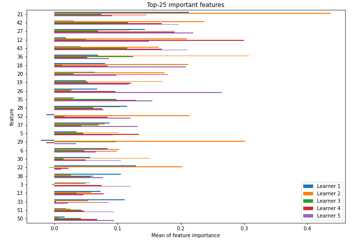
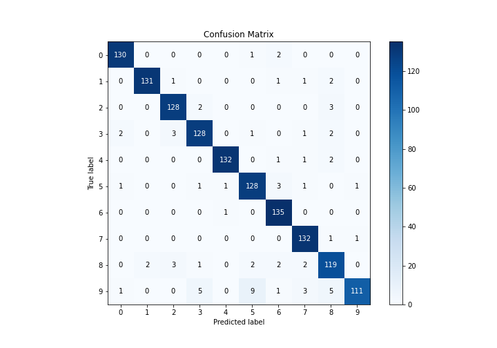
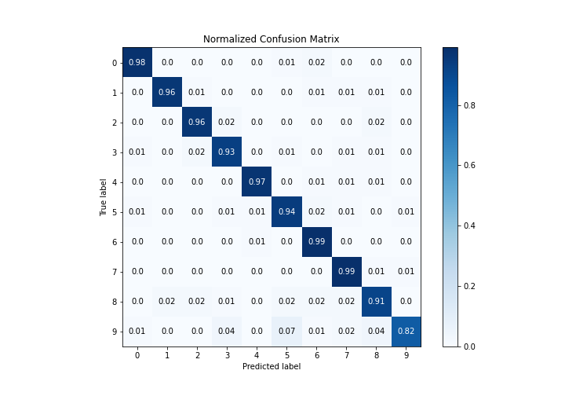
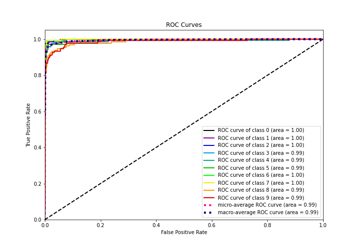
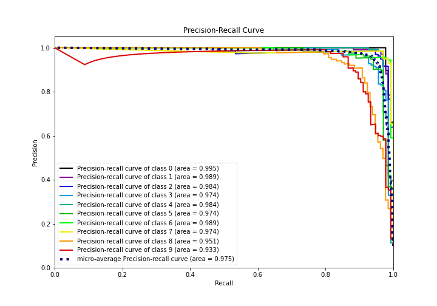

# Summary of 20_NeuralNetwork

[<< Go back](../README.md)

## Neural Network
- **n_jobs**: -1
- **dense_1_size**: 64
- **dense_2_size**: 32
- **learning_rate**: 0.08
- **num_class**: 10
- **explain_level**: 1

## Validation
 - **validation_type**: kfold
 - **k_folds**: 5
 - **shuffle**: True
 - **stratify**: True

## Optimized metric
logloss

## Training time

5.1 seconds

### Metric details
|           |          0 |          1 |          2 |          3 |          4 |          5 |          6 |          7 |          8 |          9 |   accuracy |   macro avg |   weighted avg |   logloss |
|:----------|-----------:|-----------:|-----------:|-----------:|-----------:|-----------:|-----------:|-----------:|-----------:|-----------:|-----------:|------------:|---------------:|----------:|
| precision |   0.970149 |   0.984962 |   0.948148 |   0.934307 |   0.985075 |   0.907801 |   0.931034 |   0.93617  |   0.88806  |   0.982301 |   0.945805 |    0.946801 |       0.946944 |  0.404874 |
| recall    |   0.977444 |   0.963235 |   0.962406 |   0.934307 |   0.970588 |   0.941176 |   0.992647 |   0.985075 |   0.908397 |   0.822222 |   0.945805 |    0.94575  |       0.945805 |  0.404874 |
| f1-score  |   0.973783 |   0.973978 |   0.955224 |   0.934307 |   0.977778 |   0.924188 |   0.960854 |   0.96     |   0.898113 |   0.895161 |   0.945805 |    0.945339 |       0.945436 |  0.404874 |
| support   | 133        | 136        | 133        | 137        | 136        | 136        | 136        | 134        | 131        | 135        |   0.945805 | 1347        |    1347        |  0.404874 |

## Confusion matrix
|              |   Predicted as 0 |   Predicted as 1 |   Predicted as 2 |   Predicted as 3 |   Predicted as 4 |   Predicted as 5 |   Predicted as 6 |   Predicted as 7 |   Predicted as 8 |   Predicted as 9 |
|:-------------|-----------------:|-----------------:|-----------------:|-----------------:|-----------------:|-----------------:|-----------------:|-----------------:|-----------------:|-----------------:|
| Labeled as 0 |              130 |                0 |                0 |                0 |                0 |                1 |                2 |                0 |                0 |                0 |
| Labeled as 1 |                0 |              131 |                1 |                0 |                0 |                0 |                1 |                1 |                2 |                0 |
| Labeled as 2 |                0 |                0 |              128 |                2 |                0 |                0 |                0 |                0 |                3 |                0 |
| Labeled as 3 |                2 |                0 |                3 |              128 |                0 |                1 |                0 |                1 |                2 |                0 |
| Labeled as 4 |                0 |                0 |                0 |                0 |              132 |                0 |                1 |                1 |                2 |                0 |
| Labeled as 5 |                1 |                0 |                0 |                1 |                1 |              128 |                3 |                1 |                0 |                1 |
| Labeled as 6 |                0 |                0 |                0 |                0 |                1 |                0 |              135 |                0 |                0 |                0 |
| Labeled as 7 |                0 |                0 |                0 |                0 |                0 |                0 |                0 |              132 |                1 |                1 |
| Labeled as 8 |                0 |                2 |                3 |                1 |                0 |                2 |                2 |                2 |              119 |                0 |
| Labeled as 9 |                1 |                0 |                0 |                5 |                0 |                9 |                1 |                3 |                5 |              111 |

## Learning curves

## Permutation-based Importance

## Confusion Matrix

## Normalized Confusion Matrix

## ROC Curve

## Precision Recall Curve

[<< Go back](../README.md)
