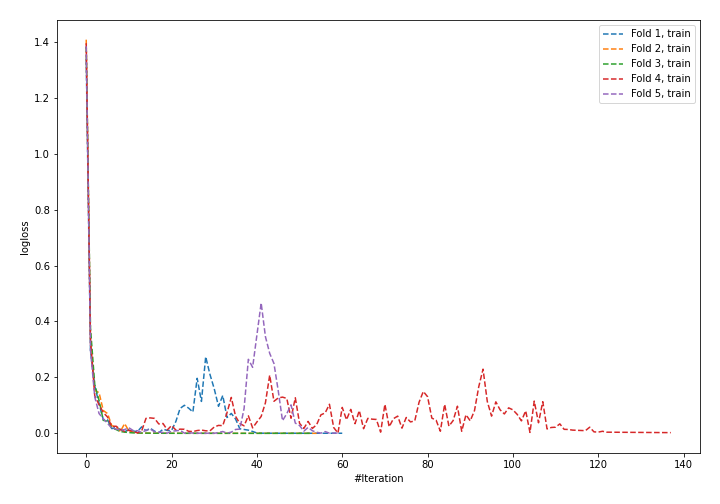
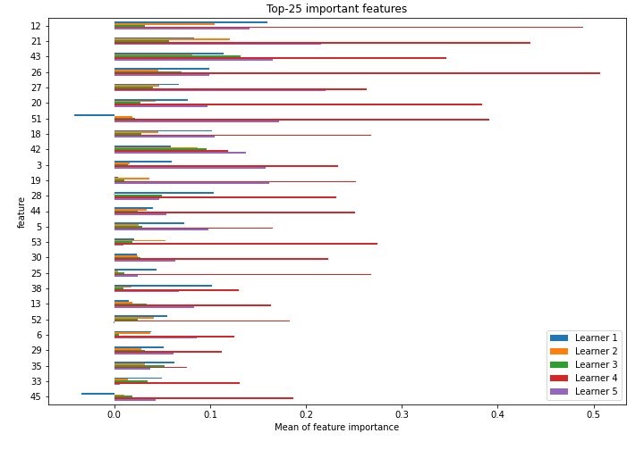
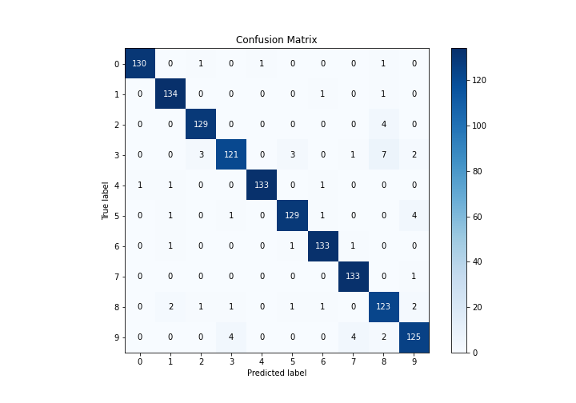
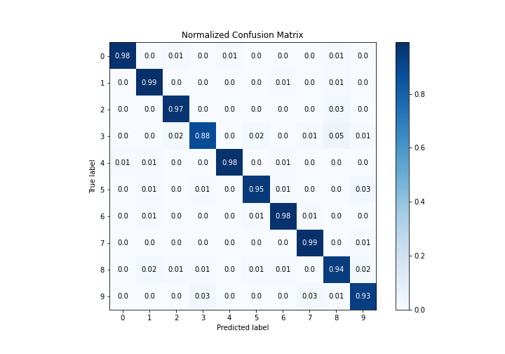
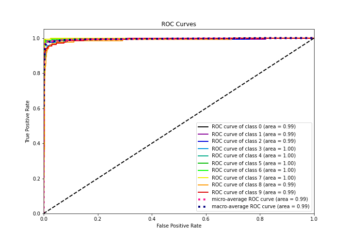
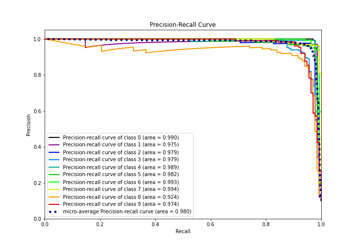

# Summary of 35_NeuralNetwork_SelectedFeatures

[<< Go back](../README.md)

## Neural Network
- **n_jobs**: -1
- **dense_1_size**: 64
- **dense_2_size**: 16
- **learning_rate**: 0.05
- **num_class**: 10
- **explain_level**: 1

## Validation
 - **validation_type**: kfold
 - **k_folds**: 5
 - **shuffle**: True
 - **stratify**: True

## Optimized metric
logloss

## Training time

8.1 seconds

### Metric details
|           |          0 |          1 |          2 |          3 |          4 |          5 |          6 |          7 |          8 |          9 |   accuracy |   macro avg |   weighted avg |   logloss |
|:----------|-----------:|-----------:|-----------:|-----------:|-----------:|-----------:|-----------:|-----------:|-----------:|-----------:|-----------:|------------:|---------------:|----------:|
| precision |   0.992366 |   0.964029 |   0.962687 |   0.952756 |   0.992537 |   0.962687 |   0.970803 |   0.956835 |   0.891304 |   0.932836 |   0.957684 |    0.957884 |       0.95806  |  0.274012 |
| recall    |   0.977444 |   0.985294 |   0.969925 |   0.883212 |   0.977941 |   0.948529 |   0.977941 |   0.992537 |   0.938931 |   0.925926 |   0.957684 |    0.957768 |       0.957684 |  0.274012 |
| f1-score  |   0.984848 |   0.974545 |   0.966292 |   0.916667 |   0.985185 |   0.955556 |   0.974359 |   0.974359 |   0.914498 |   0.929368 |   0.957684 |    0.957568 |       0.957613 |  0.274012 |
| support   | 133        | 136        | 133        | 137        | 136        | 136        | 136        | 134        | 131        | 135        |   0.957684 | 1347        |    1347        |  0.274012 |

## Confusion matrix
|              |   Predicted as 0 |   Predicted as 1 |   Predicted as 2 |   Predicted as 3 |   Predicted as 4 |   Predicted as 5 |   Predicted as 6 |   Predicted as 7 |   Predicted as 8 |   Predicted as 9 |
|:-------------|-----------------:|-----------------:|-----------------:|-----------------:|-----------------:|-----------------:|-----------------:|-----------------:|-----------------:|-----------------:|
| Labeled as 0 |              130 |                0 |                1 |                0 |                1 |                0 |                0 |                0 |                1 |                0 |
| Labeled as 1 |                0 |              134 |                0 |                0 |                0 |                0 |                1 |                0 |                1 |                0 |
| Labeled as 2 |                0 |                0 |              129 |                0 |                0 |                0 |                0 |                0 |                4 |                0 |
| Labeled as 3 |                0 |                0 |                3 |              121 |                0 |                3 |                0 |                1 |                7 |                2 |
| Labeled as 4 |                1 |                1 |                0 |                0 |              133 |                0 |                1 |                0 |                0 |                0 |
| Labeled as 5 |                0 |                1 |                0 |                1 |                0 |              129 |                1 |                0 |                0 |                4 |
| Labeled as 6 |                0 |                1 |                0 |                0 |                0 |                1 |              133 |                1 |                0 |                0 |
| Labeled as 7 |                0 |                0 |                0 |                0 |                0 |                0 |                0 |              133 |                0 |                1 |
| Labeled as 8 |                0 |                2 |                1 |                1 |                0 |                1 |                1 |                0 |              123 |                2 |
| Labeled as 9 |                0 |                0 |                0 |                4 |                0 |                0 |                0 |                4 |                2 |              125 |

## Learning curves

## Permutation-based Importance

## Confusion Matrix

## Normalized Confusion Matrix

## ROC Curve

## Precision Recall Curve

[<< Go back](../README.md)
